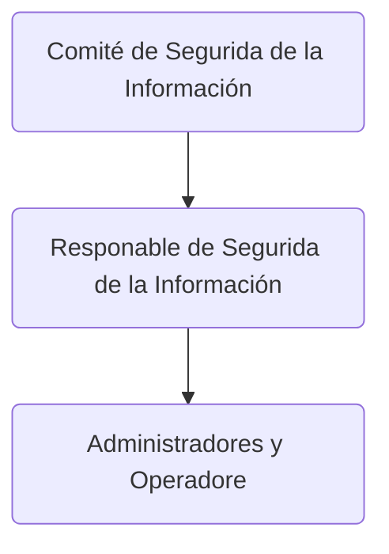
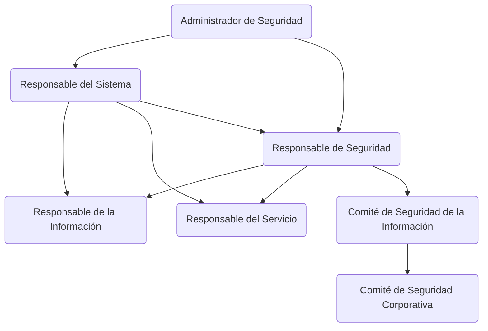
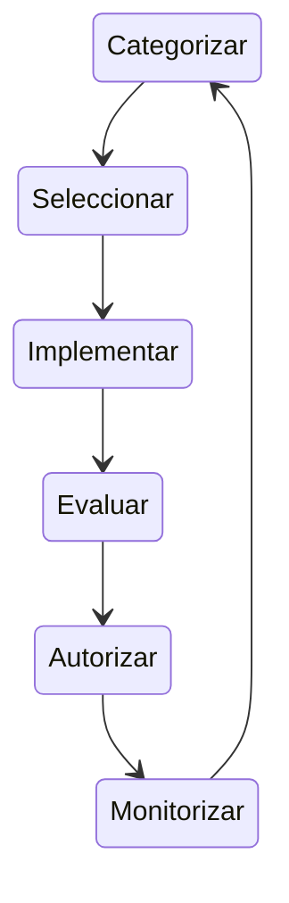

Es toda la normativa que se aplica en todo el territorio español para la protección de dispositivos, sistemas, redes de la administración pública, para las empresas no es de obligatorio cumplimiento pero se puede aplicar perfectamente.

Responsable de información:

Responsable de seguridad:

Comite de seguridad:

Gestión de riesgos:

Se regula con 2 leyes y 2 reales decretos:

- [Ley 11/2007, de 22 de Junio](https://www.boe.es/buscar/pdf/2007/BOE-A-2007-12352-consolidado.pdf), de acceso electrónico de los ciudadanos a los Servicios Públicos ESTABLECE el Esquema Nacional de Seguridad

- [Real Decreto 3/2010, de 8 de enero](https://www.boe.es/buscar/act.php?id=BOE-A-2010-1330)
	- Principios básicos y requisitos mínimos que permitan una protección adecuada de la información.

- [Ley 40/2015, de 1 de octubre](https://www.boe.es/buscar/act.php?id=BOE-A-2015-10566), de Régimen Jurídico del Sector Público, recoge el Esquema Nacional de Seguridad en su artículo 156 apartado 2 en similares términos.

- En 2015 modificación del ENS en [Real Decreto 951/2015, de 23 de octubre](https://www.boe.es/buscar/doc.php?id=BOE-A-2015-11881), en respuesta a:
	- Evolución del entorno regulatorio (sobre todo de Unión Euripea)
	- Evolución de tecnologías de la información.
	- Experiencia de la implantación del Esquema.

- Actualmente legislado por [Real Decreto 311/2022, de 3 de mayo](https://www.boe.es/buscar/act.php?id=BOE-A-2022-7191)

El Esquema Nacional de Seguridad recoge 75 medidas las cuales se dividen en 3 grupos:

- Marco Organizativo está constituido por un conjunto de medidas relaccionadas con la organización global de seguridad. Ejemplo:
	- Política de seguridad
	- Normativa de seguridad
	- Procedimientos de seguridad
	- Proceso de autorización

- Marco Operacional está constituido por las medidas a tomar para proteger la operación del sistema como conjunto integral de componentes para un fin. Ejemplo:
	- Platinicación
	- Control de acceso
	- Explotación
	- Servicios externos
	- Continuidad del servicio
	- Monitorización del sistema

- Medidas de protección se centrarán en activos concretos, según su naturaleza, con el nivel requerido en cada dimensión de seguridad. Ejemplo:
	- Instalaciones e infraestructuras
	- Gestión del personal
	- Protección de los equipos
	- Protección de las comunicaciones
	- Protección soportes de información
	- Protección aplicaciones informáticas
	- Protección de la información
	- Protección de los servicios

Mas información en [CNI](https://www.ccn.cni.es/index.php/es/?id=11)

[Versión Navegable del Esquema Nacional de Seguridad](https://gobernanza.ccn-cert.cni.es/ens-navegable)

{: width="972" height="589" }
_Full screen width and center alignment_

El Esquema Nacional de Seguridad define los roles y las funciones de la Gestión de la Seguridad IT.

Se define a 3 personas:

### Artículo 10
#### La seguridad como función diferenciada

Responsable de la información
: Decide cuales son los requisitos que se van a implementar deacuerdo a los datos que se utilizan.

Responsable del servicio
: Determina los requisitos de los servicios que se prestan.

Responsable de la seguridad
: Decide como conseguir los requisitos de seguridad de los 2 roles anteriores.

La Política de Seguridad
: Detallará las atribuciones de cada respnosable y los mecanismos de coordinación y resolución de conflictos.

Estructura Propuesta en la Guía CCN-STIC-801

3 Bloques de responsabilidad
- Comité de Seguridad Corporativa
- Especificación de requisitos de Seguridad
	- Comité de Seguridad de la Información
		- Responsable del Tratamiento Protección de Datos
		- Responsable de la Información
		- Responsable del Servicio
- Supervisión de la Seguridad
	- Responsable de Seguridad
- Operación de la Seguridad
	- Responsable del Sistema

La Dirección del organismo es **responsable** de:

- Organizar las funciones y responsabilidades

- La Política de Segurida del organismo

- Facilitar los recursos adecuados para alcanzar los objetivos propuestos

Los directivos son también responsables de dar buen ejemplo, siguiendo las normas de seguridad establecidas.

En una organización pueden coexistir diferentes informaciones y servicios, debiendo identificarse al responsable (o propietario) de cada uno de ellos.

Una misma persona puede aunar varias responsabilidades.

Responsable de la Información es el que va a decidir que uso se le va a dar a la informacióny, por tanto, de su protección.

Responsable de Servicio determina los niveles de seguridad en cada dimensión de seguriad deben realizarse dentro del marco establecido en el Anexo I del Esquema Nacional de Seguridad, los criterios de valoración estén, respaldados por la Política de Seguridad.

Es posible que la persona física tenga el rol de responsable de la información y responsable del servicio.
Aunque  se deberían diferenciar:

- Cuando el servicio maneja información de diferentes procedencias, no necesariamente de la misma unidad departamental que la que presta el servicio.

- Cuando la prestación del servicio no depende de la unidad que es Responsable de la Información.

Responsable de la Seguridad es la persona en la cual recae mantener la seguridad, promover la formación y concienciación.

- Tareas del Anexo A de la Guía CCN-STIC-801

Podrán designarse Responsable de Seguridad Delegados en caso de Sistemas de Información complejos, muy distribuidos o separados físicamente, o con muchos usuarios.

> Se delegan funciones, no la responsabilidad.
{: .prompt-warning }

Responsabilidades:

- Desarrollar, operar y mantener el Sistema de Información.

- Definir la topología y sistemas de gestión del Sistema de Información.

- Cerciorarse de que las medidas específicas de seguridad se integren adecuadamente.

- Puede suspender el manejo de información debido a deficiencias graves de seguridad.

- Las Tareas mencionadas en el Anexo A de la Guía CCN-STIC-801.

Administrador de seguridad del sistema puede depender del Responsable de Sistema o del Responsable de la Seguridad.

- Las Tareas mencionadas en el Anexo A de la Guía CCN-STIC-801.

De algunas responsabilidades pueden encargarse los comités:

- Comité de Seguridad Corporativa.

- Comité de Seguridad de la Información.

Jerarquía:

¿Quién informa a Quién?

Gestión de riesgos

El Responsable de la Información es el propietario de los riesgos sobre la información.

El Responsable del Servicio es el propietario de los riesgos sobre los servicios.

Los responsable de monitorizar un riesgo son sus propietarios.

Monitorear un riesgo

Categorizar
: Establecer los niveles de seguridad que se requieren. Anexo I ENS y Guía CCN-STIC 803

Seleccionar
: Selecionar medidas de seguridad.

Implementar
: Implementar dichas medidas de serguridad.

Evaluar
: Evaluar si se estan implementando correctamente las medidas. Se evalúa el riesgo residual.

El riesgo residual es el riesgo que permanece aunque se haya decidido aplicar las medidas de seguridad.

Autorizar
: Autorizamos las medidas que se han decidido llevar a cabo para implementar la seguridad. Quiere decir que se acepta el riesgo residual. Si los riesgos residuales no son aceptables hay que volver al paso 2.

Monitorizar
: Recopilar información sobre el desempeño, si se comporta dentro de los márgenes aceptados.