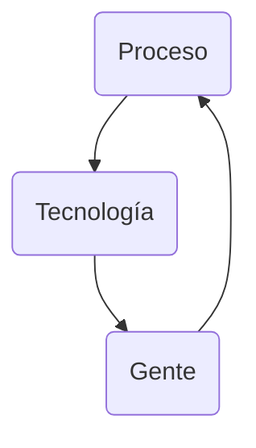

## 1 - The Danger
### 1.0 Introduction

Vamos a usar 2 máquinas virtuales: 

- [CyberOps Workstation VM](https://www.netacad.com/portal/resources/file/a7801868-0dab-4d4c-83b1-c0a7372ab7e1)

- [Security Onion VM](https://www.netacad.com/portal/resources/file/ea551ddd-9345-4f5e-bd82-7a7586c5f088)

#### 1.0.5 What Will I Learn in this Module?

| Topic Title			| Topic Objective			|
| :---------------------------- | :-----------------------------------: |
| War Stories			| Explain why networks and data are attacked			|
| Threat Actors			| Explain the motivations of the threat actors behind specific security incidents			|
| Threat Impact			| Explain the potential impact of network security attacks		|

### 1.1 War Stories
#### 1.1.1 Hijacked People

Sarah order a coffee, while waiting, she connected to what she assumed was the coffee shop's free wireless network.
Sitting in a cornet a hacker had just set up an open **"rogue"** wireless hotspot posing as the coffee shop's wireless network. When Sarah logged onto het bank's website, the hacker hijacked her session and gained access to her bank accounts. Another term for rogue wireless hotspots is **"evil twin"** hotspots.

#### 1.1.5 Installing the Virtual Machines

[CyberOps Workstation VM](/assets/img/cyberops_associate/cyberops_workstation.ova)

MD5 Checksum: 6a70f156715f85c09fbb859c80c4b6c5
SHA512 Checksum: 2cc44d6585001d99bce5dfc19ed5ef920714ca03

[Security Onion VM](/assets/img/cyberops_associate/security_onion.ova)

MD5 Checksum: 8d65135641b9c94e788909026805ad6b
SHA512 Checksum: aaca24b0036be5d61dd42a0b3503403e18ae0e12 

[Installing the Virtual Machines](/assets/img/cyberops_associate/1.1.5_lab_installing_the_virtual_machines.pdf)

#### 1.1.6 Lab - Cybersecurity Case Studies

[Cybersecurity Case Studies](/assets/img/cyberops_associate/1.1.6_lab_cybersecurity_case_studies.pdf)

### 1.2 Threat Actors
#### 1.2.1 Threat Actors

Threat Actors include, but not limited to, amateurs (script kiddies), hacktivist, organized crime groups, state-sponsored, and terrorist groups.

#### 1.2.2 How Secure is the Internet of Things?

How secure are these devices? For example, who wrote the firmware? Did the programmer pay attention to security flaws? Is your connected home thermostat vulnerable to attacks? What about your digital video recorder (DVR)? If security vulnerabilities are found, can firmware in the device be patched to eliminate the vulnerability? Many devices on the internet are not updated with the latest firmware. Some older devices were not even developed to be updated with patches. These two situations create opportunity for threat actors and security risks for the owners of these devices.

### 1.3 Threat Impact
#### 1.3.1 PII, PHI, PSI

Personally identifiable information (PII) is any information that can be used to positively identify an individual. Examples of PII include:

- Name
- Social security number
- Birthdate
- Credit card numbers
- Bank account numbers
- Government issued ID
- Address information (street, email, phone numbers)

PII can be used to create fake financial accounts, such as credit cards and short-term loans.

A subset of PII is protected health information (PHI). The medical community creates and maintains electronic medical records (EMRs) that contain PHI. In the U.S., handling of PHI is regulated by the Health Insurance Portability and Accountability Act (HIPAA). In the European Union the General Data Protection Regulation (GDPR) protects a broad range of personal information in including health records.

Personal security information (PSI) is another type of PII. This information includes usernames, passwords, and other security-related information that individuals use to access information or services on the network.

### 1.4 The Danger Summary
#### 1.4.1 What Did I Learn in this Module?

War Stories

: Threat actors can hijack banking sessions and other personal information by using “evil twin” hotspots. Threat actors can target companies, as in the example where opening a pdf on the company computer can install ransomware. Entire nations can be targeted. This occurred in the Stuxnet malware attack.

Threat Actors

: Threat actors include, but are not limited to, amateurs, hacktivists, organized crime groups, state sponsored, and terrorist groups. The amateur may have little to no skill and often use information found on the internet to launch attacks. Hacktivists are hackers who protest against a variety of political and social ideas. Much of the hacking activity is motivated by financial gain. Nation states are interested in using cyberspace for industrial espionage. Theft of intellectual property can give a country a significant advantage in international trade. As the Internet of Things (IoT) expands, webcams, routers, and other devices in our homes are also under attack.

Threat Impact

: It is estimated that businesses will lose over $5 trillion annually by 2024 due to cyberattacks. Personally identifiable information (PII), protected health information (PHI), and personal security information (PSI) are forms of protected information that are often stolen. A company can lose its competitive advantage when this information is stolen, including trade secrets. Also, customers lose trust in the company’s ability to protect their data. Governments have also been victims of hacking.

#### 1.4.2 Module 1: The Danger Quiz

An attacker sends a piece of mallware as an email attachment to employees in a company. What is one probable purpose of the attack?
- [ ] Denying external access to a web server that is open to the public
- [ ] Probing open ports on the firewall on the border network
- [X] Searching and obtaining trade secrets
- [ ] Cracking the administrator password for a critical server

> This is a malware attack. The purpose of a typical malware attack is to disrupt computer operations, gather sensitive information, or gain access to a private computer system. Cracking a password cannot be carried out by a simple malware attack because it requires intensive CPU and memory, which will make its operation noticeable. A reconnaissance attack would be used to probe open ports on a border firewall. Similarly, denying external access to a web server is a DoS attack launched from outside the company.
{: .prompt-info }

What is cyberwarfare?
- [ ] It is an attack that only involves robots and borts.
- [x] It is an attack designed to disrupt, corrupt, or exploit notional interests.
- [ ] It is an attack on a major corporation.
- [ ] It is an attack only on military targets.

> `Cyberwarfare` is a subset of information warfare (IW). Its objective is to disrupt (availability), corrupt (integrity) or exploit (confidentiality or privacy). It can be directed against military forces, critical infrastructures, or other national interests, such as economic targets. It involves several teams that work together. Botnet might be one of several tools to be used for launching the attack.
{: .prompt-info }

What type of malware has the primary objective of spreading across the network?
- [x] Worm
- [ ] Trojan horse
- [ ] Virus
- [ ] Botnet

> The main purpose of a `worm` is to self-replicate and propagate across the network.  A virus is a type of malicious software that needs a user to spread.  A trojan horse is not self-replicating and disguises itself as a legitimate application when it is not.  A botnet is a series of zombie computers working together to wage a network attack. ​
{: .prompt-info }

What is a potential risk when using a free and open wireless hotspot in a public location?
- [x] Network traffic might be hijacked and information stolen.
- [ ] The Internet connection can become too slow when many users access the wireless hotspot.
- [ ] Purchase of products from vendors might be required in exchange for the Internet access.
- [ ] Too many users trying to connect to the Internet may cause a network traffic jam.

> Many free and open wireless hotspots operate with no authentication or weak authentication mechanisms. Attackers could easily capture the network traffic in and out of such a hotspot and steal user information. In addition, attackers might set up a "rogue" wireless hotspot to attract unsuspecting users to it and then collect information from those users.
{: .prompt-info }

At the request of investors, a company is proceeding with cyber attribution with a particular attack that was conducted from an external source. Which security term is used to describe the person or device responsible for the attack?
- [x] Threat actor
- [ ] Fragmenter
- [ ] Tunneler
- [ ] Skeleton

> Some people may use the common word of "hacker" to describe a `threat actor`. A threat actor is an entity that is involved with an incident that impacts or has the potential to impact an organization in such a way that it is considered a security risk or threat.
{: .prompt-info }

What name is given to an amateur hacker?
- [x] Script kiddie
- [ ] Blue team
- [ ] Red hat
- [ ] Black hat

> `Script kiddies` is a term used to describe inexperienced hackers.
{: .prompt-info }

What commonly motivates cybercriminals to attack networks as compared to hacktivists or state-sponsored hackers?
- [x] Financial gain
- [ ] Fame seeking
- [ ] Political reasons
- [ ] Status among peers

> Cybercriminals are commonly motivated by `money`. Hackers are known to hack for status. Cyberterrorists are motivated to commit cybercrimes for religious or political reasons.
{: .prompt-info }

What is a botnet? 

- [X] A network of infected computers that are controlled as a group.
- [ ] A group of web servers that provide load balancing and fault tolerance.
- [ ] A network that allows users to bring their own technology.
- [ ] An online video game intended for multiple players.

> One method of executing a DDoS attack involves using a `botnet`. A botnet builds or purchases a botnet of zombie hosts, which is a group of infected devices. The zombies continue to create more zombies which carry out the DDoS attack.
{: .prompt-info }

What is a rogue wireless hotspot? 
- [x] It is a hotspot that appears to be from a legitimate business but was actually set up by someone without the permission from the business.
- [ ] It is a hotspot that does not encrypt network user traffic.
- [ ] It is a hotspot that was set up with outdated devices.
- [ ] It is a hotspot that does not implemented strong user authentication mechanims.

> A `rogue wireless` hotspot is a wireless access point running in a business or an organization without the official permission from the business or organization.
{: .prompt-info }

What is the best definition of personally identifiable information (PII)?
- [x] Data that is collected by businesses to distinguish identities of individuals.
- [ ] Data that is collected from servers and websites for anonymous browsing.
- [ ] Data that is collected by businesses to track the digitals behaivor of consumers.
- [ ] Data that is collected from servers and web browsers using cookies in order to track a consumer.

> `Personally identifiable information (PII)` is data that could be used to distinguish the identity of an individual, such as mother's maiden name, social security number, and/or date of birth.
{: .prompt-info }

What type of malware has the primary objective of spreading across the network?
- [x] Stuxnet
- [ ] SQL injection
- [ ] PSYOPS
- [ ] DDoS

> `Stuxnet` malware program is an excellet example of a sophisticated cyberwarfare weapon. In 2010, it was used to attack programmable logic controllers that operated uranium enrichment centrifuges in Iran.
{: .prompt-info }

A company pays a significant sum of money to hackers in order to regain control of an email and data server. Which type of security attack was used by the hackers?
- [x] Ransomware
- [ ] Tojan horse
- [ ] DoS
- [ ] Spyware

> `Ramsomware` involves the hackers preventing user access to the infected and controlled system until the user pays a specified amount.
{: .prompt-info }

## 2 - Fighters in the War Against Cybercrime
### 2.0 Introduction
#### 2.0.1 What Will I Learn in this Module?

| Topic Title			| Topic Objective			|
| :---------------------------- | :-----------------------------------: |
| The Moderm SOC		| Explain the mission of the security operations center (SOC).			|
| Becoming a Defender			| Describe resources available to prepare for a career in cybersecurity operations.			|

### 2.1 The Moderm Security Operations Center
#### 2.1.1 Elements of a SOC

#### 2.1.2 People in the SOC

SOCs assign job roles by tiers, according to the expertise and responsibilities.

Tier 1 Alert Analyst
: These professionals monitor incoming alerts, verify that a true incident has accorred, and forward tickets to Tier 2, if necessary.

Tier 2 Incident Responder
: These professionals are responsible for deep investigation of incidents and advise remediation or action to be taken.

Tier 3 Threat Hunter
: These professionals have expert-level skill in network, endpoint, threat intelligence, and malware reverse enginnering. They are experts at tracing the processes of the malware to determine its impact and how it can be remove. They are also deeply involved in huting for potential threats and implementing threat detection tools. Threat hunters search for cyber threats that are present in the network but have not yet been detected.

SOC Maganer
: This professional manages all the resources of the SOC and serves as the point of contact for the larger organization or customer.

This course offers preparation for a certification suitable for the position of Tier 1 Alert Analyst, also known as Cybersecurity Analyst of CyberOps Associate.

The figure, which is originally from the SANS Institute, graphically represents how these roles interact with each other.

#### 2.1.3 Process in the SOC

The day of a Cybersecurity Analyst typically begins with monitoring security alert queues. A ticketing system is frequently used to assign alerts to a queue for an analyst to investigate. One job of the Analyst might be to verify that an alert represent a true security incident.

If a ticket cannot be resolve, the Analyst will forward the tocket to a Tier 2 Invident Responder for a deeper investigation and remediation. If the Incident Responder cannot resolve the ticket,it will be forwarded it to Tier 3 personnel with in-depth knowledge and threat hunting skills.

#### 2.1.4 Technologies in the SOC: SIEM

A SOC needs a security information and event management system (SIEM), or its equivalent. SIEM makes sense of all the data that firewalls, network appliances, intrusion detection systems, and other devices generate.

SIEM system are used for collectiong and filtering data, detecting and classifying threats, and analyzing and investigating threats. SIEM systems may also and manage resources to implement preventive measures and address future threats. SOC technologies include one or more of the following:

- Event collection, correlation, and analysis.
- Security monitoring.
- Security control.
- Log management.
- Vulnerability assessment.
- Vulnerability tracking.
- Threat intelligence.

#### 2.1.5 Technologies in the SOC: SOAR

SIEM and security orchestration, automation and response (SOAR) are often paired together as they have capabilities that complement each other.

SOAR platform are similar to SIEMs in that they aggregate, correlate and analyze alerts. However, SOAR technology goes a step fither by integrating threat intelligence and automating incident investigation and response workflows based on playbooks developed by the security team.

SOAR security platforms:

- Gather alarm data from each component of the system.
- Provide tools that enable cases to be researched, assessed, and investigated.
- Emphasize integration as a means of automating complex incident response workflow that enable more rapid response and adaptive defense strategies.
- Include pre-defined playbooks that enable automatic response to specific threats. Playbooks can be intiated automatically based on predefined rules or may be triggered by security personnel.

SOAR emphasizes integration tools and automation of SOC workflows. It orchestrates many manual processes such as investigatino of security alerts only requiring human intervention when necessary. This frees security personnel to address more pressing matters and hight-end investigation and threat remediation.

SIEM systems necessarily produce more alerts than SecOps teams can investigate, SOAR will process many of these alerts automatically.

#### 2.1.6 SOC Metrics

Many metrics, or key performance indicators (KPI) can be devised to measure different specific aspects of SOC performance. However, five metrics are commonly used as SOC metrics. Common metrics compiled by SOC managers are:

- **Dwell Time**: The lenght of time that threat actors have access to a network before they are detected, ad their access is stopped.

- **Mean Time to Detect (MTTD)**: The average time that it takes for the SOC personnel to identify valid security incidents have occurred in the network.

- **Mean Time to Respond (MTTR)**: The average time that it takes to stop and remediate a security incident.

- **Mean Time to Contain (MTTC)**: The time required to stop the incident from causing further damage to systems or data.

- **Time to Control**: The time required to stop the spread of malware in the network.

#### 2.1.8 Security vs. Availability

Most enterprise networks must be up and running at all times.

Each business or industry has a limited tolerance for network downtime. That tolerance is usually based upon a comparison of the cost of the downtime in relation to the cost of ensuring against downtime.

| Avaliability %		| Downtime				|
| :---------------------------- | :-----------------------------------: |
| 99.8%				| 17.52 hours				|
| 99.9% ("three nines")		| 8.76 hours				|
| 99.99% ("four nines")		| 52.56	minutes				|
| 99.999% ("five nines")	| 5.256 minutes				|
| 99.9999% ("six nines")	| 31.56 seconds				|
| 99.99999% ("seven nines")	| 3.16 seconds				|

#### 2.1.9 Check Your Understanding - Identify the SOC Terminology

Which SOC job role manages all the resources of the SOC and serves as a point of contact for the larger organization or customer?
- [ ] SME / Threat Hunter
- [x] SOC Manager
- [ ] Cybersecurity Analyst
- [ ] Incident Responder

> The `SOC manager` oversees operation of the SOC and is the point-of-contact for internal and external customers.
{: .prompt-info }

Which SOC job role processes security alerts and forward tickets to Tier 2 if necessary?
- [ ] SME / Threat Hunter
- [ ] SOC Manager
- [x] Cybersecurity Analyst
- [ ] Incident Responder

> `Cybersecurity Analysts` are on the frontline of the SOC. They `analyze alerts` and `determine`  whether security issues should be escalated to Tier 2 for in-depth analysis.
{: .prompt-info }

Which SOC job role is responsible for deep investigation of incidents?
- [ ] SME / Threat Hunter
- [ ] SOC Manager
- [ ] Cybersecurity Analyst
- [x] Incident Responder

> `Incident Responder`  are professionals responsible for deep investigation of incidents and advising remediation or actions to be taken.
{: .prompt-info }

Which device integrates security information and event management into a single platform?
- [x] SIEM
- [ ] SOAR
- [ ] Threat Hunter

> `SIEMs integrate` security data and events into a `single platform` form which `investigations` can be conducted.
{: .prompt-info }

Which device integrates orchestration tools and resources to automatically respond to security events?
- [ ] SIEM
- [x] SOAR
- [ ] Threat Hunter

> `SOAR enhances` SIEM by `orchestrating` diverse tools and resources into a single platform and providing `automated response` to security events.
{: .prompt-info }

### 2.2 Becoming a Defender
#### 2.2.1 Certifications

A variety of cybersecurity certifications that are relevant to careers in SOCs are available from several different organizations.

Cisco Certified CyberOps Associate

: The Cisco Certified CyberOps Associate certification provides a valuable first step in acquiring the knowledge and skills needed to work with a SOC team. It can be a valuable part of a career in the exciting and growing field of cybersecurity operations.

CompTIA Cybersecurity Analyst Certification

: The CompTIA Cybersecurity Analyst (CySA+) certification is a vendor-neutral IT professional certification. It validates knowledge and skills required to configure and use threat detection tools, perform data analysis, interpret the results to identify vulnerabilities, threats and risks to an organization. The end goal is the ability to secure and protect applications and systems within an organization.

(ISC)² Information Security Certifications

: (ISC)² is an international non-profit organization that offers the highly-acclaimed CISSP certification. They offer a range of other certifications for various specialties in cybersecurity.

Global Information Assurance Certification (GIAC)

: GIAC, which was founded in 1999, is one of the oldest security certification organizations. It offers a wide range of certifications in seven categories.

#### 2.2.2 Further Education

Degrees

: Anyone considering a career in the cybersecurity field, should seriously consider pursuing a technical degree or bachelor’s degree in computer science, electrical engineering, information technology, or information security. Many educational institutions offer security-related specialized tracks and certifications.

Python Programming

: Computer programming is an essential skill for anyone who wishes to pursue a career in cybersecurity. If you have never learned how to program, then Python might be the first language to learn. Python is an open-source, object-oriented language that is routinely used by cybersecurity analysts. It is also a popular programming language for Linux-based systems and software-defined networking (SDN).

Linux Skills

: Linux is widely used in SOCs and other networking and security environments. Linux skills are a valuable addition to your skillset as you work to develop a career in cybersecurity.

#### 2.3.1 What Did I Learn in this Module?

The Modern Security Operations Center

: Major elements of the SOC include people, processes, and technologies. These roles include a Tier 1 Alert Analyst, a Tier 2 Incident Responder, a Tier 3 Threat hunter, and an SOC Manager. A Tier 1 Analyst will monitor incidents, open tickets, and perform basic threat mitigation.

: SEIM systems are used for collecting and filtering data, detecting and classifying threats, and analyzing and investigating threats. SEIM and SOAR are often paired together. SOAR is similar to SIEM. SOAR goes a step further by integrating threat intelligence and automating incident investigation and response workflows based on playbooks developed by the security team. Key Performance Indicators (KPI) are devised to measure different aspects of SOC performance. Common metrics include Dwell Time, Meant Time to Detect (MTTD), Mean Time to Respond (MTTR), Mean Time to Contain (MTTC), and Time to Control.

: There must be a balance between security and availability of the networks. Security cannot be so strong that it interferes with employees or business functions.

Becoming a Defender

: A variety of cybersecurity certifications that are relevant to careers in SOCs are available from different organizations. They include Cisco Certified CyberOps Associate, CompTIA Cybersecurity Analyst Certification, (ISC)2 Information Security Certifications, Global Information Assurance Certification (GIAC), and others. Job sites include Indeed.com, CareerBuilder.com, USAJobs.gov, Glassdoor, and LinkedIn. You may also want to consider internships and temporary agencies to gain experience and begin your career. In addition, Linux and Python programming skills will add to your desirability in the job market.

#### 2.3.2 Module 2: Fighters in the War Against Cybercrime Quiz

Which personnel in a SOC is assigned the task of verifying whether an alert triggered by monitoring software represents a true security incident?
- [ ] SOC Manager
- [ ] Tier 2 personnel
- [x] Tier 1 personnel
- [ ] Tier 3 personnel

> In a SOC, the job of a Tier 1 Alert Analyst includes monitoring incoming alerts and verifying that a true security incident has occurred.
{: .prompt-info }

After a security incident is verified in a SOC, an incident responder reviews the incident but cannot identify the source of the incident and form an effective mitigation procedure. To whom should the incident ticket be escalated?
- [ ] the SOC manager to ask for other personnel to be assigned
- [ ] a cyberoperations analyst for help
- [ ] an alert analyst for further analysis
- [x] a SME for further investigation

> An incident responder is a Tier 2 security professional in a SOC. If the responder cannot resolve the incident ticket, the incident ticket should be escalated to the next tier support, a Tier 3.  A Tier 3 SME would further investigate the incident.
{: .prompt-info }

Which two services are provided by security operations centers? (Choose two.)
- [x] managing comprehensive threat solutions
- [x] monitoring network security threats
- [ ] responding to data center physical break-ins
- [ ] ensuring secure routing packet exchanges
- [ ] providing secure Internet connections

> Security operations centers (SOCs) can provide a broad range of services to defend against threats to information systems of an organization. These services include monitoring threats to network security and managing comprehensive solutions to fight against threats. Ensuring secure routing exchanges and providing secure Internet connections are tasks typically performed by a network operations center (NOC). Responding to facility break-ins is typically the function and responsibility of the local police department.
{: .prompt-info }

Which metric is used in SOCs to evaluate the average time that it takes to identify that valid security incidents have occurred in the network?
- [ ] MTTC
- [ ] Dwell Time
- [ ] MTTR
- [x] MTTD

> SOCs use many metrics as performance indicators of how long it takes personnel to locate, stop, and remediate security incidents.
- Dwell Time
- Mean Time to Detect (MTTD)
- Mean Time to Respond (MTTR)
- Mean Time to Contain (MTTC)
- Time to Control 
{: .prompt-info }

Which KPI metric does SOAR use to measure the length of time that threat actors have access to a network before they are detected and the access of the threat actors stopped?
- [ ] MTTR
- [ ] MTTC
- [x] Dwell Time
- [ ] MTTD

> The common key performance indicator (KPI) metrics compiled by SOC managers are as follows:
- Dwell Time: the length of time that threat actors have access to a network before they are detected and the access of the threat actors stopped
- Mean Time to Detect (MTTD): the average time that it takes for the SOC personnel to identify valid security incidents have occurred in the network
- Mean Time to Respond (MTTR): the average time that it takes to stop and remediate a security incident
- Mean Time to Contain (MTTC): the time required to stop the incident from causing further damage to systems or data
{: .prompt-info }

What is the role of SIEM?
- [x] to analyze all the data that firewalls, network appliances, intrusion detection systems, and other devices generate and institute preventive measures
- [ ] to analyze all the network packets for any malware signatures and update the vulnerabilities database
- [ ] to analyze all the network packets for any malware signatures and synchronize the signatures with the Federal Government databases
- [ ] to analyze any OS vulnerabilities and apply security patches to secure the operating systems

> A security information and event management system (SIEM) makes sense of all of the data that firewalls, network appliances, intrusion detection systems, and other devices generate. SIEMs are used for collecting and filtering data, detecting and classifying threats, and analyzing and investigating threats. SIEM systems may also manage resources to implement preventive measures and address future threats.
{: .prompt-info }

What is a characteristic of the SOAR security platform?
- [ ] to interact with the Federal Government security sites and update all vulnerability platforms
- [ ] to provide a user friendly interface that uses the Python programming language to manage security threats
- [x] to include predefined playbooks that enable automatic response to specific threats
- [ ] to provide a means to synchronize the vulnerabilities database

> SOAR security platforms offer the following features:
- Gather alarm data from each component of the system
- Provide tools that enable cases to be researched, assessed, and investigated
- Emphasize integration as a means of automating complex incident response workflows that enable more rapid response and adaptive defense strategies
- Include predefined playbooks that enable automatic response to specific threats
{: .prompt-info }

A network security professional has applied for a Tier 2 position in a SOC. What is a typical job function that would be assigned to a new employee?
- [ ] hunting for potential security threats and implementing threat detection tools
- [ ] monitoring incoming alerts and verifying that a true security incident has occurred
- [x] further investigating security incidents
- [ ] serving as the point of contact for a customer

> In a typical SOC, the job of a Tier 2 incident responder involves deep investigation of security incidents.
{: .prompt-info }

If a SOC has a goal of 99.99% uptime, how many minutes of downtime a year would be considered within its goal?
- [ ] 48.25
- [ ] 50.38
- [x] 52.56
- [ ] 60.56

> Within a year, there are 365 days x 24 hours a day x 60 minutes per hour = 525,600 minutes. With the goal of uptime 99.99% of time, the downtime needs to be controlled under 525,600 x (1-0.9999) = 52.56 minutes a year.
{: .prompt-info }

Which organization offers the vendor-neutral CySA+ certification?
- [ ] GIAC
- [ ] (ISC)²
- [x] CompTIA
- [ ] IEEE

> The CompTIA Cybersecurity Analyst (CySA+) certification is a vendor-neutral security professional certification.
{: .prompt-info }

In the operation of a SOC, which system is frequently used to let an analyst select alerts from a pool to investigate?
- [ ] registration system
- [x] ticketing system
- [ ] syslog server
- [ ] security alert knowledge-based system

> In a SOC, a ticketing system is typically used for a work flow management system.
{: .prompt-info }

How can a security information and event management system in a SOC be used to help personnel fight against security threats?
- [ ] by filtering network traffic
- [ ] by authenticating users to network resources
- [x] by collecting and filtering data
- [ ] by encrypting communications to remote sites

> A security information and event management system (SIEM) combines data from multiple sources to help SOC personnel collect and filter data, detect and classify threats, analyze and investigate threats, and manage resources to implement preventive measures.
{: .prompt-info }

Which three technologies should be included in a security information and event management system in a SOC? (Choose three.)
- [ ] VPN connection
- [ ] firewall appliance
- [x] threat intelligence
- [x] vulnerability tracking
- [x] security monitoring
- [ ] intrusion prevention

>Technologies in a SOC should include the following:
- Event collection, correlation, and analysis
- Security monitoring
- Security control
- Log management
- Vulnerability assessment
- Vulnerability tracking
- Threat intelligence 
{: .prompt-info }

> Firewall appliances, VPNs, and IPS are security devices deployed in the network infrastructure.

## 3 - The Windows Operating System
### 3.0 Introduction
#### 3.0.2 What Will I LEarn in This Module?

| Topic Title			| Topic Objective			|
| :---------------------------- | :-----------------------------------: |
| Windows History				| Describe the history of the Windows Operating System				|
| Windows Architecture and Operations		| Explain the architecture of Windows and its operation				|
| Windows Configuration and Monitoring		| Explain how to configure and monitor Windows				|
| Windows Security		| Explain how Windows can be kept secure|

#### 3.2.1 Hardware Abstraction Layer

When the operating system is istalled, it must be isolated from differences in hardware, due to multiple of hardware in the market.

_Basic Windows architecture_

A hardware abstraction layer (HAL) is software that handles all of the communication between the hardware and the kernel.