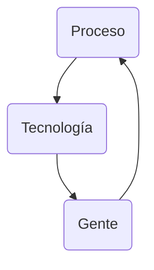

## 1 - The Danger
### 1.0 Introduction

Vamos a usar 2 máquinas virtuales: 

- [CyberOps Workstation VM](https://www.netacad.com/portal/resources/file/a7801868-0dab-4d4c-83b1-c0a7372ab7e1)

- [Security Onion VM](https://www.netacad.com/portal/resources/file/ea551ddd-9345-4f5e-bd82-7a7586c5f088)

#### 1.0.5 What Will I Learn in this Module?

| Topic Title			| Topic Objective			|
| :---------------------------- | :-----------------------------------: |
| War Stories			| Explain why networks and data are attacked			|
| Threat Actors			| Explain the motivations of the threat actors behind specific security incidents			|
| Threat Impact			| Explain the potential impact of network security attacks		|


### 1.1 War Stories
#### 1.1.1 Hijacked People

Sarah order a coffee, while waiting, she connected to what she assumed was the coffee shop's free wireless network.
Sitting in a cornet a hacker had just set up an open **"rogue"** wireless hotspot posing as the coffee shop's wireless network. When Sarah logged onto het bank's website, the hacker hijacked her session and gained access to her bank accounts. Another term for rogue wireless hotspots is **"evil twin"** hotspots.

#### 1.1.5 Installing the Virtual Machines

CyberOps Workstation VM

MD5 Checksum: 6a70f156715f85c09fbb859c80c4b6c5
SHA512 Checksum: 2cc44d6585001d99bce5dfc19ed5ef920714ca03

Security Onion VM

MD5 Checksum: 8d65135641b9c94e788909026805ad6b
SHA512 Checksum: aaca24b0036be5d61dd42a0b3503403e18ae0e12 

[Installing the Virtual Machines](/assets/img/cyberops_associate/1.1.5_lab_installing_the_virtual_machines.pdf)

#### 1.1.6 Lab - Cybersecurity Case Studies

[Cybersecurity Case Studies](/assets/img/cyberops_associate/1.1.6_lab_cybersecurity_case_studies.pdf)

### 1.2 Threat Actors
#### 1.2.1 Threat Actors

Threat Actors include, but not limited to, amateurs (script kiddies), hacktivist, organized crime groups, state-sponsored, and terrorist groups.

#### 1.2.2 How Secure is the Internet of Things?

How secure are these devices? For example, who wrote the firmware? Did the programmer pay attention to security flaws? Is your connected home thermostat vulnerable to attacks? What about your digital video recorder (DVR)? If security vulnerabilities are found, can firmware in the device be patched to eliminate the vulnerability? Many devices on the internet are not updated with the latest firmware. Some older devices were not even developed to be updated with patches. These two situations create opportunity for threat actors and security risks for the owners of these devices.

### 1.3 Threat Impact
#### 1.3.1 PII, PHI, PSI

Personally identifiable information (PII) is any information that can be used to positively identify an individual. Examples of PII include:

- Name
- Social security number
- Birthdate
- Credit card numbers
- Bank account numbers
- Government issued ID
- Address information (street, email, phone numbers)

PII can be used to create fake financial accounts, such as credit cards and short-term loans.

A subset of PII is protected health information (PHI). The medical community creates and maintains electronic medical records (EMRs) that contain PHI. In the U.S., handling of PHI is regulated by the Health Insurance Portability and Accountability Act (HIPAA). In the European Union the General Data Protection Regulation (GDPR) protects a broad range of personal information in including health records.

Personal security information (PSI) is another type of PII. This information includes usernames, passwords, and other security-related information that individuals use to access information or services on the network.

### 1.4 The Danger Summary
#### 1.4.1 What Did I Learn in this Module?

War Stories

: Threat actors can hijack banking sessions and other personal information by using “evil twin” hotspots. Threat actors can target companies, as in the example where opening a pdf on the company computer can install ransomware. Entire nations can be targeted. This occurred in the Stuxnet malware attack.

Threat Actors

: Threat actors include, but are not limited to, amateurs, hacktivists, organized crime groups, state sponsored, and terrorist groups. The amateur may have little to no skill and often use information found on the internet to launch attacks. Hacktivists are hackers who protest against a variety of political and social ideas. Much of the hacking activity is motivated by financial gain. Nation states are interested in using cyberspace for industrial espionage. Theft of intellectual property can give a country a significant advantage in international trade. As the Internet of Things (IoT) expands, webcams, routers, and other devices in our homes are also under attack.

Threat Impact

: It is estimated that businesses will lose over $5 trillion annually by 2024 due to cyberattacks. Personally identifiable information (PII), protected health information (PHI), and personal security information (PSI) are forms of protected information that are often stolen. A company can lose its competitive advantage when this information is stolen, including trade secrets. Also, customers lose trust in the company’s ability to protect their data. Governments have also been victims of hacking.

#### 1.4.2 Module 1: The Danger Quiz

An attacker sends a piece of mallware as an email attachment to employees in a company. What is one probable purpose of the attack?
- [ ] Denying external access to a web server that is open to the public
- [ ] Probing open ports on the firewall on the border network
- [X] Searching and obtaining trade secrets
- [ ] Cracking the administrator password for a critical server

> This is a malware attack. The purpose of a typical malware attack is to disrupt computer operations, gather sensitive information, or gain access to a private computer system. Cracking a password cannot be carried out by a simple malware attack because it requires intensive CPU and memory, which will make its operation noticeable. A reconnaissance attack would be used to probe open ports on a border firewall. Similarly, denying external access to a web server is a DoS attack launched from outside the company.
{: .prompt-info }

What is cyberwarfare?
- [ ] It is an attack that only involves robots and borts.
- [x] It is an attack designed to disrupt, corrupt, or exploit notional interests.
- [ ] It is an attack on a major corporation.
- [ ] It is an attack only on military targets.

> `Cyberwarfare` is a subset of information warfare (IW). Its objective is to disrupt (availability), corrupt (integrity) or exploit (confidentiality or privacy). It can be directed against military forces, critical infrastructures, or other national interests, such as economic targets. It involves several teams that work together. Botnet might be one of several tools to be used for launching the attack.
{: .prompt-info }

What type of malware has the primary objective of spreading across the network?
- [x] Worm
- [ ] Trojan horse
- [ ] Virus
- [ ] Botnet

> The main purpose of a `worm` is to self-replicate and propagate across the network.  A virus is a type of malicious software that needs a user to spread.  A trojan horse is not self-replicating and disguises itself as a legitimate application when it is not.  A botnet is a series of zombie computers working together to wage a network attack. ​
{: .prompt-info }

What is a potential risk when using a free and open wireless hotspot in a public location?
- [x] Network traffic might be hijacked and information stolen.
- [ ] The Internet connection can become too slow when many users access the wireless hotspot.
- [ ] Purchase of products from vendors might be required in exchange for the Internet access.
- [ ] Too many users trying to connect to the Internet may cause a network traffic jam.

> Many free and open wireless hotspots operate with no authentication or weak authentication mechanisms. Attackers could easily capture the network traffic in and out of such a hotspot and steal user information. In addition, attackers might set up a "rogue" wireless hotspot to attract unsuspecting users to it and then collect information from those users.
{: .prompt-info }

At the request of investors, a company is proceeding with cyber attribution with a particular attack that was conducted from an external source. Which security term is used to describe the person or device responsible for the attack?
- [x] Threat actor
- [ ] Fragmenter
- [ ] Tunneler
- [ ] Skeleton

> Some people may use the common word of "hacker" to describe a `threat actor`. A threat actor is an entity that is involved with an incident that impacts or has the potential to impact an organization in such a way that it is considered a security risk or threat.
{: .prompt-info }

What name is given to an amateur hacker?
- [x] Script kiddie
- [ ] Blue team
- [ ] Red hat
- [ ] Black hat

> `Script kiddies` is a term used to describe inexperienced hackers.
{: .prompt-info }

What commonly motivates cybercriminals to attack networks as compared to hacktivists or state-sponsored hackers?
- [x] Financial gain
- [ ] Fame seeking
- [ ] Political reasons
- [ ] Status among peers

> Cybercriminals are commonly motivated by `money`. Hackers are known to hack for status. Cyberterrorists are motivated to commit cybercrimes for religious or political reasons.
{: .prompt-info }

What is a botnet? 

- [X] A network of infected computers that are controlled as a group.
- [ ] A group of web servers that provide load balancing and fault tolerance.
- [ ] A network that allows users to bring their own technology.
- [ ] An online video game intended for multiple players.

> One method of executing a DDoS attack involves using a `botnet`. A botnet builds or purchases a botnet of zombie hosts, which is a group of infected devices. The zombies continue to create more zombies which carry out the DDoS attack.
{: .prompt-info }

What is a rogue wireless hotspot? 
- [x] It is a hotspot that appears to be from a legitimate business but was actually set up by someone without the permission from the business.
- [ ] It is a hotspot that does not encrypt network user traffic.
- [ ] It is a hotspot that was set up with outdated devices.
- [ ] It is a hotspot that does not implemented strong user authentication mechanims.

> A `rogue wireless` hotspot is a wireless access point running in a business or an organization without the official permission from the business or organization.
{: .prompt-info }

What is the best definition of personally identifiable information (PII)?
- [x] Data that is collected by businesses to distinguish identities of individuals.
- [ ] Data that is collected from servers and websites for anonymous browsing.
- [ ] Data that is collected by businesses to track the digitals behaivor of consumers.
- [ ] Data that is collected from servers and web browsers using cookies in order to track a consumer.

> `Personally identifiable information (PII)` is data that could be used to distinguish the identity of an individual, such as mother's maiden name, social security number, and/or date of birth.
{: .prompt-info }

What type of malware has the primary objective of spreading across the network?
- [x] Stuxnet
- [ ] SQL injection
- [ ] PSYOPS
- [ ] DDoS

> `Stuxnet` malware program is an excellet example of a sophisticated cyberwarfare weapon. In 2010, it was used to attack programmable logic controllers that operated uranium enrichment centrifuges in Iran.
{: .prompt-info }

A company pays a significant sum of money to hackers in order to regain control of an email and data server. Which type of security attack was used by the hackers?
- [x] Ransomware
- [ ] Tojan horse
- [ ] DoS
- [ ] Spyware

> `Ramsomware` involves the hackers preventing user access to the infected and controlled system until the user pays a specified amount.
{: .prompt-info }

## 2 - Fighters in the War Against Cybercrime
### 2.0 Introduction
#### 2.0.1 What Will I Learn in this Module?

| Topic Title			| Topic Objective			|
| :---------------------------- | :-----------------------------------: |
| The Moderm SOC		| Explain the mission of the security operations center (SOC).			|
| Becoming a Defender			| Describe resources available to prepare for a career in cybersecurity operations.			|

### 2.1 The Moderm Security Operations Center
#### 2.1.1 Elements of a SOC



#### 2.1.2 People in the SOC

SOCs assign job roles by tiers, according to the expertise and responsibilities.

Tier 1 Alert Analyst
: These professionals monitor incoming alerts, verify that a true incident has accorred, and forward tickets to Tier 2, if necessary.

Tier 2 Incident Responder
: These professionals are responsible for deep investigation of incidents and advise remediation or action to be taken.

Tier 3 Threat Hunter
: These professionals have expert-level skill in network, endpoint, threat intelligence, and malware reverse enginnering. They are experts at tracing the processes of the malware to determine its impact and how it can be remove. They are also deeply involved in huting for potential threats and implementing threat detection tools. Threat hunters search for cyber threats that are present in the network but have not yet been detected.

SOC Maganer
: This professional manages all the resources of the SOC and serves as the point of contact for the larger organization or customer.

This course offers preparation for a certification suitable for the position of Tier 1 Alert Analyst, also known as Cybersecurity Analyst of CyberOps Associate.

The figure, which is originally from the SANS Institute, graphically represents how these roles interact with each other.


#### 2.1.3 Process in the SOC

The day of a Cybersecurity Analyst typically begins with monitoring security alert queues. A ticketing system is frequently used to assign alerts to a queue for an analyst to investigate. One job of the Analyst might be to verify that an alert represent a true security incident.

If a ticket cannot be resolve, the Analyst will forward the tocket to a Tier 2 Invident Responder for a deeper investigation and remediation. If the Incident Responder cannot resolve the ticket,it will be forwarded it to Tier 3 personnel with in-depth knowledge and threat hunting skills.


#### 2.1.4 Technologies in the SOC: SIEM

A SOC needs a security information and event management system (SIEM), or its equivalent. SIEM makes sense of all the data that firewalls, network appliances, intrusion detection systems, and other devices generate.

SIEM system are used for collectiong and filtering data, detecting and classifying threats, and analyzing and investigating threats. SIEM systems may also and manage resources to implement preventive measures and address future threats. SOC technologies include one or more of the following:

- Event collection, correlation, and analysis.
- Security monitoring.
- Security control.
- Log management.
- Vulnerability assessment.
- Vulnerability tracking.
- Threat intelligence.


#### 2.1.5 Technologies in the SOC: SOAR

SIEM and security orchestration, automation and response (SOAR) are often paired together as they have capabilities that complement each other.

SOAR platform are similar to SIEMs in that they aggregate, correlate and analyze alerts. However, SOAR technology goes a step fither by integrating threat intelligence and automating incident investigation and response workflows based on playbooks developed by the security team.


SOAR security platforms:

- Gather alarm data from each component of the system.
- Provide tools that enable cases to be researched, assessed, and investigated.
- Emphasize integration as a means of automating complex incident response workflow that enable more rapid response and adaptive defense strategies.
- Include pre-defined playbooks that enable automatic response to specific threats. Playbooks can be intiated automatically based on predefined rules or may be triggered by security personnel.

SOAR emphasizes integration tools and automation of SOC workflows. It orchestrates many manual processes such as investigatino of security alerts only requiring human intervention when necessary. This frees security personnel to address more pressing matters and hight-end investigation and threat remediation.

SIEM systems necessarily produce more alerts than SecOps teams can investigate, SOAR will process many of these alerts automatically.

#### 2.1.6 SOC Metrics

Many metrics, or key performance indicators (KPI) can be devised to measure different specific aspects of SOC performance. However, five metrics are commonly used as SOC metrics. Common metrics compiled by SOC managers are:

- **Dwell Time**: The lenght of time that threat actors have access to a network before they are detected, ad their access is stopped.

- **Mean Time to Detect (MTTD)**: The average time that it takes for the SOC personnel to identify valid security incidents have occurred in the network.

- **Mean Time to Respond (MTTR)**: The average time that it takes to stop and remediate a security incident.

- **Mean Time to Contain (MTTC)**: The time required to stop the incident from causing further damage to systems or data.

- **Time to Control**: The time required to stop the spread of malware in the network.

#### 2.1.8 Security vs. Availability

Most enterprise networks must be up and running at all times.

Each business or industry has a limited tolerance for network downtime. That tolerance is usually based upon a comparison of the cost of the downtime in relation to the cost of ensuring against downtime.

| Avaliability %		| Downtime				|
| :---------------------------- | :-----------------------------------: |
| 99.8%				| 17.52 hours				|
| 99.9% ("three nines")		| 8.76 hours				|
| 99.99% ("four nines")		| 52.56	minutes				|
| 99.999% ("five nines")	| 5.256 minutes				|
| 99.9999% ("six nines")	| 31.56 seconds				|
| 99.99999% ("seven nines")	| 3.16 seconds				|

#### 2.1.9 Check Your Understanding - Identify the SOC Terminology

Which SOC job role manages all the resources of the SOC and serves as a point of contact for the larger organization or customer?
- [ ] SME / Threat Hunter
- [x] SOC Manager
- [ ] Cybersecurity Analyst
- [ ] Incident Responder

> The `SOC manager` oversees operation of the SOC and is the point-of-contact for internal and external customers.
{: .prompt-info }

Which SOC job role processes security alerts and forward tickets to Tier 2 if necessary?
- [ ] SME / Threat Hunter
- [ ] SOC Manager
- [x] Cybersecurity Analyst
- [ ] Incident Responder

> `Cybersecurity Analysts` are on the frontline of the SOC. They `analyze alerts` and `determine`  whether security issues should be escalated to Tier 2 for in-depth analysis.
{: .prompt-info }

Which SOC job role is responsible for deep investigation of incidents?
- [ ] SME / Threat Hunter
- [ ] SOC Manager
- [ ] Cybersecurity Analyst
- [x] Incident Responder

> `Incident Responder`  are professionals responsible for deep investigation of incidents and advising remediation or actions to be taken.
{: .prompt-info }

Which device integrates security information and event management into a single platform?
- [x] SIEM
- [ ] SOAR
- [ ] Threat Hunter

> `SIEMs integrate` security data and events into a `single platform` form which `investigations` can be conducted.
{: .prompt-info }

Which device integrates orchestration tools and resources to automatically respond to security events?
- [ ] SIEM
- [x] SOAR
- [ ] Threat Hunter

> `SOAR enhances` SIEM by `orchestrating` diverse tools and resources into a single platform and providing `automated response` to security events.
{: .prompt-info }

### 2.2 Becoming a Defender
#### 2.2.1 Certifications

A variety of cybersecurity certifications that are relevant to careers in SOCs are available from several different organizations.

Cisco Certified CyberOps Associate

: The Cisco Certified CyberOps Associate certification provides a valuable first step in acquiring the knowledge and skills needed to work with a SOC team. It can be a valuable part of a career in the exciting and growing field of cybersecurity operations.

CompTIA Cybersecurity Analyst Certification

: The CompTIA Cybersecurity Analyst (CySA+) certification is a vendor-neutral IT professional certification. It validates knowledge and skills required to configure and use threat detection tools, perform data analysis, interpret the results to identify vulnerabilities, threats and risks to an organization. The end goal is the ability to secure and protect applications and systems within an organization.

(ISC)² Information Security Certifications

: (ISC)² is an international non-profit organization that offers the highly-acclaimed CISSP certification. They offer a range of other certifications for various specialties in cybersecurity.

Global Information Assurance Certification (GIAC)

: GIAC, which was founded in 1999, is one of the oldest security certification organizations. It offers a wide range of certifications in seven categories.

#### 2.2.2 Further Education

Degrees

: Anyone considering a career in the cybersecurity field, should seriously consider pursuing a technical degree or bachelor’s degree in computer science, electrical engineering, information technology, or information security. Many educational institutions offer security-related specialized tracks and certifications.

Python Programming

: Computer programming is an essential skill for anyone who wishes to pursue a career in cybersecurity. If you have never learned how to program, then Python might be the first language to learn. Python is an open-source, object-oriented language that is routinely used by cybersecurity analysts. It is also a popular programming language for Linux-based systems and software-defined networking (SDN).

Linux Skills

: Linux is widely used in SOCs and other networking and security environments. Linux skills are a valuable addition to your skillset as you work to develop a career in cybersecurity.

#### 2.3.1 What Did I Learn in this Module?

The Modern Security Operations Center

: Major elements of the SOC include people, processes, and technologies. These roles include a Tier 1 Alert Analyst, a Tier 2 Incident Responder, a Tier 3 Threat hunter, and an SOC Manager. A Tier 1 Analyst will monitor incidents, open tickets, and perform basic threat mitigation.

: SEIM systems are used for collecting and filtering data, detecting and classifying threats, and analyzing and investigating threats. SEIM and SOAR are often paired together. SOAR is similar to SIEM. SOAR goes a step further by integrating threat intelligence and automating incident investigation and response workflows based on playbooks developed by the security team. Key Performance Indicators (KPI) are devised to measure different aspects of SOC performance. Common metrics include Dwell Time, Meant Time to Detect (MTTD), Mean Time to Respond (MTTR), Mean Time to Contain (MTTC), and Time to Control.

: There must be a balance between security and availability of the networks. Security cannot be so strong that it interferes with employees or business functions.

Becoming a Defender

: A variety of cybersecurity certifications that are relevant to careers in SOCs are available from different organizations. They include Cisco Certified CyberOps Associate, CompTIA Cybersecurity Analyst Certification, (ISC)2 Information Security Certifications, Global Information Assurance Certification (GIAC), and others. Job sites include Indeed.com, CareerBuilder.com, USAJobs.gov, Glassdoor, and LinkedIn. You may also want to consider internships and temporary agencies to gain experience and begin your career. In addition, Linux and Python programming skills will add to your desirability in the job market.

#### 2.3.2 Module 2: Fighters in the War Against Cybercrime Quiz

Which personnel in a SOC is assigned the task of verifying whether an alert triggered by monitoring software represents a true security incident?
- [ ] SOC Manager
- [ ] Tier 2 personnel
- [x] Tier 1 personnel
- [ ] Tier 3 personnel

> In a SOC, the job of a Tier 1 Alert Analyst includes monitoring incoming alerts and verifying that a true security incident has occurred.
{: .prompt-info }

After a security incident is verified in a SOC, an incident responder reviews the incident but cannot identify the source of the incident and form an effective mitigation procedure. To whom should the incident ticket be escalated?
- [ ] the SOC manager to ask for other personnel to be assigned
- [ ] a cyberoperations analyst for help
- [ ] an alert analyst for further analysis
- [x] a SME for further investigation

> An incident responder is a Tier 2 security professional in a SOC. If the responder cannot resolve the incident ticket, the incident ticket should be escalated to the next tier support, a Tier 3.  A Tier 3 SME would further investigate the incident.
{: .prompt-info }

Which two services are provided by security operations centers? (Choose two.)
- [x] managing comprehensive threat solutions
- [x] monitoring network security threats
- [ ] responding to data center physical break-ins
- [ ] ensuring secure routing packet exchanges
- [ ] providing secure Internet connections

> Security operations centers (SOCs) can provide a broad range of services to defend against threats to information systems of an organization. These services include monitoring threats to network security and managing comprehensive solutions to fight against threats. Ensuring secure routing exchanges and providing secure Internet connections are tasks typically performed by a network operations center (NOC). Responding to facility break-ins is typically the function and responsibility of the local police department.
{: .prompt-info }

Which metric is used in SOCs to evaluate the average time that it takes to identify that valid security incidents have occurred in the network?
- [ ] MTTC
- [ ] Dwell Time
- [ ] MTTR
- [x] MTTD

> SOCs use many metrics as performance indicators of how long it takes personnel to locate, stop, and remediate security incidents.
- Dwell Time
- Mean Time to Detect (MTTD)
- Mean Time to Respond (MTTR)
- Mean Time to Contain (MTTC)
- Time to Control 
{: .prompt-info }

Which KPI metric does SOAR use to measure the length of time that threat actors have access to a network before they are detected and the access of the threat actors stopped?
- [ ] MTTR
- [ ] MTTC
- [x] Dwell Time
- [ ] MTTD

> The common key performance indicator (KPI) metrics compiled by SOC managers are as follows:
- Dwell Time: the length of time that threat actors have access to a network before they are detected and the access of the threat actors stopped
- Mean Time to Detect (MTTD): the average time that it takes for the SOC personnel to identify valid security incidents have occurred in the network
- Mean Time to Respond (MTTR): the average time that it takes to stop and remediate a security incident
- Mean Time to Contain (MTTC): the time required to stop the incident from causing further damage to systems or data
{: .prompt-info }

What is the role of SIEM?
- [x] to analyze all the data that firewalls, network appliances, intrusion detection systems, and other devices generate and institute preventive measures
- [ ] to analyze all the network packets for any malware signatures and update the vulnerabilities database
- [ ] to analyze all the network packets for any malware signatures and synchronize the signatures with the Federal Government databases
- [ ] to analyze any OS vulnerabilities and apply security patches to secure the operating systems

> A security information and event management system (SIEM) makes sense of all of the data that firewalls, network appliances, intrusion detection systems, and other devices generate. SIEMs are used for collecting and filtering data, detecting and classifying threats, and analyzing and investigating threats. SIEM systems may also manage resources to implement preventive measures and address future threats.
{: .prompt-info }

What is a characteristic of the SOAR security platform?
- [ ] to interact with the Federal Government security sites and update all vulnerability platforms
- [ ] to provide a user friendly interface that uses the Python programming language to manage security threats
- [x] to include predefined playbooks that enable automatic response to specific threats
- [ ] to provide a means to synchronize the vulnerabilities database

> SOAR security platforms offer the following features:
- Gather alarm data from each component of the system
- Provide tools that enable cases to be researched, assessed, and investigated
- Emphasize integration as a means of automating complex incident response workflows that enable more rapid response and adaptive defense strategies
- Include predefined playbooks that enable automatic response to specific threats
{: .prompt-info }

A network security professional has applied for a Tier 2 position in a SOC. What is a typical job function that would be assigned to a new employee?
- [ ] hunting for potential security threats and implementing threat detection tools
- [ ] monitoring incoming alerts and verifying that a true security incident has occurred
- [x] further investigating security incidents
- [ ] serving as the point of contact for a customer

> In a typical SOC, the job of a Tier 2 incident responder involves deep investigation of security incidents.
{: .prompt-info }

If a SOC has a goal of 99.99% uptime, how many minutes of downtime a year would be considered within its goal?
- [ ] 48.25
- [ ] 50.38
- [x] 52.56
- [ ] 60.56

> Within a year, there are 365 days x 24 hours a day x 60 minutes per hour = 525,600 minutes. With the goal of uptime 99.99% of time, the downtime needs to be controlled under 525,600 x (1-0.9999) = 52.56 minutes a year.
{: .prompt-info }

Which organization offers the vendor-neutral CySA+ certification?
- [ ] GIAC
- [ ] (ISC)²
- [x] CompTIA
- [ ] IEEE

> The CompTIA Cybersecurity Analyst (CySA+) certification is a vendor-neutral security professional certification.
{: .prompt-info }

In the operation of a SOC, which system is frequently used to let an analyst select alerts from a pool to investigate?
- [ ] registration system
- [x] ticketing system
- [ ] syslog server
- [ ] security alert knowledge-based system

> In a SOC, a ticketing system is typically used for a work flow management system.
{: .prompt-info }

How can a security information and event management system in a SOC be used to help personnel fight against security threats?
- [ ] by filtering network traffic
- [ ] by authenticating users to network resources
- [x] by collecting and filtering data
- [ ] by encrypting communications to remote sites

> A security information and event management system (SIEM) combines data from multiple sources to help SOC personnel collect and filter data, detect and classify threats, analyze and investigate threats, and manage resources to implement preventive measures.
{: .prompt-info }

Which three technologies should be included in a security information and event management system in a SOC? (Choose three.)
- [ ] VPN connection
- [ ] firewall appliance
- [x] threat intelligence
- [x] vulnerability tracking
- [x] security monitoring
- [ ] intrusion prevention

>Technologies in a SOC should include the following:
- Event collection, correlation, and analysis
- Security monitoring
- Security control
- Log management
- Vulnerability assessment
- Vulnerability tracking
- Threat intelligence 
{: .prompt-info }

> Firewall appliances, VPNs, and IPS are security devices deployed in the network infrastructure.

## 3 - The Windows Operating System
### 3.0 Introduction
#### 3.0.2 What Will I LEarn in This Module?

| Topic Title			| Topic Objective			|
| :---------------------------- | :-----------------------------------: |
| Windows History				| Describe the history of the Windows Operating System				|
| Windows Architecture and Operations		| Explain the architecture of Windows and its operation				|
| Windows Configuration and Monitoring		| Explain how to configure and monitor Windows				|
| Windows Security		| Explain how Windows can be kept secure|

### 3.2 Windows Architecture and Operations
#### 3.2.1 Hardware Abstraction Layer

When the operating system is istalled, it must be isolated from differences in hardware, due to multiple of hardware in the market.


_Basic Windows architecture_

A hardware abstraction layer (HAL) is software that handles all of the communication between the hardware and the kernel. The Kernel is the core of the operating system and has control over the entire computer.

In some instances, the kernel still communicates with the hardware directly, so it is not completely independent of the HAL. The HAL also need the kernel to perform some functions.

#### 3.2.2 User Mode and Kernel Mode

There are two different modes in which a CPU operates when the computer has Windows installed: the user mode and the kernel mode.


Installed applications run in user mode, and operating system code runs in kernel mode. Code that is executing in kernel mode has unrestricted access to the underlying hardware and is capable of executing and CPU instruction. Kernel mode code also can reference any memory address directly. Generally reserved for the most trusted functions of the OS, crashes in code running in kernel mode stop the operation of the entire computer. Conversely, programs such as user applications, run in user mode and have no direct access to hardware or memory locations. User mode code must go through the operating system to access hardware resources. Because of the isolation provided by user mode, crashes in user mode are restricted to the application only and are recoverable. Most of the programs in Windows run in user mode. Device drivers, pieces of software that allow the operating system and a device to communicate, may run in either kernel or user mode, depending on the driver.

All of the code that runs in kernel mode uses the same address space. Kernel-mode drivers have no isolation from the operating system. If an error occurs with the driver running in kernel mode, and it writes to the wrong address space, the operating system or another kernel-mode driver could be adversely affected. In this respect, the driver might crash, causing the entire operating system to crash.

When user mode code runs, it is granted its own restricted address space by the kernel, along with a process created specifically for the application. The reason for this functionality is mainly to prevent applications from changing operating system code that is running at the same time. By having its own process, that application has its own private address space, rendering other applications unable to modify the data in it. This also helps to prevent the operating system and other applications from crashing if that application crashes.

#### 3.2.3 Windows File Systems

A file system is how information is organized on storage media. Some file systems may be a better choice to use than others, depending on the type of media that will be used. The table lists the file systems that Windows supports.

| Windows File System		| Description				|
| :---------------------------- | :-----------------------------------: |
| exFAT				| - This is a simple file system supported by many different operating systems.				|
| 				| - FAT has limitations to the number of partitions, partition sizes, and files sizes that it can address, so it is not usually used for hard drives (HDs) or solid-state drives (SSDs) anymore.	|
| 				| - Both FAT16 and FAT32 are available to use, with FAT32 being the most common because it has many fewer restriction than FAT16.				|
| Hierarchical File System Plus (HSF+)		| - The file system is used on MAC OS X computers and allows much longer filenames, file sizes, and partition sizes than previous file systems.			|
| 				| - Althought it is not supported by Windows without special software, Windows is able to read data from HFS+ partitions.			|
| Extended File System (EXT)	| - This file system is used with Linux-based computer				|
| 				| - Althought it is not supported by Windows, Windows is able to read data from EXT partitions with special software.				|
| New Technology File System (NTFS)		| - This is the most commonly used file system when installing Windows. All versions of Windows and Linux support NTFS.|
| 				| - Max-OS X computers can only read an NTFS partition. They are able to write to an NTFS partition after installing special drivers. |

NTFS is the most widely used file system for Windows for many reasons. NTFS supports very large files and partitions and it is very compatible with other operating systems. NTFS is also very reliable and supports recovery features. Most importantly, it supports many security features. Data access control is achieved through security descriptors. These security descriptors contain file ownership and permissions all the way down to the file level. NTFS also tracks many time stamps to track file activity. Sometimes referred to as MACE, the timestamps Modify, Access, Create, and Entry Modified are often used in forensic investigations to determine the history of a file or folder. NTFS also supports file system encryption to secure the entire storage media.

Before a storage device such as a disk can be used, it must be formatted with a file system. In turn, before a file system can be put into place on a storage device, the device needs to be partitioned. A hard drive is divided into areas called partitions. Each partition is a logical storage unit that can be formatted to store information, such as data files or applications. During the installation process, most operating systems automatically partition and format the available drive space with a file system such as NTFS.

NTFS formatting creates important structures on the disk for file storage, and tables for recording the locations of files:

- **Partition Boot Sector**: This is the first 16 sectors of the drive. It contains the location of the Master File Table (MFT). The last 16 sectors contain a copy of the boot sector.
- **Master File Table (MFT)**: This table contains the locations of all the files and directories on the partition, including file attributes such as security information and timestamps.
- **System Files**: These are hidden files that store information about other volumes and file attributes.
- **File Area**: The main area of the partition where files and directories are stored.

> When formatting a partition, the previous data may still be recoverable because not all the data is completely removed. The free space can be examined, and files can be retrieved which can compromise security. It is recommended to perform a secure wipe on a drive that is being reused. The secure wipe will write data to the entire drive multiple times to ensure there is no remaining data.
{: .prompt-info }

#### 3.2.4 Alternate Data Streams

NTFS stores files as a series of attributes, such as the name of the file, or a timestamp. The data which the file contains is stored in the attribute $DATA, and is known as a data stream. By using NTFS, you can connect Alternate Data Streams (ADSs) to the file. This is sometimes used by applications that are storing additional information about the file. The ADS is an important factor when discussing malware. This is because it is easy to hide data in an ADS. An attacker could store malicious code within an ADS that can then be called from a different file.

In the NTFS file system, a file with an ADS is identified after the filename and a colon, for example, Testfile.txt:ADS. This filename indicates an ADS called ADS is associated with the file called Testfile.txt. An example of ADS is shown in the command output.

```bash
C:\Users\BorjaAB\Documents>echo "Alternate Data Here" > Testfile.txt:ADS

C:\Users\BorjaAB\Documents>dir
 El volumen de la unidad C es Windows
 El número de serie del volumen es: A6D0-7BA7

 Directorio de C:\Users\BorjaAB\Documents

31/05/2024  18:11    <DIR>          .
31/05/2024  18:11    <DIR>          ..
16/05/2024  19:32    <DIR>          Plantillas personalizadas de Office
31/05/2024  18:11                 0 Testfile.txt
               1 archivos              0 bytes
               3 dirs  63.017.918.464 bytes libres

C:\Users\BorjaAB\Documents>dir /r
 El volumen de la unidad C es Windows
 El número de serie del volumen es: A6D0-7BA7

 Directorio de C:\Users\BorjaAB\Documents

31/05/2024  18:11    <DIR>          .
31/05/2024  18:11    <DIR>          ..
16/05/2024  19:32    <DIR>          Plantillas personalizadas de Office
31/05/2024  18:11                 0 Testfile.txt
                                 24 Testfile.txt:ADS:$DATA
               1 archivos              0 bytes
               3 dirs  63.017.963.520 bytes libres

C:\Users\BorjaAB\Documents>more < Testfile.txt:ADS
"Alternate Data Here"

C:\Users\BorjaAB\Documents>
```

#### 3.2.5 Windows Boot Process

Many actions occur between the time that the computer power button is pressed and Windows is fully loaded, as shown in the figure. This is known as the Windows Boot process.


_Windows Boot Process_

Two types of computer firmware exist:

- **Basic Input-Output System (BIOS)**: BIOS firmware was created in the early 1980s and works in the same way it did when it was created. As computers evolved, it became difficult for BIOS firmware to support all the new features requested by users.
- **Unified Extensible Firmware Interface (UEFI)**: UEFI was designed to replace BIOS and support the new features.

In BIOS firmware, the process begins with the BIOS initialization phase. This is when hardware devices are initialized and a power on self-test (POST) is performed to make sure all of these devices are communicating. When the system disk is discovered, the POST ends. The last instruction in the POST is to look for the master boot record (MBR).

The MBR contains a small program that is responsible for locating and loading the operating system. The BIOS executes this code and the operating system starts to load.

In contrast to BIOS firmware, UEFI firmware has a lot of visibility into the boot process. UEFI boots by loading EFI program files, stored as .efi files in a special disk partition, known as the EFI System Partition (ESP).

> A computer that uses UEFI stores boot code in the firmware. This helps to increase the security of the computer at boot time because the computer goes directly into protected mode.
{: .prompt-info }

Whether the firmware is BIOS or UEFI, after a valid Windows installation is located, the **Bootmgr.exe** file is run. **Bootmgr.exe** switches the system from real mode to protected mode so that all of the system memory can be used.

**Bootmgr.exe** reads the Boot Configuration Database (BCD). The BCD contains any additional code needed to start the computer, along with an indication of whether the computer is coming out of hibernation, or if this is a cold start. If the computer is coming out of hibernation, the boot process continues with **Winresume.exe**. This allows the computer to read the **Hiberfil.sys** file which contains the state of the computer when it was put into hibernation.

If the computer is being booted from a cold start, then the **Winload.exe** file is loaded. The **Winload.exe** file creates a record of the hardware configuration in the registry. The registry is a record of all of the settings, options, hardware, and software the computer has. The registry will be explored in depth later in this chapter. **Winload.exe** also uses Kernel Mode Code Signing (KMCS) to make sure that all drivers are digitally signed. This ensures that the drivers are safe to load as the computer starts.

After the drivers have been examined, **Winload.exe** runs **Ntoskrnl.exe** which starts the Windows kernel and sets up the HAL. Finally, the Session Manager Subsystem (SMSS) reads the registry to create the user environment, start the Winlogon service, and prepare each user’s desktop as they log on.

#### 3.2.6 Windows Startup

There are two important registry items that are used to automatically start applications and services:

- **HKEY_LOCAL_MACHINE**: Several aspects of Windows configuration are stored in this key, including information about services that start with each boot.
- **HKEY_CURRENT_USER**: Several aspects related to the logged in user are stored in this key, including information about services that start only when the user logs on to the computer.

Different entries in these registry locations define which services and applications will start, as indicated by their entry type. These types include Run, RunOnce, RunServices, RunServicesOnce, and Userinit. These entries can be manually entered into the registry, but it is much safer to use the Msconfig.exe tool. This tool is used to view and change all of the start-up options for the computer. Use the search box to find and open the Msconfig tool.

The Msconfig tool opens the System Configuration window. There are five tabs which contain the configuration options.

General
: Three different startup types can be chosen here. Normal loads all drivers and services. Diagnostic loads only basic drivers and services. Selective allows the user to choose what to load on startup.


Boot
: Any installed operating system can be chosen here to start. There are also options for Safe boot, which is used to troubleshoot startup.


Services
: All the installed services are listed here so that they can be chosen to start at startup.


Startup
: All the applications and services that are configured to automatically begin at startup can be enabled or disabled by opening the task manager from this tab.


Tool
: Many common operating system tools can be launched directly from this tab.


#### 3.2.7 Windows Shutdown

It is always best to perform a proper shutdown to turn off the computer. Files that are left open, services that are closed out of order, and applications that hang can all be damaged if the power is turned off without first informing the operating system. The computer needs time to close each application, shut down each service, and record any configuration changes before power is lost.

During shutdown, the computer will close user mode applications first, followed by kernel mode processes. If a user mode process does not respond within a certain amount of time, the OS will display notification and allow the user to wait for the application to respond, or forcibly end the process. If a kernel mode process does not respond, the shutdown will appear to hang, and it may be necessary to shut down the computer with the power button.

There are several ways to shut down a Windows computer: Start menu power options, the command line command **shutdown**, and using **Ctrl+Alt+Delete** and clicking the power icon.

There are three different options from which to choose when shutting down the computer:

- **Shutdown**: Turns the computer off (power off).
- **Restart**: Re-boots the computer (power off and power on).
- **Hibernate**: Records the current state of the computer and user environment and stores it in a file. Hibernation allows the user to pick up right where they left off very quickly with all their files and programs still open.
  
#### 3.2.8 Processes, Threads, and Services

A Windows application is made up of processes. The application can have one or many processes dedicated to it. A process is any program that is currently executing. Each process that runs is made up of at least one thread. A thread is a part of the process that can be executed. The processor performs calculations on the thread. To configure Windows processes, search for Task Manager. The Processes tab of the Task Manager is shown in the figure.
The figure shows running processes including applications, background processes, and system processes which are shown within the Processes tab within the Task Manager tool.


_Windows Task Manager_

All of the threads dedicated to a process are contained within the same address space. This means that these threads may not access the address space of any other process. This prevents corruption of other processes. Because Windows multitasks, multiple threads can be executed at the same time. The amount of threads that can be executed at the same time is dependent on the number of the computer’s processors.

Some of the processes that Windows runs are services. These are programs that run in the background to support the operating system and applications. They can be set to start automatically when Windows boots or they can be started manually. They can also be stopped, restarted, or disabled.

Services provide long-running functionality, such as wireless or access to an FTP server. To configure Windows Services, search for services. The Windows Services control panel applet is shown in the figure.


> Be very careful when manipulating the settings of these services. Some programs rely on one or more services to operate properly. Shutting down a service may adversely affect applications or other services.

#### 3.2.9 Memory Allocation and Handles

A computer works by storing instructions in RAM until the CPU processes them. The virtual address space for a process is the set of virtual addresses that the process can use. The virtual address is not the actual physical location in memory, but an entry in a page table that is used to translate the virtual address into the physical address.

Each process in a 32-bit Windows computer supports a virtual address space that enables addressing up to 4 gigabytes. Each process in a 64-bit Windows computer supports a virtual address space of 8 terabytes.

Each user space process runs in a private address space, separate from other user space processes. When the user space process needs to access kernel resources, it must use a process handle. This is because the user space process is not allowed to directly access these kernel resources. The process handle provides the access needed by the user space process without a direct connection to it.

A powerful tool for viewing memory allocation is RAMMap, which is shown in the figure. RAMMap is part of the Windows Sysinternals Suite of tools. It can be downloaded from Microsoft. RAMMap provides a wealth of information regarding how Windows has allocated system memory to the kernel, processes, drivers, and applications.


#### 3.2.10 The Windows Registry

Windows stores all of the information about hardware, applications, users, and system settings in a large database known as the registry. The ways that these objects interact are also recorded, such as what files an application opens and all of the property details of folders and applications. The registry is a hierarchical database where the highest level is known as a hive, below that there are keys, followed by subkeys. Values store data and are stored in the keys and subkeys. A registry key can be up to 512 levels deep.

The table lists the five hives of the Windows registry.

| Registry Hive			| Description			|
| :---------------------------- | :-----------------------------------: |
| HKEY_CURRENT_USER (HKCU)	| Holds information concerning the currently logged in user	|
| HKEY_USERS (HKU)		| Holds information concerning all the user accounts on the host. |
| HKEY_CLASSES_ROOT (HKCR)	| Holds information about object linking and embedding (OLE) registration. OLE allows users to embed objects from other applications (like a spreadsheet) into a single document (like a Word document.) |
| HKEY_LOCAL_MACHINE (HKLM)	| Holds system-related information. |
| HKEY_CURRENT_CONFIG (HKCC)	| Holds information about the current hardware profile. |

New hives cannot be created. The registry keys and values in the hives can be created, modified, or deleted by an account with administrative privileges. As shown in the figure, the tool **regedit.exe** is used to modify the registry. Be very careful when using this tool. Minor changes to the registry can have massive or even catastrophic effects.


Navigation in the registry is very similar to Windows file explorer. Use the left panel to navigate the hives and the structure below it and use the right panel to see the contents of the highlighted item in the left panel. With so many keys and subkeys, the key path can become very long. The path is displayed at the bottom of the window for reference. Because each key and subkey is essentially a container, the path is represented much like a folder in a file system. The backslash (\) is used to differentiate the hierarchy of the database.

Registry keys can contain either a subkey or a value. The different values that keys can contain are as follows:

- **REG_BINARY**: Numbers or Boolean values
- **REG_DWORD**: Numbers greater than 32 bits or raw data
- **REG_SZ**: String values

Because the registry holds almost all the operating system and user information, it is critical to make sure that it does not become compromised. Potentially malicious applications can add registry keys so that they start when the computer is started. During a normal boot, the user will not see the program start because the entry is in the registry and the application displays no windows or indication of starting when the computer boots. A keylogger, for example, would be devastating to the security of a computer if it were to start at boot without the user’s knowledge or consent. When performing normal security audits, or remediating an infected system, review the application startup locations within the registry to ensure that each item is known and safe to run.

The registry also contains the activity that a user performs during normal day-to-day computer use. This includes the history of hardware devices, including all devices that have been connected to the computer including the name, manufacturer and serial number. Other information, such as what documents a user and program have opened, where they are located, and when they were accessed is stored in the registry. This is all very useful information when a forensics investigation needs to be performed.

#### 3.2.11 Lab - Exploring Processes, Threads, Handles, and Windows Registry

[Download Sysinternals Suite](https://learn.microsoft.com/es-es/sysinternals/downloads/sysinternals-suite)

[In this lab](/assets/img/cyberops_associate/3.2.11_lab_exploring_processes_threads_handles_and_windows_registry.pdf), you will explore the processes, threads, and handles using Process Explorer in Sysinternals Suite. You will also use the Windows Registry to change a setting.

#### 3.2.12 Check Your Understanding - Identify the Windows Registry Hive

> Check your understanding and identify the Windows registry hive by choosing the BEST answer to the following questions.
{: .prompt-tip }

Which Windows registry hive stores information about object linking and embedding (OLE) registrations?
- [x] HKEY_CLASSES_ROOT (HKCR)
- [ ] HKEY_CURRENT_CONFIG (HKCC)
- [ ] HKEY_CURRENT_USER (HKCU)
- [ ] HKEY_LOCAL_MACHINE (HKLM)
- [ ] HKEY_USERS (HKU)

> The HKEY_CLASSES_ROOT (HKCR) Windows registry hive stores information about object linking and embedding (OLE) registrations.
{: .prompt-info }

Which Windows registry hive stores information about the current hardware profile?
- [ ] HKEY_CLASSES_ROOT (HKCR)
- [x] HKEY_CURRENT_CONFIG (HKCC)
- [ ] HKEY_CURRENT_USER (HKCU)
- [ ] HKEY_LOCAL_MACHINE (HKLM)
- [ ] HKEY_USERS (HKU)

> The HKEY_CURRENT_CONFIG (HKCC) Windows registry hive stores information about the current hardware profile.
{: .prompt-info }

Which Windows registry hive stores information concerning all the user accounts on the host?
- [ ] HKEY_CLASSES_ROOT (HKCR)
- [ ] HKEY_CURRENT_CONFIG (HKCC)
- [ ] HKEY_CURRENT_USER (HKCU)
- [ ] HKEY_LOCAL_MACHINE (HKLM)
- [x] HKEY_USERS (HKU)

> The HKEY_USERS (HKU) Windows registry hive stores information concerning all the user accounts on the host.
{: .prompt-info }

Which Windows registry hive stores information concerning the currently logged in user?
- [ ] HKEY_CLASSES_ROOT (HKCR)
- [ ] HKEY_CURRENT_CONFIG (HKCC)
- [x] HKEY_CURRENT_USER (HKCU)
- [ ] HKEY_LOCAL_MACHINE (HKLM)
- [ ] HKEY_USERS (HKU)

> The HKEY_CURRENT_USER (HKCU)  Windows registry hive stores information concerning the currently logged in user.
{: .prompt-info }

Which Windows registry hive stores system-related information?
- [ ] HKEY_CLASSES_ROOT (HKCR)
- [ ] HKEY_CURRENT_CONFIG (HKCC)
- [ ] HKEY_CURRENT_USER (HKCU)
- [x] HKEY_LOCAL_MACHINE (HKLM)
- [ ] HKEY_USERS (HKU)

> The HKEY_LOCAL_MACHINE (HKLM) Windows registry hive stores information concerning the currently logged in user.
{: .prompt-info }

### 3.3 Windows Configuration and Monitoring
#### 3.3.1 Run as Administrator

As a security best practice, it is not recomended to log on to Windows using the Administrator account or an account with administrative privileges. This is because any program that is executed while logged on with those privileges will inherit administrative privileges. Malware that has administrative privileges has full access to all the files and folders on the computer.

#### 3.3.2 Local Users and Domains

As a security best practice, do not enable the Administrator account and do not give standard users administrative privileges, the guests account should not be enabled too.

To make administration of users easier, Windows uses groups. A group will have a name and a specific set of permissions associated with it. When a user is placed into a group, the permissions of that group are given to that user. A user can be placed into multiple groups to be provided with many different permissions. When the permissions overlap, certain permissions, like "explicitly deny" will override the permission provided by a different group. There are many different user groups built into Windows that are used for specific tasks. For example, the Performance Log Users group allows members to schedule logging of performance counters and collect logs either locally or remotely. Local users and groups are managed with the **lusrmgr.msc** control panel applet, as shown in the figure.


In addition to groups, Windows can also use domains to set permissions. A domain is a type of network service where all of the users, groups, computers, peripherals, and security settings are stored on and controlled by a database. This database is stored on special computers or groups of computers called domain controllers (DCs). Each user and computer on the domain must authenticate against the DC to logon and access network resources. The security settings for each user and each computer are set by the DC for each session. Any setting supplied by the DC defaults to the local computer or user account setting.

#### 3.3.3 CLI and PowerShell

These are a few things to remember when using the CLI:

- The file names and paths are not case-sensitive, by default.
- To switch between storage devices, type the letter of the device, followed by a colon, and then press **Enter**.

Even though the CLI has many commands and features, it cannot work together with the core of Windows or the GUI. Another environment, called the Windows PowerShell, can be used to create scripts to automate tasks that the regular CLI is unable to create. PowerShell also provides a CLI for initiating commands. PowerShell is an integrated program within Windows.

These are the types of commands that PowerShell can execute:
- **cmdlets**: These commands perform an action and return an output or object to the next command that will be executed.
- **PowerShell scripts**: These are files with a .ps1 extension that contain PowerShell commands that are executed.
- **PowerShell functions**: These are pieces of code that can be referenced in a script.

To see more information about Windows PowerShell and get started using it, type help in PowerShell.
There are four levels of help in Windows PowerShell:
- **get-help** PS command: Displays basic help for a command
- **get-help** PS command [-examples]: Displays basic help for a command with examples
- **get-help** PS command [-detailed]: Displays detailed help for a command with examples
- **get-help** PS command [-full]: Displays all help information for a command with examples in greater depth

#### 3.3.4 Windows Management Instrumentation

Windows Management Instrumentation (WMI) is used to manage remote computers. It can retrieve information about computer components, hardware and software statistics, and monitor the health of remote computers. To open the WMI control from the Control Panel, double-click Administrative Tools > Computer Management to open the Computer Management window, expand the Services and Applications tree and right-click the WMI Control icon > Properties.


These are the four tabs in the WMI Control Properties window:

- **General**: Summary information about the local computer and WMI
- **Backup/Restore**: Allows manual backup of statistics gathered by WMI
- **Security**: Settings to configure who has access to different WMI statistics
- **Advanced**: Settings to configure the default namespace for WMI

> Some attacks today use WMI to connect to remote systems, modify the registry, and run commands. WMI helps them to avoid detection because it is common traffic, most often trusted by the network security devices and the remote WMI commands do not usually leave evidence on the remote host. Because of this, WMI access should be strictly limited.
{: .prompt-warning }

#### 3.3.5 The net Command

One important command is the net command, which is used in the administration and maintenance of the OS.

```bash
C:\>net help
La sintaxis de este comando es:

NET HELP
comando
     -o-
NET comando /HELP

  Éstos son los comandos disponibles:

  NET ACCOUNTS             NET HELPMSG              NET STATISTICS
  NET COMPUTER             NET LOCALGROUP           NET STOP
  NET CONFIG               NET PAUSE                NET TIME
  NET CONTINUE             NET SESSION              NET USE
  NET FILE                 NET SHARE                NET USER
  NET GROUP                NET START                NET VIEW
  NET HELP

  NET HELP NAMES explica los diferentes tipos de nombres usados en las
  líneas de sintaxis de NET HELP.
  NET HELP SERVICES muestra algunos de los servicios que se pueden iniciar.
  NET HELP SYNTAX explica cómo leer las líneas de sintaxis de NET HELP.
  NET HELP comando | MORE muestra la Ayuda en una pantalla a la vez.

C:\>
```

| Command			| Description			|
| :---------------------------- | :-----------------------------------: |
| net accounts | Sets password and logon requirements for users.	|
| net session | Lists or disconnects sessions between a computer and other computers on the network. |
| net share | Creates, removes, or manages shared resources. |
| net start | Starts a network service or lists running network services. |
| net stop  | Stops a network service. |
| net use   | Connects, disconnects, and displays information about shared network resources. |
| net view  | Show a list of computers and network devices on the network. |

#### 3.3.6 Task Manager and Resource Monitor

There are two very important and useful tools to help an administrator to understand the many different applications, services, and processes that are running on a Windows computer. These tools also provide insight into the performance of the computer, such as CPU, memory, and network usage. These tools are especially useful when investigating a problem where malware is suspected. When a component is not performing the way that it should be, these tools can be used to determine what the problem might be.

Task Manager
: Provides a lot of information about the software that is running and the general performance of the computer.


| Task Manager Tabs		| Description				|
| :---------------------------- | :-----------------------------------: |
| Processes			| - Lists all of the programms and processes thtat are currently running. |
| 				| - Displays the CPU, memory, disk, and network utilization of each process. |
| 				| - The propierties of a process can be examined or ended if it is not behaving properly or has stalled. |
| Performance			| - A view of all the performance statistics provides a useful overview of the CPU, memory, disk, and network performance. |
| 				| - Clicking each item in the left pane will show detailed statistics of that item in the right page. |
| App History | - The use of resources by application over time provides insight into applications that are consuming more resources than they should. |
| | - Click **Options** and **Show history for all processes** to see the history of every process that has run since the computer was started.|
| Startup | - All of the applications and services that start when the computer is booted are shown in this tab. |
| | - To disable a program from starting at startup, **right-click** the item and choose **Disable**. |
| Users | - All of the users that are logged on to the computer are shown in this tab. |
| | - Also shown are all the resources that each user’s applications and processes are using. |
| | - From this tab, an administrator can disconnect a user from the computer. |
| Details | - Similar to the Processes tab, this tab provides additional management options for processes such as setting a priority to make the processor devote more or less time to a process. |
| | - CPU affinity can also be set which determines which core or CPU a program will use. |
| | - Also, a useful feature called Analyze wait chain shows any process for which another process is waiting. |
| | - This feature helps to determine if a process is simply waiting or is stalled. |
| Services | - All the services that are loaded are shown in this tab. |
| | - The process ID (PID) and a short description are also shown along with the status of either Running or Stopped. |
| | - At the bottom, there is a button to open the Services console which provides additional management of services. |

Resource Monitor
: When more detailed information about resource usage is needed, you can use the Resource Monitor.


When searching for the reason a computer may be acting erratically, the Resource Monitor can help to find the source of the problem.

| Resource Monitor Tabs		| Description				|
| :---------------------------- | :-----------------------------------: |
| Overview			| - The tab displays the general usage for each resource. |
| 				| - If you select a single process, it will be filtered across all of the tabs to show only that process’s statistics. |
| CPU				| - The PID, number of threads, which CPU the process is using, and the average CPU usage of each process is shown. |
| 				| - Additional information about any services that the process relies on, and the associated handles and modules can be seen by expanding the lower rows. |
| Memory			| - All of the statistical information about how each process uses memory is shown in this tab. |
| 				| - Also, an overview of usage of all the RAM is shown below the Processes row. |
| Disk				| - All of the processes that are using a disk are shown in this tab, with read/write statistics and an overview of each storage device. |
| Network			| - All of the processes that are using the network are shown in this tab, with read/write statistics. |
| 				| - Most importantly, the current TCP connections are shown, along with all of the ports that are listening. |
| 				| - This tab is very useful when trying to determine which applications and processes are communicating over the network. |
| 				| - It makes it possible to tell if an unauthorized process is accessing the network, listening for a communication, and the address with which it is communicating. |

#### 3.3.7 Networking

One of the most important features of any operating system is the ability for the computer to connect to a network. Without this feature, there is no access to network resources or the internet. To configure Windows networking properties and test networking settings, the Network and Sharing Center is used. The easiest way to run this tool is to search for it and click it. Use the Network and Sharing Center to verify or create network connections, configure network sharing, and change network adapter settings.


nslookup and netstat
: Domain Name System (DNS) should also be tested because it is essential to finding the address of hosts by translating it from a name, such as a URL. Use the nslookup command to test DNS. You can also check to see what ports are open, where they are connected, and what their current status is.

```bash
C:\>netstat

Conexiones activas

  Proto  Dirección local     Dirección remota       Estado
  TCP    127.0.0.1:4000      XXXXXXXXXXXXXXX:52996  TIME_WAIT
  TCP    127.0.0.1:4000      XXXXXXXXXXXXXXX:53002  TIME_WAIT
  TCP    127.0.0.1:4000      XXXXXXXXXXXXXXX:53003  TIME_WAIT
  TCP    127.0.0.1:4000      XXXXXXXXXXXXXXX:53004  TIME_WAIT
  TCP    127.0.0.1:4000      XXXXXXXXXXXXXXX:53005  TIME_WAIT
  TCP    127.0.0.1:4000      XXXXXXXXXXXXXXX:53006  TIME_WAIT
  TCP    127.0.0.1:54245     XXXXXXXXXXXXXXX:54246  ESTABLISHED
  TCP    127.0.0.1:54246     XXXXXXXXXXXXXXX:54245  ESTABLISHED
  TCP    127.0.0.1:54248     XXXXXXXXXXXXXXX:54249  ESTABLISHED
  TCP    127.0.0.1:54249     XXXXXXXXXXXXXXX:54248  ESTABLISHED

C:\>
```

#### 3.3.8 Accessing Network Resources

Windows use Server Message Block (SMB) protocol to share network resources. SMB is mostly used for accessing files on remote hosts. The Universal Naming Convention (UNC) format is used to connect to resources, for example:

**\\****\\servername\sharename\file**

In the UNC, servername is the server that is hosting the resource. This can be a DNS name, a NetBIOS name, or simply an IP address. The sharename is the root of the folder in the file system on the remote host, while the file is the resource that the local host is trying to find. The file may be deeper within the file system and this hierarchy will need to be indicated.

When sharing resources on the network, the area of the file system that will be shared will need to be identified. Access control can be applied to the folders and files to restrict users and groups to specific functions such as read, write, or deny. There are also special shares that are automatically created by Windows. These shares are called administrative shares. An administrative share is identified by the dollar sign (\\$) that comes after the share name. Each disk volume has an administrative share, represented by the volume letter and the \\$ such as C\\$, D\\$, or E\\$. The Windows installation folder is shared as admin\\$, the printers' folder is shared as print\$, and there are other administrative shares that can be connected. Only users with administrative privileges can access these shares.

#### 3.3.9 Windows Server

Services that Windows Server provides:

- **Network Services**: DNS, DHCP, Terminal services, Network Controller, and Hyper-V Network virtualization
- **File Services**: SMB, NFS, and DFS
- **Web Services**: FTP, HTTP, and HTTPS
- **Management**: Group policy and Active Directory domain services control

### 3.4 Windows Security
#### 3.4.1 The netstat Command

When malware is present in a computer, it will often open communication ports on the host to send and receive data. The netstat command can be used to look for inbound or outbound connections that are not authorized. When used on its own, the netstat command will display all of the active TCP connections.

By examining these connections, it is possible to determine which of the programs are listening for connections that are not authorized. When a program is suspected of being malware, a little research can be performed to determine its legitimacy. From there, the process can be shut down with Task Manager, and malware removal software can be used to clean the computer.

To make this process easier, you can link the connections to the running processes that created them in Task Manager. To do this, open a command prompt with administrative privileges and enter the **netstat -abno** command.

#### 3.4.2 Event Viewer

Windows Event Viewer logs the history of application, security, and system events. These log files are a valuable troubleshooting tool because they provide information necessary to identify a problem.


It is also possible to create a custom view. This is useful when looking for certain types of events, finding events that happened during a certain time period, displaying events of a certain level, and many other criteria. There is a built-in custom view called Administrative Events that shows all critical, error, and warning events from all of the administrative logs.

Security event logs are found under Windows Logs. They use event IDs to identify the type of event.

#### 3.4.3 Windows Update Management

To ensure the highest level of protection against attacks, always make sure Windows is up to date with the latest service packs and security patches.

Patches are code updates that manufacturers provide to prevent a newly discovered virus or worm from making a successful attack. From time to time, manufacturers combine patches and upgrades into a comprehensive update application called a service pack. Many devastating virus attacks could have been much less severe if more users had downloaded and installed the latest service pack. It is highly desirable that enterprises utilize systems that automatically distribute, install, and track security updates.

Windows routinely checks the Windows Update website for high-priority updates that can help protect a computer from the latest security threats. These updates include security updates, critical updates, and service packs.

#### 3.4.4 Local Security Policy

A security policy is a set of objectives that ensures the security of a network, the data, and the computer systems in an organization. The security policy is a constantly evolving document based on changes in technology, business, and employee requirements.

In most networks that use Windows computers, Active Directory is configured with Domains on a Windows Server. Windows computers join the domain. The administrator configures a Domain Security Policy that applies to all computers that join the domain. Account policies are automatically set when a user logs in to a computer that is a member of a domain. Windows Local Security Policy, shown in the figure, can be used for stand-alone computers that are not part of an Active Directory domain.


Password guidelines are an important component of a security policy. Any user that must log on to a computer or connect to a network resource should be required to have a password. Passwords also help to confirm that the logging of events is valid by ensuring that the user is the person that they say they are. In the Local Security Policy, Password Policy is found under Account Policies and defines the criteria for the passwords for all of the users on the local computer.

Use the Account Lockout Policy in Account Policies to prevent brute-force login attempts.

It is important to make sure that computers are secure when users are away. A security policy should contain a rule about requiring a computer to lock when the screensaver starts.

If the Local Security Policy on every stand-alone computer is the same, then use the Export Policy feature. Save the policy with a name, such as workstation.inf. Copy the policy file to an external media or network drive to use on other stand-alone computers. This is particularly helpful if the administrator needs to configure extensive local policies for user rights and security options.

The Local Security Policy applet contains many other security settings that apply specifically to the local computer. You can configure User Rights, Firewall Rules, and even the ability to restrict the files that users or groups are allowed to run with the AppLocker.

#### 3.4.5 Windows Defender

Malware includes viruses, worms, Trojan horses, keyloggers, spyware, and adware. These are designed to invade privacy, steal information, damage the computer, or corrupt data.

The following types of antimalware programs are available:

- **Antivirus protection**: This program continuously monitors for viruses. When a virus is detected, the user is warned, and the program attempts to quarantine or delete the virus.
- **Adware protection**: This program continuously looks for programs that display advertising on your computer.
- **Phishing protection**: This program blocks the IP addresses of known phishing websites and warns the user about suspicious sites.
- **Spyware protection**: This program scans for keyloggers and other spyware.
- **Trusted / untrusted sources**: This program warns you about unsafe programs about to be installed or unsafe websites before they are visited.

It may take several different programs and multiple scans to completely remove all malicious software. Run only one malware protection program at a time.

Windows has built-in virus and spyware protection called Windows Defender it is turned on by default to provide real-time protection against infection.

Although Windows Defender works in the background, you can perform manual scans of the computer and storage devices. You can also manually update the virus and spyware definitions in the **Update** tab. Also, to see all of the items that were found during previous scans, click the **History** tab.

#### 3.4.6 Windows Firewall

A firewall selectively denies traffic to a computer or network segment. Firewalls generally work by opening and closing the ports used by various applications. By opening only the required ports on a firewall, you are implementing a restrictive security policy. Any packet not explicitly permitted is denied. In contrast, a permissive security policy permits access through all ports, except those explicitly denied.

#### 3.4.7 Check Your Understanding - Identify the Windows Tool

Which Windows tool selectively denies traffic to a computer or network segment?
- [ ] Event Viewer
- [ ] Resource Monitor
- [ ] Task Manager
- [ ] Windows Defender
- [x] Windows Firewall
- [ ] Windows Registy

> The `Windows Firewall` selectively denies traffic to a computer or network segment.
{: .prompt-info }

Which Windows tool logs history, application, security, and system events?
- [x] Event Viewer
- [ ] Resource Monitor
- [ ] Task Manager
- [ ] Windows Defender
- [ ] Windows Registy

> The `Event Viewer` logs history, application, security, and system events.
{: .prompt-info }

Which windows tool or command can be used to look for inbound or outbound TCP connections on a Windows host that are not authorized?
- [x] netstat
- [ ] Network and Sharing Center
- [ ] Regedit
- [ ] Net
- [ ] resource monitor
- [ ] Nslookup

> The `netstat` command displays information about all of TCP and UDP connections that are present on a host. Unauthorized connections can be identified.
{: .prompt-info }

Which Windows tool provides resource information, such as memory, CPU, disk, and network?
- [ ] Event Viewer
- [x] Resource Monitor
- [ ] Task Manager
- [ ] Windows Defender
- [ ] Windows Firewall
- [ ] Windows Registy

> The `Resource Monitor` provides resource information, such as memory, CPU, disk, and network.
{: .prompt-info }

Which Windows tool is the built-in virus and spyware protection?
- [ ] Event Viewer
- [ ] Resource Monitor
- [ ] Task Manager
- [x] Windows Defender
- [ ] Windows Firewall
- [ ] Windows Registy

> The `Windows Defender` is the built-in virus and spyware protection.
{: .prompt-info }

Which command or tool finds the IP address of a server from a URL?
- [ ] Net
- [ ] Windows Registry
- [x] Nslookup
- [ ] net session
- [ ] Netstat

> The `Nslookup` command will show the IP address that is associated with a URL.
{: .prompt-info }

Which Windows tool provides information about applications, processes, and services running on the computer?
- [ ] Event Viewer
- [ ] Resource Monitor
- [x] Task Manager
- [ ] Windows Defender
- [ ] Windows Firewall
- [ ] Windows Registy

> The `Task Manager` provides information about applications, processes, and services running on the computer.
{: .prompt-info }

Which Windows tool is the database that stores all the information about hardware, applications, users, and system settings?
- [ ] Event Viewer
- [ ] Resource Monitor
- [ ] Task Manager
- [ ] Windows Defender
- [ ] Windows Firewall
- [x] Windows Registy

> The `Windows Registy` is the database that stores all the information about hardware, applications, users, and system settings.
{: .prompt-info }

### 3.5 The Windows Operating System Summary
#### 3.5.1 What Did I Learn in this Module?

Windows Architecture and Operations

: Windows consists of a hardware abstraction layer (HAL) that is software that handles all of the communication between the hardware and the kernel. The kernel has control over the entire computer and handles input and output requests, memory, and all of the peripherals connected to the computer. Windows operates in two different modes. The first is user mode. Most Windows programs run in user mode. The second is kernel mode. It allows operating system code direct access to the computer hardware. Windows supports several different file systems, but NTFS is the most widely used. NTFS volumes include the partition boot sector, master file table, system files and the file area. When a computer boots, it first accesses system information and code that is stored in BIOS hardware. The BIOS boot code performs a system self-test called POST, locates and loads the Windows OS, and loads other associated programs to start the operating system. Windows should always be shutdown properly.

: A computer works by storing instructions in RAM until the CPU processes them. Each process in a 32-bit Windows computer supports a virtual address space that enables addressing up to 4 gigabytes. Each process in a 64-bit Windows computer supports a virtual address space of up to 8 terabytes. Windows stores all of the information about hardware, applications, users, and system settings in a large database known as the registry. The registry is a hierarchical database where the highest level is known as a hive, below that there are keys, followed by subkeys. There are five registry hives that contain data regarding the configuration and operation of Windows. There are hundreds of keys and subkeys.

Windows Configuration and Monitoring

: For security reasons, it is not advisable to log on to Windows using the Administrator account or an account with administrative privileges. Do not give standard users administrative privileges. Do not enable the Guests account unless the computer is going to be used by many different people who do not have accounts. Use Windows groups to make administration of users easier. Local users and groups are managed with the lusrmgr.msc control panel applet.

: You can use the CLI or the Windows PowerShell to execute commands. PowerShell can be used to create scripts to automate tasks that the regular CLI is unable to automate. Windows Management Instrumentation (WMI) is used to manage remote computers. The **net*+ command can be combined with switches to focus on specific output. Task Manager provides a lot of information about what is running, and the general performance of the computer. The Resource Monitor provides more detailed information about resource usage. The Network and Sharing Center is used to configure Windows networking properties and test networking settings. The Server Message Block (SMB) protocol is used to share network resources such as files on remote hosts. The Universal Naming Convention (UNC) format is used to connect to resources. Windows Server is an edition of Windows that is mainly used in data centers. It provides network, file, web, and management services to a Windows network or domain.

Windows Security

: Malware can open communication ports to communicate and spread. The Windows **netstat** command displays all open communication ports on a computer and can also display the software processes that are associated with the ports. This enables unknown potentially malicious software to be identified and shutdown. Windows Event Viewer provides access to numerous logged events regarding the operation of a computer. Windows logs Windows events and applications and services events. Logged event severity levels range through the information, warning, error, or critical levels. It is very import to keep Windows up to date to guard against new security threats. Software patches, updates, and service packs address security vulnerabilities as they are discovered. Windows should be configured to automatically download and install updates as they become available. Windows can be configured to only install and restart a computer at specified times of day.

#### 3.5.2 Module 3: The Windows Operating System Quiz

When a user makes changes to the settings of a Windows system, where are these changes stored?
- [ ] boot.ini
- [ ] Control Panel
- [ ] win.ini
- [x] Registry

> The registry contains information about applications, users, hardware, network settings, and file types. The registry also contains a unique section for every user, which contains the settings configured by that particular user.
{: .prompt-info }

Which user account should be used only to perform system management and not as the account for regular use?
- [x] administrator
- [ ] power user
- [ ] standard user
- [ ] guest

> The administrator account is used to manage the computer and is very powerful. Best practices recommend that it be used only when it is needed to avoid accidentally performing significant changes to the system.
{: .prompt-info }

Which command is used to manually query a DNS server to resolve a specific host name?
- [x] nslookup
- [ ] tracert
- [ ] net
- [ ] ipconfig /displaydns

> The `nslookup` command was created to allow a user to manually query a DNS server to resolve a given host name. The `ipconfig /displaydns` command only displays previously resolved DNS entries. The `tracert` command was created to examine the path that packets take as they cross a network and can resolve a hostname by automatically querying a DNS server. The `net` command is used to manage network computers, servers, printers, and network drives.
{: .prompt-info }

For security reasons a network administrator needs to ensure that local computers cannot ping each other. Which settings can accomplish this task?
- [ ] file system settings
- [ ] smartcard settings
- [ ] MAC address settings
- [x] firewall settings

> Smartcard and file system settings do not affect network operation. MAC address settings and filtering may be used to control device network access but cannot be used to filter different data traffic types.
{: .prompt-info }

What contains information on how hard drive partitions are organized?
- [x] MBR
- [ ] CPU
- [ ] Windows Registry
- [ ] BOOTMGR

> Topic 3.2.0
{: .prompt-info }

What utility is used to show the system resources consumed by each user?
- [ ] User Accounts
- [ ] Device Manager
- [ ] Event Viewer
- [x] Task Manager

> The Windows Task Manager utility includes a Users tab from which the system resources consumed by each user can be displayed.
{: .prompt-info }

What term is used to describe a logical drive that can be formatted to store data?
- [ ] volume
- [ ] sector
- [ ] track
- [ ] cluster
- [x] partition

> Hard disk drives are organized by several physical and logical structures. Partitions are logical portions of the disk that can be formatted to store data. Partitions consist of tracks, sectors, and clusters. Tracks are concentric rings on the disk surface. Tracks are divided into sectors and multiple sectors are combined logically to form clusters.
{: .prompt-info }

How much RAM is addressable by a 32-bit version of Windows?
- [x] 4 GB
- [ ] 8 GB
- [ ] 16 GB
- [ ] 32 GB

> A 32-bit operating system is capable of supporting approximately 4 GB of memory. This is because 2^32 is approximately 4 GB.
{: .prompt-info }

Which Windows version was the first to introduce a 64-bit Windows operating system?
- [ ] Windows NT
- [x] Windows XP
- [ ] Windows 10
- [ ] Windows 7

> There are more than 20 releases and versions of the Windows operating system. The Windows XP release introduced 64-bit processing to WIndows computing.
{: .prompt-info }

Which **net** command is used on a Windows PC to establish a connection to a shared directory on a remote server?
- [ ] net share
- [ ] net start
- [ ] net session
- [x] net use

>The net command is a very important command in Windows. Some common net commands include the following:
- **net accounts**: sets password and logon requirements for users
- **net session**: lists or disconnects sessions between a computer and other computers on the network
- **net share**: creates, removes, or manages shared resources
- **net start**: starts a network service or lists running network services
- **net stop**: stops a network service
- **net use**: connects, disconnects, and displays information about shared network resources
- **net view**: shows a list of computers and network devices on the network 
{: .prompt-info }

What is the purpose of the cd / command?
- [ ] changes directory to the lower directory
- [ ] changes directory to the highest directory
- [ ] changes directory to the previous directory
- [x] changes directory to the root directory

> CLI commands are typed into the Command Prompt window of the Windows operating system. The cd command is used to change the directory to the Windows root directory.
{: .prompt-info }

What would be displayed if the **netstat -abno** command was entered on a Windows PC?
- [ ] only active TCP conections in an ESTABLISHED state
- [ ] only active UDP connections in a LISTENING state
- [x] all active TCP and UDP connections, their current state, and threir associated process ID (PID)
- [ ] a local routing table

> With the optional switch **-abno**, the **netstat** command will display all network connections together with associated running processes. It helps a user identify possible malware connections.
{: .prompt-info }

A security incident has been filed and an employee believes that someone has been on the computer since the employee left last night. The employee states that the computer was turned off before the employee left for the evening. The computer is running slowly and applications are acting strangely. Which Microsoft Windows tool would be used by the security analyst to determine if and when someone logged on to the computer after working hours?

- [ ] PowerShell
- [ ] Task Manager
- [ ] Performance Monitor
- [x] Event Viewer

> Event Viewer is used to investigate the history of application, security, and system events. Events show the date and time that the event occurred along with the source of the event. If a cybersecurity analyst has the address of the Windows computer targeted or the date and time that a security breach occurred, the analyst could use Event Viewer to document and prove what occurred on the computer.
{: .prompt-info }

## 4 - Linux Overview
### 4.0 Introduction
#### 4.0.2 What Will I Learn in this Module?

Linux Basics
: Explain why Linux skills are essential for network security monitoring and investigation.

Working in the Linux Shell
: Use the Linux shell to manipulate text files.

Linux Servers and Clients
: Explain how client-server networks function.

Basic Server Administration
: Explain how a Linux administrator locates and manipulates security log files.

The Linux File System
: Manage the Linux file system and permissions.

Working in the Linux GUI
: Explain the basic components of the Linux GUI.

Working on a Linux Host
: Use tools to detect malware on a Linux host.

### 4.1 Linux Basics
#### 4.1.3 Linux in the SOC

The table lists a few tools that are often found in a SOC.

Network packet capture software
: - A crucial tool for a SOC analyst as it makes it possible to observe and understand every detail of a network transaction.
: - Wireshark is a popular packet capture tool.

Malware analysis tools
: These tools allow analysts to safely run and observe malware execution without the risk of compromising the underlying system.

Intrusion detection systems (IDSs)
: - These tools are used for real-time traffic monitoring and inspection.
: - If any aspect of the currently flowing traffic matches any of the established rules, a pre-defined action is taken.

Firewalls
: This software is used to specify, based on pre-defined rules, whether traffic is allowed to enter or leave a network or device.

Log managers
: Log files are used to record events.
: Because a network can generate a very large number of log entries, log manager software is employed to facilitate log monitoring.

Security information and event management (SIEM)
: SIEMs provide real-time analysis of alerts and log entries generated by network appliances such as IDSs and firewalls.

Ticketing systems
: Task ticket assignment, editing, and recording is done through a ticket management system. Security alerts are often assigned to analysts through a ticketing system.

### 4.2 Working in the Linux Shell
#### 4.2.1 The Linux Shell

In Linux, the user communicates with the OS by using the CLI or the GUI. One way to access the CLI from the GUI is through a terminal emulator application. These applications provide user access to the CLI and are often named as some variation of the word "terminal". In Linux, popular terminal emulators are Terminator, eterm, xterm, konsole, and gnome-terminal.

> **Note**: The terms shell, console, console window, CLI terminal, and terminal window are often used interchangeably.

#### 4.2.2 Basic Commands

Linux commands are programs created to perform a specific task. Use the man command to obtain documentation about commands.

Because commands are programs stored on the disk, when a user types a command, the shell must find it on the disk before it can be executed. The shell will look for user-typed commands in specific directories and attempt to execute them. The list of directories checked by the shell is called the path. The path contains many directories commonly used to store commands. If a command is not in the path, the user must specify its location, or the shell will not be able to find it. Users can easily add directories to the path, if necessary.

The table lists basic Linux commands and their functions.

mv
: Moves or renames files and directories.

chmod
: Modifies file permissions.

chown
: Changes the ownership of a file.

dd
: Copies data from an input to an output.

pwd
: Displays the name of the current directory

ps
: Lists the processes that are currently running in the system

su
: Simulates a login as another user or to become a superuser

sudo
: Runs a command as a super user, by default, or another named user

grep
: Used to search for specific strings of characters within a file or other command outputs. To search through the output of a previous command, **grep** must be piped at the end of the previous command.

ifconfig
: Used to display or configure network card related information. If issued without parameters, **ifconfig** will display the current network card(s) configuration. Note: While still widely in use, this command is deprecated. Use **ip address** instead.

apt-get
: Used to install, configure and remove packages on Debian and its derivatives. Note: **apt-get** is a user-friendly command line front-end for **dpkg**, Debian’s package manager. The combo **dpkg** and **apt-get** is the default package manager system in all Debian Linux derivatives, including Raspbian.

iwconfig
: Used to display or configure wireless network card related information. Similar to **ifconfig**, **iwconfig** will display wireless information when issued without parameters.

shutdown
: Shuts down the system, **shutdown** can be instructed to perform a number of shut down related tasks, including restart, halt, put to sleep or kick out all currently connected users.

passwd
: Used to change the password. If no parameters are provided, **passwd** changes the password for the current user.

cat
: Used to list the contents of a file and expects the file name as the parameter. The **cat** command is usually used on text files.

man
: Used to display the documentation for a specific command.

> **Note**: It is assumed that the user has the proper permissions to execute the command. File permissions in Linux are covered later in this chapter.

#### 4.2.3 File and Directory Commands

The table lists a few of the most common commands related to files and directories.

ls
: Displays the files inside a directory

cd
: Changes the current directory

mkdir
: Creates a directory under the current directory

cp
: Copies files from source to destination

mv
: Moves files to a different directory

rm
: Removes files

grep
: Searches for specific strings of characters within a file or other commands outputs

cat
: Lists the contents of a file and expects the file name as the parameter

#### 4.2.4 Working with Text Files

Some text editors include graphical interfaces while others are command-line only tools. Some text editors focus on the programmer and include features such as syntax highlighting, brackets and parenthesis check, and other programming-focused features.

The main benefit of command-line-based text editors is that they allow for text file editing from a remote computer.

#### 4.2.5 The Importance of Text Files in Linux

In Linux, everything is treated as a file. This includes the memory, the disks, the monitor, and the directories.
The computer itself is configured through files. Known as configuration files, they are usually text files used to store adjustments and settings for specific applications or services. Practically everything in Linux relies on configuration files to work. Some services have not one, but several configuration files.

Users with proper permission levels can use text editors to change the contents of configuration files. After the changes are made, the file is saved and can be used by the related service or application. Users are able to specify exactly how they want any given application or service to behave. When launched, services and applications check the contents of specific configuration files to adjust their behavior accordingly.

#### 4.2.6 Lab – Working with Text Files in the CLI

[In this lab](/assets/img/cyberops_associate/4.2.6_lab_working_with_text_files_in_the_cli.pdf), you will get familiar with Linux command-line text editors and configuration files.

#### 4.2.7 Lab – Getting Familiar with the Linux Shell

[In this lab](/assets/img/cyberops_associate/4.2.7_lab_getting_familiar_with_the_linux_shell.pdf), you will use the Linux command line to manage files and folders and perform some basic administrative tasks.

### 4.3 Linux Servers and Clients
#### 4.3.1 An Introduction to Client-Server Communications

Servers are computers with software installed that enables them to provide services to clients across the network. There are many types of services. Some provide external resources such as files, email messages, or web pages to clients upon request. Other services run maintenance tasks such as log management, memory management, disk scanning, etc. Each service requires separate server software. For example, the server in the figure uses file server software to provide clients with the ability to retrieve and submit files.

#### 4.3.2 Servers, Services, and Their Ports

In order that a computer can be the server for multiple services, ports are used. A port is a reserved network resource used by a service. A server is said to be “listening” on a port when it has associated itself to that port.

While the administrator can decide which port to use with any given service, many clients are configured to use a specific port by default. It is common practice to leave the service running in its default port. The table lists a few commonly used ports and their services. These are also called “well-known ports”.

20/21
: File Transfer Protocol (FTP)

22
: Secure Shell (SSH)

23
: Telnet remote login service

25
: Simple Mail Transfer Protocol (SMTP)

53
: Domain Name System (DNS)

67/68
: Dynamic Host Configuration Protocol (DHCP)

69
: Trivial File Transfer Protocol (TFTP)

80
: Hypertext Transfer Protocol (HTTP)

110
: Post Office Protocol version 3 (POP3)

123
: Network Time Protocol (NTP)

143
: Internet Message Access Protocol (IMAP)

161/162
: Simple Network Management Protocol (SNMP)

443
: HTTP Secure (HTTPS)

#### 4.3.3 Clients

Clients are programs or applications designed to communicate with a specific type of server. Also known as client applications, clients use a well-defined protocol to communicate with the server. Web browsers are web clients that are used to communicate with web servers through the Hyper Text Transfer Protocol (HTTP) on port 80. The File Transfer Protocol (FTP) client is software used to communicate with an FTP server.

#### 4.3.4 Lab - Linux Servers

[In this lab](/assets/img/cyberops_associate/4.3.4_lab_linux_servers.pdf), you will use the Linux command line to identify servers that are running on a computer.

### 4.4 Basic Server Administration
#### 4.4.1 Service Configuration Files

In Linux, services are managed using configuration files. Common options in configuration files are port number, location of the hosted resources, and client authorization details. When the service starts, it looks for its configuration files, loads them into memory, and adjusts itself according to the settings in the files. Configuration file modifications often require restarting the service before the changes take effect.

Because services often require superuser privileges to run, service configuration files often require superuser privileges to edit.

There is no rule for a configuration file format; it is the choice of the service’s developer. However, the **option** = **value** format is often used.

#### 4.4.2 Hardening Devices

Device hardening involves implementing proven methods of securing the device and protecting its administrative access. Some of these methods involve maintaining passwords, configuring enhanced remote login features, and implementing secure login with SSH.

The following are basic best practices for device hardening.

- Ensure physical security
- Minimize installed packages
- Disable unused services
- Use SSH and disable the root account login over SSH
- Keep the system updated
- Disable USB auto-detection
- Enforce strong passwords
- Force periodic password changes
- Keep users from re-using old passwords

#### 4.4.3 Monitoring Service Logs

Log files are the records that a computer stores to keep track of important events. Kernel, services, and application events are all recorded in log files.

In Linux, log files can be categorized as:

- Application logs
- Event logs
- Service logs
- System logs

Some logs contain information about daemons that are running in the Linux system. A daemon is a background process that runs without the need for user interaction.

The table lists a few popular Linux log files and their functions

/var/log/messages
: - This directory contains generic computer activity logs.
: - It is mainly used to store informational and non-critical system messages.
: - In Debian-based computers, /var/log/syslog directory serves the same purpose.

/var/log/auth.log
: - This file stores all authentication-related events in Debian and Ubuntu computers.
: - Anything involving the user authorization mechanism can be found in this file.

/var/log/secure
: - This directory is used by RedHat and CentOS computers instead of /var/log/auth.log.
: - It also tracks sudo logins, SSH logins, and other errors logged by SSSD.

/var/log/boot.log
: - This file stores boot-related information and messages logged during the computer startup process.

/var/log/dmesg
: - This directory contains kernel ring buffer messages.
: - Information related to hardware devices and their drivers is recorded here.
: - It is very important because, due to their low-level nature, logging systems such as syslog are not running when these events take place and therefore are often unavailable to the administrator in real-time.

/var/log/kern.log
: - This file contains information logged by the kernel.

/var/log/cron
: - Cron is a service used to schedule automated tasks in Linux and this directory stores its events.
: - Whenever a scheduled task (also called a cron job) runs, all its relevant information including execution status and error messages are stored here.

/var/log/mysqld.log or /var/log/mysql.log
: - This is the MySQL log file.
: - All debug, failure and success messages related to the mysqld process and mysqld_safe daemon are logged here.
: - RedHat, CentOS and Fedora Linux distributions store MySQL logs under /var/log/mysqld.log, while Debian and Ubuntu maintain the log in /var/log/mysql.log file.

The command `cat /var/log/messages` output shows a portion of /var/log/messages log file. Each line represents a logged event. The timestamps at the beginning of the lines mark the moment the event took place.

#### 4.4.4 Lab – Locating Log Files

[In this lab](/assets/img/cyberops_associate/4.4.4_lab_locating_log_files.pdf), you will get familiar with locating and manipulating Linux log files.

### 4.5 The Linux File System
#### 4.5.1 The File System Types in Linux

There are many different kinds of file systems, varying in properties of speed, flexibility, security, size, structure, logic and more. It is up to the administrator to decide which file system type best suits the operating system and the files it will store.

The table lists a few file system types commonly found and supported by Linux.

ext2 (second extended file system)
: - ext2 was the default file system in several major Linux distributions until supplanted by ext3.
: - Almost fully compatible with ext2, ext3 also supports journaling (see below).
: - ext2 is still the file system of choice for flash-based storage media because its lack of a journal increases performance and minimizes the number of writes.
: - Because flash memory devices have a limited number of write operations, minimizing write operations increases the device’s lifetime.
: - However, contemporary Linux kernels also support ext4, an even more modern file system, with better performance and which can also operate in a journal-less mode.

ext3 (third extended file system)
: - ext3 is a journaled file system designed to improve the existing ext2 file system.
: - A journal, the main feature added to ext3, is a technique used to minimize the risk of file system corruption in the event of sudden power loss.
: - The file systems keeps a log (or journal) of all the file system changes about to be made.
: - If the computer crashes before the change is complete, the journal can be used to restore or correct any eventual issues created by the crash.
: - The maximum file size in ext3 file systems is 32 TB.

ext4 (fourth extended file system)
: - Designed as a successor of ext3, ext4 was created based on a series of extensions to ext3.
: - While the extensions improve the performance of ext3 and increase supported file sizes, Linux kernel developers were concerned about stability issues and were opposed to adding the extensions to the stable ext3.
: - The ext3 project was split in two; one kept as ext3 and its normal development and the other, named ext4, incorporated the mentioned extensions.

NFS (Network File System)
: - NFS is a network-based file system, allowing file access over the network.
: - From the user standpoint, there is no difference between accessing a file stored locally or on another computer on the network.
: - NFS is an open standard which allows anyone to implement it.

CDFS (Compact Disc File System)
: - CDFS was created specifically for optical disk media.

Swap File System
: - The swap file system is used by Linux when it runs out of RAM.
: - Technically, it is a swap partition that does not have a specific file system, but it is relevant to the file system discussion.
: - When this happens, the kernel moves inactive RAM content to the swap partition on the disk.
: - While swap partitions (also known as swap space) can be useful to Linux computers with a limited amount of memory, they should not be considered as a primary solution.
: - Swap partition is stored on disk which has much lower access speeds than RAM.

HFS Plus or HFS+ (Hierarchical File System Plus)
: - A file system used by Apple in its Macintosh computers.
: - The Linux kernel includes a module for mounting HFS+ for read-write operations.

APFS (Apple File System)
: - An updated file system that is used by Apple devices. It provides strong encryption and is optimized for flash and solid-state drives.

Master Boot Record (MBR)
: - Located in the first sector of a partitioned computer, the MBR stores all the information about the way in which the file system is organized.
: - The MBR quickly hands over control to a loading function, which loads the OS.

Mounting is the term used for the process of assigning a directory to a partition. After a successful mount operation, the file system contained on the partition is accessible through the specified directory. In this context, the directory is called the mounting point for that file system.

The command output shows the output of the mount command issued in the Cisco CyberOPS VM.

```bash
[analyst@secOps ~]$ mount
/dev/sda1 on / type ext4 (rw,relatime)
proc on /proc type proc (rw,nosuid,nodev,noexec,relatime)
sys on /sys type sysfs (rw,nosuid,nodev,noexec,relatime)
run on /run type tmpfs (rw,nosuid,nodev,relatime,mode=755)
tmpfs on /dev/shm type tmpfs (rw,nosuid,nodev)
devpts on /dev/pts type devpts
```

When issued with no options, mount returns the list of file systems currently mounted in a Linux computer. Notice the root file system is represented by the “/” symbol and holds all files in the computer by default. It is also shown in the output that the root file system was formatted as ext4 and occupies the first partition of the first drive (/dev/sda1).

#### 4.5.2 Linux Roles and File Permissions

In Linux, most system entities are treated as files. In order to organize the system and enforce boundaries within the computer, Linux uses file permissions. File permissions are built into the file system structure and provide a mechanism to define permissions on every file. Every file in Linux carries its file permissions, which define the actions that the owner, the group, and others can perform with the file. The possible permission rights are Read, Write and Execute. The ls command with the -l parameter lists additional information about the file.

Consider the output of the ls -l command in the command output.

```bash
[analyst@secOps ~]$ ls -l space.txt
-rwxrw-r-- 1 analyst staff 253 May 20 12:49 space.txt
 (1)(2)(3)(4)(5)(6)(7)
```

The first field of the output displays the permissions that are associated with **space.txt** (**-rwxrw-r--**). File permissions are always displayed in the User, Group, and Other order.

The file **space.txt** in has the following permissions:

- The dash (-) means that this is a file. For directories, the first dash would be a “d”.
- The first set of characters is for user permission (**rwx**). The user, **analyst**, who owns the file can **R**ead, **W**rite and e**X**ecute the file.
- The second set of characters is for group permissions (**rw-**). The group, **staff**, who owns the file can **R**ead and **W**rite to the file.
- The third set of characters is for any other user or group permissions (**r**--). Any other user or group on the computer can only **R**ead the file.

The second field defines the number of hard links to the file (the number 1 after the permissions). A hard link creates another file with a different name linked to the same place in the file system (called an inode).

The third and fourth field display the user (analyst) and group (staff) who own the file, respectively.

The fifth field displays the file size in bytes. The **space.txt** file has 253 bytes

The sixth field displays the date and time of the last modification.

The seventh field displays the file name.

The figure shows a breakdown of file permissions in Linux.


Use octal values to define permissions.

| Binary | Octal | Permission | Description |
|:-------|-------|------------|------------:|
|000|0|- - -|No access|
|001|1|- - x|Execute only|
|010|2|- w -|Write only|
|011|3|- w x|Write and Execute|
|100|4|r - -|Read only|
|101|5|r - x|Read and Execute|
|110|6|r w -|Read and Write|
|111|7|r w x|Read, Write and Execute|

File permissions are a fundamental part of Linux and cannot be broken. A user has only the rights to a file that the file permissions allow. The only user that can override file permission on a Linux computer is the root user. Because the root user has the power to override file permissions, the root user can write to any file. Because everything is treated as a file, the root user has full control over a Linux computer. Root access is often required before performing maintenance and administrative tasks. Because of the power of the root user, root credentials should use strong passwords and not be shared with anyone other than system administrators and other high-level users.

### 4.5.3 Hard Links and Symbolic Links

A hard link is another file that points to the same location as the original file. Use the command **ln** to create a hard link. The first argument is the existing file and the second argument is the new file. As shown in the command output, the file **space.txt** is linked to **space.hard.txt** and the link field now shows 2.

```bash
[analyst@secOps ~]$ ln space.txt space.hard.txt
[analyst@secOps ~]$ 
[analyst@secOps ~]$ ls -l space*
-rw-r--r-- 2 analyst analyst 239 May  7 18:18 space.hard.txt
-rw-r--r-- 2 analyst analyst 239 May  7 18:18 space.txt
[analyst@secOps ~]$ 
[analyst@secOps ~]$ echo "Testing hard link" >> space.txt
[analyst@secOps ~]$ 
[analyst@secOps ~]$ ls -l space*
-rw-r--r-- 2 analyst analyst 257 May  7 18:19 space.hard.txt
-rw-r--r-- 2 analyst analyst 257 May  7 18:19 space.txt
[analyst@secOps ~]$ 
[analyst@secOps ~]$ rm space.hard.txt
[analyst@secOps ~]$ 
[analyst@secOps ~]$ more space.txt
Space... The final frontier…
These are the voyages of the Starship Enterprise.
Its continuing mission: 
- To explore strange new worlds…
- To seek out new life; new civilizations…
- To boldly go where no one has gone before!
Testing hard link
[analyst@secOps ~]$ 
```

Both files point to the same location in the file system. If you change one file, the other is changed. The **echo** command is used to add some text to **space.txt**. Notice that the file size for both **space.txt** and **space.hard.txt** increased to 257 bytes. If you delete the space.hard.txt with the **rm** command (remove), the **space.txt** file still exists, as verified with the **more space.txt** command.

A symbolic link, also called a symlink or soft link, is similar to a hard link in that applying changes to the symbolic link will also change the original file. As shown in the command output below, use the **ln** command option **-s** to create a symbolic link.

```bash
[analyst@secOps ~]$ echo "Hello World!" > test.txt
[analyst@secOps ~]$ 
[analyst@secOps ~]$ ln -s test.txt mytest.txt
[analyst@secOps ~]$ 
[analyst@secOps ~]$ echo "It's a lovely day!" >> mytest.txt
[analyst@secOps ~]$ 
[analyst@secOps ~]$ more test.txt
Hello World!
[analyst@secOps ~]$ 
[analyst@secOps ~]$ rm test.txt
[analyst@secOps ~]$ 
[analyst@secOps ~]$ more mytest.txt
more: stat of mytest.txt failed: No such file or directory
[analyst@secOps ~]$ 
[analyst@secOps ~]$ ls -l mytest.txt
lrwxrwxrwx 1 analyst analyst 8 May 7 20:17 mytest.txt -> test.txt
[analyst@secOps ~]$ 
```

Notice that adding a line of text to **test.txt** also adds the line to **mytest.txt**. However, unlike a hard link, deleting the original **text.txt** file means that **mytext.txt** is now linked to a file that no longer exists, as shown with the **more mytest.txt** and **ls -l mytest.txt** commands.

Although symbolic links have a single point of failure (the underlying file), symbolic links have several benefits over hard links:

- Locating hard links is more difficult. Symbolic links show the location of the original file in the **ls -l** command, as shown in the last line of output in the previous command output (**mytest.txt -> test.txt**).
- Hard links are limited to the file system in which they are created. Symbolic links can link to a file in another file system.
- Hard links cannot link to a directory because the system itself uses hard links to define the hierarchy of the directory structure. However, symbolic links can link to directories.

#### 4.5.4 Lab - Navigating the Linux Filesystem and Permission Settings

[In this lab](/assets/img/cyberops_associate/4.5.4_lab_navigating_the_linux_filesystem_and_permission_settings.pdf), you will familiarize yourself with Linux filesystems.

### 4.6 Working with the Linux GUI
#### 4.6.1 X Windows System

The graphical interface present in most Linux computers is based on the X Window System. Also known as X or X11, X Window is a windowing system designed to provide the basic framework for a GUI. X includes functions for drawing and moving windows on the display device and interacting with a mouse and keyboard.

X works as a server which allows a remote user to use the network to connect, start a graphical application, and have the graphical window open on the remote terminal. While the application itself runs on the server, the graphical aspect of it is sent by X over the network and displayed on the remote computer.

Notice that X does not specify the user interface, leaving it to other programs, such as window managers, to define all the graphical components. This abstraction allows for great flexibility and customization as graphical components such as buttons, fonts, icons, window borders, and color schemes are all defined by the user application. Because of this separation, the Linux GUI varies greatly from distribution to distribution. Examples of window managers are Gnome and KDE.

### 4.7 Working on a Linux Host
#### 4.7.1 Installing and Running Applications on a Linux Host

To aid in the installation process, Linux often includes programs called package managers. A package is the term used to refer to a program and all its supporting files. By using a package manager to install a package, all the necessary files are placed in the correct file system location.

Package managers vary depending on Linux distributions. For example, **pacman** is used by Arch Linux while **dpkg** (Debian package) and **apt** (Advanced Packaging Tool) are used in Debian and Ubuntu Linux distributions.

```bash
analyst@cuckoo:~$ sudo apt-get update 
[sudo] password for analyst:
Hit:l http://us.archive.ubuntu.com/ubuntu xenial InRelease 
Get:2 http://us.archive.ubuntu.com/ubuntu xenial-updates InRelease [102 kB] 
Get:3 http://security.ubuntu.com/ubuntu xenial-security InRelease [102 kB] 
Get:4 http://us.archive.ubuntu.com/ubuntu xenial-backports InRelease [102 kB] 
Get:5 http://us.archive.ubuntu.com/ubuntu xenial-updates/main amd64 Packages [534 kB]
<output omitted>
Fetched 4,613 kB in 4s (1,003 kB/s)
Reading package lists... Done
analyst@cuckoo:~$
analyst@cuckoo:~$ sudo apt-get upgrade
Reading package lists	Done
Building dependency tree
Reading state information... Done
Calculating upgrade... Done
The following packages have been kept back:
linux-generic-hwe-16.04 linux-headers-generic-hwe-16.04
linux-image-generic-hwe-16.04
The following packages will be upgraded:
firefox firefox-locale-en girl.2-javascriptcoregtk-4.0 girl.2-webkit2-4.0 libjavascriptcoregtk-4.0-18
libwebkit2gtk-4.0-37 libwebkit2gtk-4.0-37-gtk2 libxen-4.6 libxenstore3.0 linux-libc-dev logrotate openssh-client
qemu-block-extra qerau-kvm qemu-system-common qemu-system-x86 qemu-utils
```

The apt-get update command is used to get the package list from the package repository and update the local package database. The apt-get upgrade command is used to update all currently installed packages to their latest versions.

#### 4.7.2 Keeping the System Up to Date

Also known as patches, OS updates are released periodically by OS companies to address any known vulnerabilities in their operating systems. While companies have update schedules, the release of unscheduled OS updates can happen when a major vulnerability is found in the OS code.

| Task | Arch | Debian / Ubuntu |
|:-----|------|----------------:|
| Install a package by name | pacman -S | apt install |
| Remove a package by name | pacman -Rs | apt remove |
| Update a local package | pacman -Syy | apt-get update |
| Update all currently installed packages | pacman -Syu | apt-get upgrade |

#### 4.7.3 Processes anf Forks

A process is a running instance of a computer program. Multitasking operating systems can execute many processes at the same time.

Forking is a method that the kernel uses to allow a process to create a copy of itself. Processes need a way to create new processes in multitasking operating systems. The fork operation is the only way of doing so in Linux.

Forking is important for many reasons. One of them relates to process scalability. Apache, a popular web server, is a good example. By forking itself, Apache is able to serve a large number of requests with fewer system resources than a single-process-based server.

When a process calls a fork, the caller process becomes the parent process, with the newly created process referred to as its child. After the fork, the processes are, to some extent, independent processes; they have different process IDs but run the same program code.

The table lists three commands that are used to manage processes.

ps
: - Used to list the processes running on the computer at the time it is invoked.
: - It can be instructed to display running processes that belong to the current user or other users.
: - While listing processes does not require root privileges, killing or modifying other user’s processes does.

top
: - Used to list running processes, but unlike **ps**, **top** keeps displaying running processes dynamically.
: - Press **q** to exit top.

kill
: - Used to modify the behavior of a specific process.
: - Depending on the parameters, **kill** will remove, restart, or pause a process.
: - In many cases, the user will run **ps** or **top** before running kill.
: - This is done so the user can learn the PID of a process before running kill.

#### 4.7.4 Malware on a Linux Host

Linux malware includes viruses, Trojan horses, worms, and other types of malware that can affect the operating system. Due to a number of design components such as file system structure, file permissions, and user account restrictions, Linux operating systems are generally regarded as better protected against malware.

Because Linux is open source, fixes and patches are often made available within hours of the discovery of such problems.

A common Linux attack vector is its services and processes. Vulnerabilities are frequently found in server and process code running on computers connected to the network. Attackers often probe open ports to assess the version and nature of the server running on that port. With that knowledge, attackers can research if there are any known issues with that particular version of that particular server to support the attack. As with most vulnerabilities, keeping the computer updated and closing any unused services and ports is a good way to reduce the opportunities for attack in a Linux computer.

#### 4.7.5 Rootkit Check

A rootkit is a type of malware that is designed to increase an unauthorized user’s privileges or grant access to portions of the software that should not normally be allowed. Rootkits are also often used to secure a backdoor to a compromised computer.

The installation of a rootkit can be automated (done as part of an infection) or an attacker can manually install it after compromising a computer. A rootkit is destructive because it changes kernel code and its modules, changing the most fundamental operations of the OS itself. With such a deep level of compromise, rootkits can hide the intrusion, remove any installation tracks, and even tamper with troubleshooting and diagnostic tools so that their output now hides the presence of the rootkit. A few Linux vulnerabilities through history have allowed rootkit installation via regular user accounts, the vast majority of rootkit compromises require root or administrator access.

Because the very nature of the computer is compromised, rootkit detection can be very difficult. Typical detection methods often include booting the computer from trusted media such as a diagnostics operating system live CD. The compromised drive is mounted and, from the trusted system toolset, trusted diagnostic tools can be launched to inspect the compromised file system. Inspection methods include behavioral-based methods, signature scanning, difference scanning, and memory dump analysis.

Rootkit removal can be complicated and often impossible, especially in cases where the rootkit resides in the kernel; re-installation of the operating system is usually the only real solution to the problem. Firmware rootkits usually require hardware replacement.

**chkrootkit** is a popular Linux-based program designed to check the computer for known rootkits. It is a shell script that uses common Linux tools such as **strings** and **grep** to compare the signatures of core programs. It also looks for discrepancies as it traverses the /proc file system comparing the signatures found there with the output of **ps**.

Programs to check for rootkits are not 100% reliable.

The command output shows the output of **chkrootkit** on an Ubuntu Linux.

```bash
analyst@cuckoo:~$ sudo ./chkrootkit 
[sudo] password for analyst:
ROOTDIR is ‘/’
Checking 'amd’... not found
Checking 'basename’... not infected
Checking 'biff’... not found
Checking 'chfn’... not infected
Checking 'chsh'... not infected
Checking 'cron'... not infected
Checking 'crontab’... not infected
Checking 'date'... not infected
Checking 'du'... not infected
Checking 'dirname'... not infected 
Checking 'echo'... not infected
Checking 'egrep’... not infected
Checking 'env'— not infected 
Checking 'find'... not infected
Checking 'fingerd'... not found
Checking 'gpm'... not found
Checking 'grep'... not infected
Checking 'hdparm’... not infected
Checking 'su'... not infected 
Checking 'ifconfig'... not infected
Checking 'inetd’... not tested
Checking 'inetdconf’... not found
```

#### 4.7.6 Piping Commands

Although command line tools are usually designed to perform a specific, well-defined task, many commands can be combined to perform more complex tasks by a technique known as piping. Named after its defining character, the pipe ( **\|** ), piping consists of chaining commands together, feeding the output of one command into the input of another.

For example, the **ls** command is used to display all the files and directories of a given directory. The **grep** command compares searches through a file or text looking for the specified string. If found, **grep** displays the entire contents of the folder where the string was found.

The two commands, **ls** and **grep**, can be piped together to filter out the output of **ls**. This is shown in the output of the **ls -l \| grep host** command and the **ls -l \| grep file** command.

```bash
[analyst@secOps ~]$ ls -l
total 40
drwxr-xr-x 2 analyst analyst   4096 Mar  22  2018 Desktop
drwxr-xr-x 3 analyst analyst   4096 April 2 14:44 Downloads
-rw-r--r-- 1 analyst analyst      9 May 20 10:51 hostfile1.txt
-rw-r--r-- 1 analyst analyst      9 May 20 10:51 hostfile2.txt
-rw-r--r-- 1 analyst analyst      9 May 20 10:52 hostfile3.txt
drwxr-xr-x 9 analyst analyst   4096 Jul 19  2018 lab.support.files
-rw-r--r-- 1 analyst analyst     19 May 20 10:53 mytest.com
-rw-r--r-- 1 analyst analyst 228844 May 20 10:54 rkhunter-1.4.6-1-any.pkg.tar.xz
drwxr-xr-x 2 analyst analyst   4096 Mar 21  2018 second_drive
-rw-r--r-- 1 analyst analyst    257 May 20 10:52 space.txt
[analyst@secOps ~]$ 
[analyst@secOps ~]$ ls -l | grep host
-rw-r--r-- 1 analyst analyst      9 May 20 10:51 hostfile1.txt
-rw-r--r-- 1 analyst analyst      9 May 20 10:51 hostfile2.txt
-rw-r--r-- 1 analyst analyst      9 May 20 10:52 hostfile3.txt
[analyst@secOps ~]$ 
[analyst@secOps ~]$ ls -l | grep file
-rw-r--r-- 1 analyst analyst      9 May 20 10:51 hostfile1.txt
-rw-r--r-- 1 analyst analyst      9 May 20 10:51 hostfile2.txt
-rw-r--r-- 1 analyst analyst      9 May 20 10:52 hostfile3.txt
drwxr-xr-x 9 analyst analyst   4096 Jul 19  2018 lab.support.files
[analyst@secOps ~]$ 
```

#### 4.7.7 Video - Applications, Rootkits, and Piping Commands

Play the video to view a demonstration of installing and updating applications, checking for a rootkit, and using piping commands.

<video src="/assets/img/cyberops_associate/CyberOps_Associate_Trabajando_en_un_Host_de_Linux.mp4" width="601" controls></video>

### 4.8.1 What Did I Learn in this Module?

Linux Basics
: Linux is a fast, reliable, and small open-source operating system. It requires few hardware resources to run and is highly customizable. It is designed to be used on networks. The Linux kernel is distributed by different organizations with different tools and software packages. A customized version of Linux that is called Security Onion contains software and tools that are designed for use in network security monitoring by cybersecurity analysts. Kali Linux is another customized Linux distribution that has numerous tools that are designed for network security penetration testing.

Working in the Linux Shell
: In Linux, the user communicates with the operating system through a GUI or a command-line interface (CLI), or shell. If a GUI is running, the shell is accessed through at terminal application such as xterm or gnome terminal. Linux commands are programs that perform a specific task. The **man** command, followed by a specific command, provides documentation for that command. It is important to know at least basic Linux commands, file and directory commands, and commands for working with text files. In Linux everything is treated is if it were a file, including the memory, disks, monitor, and directories.

Linux Servers and Clients
: Servers are computers that have software installed that enables them to provide services to client computers across the network. Some services provide access to external resources such as files, email, and web pages, to clients upon request. Other services run internally and perform tasks such as log management, memory management, or disk scanning. To enable a computer to provide multiple services, ports are used. A port is a reserved network resource that "listens" for requests by clients. While the port number that is used by a service can be configured, most services listen on default "well-known" ports. Client software applications are designed to communicate with specific types of servers. Web browsers are designed to communicate with web servers by using the HTTP protocol on port 80. FTP clients communicate with FTP servers to transfer files.

Basic Server Administration
: In Linux, servers are managed by using configuration files. Various settings can be modified and saved in configuration files. When a service is started, it looks at its configuration file(s) to know how it should run. There is no rule for the way configuration files are written. Configuration file formatting depends on the creator of the server software. Linux devices should be secured by using proven methods to protect the device and administrative access. This is known as hardening devices. One way to harden a device is to maintain passwords, configure enhanced login features, and implement secure remote login with SSH. It is also very important to keep the operating system up to date. Other ways to harden a device are to force periodic password changes, enforce strong passwords, and to prevent reuse of passwords. Finally, Linux clients and servers use logfiles to record the operation of the system and important events. A number of different logfiles are maintained including application logs, event logs, service logs, and system logs. Server logs record activities that are conducted by remote users who access system services. It is important to know the location of different logs in the Linux file system so that they can be accessed and monitored for problems.

The Linux File System
: Linux supports a number of different file systems that vary by speed, flexibility, security, size, structure, logic, and more. Some of the file systems that are supported by Linux are ext2, ext3, ext4, NFS, and CDFS. File systems are mounted on partitions and accessed through mounting points, or directories. Windows drive letters are examples of mounting points. The **mount** command can be used to display details of the file systems that are currently mounted on a Linux computer. The root file system is represented by the "/" symbol. It contains all of the files in the computer by default. Linux uses file permissions to control who is permitted to have different types of access to files and directories. Permissions include read (r), write (w), and execute (x). Files and directories have permissions that are assigned for users, groups, and others. The permissions for files and folders are displayed with the **ls -l** command. This command also displays the links for a file. Hard links create another file with a different name that is linked to the same place in the file system. The owner of the file and the group for the file are also displayed along with the date and time of the last modification to the file. File permissions are powerful features of the Linux file system and can't be violated. Only the root user can override file permissions. Because of the power of the root user, root access should be carefully controlled. Hard links are created with the **ln** command. Changes to one of the hard-linked files are also made to the original file. Symbolic links, or symlinks, are similar to hard links in that a change to the linked file is reflected in the original file. Symbolic links have several advantages over hard links.

Working with Linux GUI
: The X Windows, or X11, system is a basic software framework that includes functions for creating, controlling, and configuring a windows GUI in a point-and-click interface. Different vendors use the X Windows system to create different windows manager GUIs for Linux. Examples of windows managers are Gnome and KDE. The Ubuntu Linux distribution uses Gnome 3 by default. The Gnome 3 desktop consists of the Apps Menu, Ubuntu Dock, Top Bar, Calendar and System Message tray, the Activities area, and the Status Menu.

Working on a Linux Host
: In order to install applications on Linux hosts, programs called package managers are used. Packages are software applications and all of their supporting files. Package managers are extremely helpful for installing complex software applications from centralized package repositories that are accessible over the internet. Different Linux distributions use different package managers. For example, Arch Linux uses **pacman**, Debian uses **dpkg** as the base package manager and **apt* to communicate with **dpkg**. Ubuntu also uses **apt**. Package manager CLI commands are used to install, remove, and update software packages. Upgrade commands upgrade all currently installed packages. Package management can also be performed in a GUI. Software processes are instances of computer programs that are running. Multitasking operating systems can run many processes at the same time. Forking is a method that the kernel uses to allow a running process to copy itself. The **ps** command lists the running processes, **top** displays information about running processes dynamically, and **kill** is used to remove, restart, or pause running processes. While Linux is considered to be better protected against malicious software (malware) than other operating systems, it is still susceptible to Trojan horses, worms, and other types of malware. Linux is usually attacked through its services and processes. Out of date software is often vulnerable to attack. Threat actors can probe a device for open ports that are linked to out of date server processes. With this knowledge, attacks can be launched. It is important to keep the operating system and its components and applications up to date. The **chkrootkit** program is designed to detect rootkit malware. Rootkits are deep level malware programs that are very difficult to detect and remove. They can change the fundamental operation of the operating system itself and can be used to create unauthorized access to systems. Piping commands uses the " \| " symbol to chain different commands together by using the output of one command as the input for another.

#### 4.8.2 Module 4: Linux Basics Quiz

Which type of tool is used by a Linux administrator to attack a computer or network to find vulnerabilities?
- [ ] firewall
- [ ] PenTesting
- [ ] malware analysis
- [ ] intrusion detection system

> PenTesting is known as penetration testing and includes tools that are used to search for vulnerabilities in a network or computer by attacking it.
{: .prompt-info }

What is a benefit of Linux being an open source operating system?
- [ ] Linux distributions are maintained by a single organization
- [ ] Linux distributions must include free support without cost
- [ ] Linux distribution source code can be modified and then recompiled
- [ ] Linux distributions are simpler operating systems since they are not designed to be connected to a network

> Linux is an open source operating system and any person can access the source code, inspect it, modify it, and recompile it. Linux distributions are maintained by a community of programmers and are designed to be connected to a network and do not have to provide free support.
{: .prompt-info }

Which method can be used to harden a device?
- [ ] Allow USB auto-detection
- [ ] Allow users to re-use old passwords
- [ ] Allow default services to reamin enabled
- [ ] Force periodic password changes

> The basic best practices for device hardening are as follows:
- Ensure physical security.
- Minimize installed packages.
- Disable unused services.
- Use SSH and disable the root account login over SSH.
- Keep the system updated.
- Disable USB auto-detection.
- Enforce strong passwords.
- Force periodic password changes.
- Keep users from re-using old passwords.
- Review logs regularly. 
{: .prompt-info }

A system administrator issues the command ps on a server that is running the Linux operating system. What is the purpose of this command?
- [ ] to change file permissions
- [ ] to process a new task
- [ ] to display the contents of the current directory
- [ ] to list the processes currently running in the system

> The Linux **ps** command is used to list the currently running processes in the system. If needed, this command can be instructed to display running processes initiated by the current user or other users.
{: .prompt-info }

Which operating system source code can be downloaded and modified by any person or company?
- [ ] Windows
- [ ] Cisco IOS
- [ ] Mac OS X
- [ ] Linux

> Open-source programs, like Linux, allow the source code to be distributed and changed by anyone.
{: .prompt-info }

Which file system is the primary file system used by Apple in current Macintosh computers?
- [ ] APFS
- [ ] ext2
- [ ] CDFS
- [ ] HFS+
- [ ] ext3

> The primary file system used by Apple in its lates Macintosh computers is APFS.
{: .prompt-info }

Consider the result of the ls -l command in the Linux output below. What are the group file permissions assigned to the analyst.txt file?

`ls –l analyst.txt`

`-rwxrw-r-- sales staff 1028 May 28 15:50 analyst.txt`

- [ ] full access
- [ ] read only
- [ ] read, write, execute
- [ ] read, write

> The file permissions are always displayed in the User, Group and Other order. In the example displayed, the file has the following permissions:
- The dash (-) means that this is a file. For directories, the first dash would be replaced with a \"d\".
- The first set of characters is for user permission (rwx). The user, sales, who owns the file can read, write and execute the file.
- The second set of characters is for group permissions (rw-). The group, staff, who owns the file can read and write to the file.
- The third set of characters is for any other user or group permissions (r--). Any other user or group on the computer can only read the file. 
{: .prompt-info }

In the context of a Linux operating system, which command can be used to display the syntax and parameters for a specific command?
- [ ] man
- [ ] contrab
- [ ] cat
- [ ] grep

> The functions of listed CLI commands of a Linux system are as follows:
- **cat**: lists the contents of a file
- **man**: displays the documentation for a specific command
- **crontab**: manages the cron service for scheduling system tasks
- **grep**: searches for specific strings of characters within a file or other commands outputs 
{: .prompt-info }

What is a daemon?
- [ ] a type of security attack
- [ ] a record to keep track of important events
- [ ] an application that monitors and analyzes suspicious activity
- [ ] a background process that runs without the need for user interaction

> A daemon in Linux is a background process that runs without the need for user interaction. A network administrator can view log files in order to see information about daemons running on the Linux server.
{: .prompt-info }

Which Linux command can be used to display the name of the current working directory?
- [ ] ps
- [ ] sudo
- [ ] pwd
- [ ] chmod

> One of the most important commands in Linux is the **pwd** command, which stands for print working directory. It shows users the physical path for the directory they are working in.
{: .prompt-info }

An author is uploading one chapter document from a personal computer to a file server of a book publisher. What role is the personal computer assuming in this network model?
- [ ] client
- [ ] secondary
- [ ] transient
- [ ] primary
- [ ] server

> In the client/server network model, a network device assumes the role of server in order to provide a particular service such as file transfer and storage. The device requesting the service assumes the role of client. In the client/server network model, a dedicated server does not have to be used, but if one is present, the network model being used is the client/server model. In contrast, the peer-to-peer network model does not have a dedicated server.
{: .prompt-info }

A technician has captured packets on a network that has been running slowly when accessing the internet. Which port number should the technician look for within the captured material to locate HTTP packets? 
- [ ] 53
- [ ] 20
- [ ] 80
- [ ] 110
- [ ] 21

> HTTP uses TCP port 80 and HTTPS uses TCP port 443. HTTP and HTTPS are protocols commonly used to access web pages.
{: .prompt-info }

A system administrator issues the **apt-get upgrade** command on a Linux operating system. What is the purpose of this command?
- [ ] Operating system updates are downloaded and will be installed.
- [ ] The remote repository of applications and dependencies will be updated to the latest version.
- [ ] A specific application named upgrade will be installed.
- [ ] Every application installed will update itself to the latest version.

> When the **apt-get upgrade** command is issued in a Linux terminal, all installed applications will attempt to upgrade to the latest version available.
{: .prompt-info }

Why would a rootkit be used by a hacker?
- [ ] to gain access to a device without being detected
- [ ] to reverse engineer binary files
- [ ] to try to guess a password
- [ ] to do reconnaissance

> Hackers use rootkits to avoid detection as well as hide any software installed by the hacker.
{: .prompt-info }