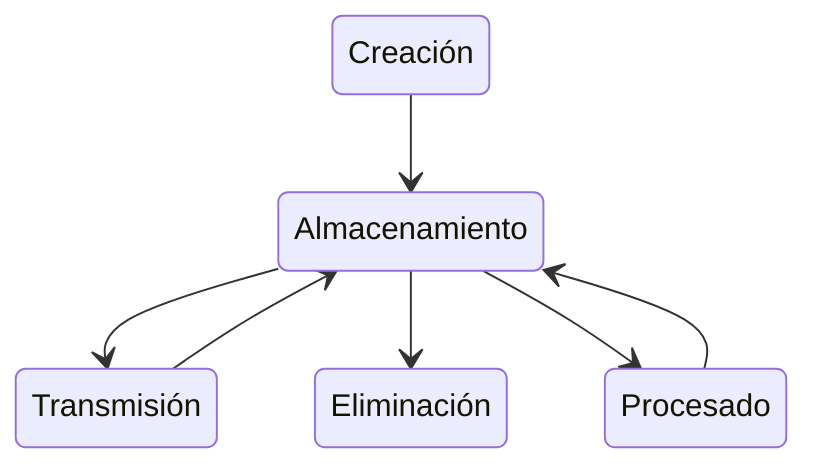

## Introducción

Es una **directiva Europea** para garantizar un nivel comun de seguridad de las redes y sistemas de información.

[**NIS V.1**](https://eur-lex.europa.eu/legal-content/ES/TXT/?uri=CELEX:32016L1148) la cual a sido derogada por [**NIS V.2**](https://eur-lex.europa.eu/legal-content/ES/TXT/?uri=CELEX:32022L2555)

La capacidad actuales no bastan para garantizar un nivel elevado de seguridad.

Los niveles de preparación de los Estados miembros son muy distintos, lo que ha dado lugar a planteamientos fragmentados

Genera niveles desiguales de protección de los consumidores y las empresas, comprometiendo el nivel general de seguridad de las redes y sistemas de información

La directiva NIS busca suplir:

- Estableciendo requisitos mínimos comunes en materia de desarrollo de capacidades y planificación
- Intercambio de información, cooperación y requisitos comunes de seguridad para los operadores de servicios esenciales y los proveedores de servicios digitales &rarr; se insta a adoptar las medidas oportunas para gestionar los riesgos en seguridad y notificar los incidentes que tendrían un efecto perturbador significativo a las Autoridades Nacionales Competentes
- Proponiendo la creación de una red de cooperación entre todos los diferentes Estados Miembros

### Consideraciones

- (1) Las redes y sistemas de información desempeñan un papel crucial en la sociedad. Su fiabilidad y seguridad son esenciales para las actividades económicas y sociales, y en particular para el funcionamiento del mercado interior.

- (2) La magnitud, la frecuencia y los efectos de los incidentes de seguridad se están incrementando y representan una grave amenaza para el funcionamiento de las redes y sistemas de información con el potencial de interrumpir las actividades económicas, provocar pérdidas financieras significativas, socavar la confianza de los usuarios e infligir daños sustanciales a la economía.

- (3) La seguridad de las redes y sistemas de información, especialmente de internet, es crucial para el funcionamiento adecuado del mercado interior, dado que su carácter transnacional implica que cualquier perturbación significativa, independientemente de su intención o ubicación, puede afectar a varios Estados miembros y a la Unión en su conjunto.

- (4) Representantes de los Estados miembros, la Comisión y la Agencia de Seguridad de las Redes y de la Información de la Unión Europea (ENISA) -> equisitos mínimos comunes en materia de desarrollo de capacidades y planificación, intercambio de información, cooperación y requisitos comunes de seguridad para los operadores de servicios esenciales y los proveedores de servicios digitales

- (32) CSIRT (Computer security incident response teams): Deben recibir las notificaciones de los incidentes de ciberseguridad de las empresas, el CSIRT ha de poder encargar al punto de contacto único que trasmita notificaciones de incidentes a los puntos de contacto únicos de los demás Estados miembros afectados.
	- (34) Los Estados miembros deben disponer de capacidades técnicas y de organización adecuadas para poder adoptar medidas de prevención, detección, respuesta y mitigación de los incidentes y riesgos que afecten a las redes y sistemas de información.
- (44) Deben fomentarse una cultura de gestión de riesgos que implique una evaluación del riesgo y la aplicación de medidas de seguridad adecuadas a los riesgos que hay que afrontar, y esta se debe desarrollar a través de requisitos normativos adecuados y prácticas sectoriales voluntarias.
- (46) Entre las medidas de gestión del riesgo figuran aquellas cuya finalidad es determinar todo riesgo de incidentes, prevenir, detectar y gestionar incidentes y mitigar sus repercusiones. La seguridad de las redes y sistemas de información comprende la seguridad de los datos conservados, transmitidos y procesados.
- (53) Para no imponer una carga financiera y administrativa desproporcionada a los **operadores de servicios esenciales y a los proveedores de servicios digitales**, los requisitos han de ser proporcionados en relación con los riesgos que presenta la red y el sistema de información en cuestión, y tener en cuenta el estado de la técnica &rarr; en el el caso de los proveedores de servicios digitales, esos requisitos no deben aplicarse ni a las microempresas ni a las pequeñas empresas (pymes).

- **ENISA** &rarr; en colaboración con los Estados miembros, elaborará directrices y orientaciones relativas a las áreas técnicas que deban examinarse en relación con el apartado 1, así como en relación con las normas ya existentes, en particular las normas nacionales de los Estados miembros que permitirían cubrir esas áreas.
- Intercambio de información, cooperación y requisitos comunes de seguridad para los operadores de servicios esenciales y servicios digitales instando a adoptar medidas para gestionar los riesgos y notificar incidentes significativos a las autoridades competentes.
- Creando una cooperación entre todos los diferentes Estados Miembros.
- Ningún Estado miembro está obligado a facilitar información cuya divulgación considere contraria a los intereses esenciales de su seguridad.

> `lex specialis` norma especifica con respecto a una más general.
{: .prompt-info }
- **lex specialis** aplica a sectores de alta criticidad como:
	- El trasporte marítimo y fluvial.
	- Sector bancario y de las infraestructuras de los mercados financieros.
	- Y se aplica a la totalidad de las operaciones, incluidas las de los sistemas de radio y telecomunicaciones, los sistemas informáticos y las redes.

## Capítulo 1
### Artículo 1
#### Objeto y ámbito de aplicación

El objetivo es lograr un elevado nivel común de seguridad de las redes y sistemas de información dentro de la Unión a fin de mejorar el funcionamiento del mercado interior.

> Todos los paises estan `OBLIGADOS` a:
{: .prompt-danger }

- Adoptar una estrategía nacional de seguridad.
- Crear un grupo de cooperación: intercambio de información y confianza.
- Creación de red de CSIRT y puntos de contacto (nacionales).
- Establecer requisitos de materia de seguridad y notificación para los operadores de servicios esenciales y para los proveedores de servicios digitales.
- La directiva **NUNCA** puede entrar en conflico con **Salvaguardar la seguridad nacional**.

### Artículo 2
#### Tratamiento de datos personales

Protección de Datos Personales y garantía de los derechos digitales

- El tratamiento de datos personales conforme a la presente Directiva se llevará a cabo de conformidad con la Directiva 95/46/CE
- El tratamiento de datos personales por las instituciones y los órganos de la Unión conforme a la presente Directiva se llevará a cabo de conformidad con el Reglamento (CE) n.o 45/2001.

[Reglamento General de Protección de Datos, RGPD](https://eur-lex.europa.eu/legal-content/ES/TXT/?uri=celex:32016R0679)

[Ley organica de Protección de Datos
Personales y garantía de los derechos digitales](https://www.boe.es/eli/es/lo/2018/12/05/3/con)

> Todo lo relaccionado con la protección de los datos recae sobre el reglamento general de la protección de datos `rgpd`.
{: .prompt-info }

Los datos al tener su propio ciclo de vida:

Y a la hora de proteger los datos dependiendo del estado en el cual se encuentre en el ciclo de vida las medidas a tomar son distintas.

### Artículo 4
#### Definiciones:

A los efecto de la presente Directiva, se entenderá por:

1. Redes y sistemas de información:

	a) una red de comunicaciones electrónicas en el sentido del artículo 2, letra a), de la Directiva 2002/21/CE;

	b) todo dispositivo o grupo de dispositivos interconectados o relacionados entre sí en el que uno o varios de ellos realizan, mediante un programa, el tratamiento automático de datos digitales, o

	c) los datos digitales almacenados, tratados, recuperados o transmitidos mediante elementos contemplados en las letras a) y b) para su funcionamiento, utilización, protección y mantenimiento;

2. Seguridad de las redes y sistemas de información: la capacidad de las redes y sistemas de información de resistir, con un nivel determinado de fiabilidad, toda acción que comprometa la disponibilidad, autenticidad, integridad o confidencialidad de los datos almacenados, transmitidos o tratados, o los servicios correspondientes ofrecidos por tales redes y sistemas de información o accesibles a través de ellos;

3. Estrategia nacional de seguridad de las redes y sistemas de información: un marco que proporciona prioridades y objetivos estratégicos de seguridad de las redes y sistemas de información a escala nacional;

4. Operador de servicios esenciales: una entidad pública o privada de uno de los tipos que figuran en el anexo 2, que reúna los criterios establecidos en el artículo 5, apartado 2;

5. Servicio digital: un servicio en el sentido del artículo 1, apartado 1, letra b), de la Directiva (UE) 2015/1535 del Parlamento Europeo y del Consejo (1) que sea de uno de los tipos que figuran en el anexo 3;

6. Proveedor de servicios digitales: toda persona jurídica que preste un servicio digital;

7. Incidente: todo hecho que tenga efectos adversos reales en la seguridad de las redes y sistemas de información;

8. Incidente: todo hecho que tenga efectos adversos reales en la seguridad de las redes y sistemas de información;

9. Riesgo: toda circunstancia o hecho razonablemente identificable que tenga un posible efecto adverso en la seguridad de las redes y sistemas de información;

10. Representante: toda persona física o jurídica establecida en la Unión que ha sido designada expresamente para actuar por cuenta de un proveedor de servicios digitales no establecido en la Unión, al que puede dirigirse una autoridad competente nacional o un CSIRT en sustitución del proveedor de servicios digitales, en lo que respecta a las obligaciones del proveedor de servicios digitales en virtud de la presente Directiva;

11. Norma: una norma en el sentido del artículo 2, punto 1, del Reglamento (UE) n.o 1025/2012;

12. Especificación: una especificación técnica en el sentido del artículo 2, punto 4, del Reglamento (UE) n.o 1025/2012;

13. Punto de intercambio de internet (»IXP«, por sus siglas en inglés de» internet exchange point«)»: una instalación de la red que permite interconectar más de dos sistemas autónomos independientes, principalmente para facilitar el intercambio de tráfico de internet; un IXP solo permite interconectar sistemas autónomos; un IXP no requiere que el tráfico de internet que pasa entre cualquier par de sistemas autónomos participantes pase por un tercer sistema autónomo, ni modifica ni interfiere de otra forma en dicho tráfico;

14. Servidor de sistema de nombres de dominio (DNS, por sus siglas en inglés de "domain name system"): un sistema de nombres de dominio distribuido jerárquicamente en una red que recibe consultas sobre nombres de dominio;

15. Proveedor de servicios de DNS: una entidad que presta servicios de DNS en internet;

16. Registro de nombres de dominio de primer nivel: una entidad que administra y dirige el registro de nombres de dominio de internet en un dominio específico de primer nivel;

17. Mercado en línea: un servicio digital que permite a los consumidores o a los comerciantes, como se definen respectivamente en el artículo 4, apartado 1, letra a) y letra b), de la Directiva 2013/11/UE del Parlamento Europeo y del Consejo (1), celebrar contratos de compraventa o de servicios en línea con comerciantes, ya sea en el sitio web del mercado en línea o en un sitio web de un comerciante que utilice servicios informáticos proporcionados por el mercado en línea;

18. Motor de búsqueda en línea: un servicio digital que permite a los usuarios hacer búsquedas de, en principio, todos los sitios web o de sitios web en una lengua en concreto mediante una consulta sobre un tema cualquiera en forma de palabra clave, frase u otro tipo de entrada, y que en respuesta muestra enlaces en los que puede encontrarse información relacionada con el contenido solicitado;

19. Servicio de computación en nube»: un servicio digital que hace posible el acceso a un conjunto modulable y elástico de recursos informáticos que se pueden compartir.

### Artículo 5
#### Identificación de operadores de servicios esenciales

A más tardar el 9 de noviembre de 2018, los Estados miembros identificarán a los operadores de servicios esenciales establecidos en su territorio para cada sector y subsector mencionados en el anexo 2.

Los criterios para la identificación de operadores de servicios esenciales a que se refiere el artículo 4, punto 4, son los siguientes:

1. Una entidad presta un servicio esencial para el mantenimiento de actividades sociales o económicas cruciales;

2. La prestación de dicho servicio depende de las redes y sistemas de información, y

3. un incidente tendría efectos perturbadores significativos en la prestación de dicho servicio.

> Los Estados miembros revisarán con regularidad, y al menos cada dos años a partir del 9 de mayo de 2018, la lista de operadores de servicios esenciales identificados y la actualizarán cuando proceda.
{: .prompt-info }

### Artículo 6
#### Efecto perturbador significativo

A la hora de determinar la importancia de un efecto perturbador tal como se indica en el artículo 5, apartado 2, letra c), los Estados miembros tendrán en cuenta al menos los siguientes factores intersectoriales:

1. El número de usuarios que confían en los servicios prestados por la entidad de que se trate;
2. La dependencia de otros sectores que figuran en el anexo 2 sobre el servicio prestado por esa entidad;
3. La repercusión que podrían tener los incidentes, en términos de grado y duración, en las actividades económicas y sociales o en la seguridad pública;
4. La cuota de mercado de la entidad;
5. La extensión geográfica con respecto a la zona que podría verse afectada por un incidente;
6. La importancia de la entidad para mantener un nivel suficiente del servicio, teniendo en cuenta la disponibilidad de alternativas para la prestación de ese servicio.

## Capítulo II
#### Marcos nacionales de seguridad de las redes y sistemas de información
### Artículo 7
#### Estrategia nacional de seguridad de las redes y sistemas de información

1. Cada Estado miembro adoptará una estrategia nacional de seguridad de las redes y sistemas de información que establezca los objetivos estratégicos y las medidas políticas y normativas adecuadas con objeto de alcanzar y mantener un elevado nivel de seguridad de las redes y sistemas de información y que cubra al menos los sectores que figuran en el anexo 2 y los servicios que figuran en el anexo 3. La estrategia nacional de seguridad de las redes y sistemas de información abordará, en particular, las cuestiones siguientes:

	a) Los objetivos y prioridades de la estrategia nacional de seguridad de las redes y sistemas de información;

	b) Un marco de gobernanza para lograr los objetivos y las prioridades de la estrategia nacional de seguridad de las redes y sistemas de información, incluidas las funciones y responsabilidades de las instituciones públicas y de los demás agentes pertinentes;

	c) La identificación de medidas sobre preparación, respuesta y recuperación, incluida la cooperación entre los sectores público y privado;

	d) Programas de educación, concienciación y formación relacionados con la estrategia nacional de seguridad de las redes y sistemas de información

	e) Programas de investigación y desarrollo relacionados con la estrategia nacional de seguridad de las redes y sistemas de información;

	f) Un plan de evaluación de riesgos para identificar riesgos;

	g) Una lista de los diversos agentes que participan en la ejecución de la estrategia de seguridad de las redes y sistemas de información.

> Véanse Capítulo II Artículo 8, Artículo 9 y Artículo 10, Capítulo III Artículo 11.
{: .prompt-info }

### Artículo 8, Artículo 9, Artículo 10
#### Autoriades nacionales competentes y punto de contacto único

1. Se crea el Grupo de cooperación para apoyar y facilitar la cooperación estratégica y el intercambio de información entre los Estados miembros, con el objetivo de alcanzar un alto nivel de seguridad en las redes y sistemas de información en la Unión.

2. El grupo de cooperación está compuesto por representantes de los Estados miembros, la Comisión y la ENISA, y puede invitar a representantes relevantes a sus trabajos.

3. Funciones del Grupo incluyen: proporcionar orientación estratégica a la red de CSIRT, intercambiar buenas prácticas y experiencias en seguridad, evaluar estrategias nacionales y la eficacia de los CSIRT, y discutir sobre normas y especificaciones.

4. El grupo revisa informes anuales y elabora un programa de trabajo bienal que alinea con los objetivos de la Directiva.

5. La comisión es responsable de la secretaría del Grupo y adopta actos de ejecución para sus procedimientos operativos, en conformidad con los procedimientos de examenes establecidos.

## Capítulo III
### Artículo 12
#### Red de CSIRT

Contribuir a desarrollar la confianza y la seguridad entre los Estados miembros y promover una cooperación operativa rápida y eficaz, con la ENISA actuando como secretaría y la Comisión como observador.

La red de CSIRT desempeñará los siguientes cometidos:

1. Intercambiar información sobre servicios, operaciones y capacidades de cooperación de los CSIRT.
2. Intercambiar y proporcionar voluntariamente información no confidencial sobre incidentes concretos.
3. Cada año y medio la red de CSIRT revisará y reportará su experiencia y eficacia en la cooperación operativa al Grupo de cooperación y establecerá su propio reglamento interno.

## Capítulo IV
#### Seguridad de las redes y sistemas de información de los proveedores de servicios digitales
### Artículo 14
#### Requisitos en materia de seguridad y notificación de incidentes

1. Los Estados miembros asegurarán que los operadores de servicios esenciales implementen medidas técnicas y organizativas apropiadas para gestionar los riesgos de seguridad en las redes y sistemas de información que utilizan, garantizando un nivel de seguridad adecuado según el riesgo.
2. Además, los Estados miembros requerirán que estos operadores notifiquen de manera inmediata a la autoridad competente o al CSIRT los incidentes que impacten significativamente la continuidad de los servicios esenciales, incluyendo detalles que permitan evaluar efectos transfronterizos del incidente sin que esto implique mayor responsabilidad para el notificante.
3. Importancia de los efectos de un incidente: nº usuarios afectados, duración del incidente, extensión geográfica con respecto a la zona afectada por el incidente.

4. Los Estados miembros asegurarán que las autoridades competentes tengan las facultades y recursos necesarios para evaluar si los operadores de servicios esenciales cumplen con las obligaciones de seguridad establecidas en el artículo 14 y sus efectos en la seguridad de las redes y sistemas de información.

5. Estas autoridades podrán requerir a los operadores que proporcionen información y pruebas, como documentación de políticas de seguridad y resultados de auditorías, para evaluar la seguridad de sus sistemas; en caso de identificar deficiencias, pueden emitir instrucciones vinculantes para corregirlas y deberán cooperar con las autoridades de protección de datos en incidentes que impliquen violaciones de datos personales.

## Capítulo V
#### Seguridad de las redes y sistemas de información de los proveedores de servicios digitales
### Artículo 16
#### Requisitos en materia de seguridad y notificación de incidentes

1. Medidas garantizarán un nivel de seguridad de las redes y los sistemas de información adecuado en relación con el riesgo planteado, y tendrán en cuenta lo siguiente:

	a) Seguridad de los sistemas e instalaciones;

	b) Gestión de incidentes;

	c) Gestión de la continuidad de las actividades;

	d) Supervisión, auditorías y pruebas;

	e) Cumplimiento de las normas internacionales;

2. Proveedores de servicios digitales deben notificar sin dilación indebida a la autoridad competente al CSIRT cualquier incidente que tenga un impacto significativo:

	a) Nº usuarios afectados

	b) Duración incidente

	c) Extensión geográfica

	d) Grado perturbación

	e) Alcance del impacto sobre actividades económicas y sociales

### Artículo 18
#### Jurisdicción y territorialidad

Un proveedor de servicios digitales estará bajo la jurisdicción del Estado miembro en el que tenga su establecimiento principal, identificado por el lugar de su domicilio social.

Si un proveedor de servicios digitales no está físicamente establecido en la Unión pero ofrece servicios en ella, debe designar un representante en un Estado miembro donde opere, estableciendo así su jurisdicción en ese Estado.

Designar un representante en la Unión no impide la posibilidad de iniciar acciones legales directamente contra el proveedor de servicios digitales.

## ANEXO 1
#### Requisitos y funciones de los equipos de respuesta a incidentes de seguridad informática (CSIRT)

Funciones (mínimas) de CSIRT
- Supervisar incidentes a escala nacional
- Difundir alertas tempranas, alertas, avisos e información sobre riesgos e incidentes entre los interesados
- Responder a incidentes
- Efectuar un análisis dinámico de riesgos e incidentes y de conocimiento de la situación,
- Participar en la red de CSIRT

## ANEXO 2
#### Tipos de entidades a efectos del artículo 4, Punto 4

1. Energía

	a) Electricidad

	b) Crudo

	c) Gas

2. Transporte

	a) Trasporte aereo

	b) Trasporte por ferrocarril

	c) Trasporte marítimo y fluvial

	d) Trasporte por carretera

3. Banca
4. Infraestructuras de los mercados financieros
5. Sector sanitario
6. Suministros y distribución de agua potable
7. Infraestructura digital

	a) IXP

	b) Proveedores de servicios del DNS

	c) Registros de nombres de dominio de primer nivel

## ANEXO 3
#### Tipos de entidades a efectos del artículo 4, Punto 5

1. Mercado en línea
2. Motor de búsqueda en línea
3. Servicios de computación en nube