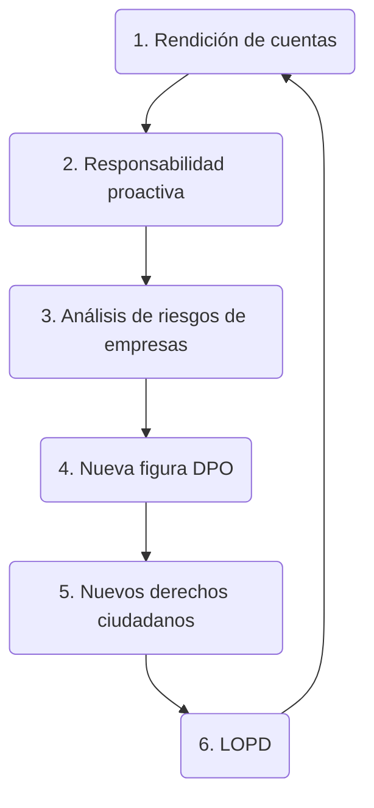

## Introducción

A partir del 25 de mayo del 2018 todas autoridades públicas y empresas que trabajen con datos personales deben aplicar las nuevas disposiciones de la Unión Europea sobre protección de datos.

Dar mayor control al usuario sobre sus datos.

Jurídicamente vinculante y aplicable de inmediato para todos los Estados &rarr; afecta a la prácticaa empresarial de toda PYME de forma inminente.

Todas las autoridades públicas y empresas que trabajen con datos personales deben aplicar las nuevas disposiciones de la Unión Europea sobre protección de datos.

Sanciones de 20 millones de euros o hasta el 4% del volumen de ventas mundial del ejercicio fiscal anterior si no se cumple la normativa.

En España nueva Ley Orgánica de Protección de Datos para adecuarse al nuevo reglamento europeo.

## LOPDGDD Y RGPD

[LOPDGDD](https://www.boe.es/eli/es/lo/2018/12/05/3/con)

[Reglamento (UE) 2016/679 del Parlamento Europeo y del Consejo, de 27 de abril de 2016](https://eur-lex.europa.eu/legal-content/ES/TXT/?uri=CELEX:32016R0679)

Objetivo: Unificar los principios de protección de datos de la Unión Europea

### Mayor rendición de cuentas

Mayor rendición de cuentas (1/3):

: Se amplia la información que se les debe dar a los interesados en relación con el tratamiento de sus datos así como a sus derechos a esta materia.

:  En la **([Consideración 78](https://eur-lex.europa.eu/legal-content/ES/TXT/?uri=CELEX:32016R0679))**, **([Artículo 25](https://eur-lex.europa.eu/legal-content/ES/TXT/?uri=CELEX:32016R0679#d1e3126-1-1))** y **([Artículo 73](https://www.boe.es/eli/es/lo/2018/12/05/3/con#a7-5) Apartado D)** se incorpora el concepto de **privacidad desde el diseño**: la elaboración de los procedimientos empresariales se tiene que realizar teniendo en cuenta la protección de datos desde un primer momento.

: En el **([Artículo 33](https://eur-lex.europa.eu/legal-content/ES/TXT/?uri=CELEX:32016R0679#d1e3494-1-1))** las violaciones en la seguridad que puedan afectar a los datos personales deben notificarse en un plazo máximo de 72 horas a la Autoridad de Control correspondiente, en el caso de España (Agencia Española de Protección de Datos).

> **[Asesora Brecha](https://www.aepd.es/guias-y-herramientas/herramientas/asesora-brecha)** es un recurso de utilidad para que cualquier organización, responsable de un tratamiento de datos personales, pueda valorar la obligación de notificar sin dilación indebida a la Agencia Española de Protección de Datos una brecha de datos personales, tal y como establece el artículo 33 del Reglamento General de Protección de Datos.
{: .prompt-info }

Mayor rendición de cuentas (2/3):

: Eliminada la obligación de registrar los ficheros ante la Autoridad de Control correspondiente

: En la **Consideración 13** y en el **([Artículo 30 - Apartado 4](https://eur-lex.europa.eu/legal-content/ES/TXT/?uri=CELEX:32016R0679#d1e3325-1-1))** es obligatorio llevar a un registro interno de todos los tratamientos de datos personales que lleva a cabo la entidad si más de 250 empleados o si se tratan datos sensibles (p.e., salud, origen étnico, religioso, condenas, etc.)

[Artículo 9](https://eur-lex.europa.eu/legal-content/ES/TXT/?uri=CELEX:32016R0679#d1e2114-1-1) lista los tipos de datos que se consideran sensibles, así como en las siguientes consideraciones: 51, 53, 54, 56, 71,

| LOPD 1998			| RGPD					|
| :---------------------------- | :-----------------------------------: |
| Ideología			| Opiniones políticas			|
| Afiliación sindical		| Afiliación sindical			|
| Religión			| Convicciones religiosas		|
| Creencias			| Convicciones filosóficas		|
| Origen racial o étnico	| Origen racial o étnico		|
| Salud				| Datos relativos a la salud		|
| Vida sexual			| Vida sexual				|
|				| Dato genético				|
|				| Dato biométrico			|
|				| Orientación sexual			|

[Lectura sobre datos sensibles](https://protecciondatos-lopd.com/empresas/datos-especialmente-protegidos-sensibles/)

Mayor rendición de cuentas (3/3):

: En el **([Artículo 34](https://eur-lex.europa.eu/legal-content/ES/TXT/?uri=CELEX:32016R0679#d1e3550-1-1))** si la violación afecta datos de carácter sensible y con gran repercusión a los afectados, también se le debe notificar a estos mismos.

> [¿Qué es una violación de la seguridad de los datos y qué deberíamos hacer en caso de sufrir una?](https://commission.europa.eu/law/law-topic/data-protection/reform/rules-business-and-organisations/obligations/what-data-breach-and-what-do-we-have-do-case-data-breach_es)
{: .prompt-info }

### Responsabilidad proactiva

Responsabilidad proactiva (1/3)

: En la **[Consideración 85](https://eur-lex.europa.eu/legal-content/ES/TXT/?uri=CELEX:32016R0679)** hay necesidad de prevención, no de actual cuando ya hay infracción.

: **Prohibición salvo autorización**: a priori se prohíbe cualquier procesamiento de datos personales a no ser que esté permitido.

: **Limitación de la finalidad**: [Artículo 5 - 1B](https://eur-lex.europa.eu/legal-content/ES/TXT/?uri=CELEX:32016R0679#d1e1873-1-1) las empresas solo podrán recopilar y editar datos con unos objetivos específicos; antes de recoger datos formular los objetivos y documentar uso futuro de los datos (ejemplo: datos recopilados y guardados justificadamente para cumplimiento de un contrato no pueden utilizarse para fines publicacitarios)

: **Minimización de datos**: [Artículo 5 - 1C](https://eur-lex.europa.eu/legal-content/ES/TXT/?uri=CELEX:32016R0679#d1e1873-1-1) las empresas deben recopilar la menor cantidad de datos posible ("lo menos posible y tanto como sea necesario")

Responsabilidad proactiva (2/3)

: **Transparencia**: [Artículo 12 - 1](https://eur-lex.europa.eu/legal-content/ES/TXT/?uri=CELEX:32016R0679#d1e2245-1-1) tratamiento de datos debe ser comprensible para los interesados &rarr; avisos de privacidad claros &rarr; mayores derechos para los usuarios.

: **Confidencialidad**: [Artículo 5 - 1F](https://eur-lex.europa.eu/legal-content/ES/TXT/?uri=CELEX:32016R0679#d1e1873-1-1) Obligación de proteger los datos personales de sus clientes de forma técnica y organizativa ya sea del tratamiento o modificación no autorizados, del robo o de la destrucción de dichos datos.

: Obligación explícita a aplicar medidas técnicas de protección (p.e., en caso del robo de información, las medidas técnicas y organizativas de protección han de resultar adecuadas para el riesgo planteado y el tipo de datos almacenados)

Responsabilidad proactiva (3/3)

: Bases de Legitimación
	- Consentimiento *Debe ser inequívoco con clara acción afiermativa*
	- Relación contractual
	- Intereses vitales del interesado o de otras personas
	- Obligación legal para el responsable
	- Interés público o ejercicio de poderes públicos
	- Intereses legítimos del responsable o de terceros a los que se comunican los datos **hay que especificar y documentar los intereses legítimos en que se fundamentan las operaciones de tratamiento**

Las **Bases de Legitimación** estan en el **[Artículo 6](https://eur-lex.europa.eu/legal-content/ES/TXT/?uri=CELEX:32016R0679#d1e1954-1-1)** y las **Consideración desde la 39 a la 56**

### Análisis de riesgos

Análisis de riesgos:

: Necesario un análisis de los tratamientos que una empresa hace para tomar medidas adecuadas &rarr; **evaluaciones de impacto** 

: **Evaluación de impacto**: [Artículo 35](https://eur-lex.europa.eu/legal-content/ES/TXT/?uri=CELEX:32016R0679#d1e3606-1-1) evaluaciones de riesgos y definición de medidas de protección adoptadas para minimizarlos
	- Especialmente relevante cuando las empresas recurren a la computación en la nube, pues en un servicio como tal se trabaja a menudo con grandes cantidades de datos personales.
	- Mayores consecuencias para las empresas que almacenan datos sanitarios, puesto que son especialmente sensibles y su difusión tiene especial relevancia los interesados.

### Delegado de protección de datos

[Delegado de protección de datos (DPO):](https://eur-lex.europa.eu/legal-content/ES/TXT/?uri=CELEX:32016R0679#d1e3782-1-1)

: Todos los organimos públicos y empresas en las que sus actividades principales hagan referencia a la manipulación de datos personales deben designar a un delegado de protección de datos.

: Aunque la actividad principal no esté relacionada con el tratamiento de datos se nombrará un DPO (Data Protection Officer) su al menos 10 personas ocupadas en tratamiento automatizado de los datos personales.

: DPO planifica las medidas de seguridad aplicables a los tratamientos de datos y la gestion de los mismos (enlace entre empresa y autoridad de control)

{: width="972" height="589" }

[Lectura DPO](https://protecciondatos-lopd.com/empresas/delegado-proteccion-datos-dpo/)

### Nuevos derechos ciudadanos, más información y consentimiento

Nuevos derechos ciudadanos, más información y consentimiento (1/2)

: Mayor capacidad de decisión y control de los ciudadanos sobre los datos personales que facilitan a terceros

: **Derecho al olvido**: En el [Artículo 17](https://eur-lex.europa.eu/legal-content/ES/TXT/?uri=CELEX:32016R0679#d1e2669-1-1) los ciudadanos tienen derecho a solicitar y conseguir de los encargados que los datos personales sean suprimidos cuando:
	- No sean necesarios para el fin para el que fueron reunidos.
	- Se haya revocado el consentimiento
	- Se hayan obtenido de forma ilegal

: **Derecho a la portabilidad**: En el [Artículo 20](https://eur-lex.europa.eu/legal-content/ES/TXT/?uri=CELEX:32016R0679#d1e2816-1-1) el interesado que haya proporcionado sus datos a un responsable que los esté tratando de forma digitalizada podrá requerir recobrar esos datos en un formato que le permita su traslado a otro responsable.

: **Derecho de rectificación, derecho a la limitación del tratamiento, derecho de oposición y decisiones individuales automarizadas**

Nuevos derechos ciudadanos, más información y consentimiento (2/2)

: **Obtención del consentimiento**: [Artículo 7](https://eur-lex.europa.eu/legal-content/ES/TXT/?uri=CELEX:32016R0679#d1e2067-1-1) las condiciones para el consentimiento, con carácter general, debe ser libre, informado, específico e inequívoco.
	- Las empresas deben revisar la forma en la que obtienen y guardan el consentimiento.
	- NO MAS consentimiento táctico (aquel que resulta de hechos o de actos que lo presuponen o que autoricen a presumidos) y no puede deducirse del silencio o de la inacción del interesado.
	- Se exige un consentimiento "manifiesto" por ejemplo para autorizar el tratamiento de datos sensibles.
	- En resumen, el consentimiento tiene que ser verificable y quienes recopilen datos personales, deben poder probar que el afectado les concedió su consentimiento.

## Resumen

RGPD

: Obligaciones de documentación

: Privacy by desing (privacidad desde el diseño)

: Privacy by default (privacidad por defecto)

: Fundamentos de la autorización (consentimiento, convenio)

: Supresión de datos

: Derecho de acceso y derecho de supresión

: La [AEPD](https://www.aepd.es/) ha decretado su compromiso para introducir las herramientas necesarias que ayuden y facilien la adaptación al RGPD:

	- Herramienta [Facilita RGPD](https://servicios.aepd.es/Facilita) (orientada a empresas que tratan datos personales de escaso riesgo, como por ejemplo, datos personales de clientes, proveedores o recursos humanos)
	- Herramienta [Facilita EMPRENDE](https://www.aepd.es/guias-y-herramientas/herramientas/facilita-emprende) persigue servir de apoyo a personas emprendedoras y startups cuyos tratamientos se caracterizan por un fuerte componente innovador que hace uso de nuevas tecnologías.

: Sistema de mediación voluntaria para [reclamación de derechos](https://privada.autocontrol.es/servicio/reclamacion/noregistrado/create/reclamacion) con colaboración con AUTOCONTROL.

: En noviembre 2018 nueva Ley Orgánica de Protección de Datos

: Adapta el derecho español al modelo establecido por el Reglamento General de Protección de Datos e introduce pequeñas novedades

: Facilita que los ciudadanos puedas ejercitar sus derechos al exigir que los medios para hacerlo sean fácilmente accesibles y se regula el modo en que debe informarse a las personas acerca del tratamiento de sus datos

	- En internet &rarr; sistema de información por capas que permita al ciudadano conocer de forma clara y sencilla los aspectos más importantes del tratamiento, pudiendo acceder a los restantes a través de un enlace directo

: Reconoce específicamente el derecho de acceso y, en su caso, de rectificación o supresión por parte de quienes tuvieran vinculación con personas fallecidas por razones familiares o de hecho a sus herederos

: En la ley fija en 14 años la edad a partir de la cual se puede prestar consentimiento de manera y se regula expresamente el derecho a solicitar la supresión de los datos facilitados a redes sociales u otros servicios de la sociedad de la información por el propio menor o por terceros durante su minoría de edad.

: Su refuerza la obligación del sistema educativo para garantizar la formación del alumnado en el uso seguro y adecuado de internet incluyéndola de forma específica en los currículums académicos y exigiendo que el profesorado reciba una formación adecuada en esta materia

: Se regula el derecho al olvido en redes sociales y servicios de la sociedad de la información equivalentes

: Se actualizan las garantías del derecho a la intimidad frente al uso de dispositivos de videovigilancia y de grabación de sonidos en el lugar de trabajo

## Caso práctico

¿Se tratan de datos personales? No; Si &rarr; se aplica el RGPD

Categorización de datos

Valoración del riesgo: reflexión documentada sobre las implicaciones de los tratamientos en los derechos y libertades de los interesados

: ¿Se tratan datos sensibles?

: ¿Se incluyen datos de una gran cantidad de personas?

: ¿Incluye el tratamiento la elaboración de perfiles?

: ¿Se cruzan los datos obtenidos de los intereados con otros disponibles en otras fuentes?

: ¿Se pretende utilizar los datos obtenidos para una finalidad para otro tipo de finalidades?

: ¿Se están tratando grandes cantidades de datos, incluido con técnicas de análisis masivo tipo big data?

: ¿Se utilizan tecnologías especialmente invasivas para la privacidad, como las relativas a geolocalización, videovigilancia a gran escala o ciertas aplicaciones del Internet de las Cosas?

Valoración del riesgo: **Gestión de riesgos**, se puede dividir en tres etapas diferencias, que son identificación, evaluación y tratamiento

: Identificación: Las amenazas se pueden categorizar principalmente en 3 tipos en base a la tipología de daño que pueden producir en los datos

: Recordad:

	- Acceso ilegítimo a los datos &rarr; confidencialidad

	- Modificación no autorizada de los datos &rarr; integridad

	- Eliminación de datos &rarr; integridad y disponibilidad

Ciclo de vida de los datos o data flow:

: Captura de datos &rarr; Clasificación / Almacenamiento &rarr; Uso / Tratamiento &rarr; Cesión / transferencia de datos a un tercero para su tratamiento &rarr; Destrucción

Evaluación: se hace a través del impacto que tendrían y la probabilidad ocurrencia, en una escala de 1 a 4 (despreciable, limitada, significativa, máxima)

: {: width="972" height="589" }

| Ciclo de vida del dato (fase almacenamiento) | Almacenamiento de datos de clientes en disponsitivos móviles			|
| :---------------------------- | ---------------------------------------------------------------------------------------------:|
| Amenaza:			| Pérdida del dispositivo móvil									|
| Riesgo:			| Acceso no autorizado por parte de terceros a datos de salud (violación de la confidencialidad)|
| Impacto:			| Violación de derechos fundamentales (Significativo 3)						|
| Probabilidad:			| Se puede producir cada vez que el usuario no tiene en su poder el dispositivo móvil (Significativa 3)|
| Riesgo inherente:		| Impacto x Probabilidad x = 3 x 3 = 9 (Riesgo alto)|
| Medidas de control:		| Método de autenticación mediante usuario, contraseña, y huella biométrica. Cifrado del dispositivo móvil y pseudonimización de los datos.|
| Eficacia del control		| Reduce la probabilidad a despreciable 1 debido a que, aunque se pierda el dispositivo, no será posible el acceso sin credenciales, Adicionalmente, reduce el impacto a despreciable 1, debido a que, aunque se pierda el dispositivo, los datos nunca serán indentificable evitando producir daños sobre los interesados.|
| Riesgo residual:		| Impacto x Probabilidad x = 1 x 1 = 1 (Riesgo bajo)|

Evaluación: para aquellos tratamientos que sea probable que conlleven un alto riesgo para los derechos y libertades de los interesados

: Supuestos en que los tratamientos pueden conllevar un alto riesgo:

	- Elaboración de perfiles sobre cuya base se tomen decisiones que produzcan efectos jurídicos o afecten significativamente a los interesados

	- Tratamientos a gran escala de datos sensibles

	- Observación sistemática a gran escala de una zona de acceso público

Revisión ética:

: Detrás de los datos hay una persona - Respeta al individuo

: Se trasparente

: Consulta a expertos si dudas so puedes estar infringiendo leyes o regulaciones

: Utilice la información de manera responsable

: Protege los datos

Analiza y establece:

: Finalidad

: Minimización datos

: Plazo de conservación

Identifica las bases lícitas:

: Consentimiento

: Relación contractual

: Intereses vitales del interesado o de otras personas

: Obligación leal para el responsable

: Interés público o ejercicio de poderes públicos

: Intereses legítimos

Establece los roles en el tratamiento de datos:

: ¿Cuántos responsables hay?

: ¿Quienes son los encargados?

: ¿Cumplen los encargados con el RGPD?

: ¿Tienes contratos con terceros?

**Derechos de los interesados: asegura que puedes cumplir con ellos como marca la ley**

**Comprobar las medidas de seguridad: anonimizar, quién tendrá acceso, copias de seguridad, aplicar cifrado, etc**

**Documentar!**

Enlaces de interes: [FAQ AEPD](https://www.aepd.es/preguntas-frecuentes)