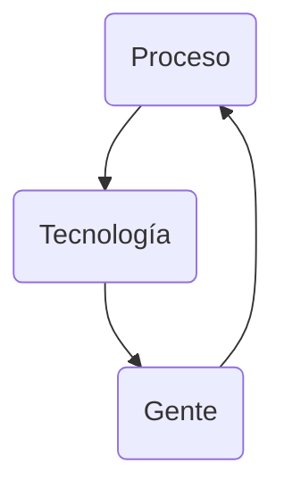

## 1 - The Danger
### 1.0 Introduction

Vamos a usar 2 máquinas virtuales: 

- [CyberOps Workstation VM](https://www.netacad.com/portal/resources/file/a7801868-0dab-4d4c-83b1-c0a7372ab7e1)

- [Security Onion VM](https://www.netacad.com/portal/resources/file/ea551ddd-9345-4f5e-bd82-7a7586c5f088)

#### 1.0.5 What Will I Learn in this Module?

| Topic Title			| Topic Objective			|
| :---------------------------- | :-----------------------------------: |
| War Stories			| Explain why networks and data are attacked			|
| Threat Actors			| Explain the motivations of the threat actors behind specific security incidents			|
| Threat Impact			| Explain the potential impact of network security attacks		|


### 1.1 War Stories
#### 1.1.1 Hijacked People

Sarah order a coffee, while waiting, she connected to what she assumed was the coffee shop's free wireless network.
Sitting in a cornet a hacker had just set up an open **"rogue"** wireless hotspot posing as the coffee shop's wireless network. When Sarah logged onto het bank's website, the hacker hijacked her session and gained access to her bank accounts. Another term for rogue wireless hotspots is **"evil twin"** hotspots.

#### 1.1.5 Installing the Virtual Machines

CyberOps Workstation VM

MD5 Checksum: 6a70f156715f85c09fbb859c80c4b6c5
SHA512 Checksum: 2cc44d6585001d99bce5dfc19ed5ef920714ca03

Security Onion VM

MD5 Checksum: 8d65135641b9c94e788909026805ad6b
SHA512 Checksum: aaca24b0036be5d61dd42a0b3503403e18ae0e12 

[Installing the Virtual Machines](/assets/img/cyberops_associate/1.1.5_lab_installing_the_virtual_machines.pdf)

#### 1.1.6 Lab - Cybersecurity Case Studies

[Cybersecurity Case Studies](/assets/img/cyberops_associate/1.1.6_lab_cybersecurity_case_studies.pdf)

### 1.2 Threat Actors
#### 1.2.1 Threat Actors

Threat Actors include, but not limited to, amateurs (script kiddies), hacktivist, organized crime groups, state-sponsored, and terrorist groups.

#### 1.2.2 How Secure is the Internet of Things?

How secure are these devices? For example, who wrote the firmware? Did the programmer pay attention to security flaws? Is your connected home thermostat vulnerable to attacks? What about your digital video recorder (DVR)? If security vulnerabilities are found, can firmware in the device be patched to eliminate the vulnerability? Many devices on the internet are not updated with the latest firmware. Some older devices were not even developed to be updated with patches. These two situations create opportunity for threat actors and security risks for the owners of these devices.

### 1.3 Threat Impact
#### 1.3.1 PII, PHI, PSI

Personally identifiable information (PII) is any information that can be used to positively identify an individual. Examples of PII include:

- Name
- Social security number
- Birthdate
- Credit card numbers
- Bank account numbers
- Government issued ID
- Address information (street, email, phone numbers)

PII can be used to create fake financial accounts, such as credit cards and short-term loans.

A subset of PII is protected health information (PHI). The medical community creates and maintains electronic medical records (EMRs) that contain PHI. In the U.S., handling of PHI is regulated by the Health Insurance Portability and Accountability Act (HIPAA). In the European Union the General Data Protection Regulation (GDPR) protects a broad range of personal information in including health records.

Personal security information (PSI) is another type of PII. This information includes usernames, passwords, and other security-related information that individuals use to access information or services on the network.

### 1.4 The Danger Summary
#### 1.4.1 What Did I Learn in this Module?

War Stories

: Threat actors can hijack banking sessions and other personal information by using “evil twin” hotspots. Threat actors can target companies, as in the example where opening a pdf on the company computer can install ransomware. Entire nations can be targeted. This occurred in the Stuxnet malware attack.

Threat Actors

: Threat actors include, but are not limited to, amateurs, hacktivists, organized crime groups, state sponsored, and terrorist groups. The amateur may have little to no skill and often use information found on the internet to launch attacks. Hacktivists are hackers who protest against a variety of political and social ideas. Much of the hacking activity is motivated by financial gain. Nation states are interested in using cyberspace for industrial espionage. Theft of intellectual property can give a country a significant advantage in international trade. As the Internet of Things (IoT) expands, webcams, routers, and other devices in our homes are also under attack.

Threat Impact

: It is estimated that businesses will lose over $5 trillion annually by 2024 due to cyberattacks. Personally identifiable information (PII), protected health information (PHI), and personal security information (PSI) are forms of protected information that are often stolen. A company can lose its competitive advantage when this information is stolen, including trade secrets. Also, customers lose trust in the company’s ability to protect their data. Governments have also been victims of hacking.

#### 1.4.2 Module 1: The Danger Quiz

An attacker sends a piece of mallware as an email attachment to employees in a company. What is one probable purpose of the attack?
- [ ] Denying external access to a web server that is open to the public
- [ ] Probing open ports on the firewall on the border network
- [X] Searching and obtaining trade secrets
- [ ] Cracking the administrator password for a critical server

> This is a malware attack. The purpose of a typical malware attack is to disrupt computer operations, gather sensitive information, or gain access to a private computer system. Cracking a password cannot be carried out by a simple malware attack because it requires intensive CPU and memory, which will make its operation noticeable. A reconnaissance attack would be used to probe open ports on a border firewall. Similarly, denying external access to a web server is a DoS attack launched from outside the company.
{: .prompt-info }

What is cyberwarfare?
- [ ] It is an attack that only involves robots and borts.
- [x] It is an attack designed to disrupt, corrupt, or exploit notional interests.
- [ ] It is an attack on a major corporation.
- [ ] It is an attack only on military targets.

> `Cyberwarfare` is a subset of information warfare (IW). Its objective is to disrupt (availability), corrupt (integrity) or exploit (confidentiality or privacy). It can be directed against military forces, critical infrastructures, or other national interests, such as economic targets. It involves several teams that work together. Botnet might be one of several tools to be used for launching the attack.
{: .prompt-info }

What type of malware has the primary objective of spreading across the network?
- [x] Worm
- [ ] Trojan horse
- [ ] Virus
- [ ] Botnet

> The main purpose of a `worm` is to self-replicate and propagate across the network.  A virus is a type of malicious software that needs a user to spread.  A trojan horse is not self-replicating and disguises itself as a legitimate application when it is not.  A botnet is a series of zombie computers working together to wage a network attack. ​
{: .prompt-info }

What is a potential risk when using a free and open wireless hotspot in a public location?
- [x] Network traffic might be hijacked and information stolen.
- [ ] The Internet connection can become too slow when many users access the wireless hotspot.
- [ ] Purchase of products from vendors might be required in exchange for the Internet access.
- [ ] Too many users trying to connect to the Internet may cause a network traffic jam.

> Many free and open wireless hotspots operate with no authentication or weak authentication mechanisms. Attackers could easily capture the network traffic in and out of such a hotspot and steal user information. In addition, attackers might set up a "rogue" wireless hotspot to attract unsuspecting users to it and then collect information from those users.
{: .prompt-info }

At the request of investors, a company is proceeding with cyber attribution with a particular attack that was conducted from an external source. Which security term is used to describe the person or device responsible for the attack?
- [x] Threat actor
- [ ] Fragmenter
- [ ] Tunneler
- [ ] Skeleton

> Some people may use the common word of "hacker" to describe a `threat actor`. A threat actor is an entity that is involved with an incident that impacts or has the potential to impact an organization in such a way that it is considered a security risk or threat.
{: .prompt-info }

What name is given to an amateur hacker?
- [x] Script kiddie
- [ ] Blue team
- [ ] Red hat
- [ ] Black hat

> `Script kiddies` is a term used to describe inexperienced hackers.
{: .prompt-info }

What commonly motivates cybercriminals to attack networks as compared to hacktivists or state-sponsored hackers?
- [x] Financial gain
- [ ] Fame seeking
- [ ] Political reasons
- [ ] Status among peers

> Cybercriminals are commonly motivated by `money`. Hackers are known to hack for status. Cyberterrorists are motivated to commit cybercrimes for religious or political reasons.
{: .prompt-info }

What is a botnet? 

- [X] A network of infected computers that are controlled as a group.
- [ ] A group of web servers that provide load balancing and fault tolerance.
- [ ] A network that allows users to bring their own technology.
- [ ] An online video game intended for multiple players.

> One method of executing a DDoS attack involves using a `botnet`. A botnet builds or purchases a botnet of zombie hosts, which is a group of infected devices. The zombies continue to create more zombies which carry out the DDoS attack.
{: .prompt-info }

What is a rogue wireless hotspot? 
- [x] It is a hotspot that appears to be from a legitimate business but was actually set up by someone without the permission from the business.
- [ ] It is a hotspot that does not encrypt network user traffic.
- [ ] It is a hotspot that was set up with outdated devices.
- [ ] It is a hotspot that does not implemented strong user authentication mechanims.

> A `rogue wireless` hotspot is a wireless access point running in a business or an organization without the official permission from the business or organization.
{: .prompt-info }

What is the best definition of personally identifiable information (PII)?
- [x] Data that is collected by businesses to distinguish identities of individuals.
- [ ] Data that is collected from servers and websites for anonymous browsing.
- [ ] Data that is collected by businesses to track the digitals behaivor of consumers.
- [ ] Data that is collected from servers and web browsers using cookies in order to track a consumer.

> `Personally identifiable information (PII)` is data that could be used to distinguish the identity of an individual, such as mother's maiden name, social security number, and/or date of birth.
{: .prompt-info }

What type of malware has the primary objective of spreading across the network?
- [x] Stuxnet
- [ ] SQL injection
- [ ] PSYOPS
- [ ] DDoS

> `Stuxnet` malware program is an excellet example of a sophisticated cyberwarfare weapon. In 2010, it was used to attack programmable logic controllers that operated uranium enrichment centrifuges in Iran.
{: .prompt-info }

A company pays a significant sum of money to hackers in order to regain control of an email and data server. Which type of security attack was used by the hackers?
- [x] Ransomware
- [ ] Tojan horse
- [ ] DoS
- [ ] Spyware

> `Ramsomware` involves the hackers preventing user access to the infected and controlled system until the user pays a specified amount.
{: .prompt-info }

## 2 - Fighters in the War Against Cybercrime
### 2.0 Introduction
#### 2.0.1 What Will I Learn in this Module?

| Topic Title			| Topic Objective			|
| :---------------------------- | :-----------------------------------: |
| The Moderm SOC		| Explain the mission of the security operations center (SOC).			|
| Becoming a Defender			| Describe resources available to prepare for a career in cybersecurity operations.			|

### 2.1 The Moderm Security Operations Center
#### 2.1.1 Elements of a SOC



#### 2.1.2 People in the SOC

SOCs assign job roles by tiers, according to the expertise and responsibilities.

Tier 1 Alert Analyst
: These professionals monitor incoming alerts, verify that a true incident has accorred, and forward tickets to Tier 2, if necessary.

Tier 2 Incident Responder
: These professionals are responsible for deep investigation of incidents and advise remediation or action to be taken.

Tier 3 Threat Hunter
: These professionals have expert-level skill in network, endpoint, threat intelligence, and malware reverse enginnering. They are experts at tracing the processes of the malware to determine its impact and how it can be remove. They are also deeply involved in huting for potential threats and implementing threat detection tools. Threat hunters search for cyber threats that are present in the network but have not yet been detected.

SOC Maganer
: This professional manages all the resources of the SOC and serves as the point of contact for the larger organization or customer.

This course offers preparation for a certification suitable for the position of Tier 1 Alert Analyst, also known as Cybersecurity Analyst of CyberOps Associate.

The figure, which is originally from the SANS Institute, graphically represents how these roles interact with each other.


#### 2.1.3 Process in the SOC

The day of a Cybersecurity Analyst typically begins with monitoring security alert queues. A ticketing system is frequently used to assign alerts to a queue for an analyst to investigate. One job of the Analyst might be to verify that an alert represent a true security incident.

If a ticket cannot be resolve, the Analyst will forward the tocket to a Tier 2 Invident Responder for a deeper investigation and remediation. If the Incident Responder cannot resolve the ticket,it will be forwarded it to Tier 3 personnel with in-depth knowledge and threat hunting skills.


#### 2.1.4 Technologies in the SOC: SIEM

A SOC needs a security information and event management system (SIEM), or its equivalent. SIEM makes sense of all the data that firewalls, network appliances, intrusion detection systems, and other devices generate.

SIEM system are used for collectiong and filtering data, detecting and classifying threats, and analyzing and investigating threats. SIEM systems may also and manage resources to implement preventive measures and address future threats. SOC technologies include one or more of the following:

- Event collection, correlation, and analysis.
- Security monitoring.
- Security control.
- Log management.
- Vulnerability assessment.
- Vulnerability tracking.
- Threat intelligence.


#### 2.1.5 Technologies in the SOC: SOAR

SIEM and security orchestration, automation and response (SOAR) are often paired together as they have capabilities that complement each other.

SOAR platform are similar to SIEMs in that they aggregate, correlate and analyze alerts. However, SOAR technology goes a step fither by integrating threat intelligence and automating incident investigation and response workflows based on playbooks developed by the security team.


SOAR security platforms:

- Gather alarm data from each component of the system.
- Provide tools that enable cases to be researched, assessed, and investigated.
- Emphasize integration as a means of automating complex incident response workflow that enable more rapid response and adaptive defense strategies.
- Include pre-defined playbooks that enable automatic response to specific threats. Playbooks can be intiated automatically based on predefined rules or may be triggered by security personnel.

SOAR emphasizes integration tools and automation of SOC workflows. It orchestrates many manual processes such as investigatino of security alerts only requiring human intervention when necessary. This frees security personnel to address more pressing matters and hight-end investigation and threat remediation.

SIEM systems necessarily produce more alerts than SecOps teams can investigate, SOAR will process many of these alerts automatically.

#### 2.1.6 SOC Metrics

Many metrics, or key performance indicators (KPI) can be devised to measure different specific aspects of SOC performance. However, five metrics are commonly used as SOC metrics. Common metrics compiled by SOC managers are:

- **Dwell Time**: The lenght of time that threat actors have access to a network before they are detected, ad their access is stopped.

- **Mean Time to Detect (MTTD)**: The average time that it takes for the SOC personnel to identify valid security incidents have occurred in the network.

- **Mean Time to Respond (MTTR)**: The average time that it takes to stop and remediate a security incident.

- **Mean Time to Contain (MTTC)**: The time required to stop the incident from causing further damage to systems or data.

- **Time to Control**: The time required to stop the spread of malware in the network.

#### 2.1.8 Security vs. Availability

Most enterprise networks must be up and running at all times.

Each business or industry has a limited tolerance for network downtime. That tolerance is usually based upon a comparison of the cost of the downtime in relation to the cost of ensuring against downtime.

| Avaliability %		| Downtime				|
| :---------------------------- | :-----------------------------------: |
| 99.8%				| 17.52 hours				|
| 99.9% ("three nines")		| 8.76 hours				|
| 99.99% ("four nines")		| 52.56	minutes				|
| 99.999% ("five nines")	| 5.256 minutes				|
| 99.9999% ("six nines")	| 31.56 seconds				|
| 99.99999% ("seven nines")	| 3.16 seconds				|

#### 2.1.9 Check Your Understanding - Identify the SOC Terminology

Which SOC job role manages all the resources of the SOC and serves as a point of contact for the larger organization or customer?
- [ ] SME / Threat Hunter
- [x] SOC Manager
- [ ] Cybersecurity Analyst
- [ ] Incident Responder

> The `SOC manager` oversees operation of the SOC and is the point-of-contact for internal and external customers.
{: .prompt-info }

Which SOC job role processes security alerts and forward tickets to Tier 2 if necessary?
- [ ] SME / Threat Hunter
- [ ] SOC Manager
- [x] Cybersecurity Analyst
- [ ] Incident Responder

> `Cybersecurity Analysts` are on the frontline of the SOC. They `analyze alerts` and `determine`  whether security issues should be escalated to Tier 2 for in-depth analysis.
{: .prompt-info }

Which SOC job role is responsible for deep investigation of incidents?
- [ ] SME / Threat Hunter
- [ ] SOC Manager
- [ ] Cybersecurity Analyst
- [x] Incident Responder

> `Incident Responder`  are professionals responsible for deep investigation of incidents and advising remediation or actions to be taken.
{: .prompt-info }

Which device integrates security information and event management into a single platform?
- [x] SIEM
- [ ] SOAR
- [ ] Threat Hunter

> `SIEMs integrate` security data and events into a `single platform` form which `investigations` can be conducted.
{: .prompt-info }

Which device integrates orchestration tools and resources to automatically respond to security events?
- [ ] SIEM
- [x] SOAR
- [ ] Threat Hunter

> `SOAR enhances` SIEM by `orchestrating` diverse tools and resources into a single platform and providing `automated response` to security events.
{: .prompt-info }

### 2.2 Becoming a Defender
#### 2.2.1 Certifications

A variety of cybersecurity certifications that are relevant to careers in SOCs are available from several different organizations.

Cisco Certified CyberOps Associate

: The Cisco Certified CyberOps Associate certification provides a valuable first step in acquiring the knowledge and skills needed to work with a SOC team. It can be a valuable part of a career in the exciting and growing field of cybersecurity operations.

CompTIA Cybersecurity Analyst Certification

: The CompTIA Cybersecurity Analyst (CySA+) certification is a vendor-neutral IT professional certification. It validates knowledge and skills required to configure and use threat detection tools, perform data analysis, interpret the results to identify vulnerabilities, threats and risks to an organization. The end goal is the ability to secure and protect applications and systems within an organization.

(ISC)² Information Security Certifications

: (ISC)² is an international non-profit organization that offers the highly-acclaimed CISSP certification. They offer a range of other certifications for various specialties in cybersecurity.

Global Information Assurance Certification (GIAC)

: GIAC, which was founded in 1999, is one of the oldest security certification organizations. It offers a wide range of certifications in seven categories.

#### 2.2.2 Further Education

Degrees

: Anyone considering a career in the cybersecurity field, should seriously consider pursuing a technical degree or bachelor’s degree in computer science, electrical engineering, information technology, or information security. Many educational institutions offer security-related specialized tracks and certifications.

Python Programming

: Computer programming is an essential skill for anyone who wishes to pursue a career in cybersecurity. If you have never learned how to program, then Python might be the first language to learn. Python is an open-source, object-oriented language that is routinely used by cybersecurity analysts. It is also a popular programming language for Linux-based systems and software-defined networking (SDN).

Linux Skills

: Linux is widely used in SOCs and other networking and security environments. Linux skills are a valuable addition to your skillset as you work to develop a career in cybersecurity.

#### 2.3.1 What Did I Learn in this Module?

The Modern Security Operations Center

: Major elements of the SOC include people, processes, and technologies. These roles include a Tier 1 Alert Analyst, a Tier 2 Incident Responder, a Tier 3 Threat hunter, and an SOC Manager. A Tier 1 Analyst will monitor incidents, open tickets, and perform basic threat mitigation.

: SEIM systems are used for collecting and filtering data, detecting and classifying threats, and analyzing and investigating threats. SEIM and SOAR are often paired together. SOAR is similar to SIEM. SOAR goes a step further by integrating threat intelligence and automating incident investigation and response workflows based on playbooks developed by the security team. Key Performance Indicators (KPI) are devised to measure different aspects of SOC performance. Common metrics include Dwell Time, Meant Time to Detect (MTTD), Mean Time to Respond (MTTR), Mean Time to Contain (MTTC), and Time to Control.

: There must be a balance between security and availability of the networks. Security cannot be so strong that it interferes with employees or business functions.

Becoming a Defender

: A variety of cybersecurity certifications that are relevant to careers in SOCs are available from different organizations. They include Cisco Certified CyberOps Associate, CompTIA Cybersecurity Analyst Certification, (ISC)2 Information Security Certifications, Global Information Assurance Certification (GIAC), and others. Job sites include Indeed.com, CareerBuilder.com, USAJobs.gov, Glassdoor, and LinkedIn. You may also want to consider internships and temporary agencies to gain experience and begin your career. In addition, Linux and Python programming skills will add to your desirability in the job market.

#### 2.3.2 Module 2: Fighters in the War Against Cybercrime Quiz

Which personnel in a SOC is assigned the task of verifying whether an alert triggered by monitoring software represents a true security incident?
- [ ] SOC Manager
- [ ] Tier 2 personnel
- [x] Tier 1 personnel
- [ ] Tier 3 personnel

> In a SOC, the job of a Tier 1 Alert Analyst includes monitoring incoming alerts and verifying that a true security incident has occurred.
{: .prompt-info }

After a security incident is verified in a SOC, an incident responder reviews the incident but cannot identify the source of the incident and form an effective mitigation procedure. To whom should the incident ticket be escalated?
- [ ] the SOC manager to ask for other personnel to be assigned
- [ ] a cyberoperations analyst for help
- [ ] an alert analyst for further analysis
- [x] a SME for further investigation

> An incident responder is a Tier 2 security professional in a SOC. If the responder cannot resolve the incident ticket, the incident ticket should be escalated to the next tier support, a Tier 3.  A Tier 3 SME would further investigate the incident.
{: .prompt-info }

Which two services are provided by security operations centers? (Choose two.)
- [x] managing comprehensive threat solutions
- [x] monitoring network security threats
- [ ] responding to data center physical break-ins
- [ ] ensuring secure routing packet exchanges
- [ ] providing secure Internet connections

> Security operations centers (SOCs) can provide a broad range of services to defend against threats to information systems of an organization. These services include monitoring threats to network security and managing comprehensive solutions to fight against threats. Ensuring secure routing exchanges and providing secure Internet connections are tasks typically performed by a network operations center (NOC). Responding to facility break-ins is typically the function and responsibility of the local police department.
{: .prompt-info }

Which metric is used in SOCs to evaluate the average time that it takes to identify that valid security incidents have occurred in the network?
- [ ] MTTC
- [ ] Dwell Time
- [ ] MTTR
- [x] MTTD

> SOCs use many metrics as performance indicators of how long it takes personnel to locate, stop, and remediate security incidents.
- Dwell Time
- Mean Time to Detect (MTTD)
- Mean Time to Respond (MTTR)
- Mean Time to Contain (MTTC)
- Time to Control 
{: .prompt-info }

Which KPI metric does SOAR use to measure the length of time that threat actors have access to a network before they are detected and the access of the threat actors stopped?
- [ ] MTTR
- [ ] MTTC
- [x] Dwell Time
- [ ] MTTD

> The common key performance indicator (KPI) metrics compiled by SOC managers are as follows:
- Dwell Time: the length of time that threat actors have access to a network before they are detected and the access of the threat actors stopped
- Mean Time to Detect (MTTD): the average time that it takes for the SOC personnel to identify valid security incidents have occurred in the network
- Mean Time to Respond (MTTR): the average time that it takes to stop and remediate a security incident
- Mean Time to Contain (MTTC): the time required to stop the incident from causing further damage to systems or data
{: .prompt-info }

What is the role of SIEM?
- [x] to analyze all the data that firewalls, network appliances, intrusion detection systems, and other devices generate and institute preventive measures
- [ ] to analyze all the network packets for any malware signatures and update the vulnerabilities database
- [ ] to analyze all the network packets for any malware signatures and synchronize the signatures with the Federal Government databases
- [ ] to analyze any OS vulnerabilities and apply security patches to secure the operating systems

> A security information and event management system (SIEM) makes sense of all of the data that firewalls, network appliances, intrusion detection systems, and other devices generate. SIEMs are used for collecting and filtering data, detecting and classifying threats, and analyzing and investigating threats. SIEM systems may also manage resources to implement preventive measures and address future threats.
{: .prompt-info }

What is a characteristic of the SOAR security platform?
- [ ] to interact with the Federal Government security sites and update all vulnerability platforms
- [ ] to provide a user friendly interface that uses the Python programming language to manage security threats
- [x] to include predefined playbooks that enable automatic response to specific threats
- [ ] to provide a means to synchronize the vulnerabilities database

> SOAR security platforms offer the following features:
- Gather alarm data from each component of the system
- Provide tools that enable cases to be researched, assessed, and investigated
- Emphasize integration as a means of automating complex incident response workflows that enable more rapid response and adaptive defense strategies
- Include predefined playbooks that enable automatic response to specific threats
{: .prompt-info }

A network security professional has applied for a Tier 2 position in a SOC. What is a typical job function that would be assigned to a new employee?
- [ ] hunting for potential security threats and implementing threat detection tools
- [ ] monitoring incoming alerts and verifying that a true security incident has occurred
- [x] further investigating security incidents
- [ ] serving as the point of contact for a customer

> In a typical SOC, the job of a Tier 2 incident responder involves deep investigation of security incidents.
{: .prompt-info }

If a SOC has a goal of 99.99% uptime, how many minutes of downtime a year would be considered within its goal?
- [ ] 48.25
- [ ] 50.38
- [x] 52.56
- [ ] 60.56

> Within a year, there are 365 days x 24 hours a day x 60 minutes per hour = 525,600 minutes. With the goal of uptime 99.99% of time, the downtime needs to be controlled under 525,600 x (1-0.9999) = 52.56 minutes a year.
{: .prompt-info }

Which organization offers the vendor-neutral CySA+ certification?
- [ ] GIAC
- [ ] (ISC)²
- [x] CompTIA
- [ ] IEEE

> The CompTIA Cybersecurity Analyst (CySA+) certification is a vendor-neutral security professional certification.
{: .prompt-info }

In the operation of a SOC, which system is frequently used to let an analyst select alerts from a pool to investigate?
- [ ] registration system
- [x] ticketing system
- [ ] syslog server
- [ ] security alert knowledge-based system

> In a SOC, a ticketing system is typically used for a work flow management system.
{: .prompt-info }

How can a security information and event management system in a SOC be used to help personnel fight against security threats?
- [ ] by filtering network traffic
- [ ] by authenticating users to network resources
- [x] by collecting and filtering data
- [ ] by encrypting communications to remote sites

> A security information and event management system (SIEM) combines data from multiple sources to help SOC personnel collect and filter data, detect and classify threats, analyze and investigate threats, and manage resources to implement preventive measures.
{: .prompt-info }

Which three technologies should be included in a security information and event management system in a SOC? (Choose three.)
- [ ] VPN connection
- [ ] firewall appliance
- [x] threat intelligence
- [x] vulnerability tracking
- [x] security monitoring
- [ ] intrusion prevention

>Technologies in a SOC should include the following:
- Event collection, correlation, and analysis
- Security monitoring
- Security control
- Log management
- Vulnerability assessment
- Vulnerability tracking
- Threat intelligence 
{: .prompt-info }

> Firewall appliances, VPNs, and IPS are security devices deployed in the network infrastructure.

## 3 - The Windows Operating System
### 3.0 Introduction
#### 3.0.2 What Will I LEarn in This Module?

| Topic Title			| Topic Objective			|
| :---------------------------- | :-----------------------------------: |
| Windows History				| Describe the history of the Windows Operating System				|
| Windows Architecture and Operations		| Explain the architecture of Windows and its operation				|
| Windows Configuration and Monitoring		| Explain how to configure and monitor Windows				|
| Windows Security		| Explain how Windows can be kept secure|

### 3.2 Windows Architecture and Operations
#### 3.2.1 Hardware Abstraction Layer

When the operating system is istalled, it must be isolated from differences in hardware, due to multiple of hardware in the market.


_Basic Windows architecture_

A hardware abstraction layer (HAL) is software that handles all of the communication between the hardware and the kernel. The Kernel is the core of the operating system and has control over the entire computer.

In some instances, the kernel still communicates with the hardware directly, so it is not completely independent of the HAL. The HAL also need the kernel to perform some functions.

#### 3.2.2 User Mode and Kernel Mode

There are two different modes in which a CPU operates when the computer has Windows installed: the user mode and the kernel mode.


Installed applications run in user mode, and operating system code runs in kernel mode. Code that is executing in kernel mode has unrestricted access to the underlying hardware and is capable of executing and CPU instruction. Kernel mode code also can reference any memory address directly. Generally reserved for the most trusted functions of the OS, crashes in code running in kernel mode stop the operation of the entire computer. Conversely, programs such as user applications, run in user mode and have no direct access to hardware or memory locations. User mode code must go through the operating system to access hardware resources. Because of the isolation provided by user mode, crashes in user mode are restricted to the application only and are recoverable. Most of the programs in Windows run in user mode. Device drivers, pieces of software that allow the operating system and a device to communicate, may run in either kernel or user mode, depending on the driver.

All of the code that runs in kernel mode uses the same address space. Kernel-mode drivers have no isolation from the operating system. If an error occurs with the driver running in kernel mode, and it writes to the wrong address space, the operating system or another kernel-mode driver could be adversely affected. In this respect, the driver might crash, causing the entire operating system to crash.

When user mode code runs, it is granted its own restricted address space by the kernel, along with a process created specifically for the application. The reason for this functionality is mainly to prevent applications from changing operating system code that is running at the same time. By having its own process, that application has its own private address space, rendering other applications unable to modify the data in it. This also helps to prevent the operating system and other applications from crashing if that application crashes.

#### 3.2.3 Windows File Systems

A file system is how information is organized on storage media. Some file systems may be a better choice to use than others, depending on the type of media that will be used. The table lists the file systems that Windows supports.

| Windows File System		| Description				|
| :---------------------------- | :-----------------------------------: |
| exFAT				| - This is a simple file system supported by many different operating systems.				|
| 				| - FAT has limitations to the number of partitions, partition sizes, and files sizes that it can address, so it is not usually used for hard drives (HDs) or solid-state drives (SSDs) anymore.	|
| 				| - Both FAT16 and FAT32 are available to use, with FAT32 being the most common because it has many fewer restriction than FAT16.				|
| Hierarchical File System Plus (HSF+)		| - The file system is used on MAC OS X computers and allows much longer filenames, file sizes, and partition sizes than previous file systems.			|
| 				| - Althought it is not supported by Windows without special software, Windows is able to read data from HFS+ partitions.			|
| Extended File System (EXT)	| - This file system is used with Linux-based computer				|
| 				| - Althought it is not supported by Windows, Windows is able to read data from EXT partitions with special software.				|
| New Technology File System (NTFS)		| - This is the most commonly used file system when installing Windows. All versions of Windows and Linux support NTFS.|
| 				| - Max-OS X computers can only read an NTFS partition. They are able to write to an NTFS partition after installing special drivers. |

NTFS is the most widely used file system for Windows for many reasons. NTFS supports very large files and partitions and it is very compatible with other operating systems. NTFS is also very reliable and supports recovery features. Most importantly, it supports many security features. Data access control is achieved through security descriptors. These security descriptors contain file ownership and permissions all the way down to the file level. NTFS also tracks many time stamps to track file activity. Sometimes referred to as MACE, the timestamps Modify, Access, Create, and Entry Modified are often used in forensic investigations to determine the history of a file or folder. NTFS also supports file system encryption to secure the entire storage media.

Before a storage device such as a disk can be used, it must be formatted with a file system. In turn, before a file system can be put into place on a storage device, the device needs to be partitioned. A hard drive is divided into areas called partitions. Each partition is a logical storage unit that can be formatted to store information, such as data files or applications. During the installation process, most operating systems automatically partition and format the available drive space with a file system such as NTFS.

NTFS formatting creates important structures on the disk for file storage, and tables for recording the locations of files:

- **Partition Boot Sector**: This is the first 16 sectors of the drive. It contains the location of the Master File Table (MFT). The last 16 sectors contain a copy of the boot sector.
- **Master File Table (MFT)**: This table contains the locations of all the files and directories on the partition, including file attributes such as security information and timestamps.
- **System Files**: These are hidden files that store information about other volumes and file attributes.
- **File Area**: The main area of the partition where files and directories are stored.

> When formatting a partition, the previous data may still be recoverable because not all the data is completely removed. The free space can be examined, and files can be retrieved which can compromise security. It is recommended to perform a secure wipe on a drive that is being reused. The secure wipe will write data to the entire drive multiple times to ensure there is no remaining data.
{: .prompt-info }

#### 3.2.4 Alternate Data Streams

NTFS stores files as a series of attributes, such as the name of the file, or a timestamp. The data which the file contains is stored in the attribute $DATA, and is known as a data stream. By using NTFS, you can connect Alternate Data Streams (ADSs) to the file. This is sometimes used by applications that are storing additional information about the file. The ADS is an important factor when discussing malware. This is because it is easy to hide data in an ADS. An attacker could store malicious code within an ADS that can then be called from a different file.

In the NTFS file system, a file with an ADS is identified after the filename and a colon, for example, Testfile.txt:ADS. This filename indicates an ADS called ADS is associated with the file called Testfile.txt. An example of ADS is shown in the command output.

```bash
C:\Users\BorjaAB\Documents>echo "Alternate Data Here" > Testfile.txt:ADS

C:\Users\BorjaAB\Documents>dir
 El volumen de la unidad C es Windows
 El número de serie del volumen es: A6D0-7BA7

 Directorio de C:\Users\BorjaAB\Documents

31/05/2024  18:11    <DIR>          .
31/05/2024  18:11    <DIR>          ..
16/05/2024  19:32    <DIR>          Plantillas personalizadas de Office
31/05/2024  18:11                 0 Testfile.txt
               1 archivos              0 bytes
               3 dirs  63.017.918.464 bytes libres

C:\Users\BorjaAB\Documents>dir /r
 El volumen de la unidad C es Windows
 El número de serie del volumen es: A6D0-7BA7

 Directorio de C:\Users\BorjaAB\Documents

31/05/2024  18:11    <DIR>          .
31/05/2024  18:11    <DIR>          ..
16/05/2024  19:32    <DIR>          Plantillas personalizadas de Office
31/05/2024  18:11                 0 Testfile.txt
                                 24 Testfile.txt:ADS:$DATA
               1 archivos              0 bytes
               3 dirs  63.017.963.520 bytes libres

C:\Users\BorjaAB\Documents>more < Testfile.txt:ADS
"Alternate Data Here"

C:\Users\BorjaAB\Documents>
```

#### 3.2.5 Windows Boot Process

Many actions occur between the time that the computer power button is pressed and Windows is fully loaded, as shown in the figure. This is known as the Windows Boot process.


_Windows Boot Process_

Two types of computer firmware exist:

- **Basic Input-Output System (BIOS)**: BIOS firmware was created in the early 1980s and works in the same way it did when it was created. As computers evolved, it became difficult for BIOS firmware to support all the new features requested by users.
- **Unified Extensible Firmware Interface (UEFI)**: UEFI was designed to replace BIOS and support the new features.

In BIOS firmware, the process begins with the BIOS initialization phase. This is when hardware devices are initialized and a power on self-test (POST) is performed to make sure all of these devices are communicating. When the system disk is discovered, the POST ends. The last instruction in the POST is to look for the master boot record (MBR).

The MBR contains a small program that is responsible for locating and loading the operating system. The BIOS executes this code and the operating system starts to load.

In contrast to BIOS firmware, UEFI firmware has a lot of visibility into the boot process. UEFI boots by loading EFI program files, stored as .efi files in a special disk partition, known as the EFI System Partition (ESP).

> A computer that uses UEFI stores boot code in the firmware. This helps to increase the security of the computer at boot time because the computer goes directly into protected mode.
{: .prompt-info }

Whether the firmware is BIOS or UEFI, after a valid Windows installation is located, the **Bootmgr.exe** file is run. **Bootmgr.exe** switches the system from real mode to protected mode so that all of the system memory can be used.

**Bootmgr.exe** reads the Boot Configuration Database (BCD). The BCD contains any additional code needed to start the computer, along with an indication of whether the computer is coming out of hibernation, or if this is a cold start. If the computer is coming out of hibernation, the boot process continues with **Winresume.exe**. This allows the computer to read the **Hiberfil.sys** file which contains the state of the computer when it was put into hibernation.

If the computer is being booted from a cold start, then the **Winload.exe** file is loaded. The **Winload.exe** file creates a record of the hardware configuration in the registry. The registry is a record of all of the settings, options, hardware, and software the computer has. The registry will be explored in depth later in this chapter. **Winload.exe** also uses Kernel Mode Code Signing (KMCS) to make sure that all drivers are digitally signed. This ensures that the drivers are safe to load as the computer starts.

After the drivers have been examined, **Winload.exe** runs **Ntoskrnl.exe** which starts the Windows kernel and sets up the HAL. Finally, the Session Manager Subsystem (SMSS) reads the registry to create the user environment, start the Winlogon service, and prepare each user’s desktop as they log on.

#### 3.2.6 Windows Startup

There are two important registry items that are used to automatically start applications and services:

- **HKEY_LOCAL_MACHINE**: Several aspects of Windows configuration are stored in this key, including information about services that start with each boot.
- **HKEY_CURRENT_USER**: Several aspects related to the logged in user are stored in this key, including information about services that start only when the user logs on to the computer.

Different entries in these registry locations define which services and applications will start, as indicated by their entry type. These types include Run, RunOnce, RunServices, RunServicesOnce, and Userinit. These entries can be manually entered into the registry, but it is much safer to use the Msconfig.exe tool. This tool is used to view and change all of the start-up options for the computer. Use the search box to find and open the Msconfig tool.

The Msconfig tool opens the System Configuration window. There are five tabs which contain the configuration options.

General
: Three different startup types can be chosen here. Normal loads all drivers and services. Diagnostic loads only basic drivers and services. Selective allows the user to choose what to load on startup.


Boot
: Any installed operating system can be chosen here to start. There are also options for Safe boot, which is used to troubleshoot startup.


Services
: All the installed services are listed here so that they can be chosen to start at startup.


Startup
: All the applications and services that are configured to automatically begin at startup can be enabled or disabled by opening the task manager from this tab.


Tool
: Many common operating system tools can be launched directly from this tab.


#### 3.2.7 Windows Shutdown

It is always best to perform a proper shutdown to turn off the computer. Files that are left open, services that are closed out of order, and applications that hang can all be damaged if the power is turned off without first informing the operating system. The computer needs time to close each application, shut down each service, and record any configuration changes before power is lost.

During shutdown, the computer will close user mode applications first, followed by kernel mode processes. If a user mode process does not respond within a certain amount of time, the OS will display notification and allow the user to wait for the application to respond, or forcibly end the process. If a kernel mode process does not respond, the shutdown will appear to hang, and it may be necessary to shut down the computer with the power button.

There are several ways to shut down a Windows computer: Start menu power options, the command line command **shutdown**, and using **Ctrl+Alt+Delete** and clicking the power icon.

There are three different options from which to choose when shutting down the computer:

- **Shutdown**: Turns the computer off (power off).
- **Restart**: Re-boots the computer (power off and power on).
- **Hibernate**: Records the current state of the computer and user environment and stores it in a file. Hibernation allows the user to pick up right where they left off very quickly with all their files and programs still open.
  
#### 3.2.8 Processes, Threads, and Services

A Windows application is made up of processes. The application can have one or many processes dedicated to it. A process is any program that is currently executing. Each process that runs is made up of at least one thread. A thread is a part of the process that can be executed. The processor performs calculations on the thread. To configure Windows processes, search for Task Manager. The Processes tab of the Task Manager is shown in the figure.
The figure shows running processes including applications, background processes, and system processes which are shown within the Processes tab within the Task Manager tool.


_Windows Task Manager_

All of the threads dedicated to a process are contained within the same address space. This means that these threads may not access the address space of any other process. This prevents corruption of other processes. Because Windows multitasks, multiple threads can be executed at the same time. The amount of threads that can be executed at the same time is dependent on the number of the computer’s processors.

Some of the processes that Windows runs are services. These are programs that run in the background to support the operating system and applications. They can be set to start automatically when Windows boots or they can be started manually. They can also be stopped, restarted, or disabled.

Services provide long-running functionality, such as wireless or access to an FTP server. To configure Windows Services, search for services. The Windows Services control panel applet is shown in the figure.


> Be very careful when manipulating the settings of these services. Some programs rely on one or more services to operate properly. Shutting down a service may adversely affect applications or other services.

#### 3.2.9 Memory Allocation and Handles

A computer works by storing instructions in RAM until the CPU processes them. The virtual address space for a process is the set of virtual addresses that the process can use. The virtual address is not the actual physical location in memory, but an entry in a page table that is used to translate the virtual address into the physical address.

Each process in a 32-bit Windows computer supports a virtual address space that enables addressing up to 4 gigabytes. Each process in a 64-bit Windows computer supports a virtual address space of 8 terabytes.

Each user space process runs in a private address space, separate from other user space processes. When the user space process needs to access kernel resources, it must use a process handle. This is because the user space process is not allowed to directly access these kernel resources. The process handle provides the access needed by the user space process without a direct connection to it.

A powerful tool for viewing memory allocation is RAMMap, which is shown in the figure. RAMMap is part of the Windows Sysinternals Suite of tools. It can be downloaded from Microsoft. RAMMap provides a wealth of information regarding how Windows has allocated system memory to the kernel, processes, drivers, and applications.


#### 3.2.10 The Windows Registry

Windows stores all of the information about hardware, applications, users, and system settings in a large database known as the registry. The ways that these objects interact are also recorded, such as what files an application opens and all of the property details of folders and applications. The registry is a hierarchical database where the highest level is known as a hive, below that there are keys, followed by subkeys. Values store data and are stored in the keys and subkeys. A registry key can be up to 512 levels deep.

The table lists the five hives of the Windows registry.

| Registry Hive			| Description			|
| :---------------------------- | :-----------------------------------: |
| HKEY_CURRENT_USER (HKCU)	| Holds information concerning the currently logged in user	|
| HKEY_USERS (HKU)		| Holds information concerning all the user accounts on the host. |
| HKEY_CLASSES_ROOT (HKCR)	| Holds information about object linking and embedding (OLE) registration. OLE allows users to embed objects from other applications (like a spreadsheet) into a single document (like a Word document.) |
| HKEY_LOCAL_MACHINE (HKLM)	| Holds system-related information. |
| HKEY_CURRENT_CONFIG (HKCC)	| Holds information about the current hardware profile. |

New hives cannot be created. The registry keys and values in the hives can be created, modified, or deleted by an account with administrative privileges. As shown in the figure, the tool **regedit.exe** is used to modify the registry. Be very careful when using this tool. Minor changes to the registry can have massive or even catastrophic effects.


Navigation in the registry is very similar to Windows file explorer. Use the left panel to navigate the hives and the structure below it and use the right panel to see the contents of the highlighted item in the left panel. With so many keys and subkeys, the key path can become very long. The path is displayed at the bottom of the window for reference. Because each key and subkey is essentially a container, the path is represented much like a folder in a file system. The backslash (\) is used to differentiate the hierarchy of the database.

Registry keys can contain either a subkey or a value. The different values that keys can contain are as follows:

- **REG_BINARY**: Numbers or Boolean values
- **REG_DWORD**: Numbers greater than 32 bits or raw data
- **REG_SZ**: String values

Because the registry holds almost all the operating system and user information, it is critical to make sure that it does not become compromised. Potentially malicious applications can add registry keys so that they start when the computer is started. During a normal boot, the user will not see the program start because the entry is in the registry and the application displays no windows or indication of starting when the computer boots. A keylogger, for example, would be devastating to the security of a computer if it were to start at boot without the user’s knowledge or consent. When performing normal security audits, or remediating an infected system, review the application startup locations within the registry to ensure that each item is known and safe to run.

The registry also contains the activity that a user performs during normal day-to-day computer use. This includes the history of hardware devices, including all devices that have been connected to the computer including the name, manufacturer and serial number. Other information, such as what documents a user and program have opened, where they are located, and when they were accessed is stored in the registry. This is all very useful information when a forensics investigation needs to be performed.

#### 3.2.11 Lab - Exploring Processes, Threads, Handles, and Windows Registry

[Download Sysinternals Suite](https://learn.microsoft.com/es-es/sysinternals/downloads/sysinternals-suite)

[In this lab](/assets/img/cyberops_associate/3.2.11_lab_exploring_processes_threads_handles_and_windows_registry.pdf), you will explore the processes, threads, and handles using Process Explorer in Sysinternals Suite. You will also use the Windows Registry to change a setting.

#### 3.2.12 Check Your Understanding - Identify the Windows Registry Hive

> Check your understanding and identify the Windows registry hive by choosing the BEST answer to the following questions.
{: .prompt-tip }

Which Windows registry hive stores information about object linking and embedding (OLE) registrations?
- [x] HKEY_CLASSES_ROOT (HKCR)
- [ ] HKEY_CURRENT_CONFIG (HKCC)
- [ ] HKEY_CURRENT_USER (HKCU)
- [ ] HKEY_LOCAL_MACHINE (HKLM)
- [ ] HKEY_USERS (HKU)

> The HKEY_CLASSES_ROOT (HKCR) Windows registry hive stores information about object linking and embedding (OLE) registrations.
{: .prompt-info }

Which Windows registry hive stores information about the current hardware profile?
- [ ] HKEY_CLASSES_ROOT (HKCR)
- [x] HKEY_CURRENT_CONFIG (HKCC)
- [ ] HKEY_CURRENT_USER (HKCU)
- [ ] HKEY_LOCAL_MACHINE (HKLM)
- [ ] HKEY_USERS (HKU)

> The HKEY_CURRENT_CONFIG (HKCC) Windows registry hive stores information about the current hardware profile.
{: .prompt-info }

Which Windows registry hive stores information concerning all the user accounts on the host?
- [ ] HKEY_CLASSES_ROOT (HKCR)
- [ ] HKEY_CURRENT_CONFIG (HKCC)
- [ ] HKEY_CURRENT_USER (HKCU)
- [ ] HKEY_LOCAL_MACHINE (HKLM)
- [x] HKEY_USERS (HKU)

> The HKEY_USERS (HKU) Windows registry hive stores information concerning all the user accounts on the host.
{: .prompt-info }

Which Windows registry hive stores information concerning the currently logged in user?
- [ ] HKEY_CLASSES_ROOT (HKCR)
- [ ] HKEY_CURRENT_CONFIG (HKCC)
- [x] HKEY_CURRENT_USER (HKCU)
- [ ] HKEY_LOCAL_MACHINE (HKLM)
- [ ] HKEY_USERS (HKU)

> The HKEY_CURRENT_USER (HKCU)  Windows registry hive stores information concerning the currently logged in user.
{: .prompt-info }

Which Windows registry hive stores system-related information?
- [ ] HKEY_CLASSES_ROOT (HKCR)
- [ ] HKEY_CURRENT_CONFIG (HKCC)
- [ ] HKEY_CURRENT_USER (HKCU)
- [x] HKEY_LOCAL_MACHINE (HKLM)
- [ ] HKEY_USERS (HKU)

> The HKEY_LOCAL_MACHINE (HKLM) Windows registry hive stores information concerning the currently logged in user.
{: .prompt-info }

### 3.3 Windows Configuration and Monitoring
#### 3.3.1 Run as Administrator

As a security best practice, it is not recomended to log on to Windows using the Administrator account or an account with administrative privileges. This is because any program that is executed while logged on with those privileges will inherit administrative privileges. Malware that has administrative privileges has full access to all the files and folders on the computer.

#### 3.3.2 Local Users and Domains

As a security best practice, do not enable the Administrator account and do not give standard users administrative privileges, the guests account should not be enabled too.

To make administration of users easier, Windows uses groups. A group will have a name and a specific set of permissions associated with it. When a user is placed into a group, the permissions of that group are given to that user. A user can be placed into multiple groups to be provided with many different permissions. When the permissions overlap, certain permissions, like "explicitly deny" will override the permission provided by a different group. There are many different user groups built into Windows that are used for specific tasks. For example, the Performance Log Users group allows members to schedule logging of performance counters and collect logs either locally or remotely. Local users and groups are managed with the **lusrmgr.msc** control panel applet, as shown in the figure.


In addition to groups, Windows can also use domains to set permissions. A domain is a type of network service where all of the users, groups, computers, peripherals, and security settings are stored on and controlled by a database. This database is stored on special computers or groups of computers called domain controllers (DCs). Each user and computer on the domain must authenticate against the DC to logon and access network resources. The security settings for each user and each computer are set by the DC for each session. Any setting supplied by the DC defaults to the local computer or user account setting.

#### 3.3.3 CLI and PowerShell

These are a few things to remember when using the CLI:

- The file names and paths are not case-sensitive, by default.
- To switch between storage devices, type the letter of the device, followed by a colon, and then press **Enter**.

Even though the CLI has many commands and features, it cannot work together with the core of Windows or the GUI. Another environment, called the Windows PowerShell, can be used to create scripts to automate tasks that the regular CLI is unable to create. PowerShell also provides a CLI for initiating commands. PowerShell is an integrated program within Windows.

These are the types of commands that PowerShell can execute:
- **cmdlets**: These commands perform an action and return an output or object to the next command that will be executed.
- **PowerShell scripts**: These are files with a .ps1 extension that contain PowerShell commands that are executed.
- **PowerShell functions**: These are pieces of code that can be referenced in a script.

To see more information about Windows PowerShell and get started using it, type help in PowerShell.
There are four levels of help in Windows PowerShell:
- **get-help** PS command: Displays basic help for a command
- **get-help** PS command [-examples]: Displays basic help for a command with examples
- **get-help** PS command [-detailed]: Displays detailed help for a command with examples
- **get-help** PS command [-full]: Displays all help information for a command with examples in greater depth

#### 3.3.4 Windows Management Instrumentation

Windows Management Instrumentation (WMI) is used to manage remote computers. It can retrieve information about computer components, hardware and software statistics, and monitor the health of remote computers. To open the WMI control from the Control Panel, double-click Administrative Tools > Computer Management to open the Computer Management window, expand the Services and Applications tree and right-click the WMI Control icon > Properties.


These are the four tabs in the WMI Control Properties window:

- **General**: Summary information about the local computer and WMI
- **Backup/Restore**: Allows manual backup of statistics gathered by WMI
- **Security**: Settings to configure who has access to different WMI statistics
- **Advanced**: Settings to configure the default namespace for WMI

> Some attacks today use WMI to connect to remote systems, modify the registry, and run commands. WMI helps them to avoid detection because it is common traffic, most often trusted by the network security devices and the remote WMI commands do not usually leave evidence on the remote host. Because of this, WMI access should be strictly limited.
{: .prompt-warning }

#### 3.3.5 The net Command

One important command is the net command, which is used in the administration and maintenance of the OS.

```bash
C:\>net help
La sintaxis de este comando es:

NET HELP
comando
     -o-
NET comando /HELP

  Éstos son los comandos disponibles:

  NET ACCOUNTS             NET HELPMSG              NET STATISTICS
  NET COMPUTER             NET LOCALGROUP           NET STOP
  NET CONFIG               NET PAUSE                NET TIME
  NET CONTINUE             NET SESSION              NET USE
  NET FILE                 NET SHARE                NET USER
  NET GROUP                NET START                NET VIEW
  NET HELP

  NET HELP NAMES explica los diferentes tipos de nombres usados en las
  líneas de sintaxis de NET HELP.
  NET HELP SERVICES muestra algunos de los servicios que se pueden iniciar.
  NET HELP SYNTAX explica cómo leer las líneas de sintaxis de NET HELP.
  NET HELP comando | MORE muestra la Ayuda en una pantalla a la vez.

C:\>
```

| Command			| Description			|
| :---------------------------- | :-----------------------------------: |
| net accounts | Sets password and logon requirements for users.	|
| net session | Lists or disconnects sessions between a computer and other computers on the network. |
| net share | Creates, removes, or manages shared resources. |
| net start | Starts a network service or lists running network services. |
| net stop  | Stops a network service. |
| net use   | Connects, disconnects, and displays information about shared network resources. |
| net view  | Show a list of computers and network devices on the network. |

#### 3.3.6 Task Manager and Resource Monitor

There are two very important and useful tools to help an administrator to understand the many different applications, services, and processes that are running on a Windows computer. These tools also provide insight into the performance of the computer, such as CPU, memory, and network usage. These tools are especially useful when investigating a problem where malware is suspected. When a component is not performing the way that it should be, these tools can be used to determine what the problem might be.

Task Manager
: Provides a lot of information about the software that is running and the general performance of the computer.


| Task Manager Tabs		| Description				|
| :---------------------------- | :-----------------------------------: |
| Processes			| - Lists all of the programms and processes thtat are currently running. |
| 				| - Displays the CPU, memory, disk, and network utilization of each process. |
| 				| - The propierties of a process can be examined or ended if it is not behaving properly or has stalled. |
| Performance			| - A view of all the performance statistics provides a useful overview of the CPU, memory, disk, and network performance. |
| 				| - Clicking each item in the left pane will show detailed statistics of that item in the right page. |
| App History | - The use of resources by application over time provides insight into applications that are consuming more resources than they should. |
| | - Click **Options** and **Show history for all processes** to see the history of every process that has run since the computer was started.|
| Startup | - All of the applications and services that start when the computer is booted are shown in this tab. |
| | - To disable a program from starting at startup, **right-click** the item and choose **Disable**. |
| Users | - All of the users that are logged on to the computer are shown in this tab. |
| | - Also shown are all the resources that each user’s applications and processes are using. |
| | - From this tab, an administrator can disconnect a user from the computer. |
| Details | - Similar to the Processes tab, this tab provides additional management options for processes such as setting a priority to make the processor devote more or less time to a process. |
| | - CPU affinity can also be set which determines which core or CPU a program will use. |
| | - Also, a useful feature called Analyze wait chain shows any process for which another process is waiting. |
| | - This feature helps to determine if a process is simply waiting or is stalled. |
| Services | - All the services that are loaded are shown in this tab. |
| | - The process ID (PID) and a short description are also shown along with the status of either Running or Stopped. |
| | - At the bottom, there is a button to open the Services console which provides additional management of services. |

Resource Monitor
: When more detailed information about resource usage is needed, you can use the Resource Monitor.


When searching for the reason a computer may be acting erratically, the Resource Monitor can help to find the source of the problem.

| Resource Monitor Tabs		| Description				|
| :---------------------------- | :-----------------------------------: |
| Overview			| - The tab displays the general usage for each resource. |
| 				| - If you select a single process, it will be filtered across all of the tabs to show only that process’s statistics. |
| CPU				| - The PID, number of threads, which CPU the process is using, and the average CPU usage of each process is shown. |
| 				| - Additional information about any services that the process relies on, and the associated handles and modules can be seen by expanding the lower rows. |
| Memory			| - All of the statistical information about how each process uses memory is shown in this tab. |
| 				| - Also, an overview of usage of all the RAM is shown below the Processes row. |
| Disk				| - All of the processes that are using a disk are shown in this tab, with read/write statistics and an overview of each storage device. |
| Network			| - All of the processes that are using the network are shown in this tab, with read/write statistics. |
| 				| - Most importantly, the current TCP connections are shown, along with all of the ports that are listening. |
| 				| - This tab is very useful when trying to determine which applications and processes are communicating over the network. |
| 				| - It makes it possible to tell if an unauthorized process is accessing the network, listening for a communication, and the address with which it is communicating. |

#### 3.3.7 Networking

One of the most important features of any operating system is the ability for the computer to connect to a network. Without this feature, there is no access to network resources or the internet. To configure Windows networking properties and test networking settings, the Network and Sharing Center is used. The easiest way to run this tool is to search for it and click it. Use the Network and Sharing Center to verify or create network connections, configure network sharing, and change network adapter settings.


nslookup and netstat
: Domain Name System (DNS) should also be tested because it is essential to finding the address of hosts by translating it from a name, such as a URL. Use the nslookup command to test DNS. You can also check to see what ports are open, where they are connected, and what their current status is.

```bash
C:\>netstat

Conexiones activas

  Proto  Dirección local     Dirección remota       Estado
  TCP    127.0.0.1:4000      XXXXXXXXXXXXXXX:52996  TIME_WAIT
  TCP    127.0.0.1:4000      XXXXXXXXXXXXXXX:53002  TIME_WAIT
  TCP    127.0.0.1:4000      XXXXXXXXXXXXXXX:53003  TIME_WAIT
  TCP    127.0.0.1:4000      XXXXXXXXXXXXXXX:53004  TIME_WAIT
  TCP    127.0.0.1:4000      XXXXXXXXXXXXXXX:53005  TIME_WAIT
  TCP    127.0.0.1:4000      XXXXXXXXXXXXXXX:53006  TIME_WAIT
  TCP    127.0.0.1:54245     XXXXXXXXXXXXXXX:54246  ESTABLISHED
  TCP    127.0.0.1:54246     XXXXXXXXXXXXXXX:54245  ESTABLISHED
  TCP    127.0.0.1:54248     XXXXXXXXXXXXXXX:54249  ESTABLISHED
  TCP    127.0.0.1:54249     XXXXXXXXXXXXXXX:54248  ESTABLISHED

C:\>
```

#### 3.3.8 Accessing Network Resources

Windows use Server Message Block (SMB) protocol to share network resources. SMB is mostly used for accessing files on remote hosts. The Universal Naming Convention (UNC) format is used to connect to resources, for example:

**\\****\\servername\sharename\file**

In the UNC, servername is the server that is hosting the resource. This can be a DNS name, a NetBIOS name, or simply an IP address. The sharename is the root of the folder in the file system on the remote host, while the file is the resource that the local host is trying to find. The file may be deeper within the file system and this hierarchy will need to be indicated.

When sharing resources on the network, the area of the file system that will be shared will need to be identified. Access control can be applied to the folders and files to restrict users and groups to specific functions such as read, write, or deny. There are also special shares that are automatically created by Windows. These shares are called administrative shares. An administrative share is identified by the dollar sign (\\$) that comes after the share name. Each disk volume has an administrative share, represented by the volume letter and the \\$ such as C\\$, D\\$, or E\\$. The Windows installation folder is shared as admin\\$, the printers' folder is shared as print\$, and there are other administrative shares that can be connected. Only users with administrative privileges can access these shares.

#### 3.3.9 Windows Server

Services that Windows Server provides:

- **Network Services**: DNS, DHCP, Terminal services, Network Controller, and Hyper-V Network virtualization
- **File Services**: SMB, NFS, and DFS
- **Web Services**: FTP, HTTP, and HTTPS
- **Management**: Group policy and Active Directory domain services control

### 3.4 Windows Security
#### 3.4.1 The netstat Command

When malware is present in a computer, it will often open communication ports on the host to send and receive data. The netstat command can be used to look for inbound or outbound connections that are not authorized. When used on its own, the netstat command will display all of the active TCP connections.

By examining these connections, it is possible to determine which of the programs are listening for connections that are not authorized. When a program is suspected of being malware, a little research can be performed to determine its legitimacy. From there, the process can be shut down with Task Manager, and malware removal software can be used to clean the computer.

To make this process easier, you can link the connections to the running processes that created them in Task Manager. To do this, open a command prompt with administrative privileges and enter the **netstat -abno** command.

#### 3.4.2 Event Viewer

Windows Event Viewer logs the history of application, security, and system events. These log files are a valuable troubleshooting tool because they provide information necessary to identify a problem.


It is also possible to create a custom view. This is useful when looking for certain types of events, finding events that happened during a certain time period, displaying events of a certain level, and many other criteria. There is a built-in custom view called Administrative Events that shows all critical, error, and warning events from all of the administrative logs.

Security event logs are found under Windows Logs. They use event IDs to identify the type of event.

#### 3.4.3 Windows Update Management

To ensure the highest level of protection against attacks, always make sure Windows is up to date with the latest service packs and security patches.

Patches are code updates that manufacturers provide to prevent a newly discovered virus or worm from making a successful attack. From time to time, manufacturers combine patches and upgrades into a comprehensive update application called a service pack. Many devastating virus attacks could have been much less severe if more users had downloaded and installed the latest service pack. It is highly desirable that enterprises utilize systems that automatically distribute, install, and track security updates.

Windows routinely checks the Windows Update website for high-priority updates that can help protect a computer from the latest security threats. These updates include security updates, critical updates, and service packs.

#### 3.4.4 Local Security Policy

A security policy is a set of objectives that ensures the security of a network, the data, and the computer systems in an organization. The security policy is a constantly evolving document based on changes in technology, business, and employee requirements.

In most networks that use Windows computers, Active Directory is configured with Domains on a Windows Server. Windows computers join the domain. The administrator configures a Domain Security Policy that applies to all computers that join the domain. Account policies are automatically set when a user logs in to a computer that is a member of a domain. Windows Local Security Policy, shown in the figure, can be used for stand-alone computers that are not part of an Active Directory domain.


Password guidelines are an important component of a security policy. Any user that must log on to a computer or connect to a network resource should be required to have a password. Passwords also help to confirm that the logging of events is valid by ensuring that the user is the person that they say they are. In the Local Security Policy, Password Policy is found under Account Policies and defines the criteria for the passwords for all of the users on the local computer.

Use the Account Lockout Policy in Account Policies to prevent brute-force login attempts.

It is important to make sure that computers are secure when users are away. A security policy should contain a rule about requiring a computer to lock when the screensaver starts.

If the Local Security Policy on every stand-alone computer is the same, then use the Export Policy feature. Save the policy with a name, such as workstation.inf. Copy the policy file to an external media or network drive to use on other stand-alone computers. This is particularly helpful if the administrator needs to configure extensive local policies for user rights and security options.

The Local Security Policy applet contains many other security settings that apply specifically to the local computer. You can configure User Rights, Firewall Rules, and even the ability to restrict the files that users or groups are allowed to run with the AppLocker.

#### 3.4.5 Windows Defender

Malware includes viruses, worms, Trojan horses, keyloggers, spyware, and adware. These are designed to invade privacy, steal information, damage the computer, or corrupt data.

The following types of antimalware programs are available:

- **Antivirus protection**: This program continuously monitors for viruses. When a virus is detected, the user is warned, and the program attempts to quarantine or delete the virus.
- **Adware protection**: This program continuously looks for programs that display advertising on your computer.
- **Phishing protection**: This program blocks the IP addresses of known phishing websites and warns the user about suspicious sites.
- **Spyware protection**: This program scans for keyloggers and other spyware.
- **Trusted / untrusted sources**: This program warns you about unsafe programs about to be installed or unsafe websites before they are visited.

It may take several different programs and multiple scans to completely remove all malicious software. Run only one malware protection program at a time.

Windows has built-in virus and spyware protection called Windows Defender it is turned on by default to provide real-time protection against infection.

Although Windows Defender works in the background, you can perform manual scans of the computer and storage devices. You can also manually update the virus and spyware definitions in the **Update** tab. Also, to see all of the items that were found during previous scans, click the **History** tab.

#### 3.4.6 Windows Firewall

A firewall selectively denies traffic to a computer or network segment. Firewalls generally work by opening and closing the ports used by various applications. By opening only the required ports on a firewall, you are implementing a restrictive security policy. Any packet not explicitly permitted is denied. In contrast, a permissive security policy permits access through all ports, except those explicitly denied.

#### 3.4.7 Check Your Understanding - Identify the Windows Tool

Which Windows tool selectively denies traffic to a computer or network segment?
- [ ] Event Viewer
- [ ] Resource Monitor
- [ ] Task Manager
- [ ] Windows Defender
- [x] Windows Firewall
- [ ] Windows Registy

> The `Windows Firewall` selectively denies traffic to a computer or network segment.
{: .prompt-info }

Which Windows tool logs history, application, security, and system events?
- [x] Event Viewer
- [ ] Resource Monitor
- [ ] Task Manager
- [ ] Windows Defender
- [ ] Windows Registy

> The `Event Viewer` logs history, application, security, and system events.
{: .prompt-info }

Which windows tool or command can be used to look for inbound or outbound TCP connections on a Windows host that are not authorized?
- [x] netstat
- [ ] Network and Sharing Center
- [ ] Regedit
- [ ] Net
- [ ] resource monitor
- [ ] Nslookup

> The `netstat` command displays information about all of TCP and UDP connections that are present on a host. Unauthorized connections can be identified.
{: .prompt-info }

Which Windows tool provides resource information, such as memory, CPU, disk, and network?
- [ ] Event Viewer
- [x] Resource Monitor
- [ ] Task Manager
- [ ] Windows Defender
- [ ] Windows Firewall
- [ ] Windows Registy

> The `Resource Monitor` provides resource information, such as memory, CPU, disk, and network.
{: .prompt-info }

Which Windows tool is the built-in virus and spyware protection?
- [ ] Event Viewer
- [ ] Resource Monitor
- [ ] Task Manager
- [x] Windows Defender
- [ ] Windows Firewall
- [ ] Windows Registy

> The `Windows Defender` is the built-in virus and spyware protection.
{: .prompt-info }

Which command or tool finds the IP address of a server from a URL?
- [ ] Net
- [ ] Windows Registry
- [x] Nslookup
- [ ] net session
- [ ] Netstat

> The `Nslookup` command will show the IP address that is associated with a URL.
{: .prompt-info }

Which Windows tool provides information about applications, processes, and services running on the computer?
- [ ] Event Viewer
- [ ] Resource Monitor
- [x] Task Manager
- [ ] Windows Defender
- [ ] Windows Firewall
- [ ] Windows Registy

> The `Task Manager` provides information about applications, processes, and services running on the computer.
{: .prompt-info }

Which Windows tool is the database that stores all the information about hardware, applications, users, and system settings?
- [ ] Event Viewer
- [ ] Resource Monitor
- [ ] Task Manager
- [ ] Windows Defender
- [ ] Windows Firewall
- [x] Windows Registy

> The `Windows Registy` is the database that stores all the information about hardware, applications, users, and system settings.
{: .prompt-info }

### 3.5 The Windows Operating System Summary
#### 3.5.1 What Did I Learn in this Module?

Windows Architecture and Operations

: Windows consists of a hardware abstraction layer (HAL) that is software that handles all of the communication between the hardware and the kernel. The kernel has control over the entire computer and handles input and output requests, memory, and all of the peripherals connected to the computer. Windows operates in two different modes. The first is user mode. Most Windows programs run in user mode. The second is kernel mode. It allows operating system code direct access to the computer hardware. Windows supports several different file systems, but NTFS is the most widely used. NTFS volumes include the partition boot sector, master file table, system files and the file area. When a computer boots, it first accesses system information and code that is stored in BIOS hardware. The BIOS boot code performs a system self-test called POST, locates and loads the Windows OS, and loads other associated programs to start the operating system. Windows should always be shutdown properly.

: A computer works by storing instructions in RAM until the CPU processes them. Each process in a 32-bit Windows computer supports a virtual address space that enables addressing up to 4 gigabytes. Each process in a 64-bit Windows computer supports a virtual address space of up to 8 terabytes. Windows stores all of the information about hardware, applications, users, and system settings in a large database known as the registry. The registry is a hierarchical database where the highest level is known as a hive, below that there are keys, followed by subkeys. There are five registry hives that contain data regarding the configuration and operation of Windows. There are hundreds of keys and subkeys.

Windows Configuration and Monitoring

: For security reasons, it is not advisable to log on to Windows using the Administrator account or an account with administrative privileges. Do not give standard users administrative privileges. Do not enable the Guests account unless the computer is going to be used by many different people who do not have accounts. Use Windows groups to make administration of users easier. Local users and groups are managed with the lusrmgr.msc control panel applet.

: You can use the CLI or the Windows PowerShell to execute commands. PowerShell can be used to create scripts to automate tasks that the regular CLI is unable to automate. Windows Management Instrumentation (WMI) is used to manage remote computers. The **net*+ command can be combined with switches to focus on specific output. Task Manager provides a lot of information about what is running, and the general performance of the computer. The Resource Monitor provides more detailed information about resource usage. The Network and Sharing Center is used to configure Windows networking properties and test networking settings. The Server Message Block (SMB) protocol is used to share network resources such as files on remote hosts. The Universal Naming Convention (UNC) format is used to connect to resources. Windows Server is an edition of Windows that is mainly used in data centers. It provides network, file, web, and management services to a Windows network or domain.

Windows Security

: Malware can open communication ports to communicate and spread. The Windows **netstat** command displays all open communication ports on a computer and can also display the software processes that are associated with the ports. This enables unknown potentially malicious software to be identified and shutdown. Windows Event Viewer provides access to numerous logged events regarding the operation of a computer. Windows logs Windows events and applications and services events. Logged event severity levels range through the information, warning, error, or critical levels. It is very import to keep Windows up to date to guard against new security threats. Software patches, updates, and service packs address security vulnerabilities as they are discovered. Windows should be configured to automatically download and install updates as they become available. Windows can be configured to only install and restart a computer at specified times of day.

#### 3.5.2 Module 3: The Windows Operating System Quiz

When a user makes changes to the settings of a Windows system, where are these changes stored?
- [ ] boot.ini
- [ ] Control Panel
- [ ] win.ini
- [x] Registry

> The registry contains information about applications, users, hardware, network settings, and file types. The registry also contains a unique section for every user, which contains the settings configured by that particular user.
{: .prompt-info }

Which user account should be used only to perform system management and not as the account for regular use?
- [x] administrator
- [ ] power user
- [ ] standard user
- [ ] guest

> The administrator account is used to manage the computer and is very powerful. Best practices recommend that it be used only when it is needed to avoid accidentally performing significant changes to the system.
{: .prompt-info }

Which command is used to manually query a DNS server to resolve a specific host name?
- [x] nslookup
- [ ] tracert
- [ ] net
- [ ] ipconfig /displaydns

> The `nslookup` command was created to allow a user to manually query a DNS server to resolve a given host name. The `ipconfig /displaydns` command only displays previously resolved DNS entries. The `tracert` command was created to examine the path that packets take as they cross a network and can resolve a hostname by automatically querying a DNS server. The `net` command is used to manage network computers, servers, printers, and network drives.
{: .prompt-info }

For security reasons a network administrator needs to ensure that local computers cannot ping each other. Which settings can accomplish this task?
- [ ] file system settings
- [ ] smartcard settings
- [ ] MAC address settings
- [x] firewall settings

> Smartcard and file system settings do not affect network operation. MAC address settings and filtering may be used to control device network access but cannot be used to filter different data traffic types.
{: .prompt-info }

What contains information on how hard drive partitions are organized?
- [x] MBR
- [ ] CPU
- [ ] Windows Registry
- [ ] BOOTMGR

> Topic 3.2.0
{: .prompt-info }

What utility is used to show the system resources consumed by each user?
- [ ] User Accounts
- [ ] Device Manager
- [ ] Event Viewer
- [x] Task Manager

> The Windows Task Manager utility includes a Users tab from which the system resources consumed by each user can be displayed.
{: .prompt-info }

What term is used to describe a logical drive that can be formatted to store data?
- [ ] volume
- [ ] sector
- [ ] track
- [ ] cluster
- [x] partition

> Hard disk drives are organized by several physical and logical structures. Partitions are logical portions of the disk that can be formatted to store data. Partitions consist of tracks, sectors, and clusters. Tracks are concentric rings on the disk surface. Tracks are divided into sectors and multiple sectors are combined logically to form clusters.
{: .prompt-info }

How much RAM is addressable by a 32-bit version of Windows?
- [x] 4 GB
- [ ] 8 GB
- [ ] 16 GB
- [ ] 32 GB

> A 32-bit operating system is capable of supporting approximately 4 GB of memory. This is because 2^32 is approximately 4 GB.
{: .prompt-info }

Which Windows version was the first to introduce a 64-bit Windows operating system?
- [ ] Windows NT
- [x] Windows XP
- [ ] Windows 10
- [ ] Windows 7

> There are more than 20 releases and versions of the Windows operating system. The Windows XP release introduced 64-bit processing to WIndows computing.
{: .prompt-info }

Which **net** command is used on a Windows PC to establish a connection to a shared directory on a remote server?
- [ ] net share
- [ ] net start
- [ ] net session
- [x] net use

>The net command is a very important command in Windows. Some common net commands include the following:
- **net accounts**: sets password and logon requirements for users
- **net session**: lists or disconnects sessions between a computer and other computers on the network
- **net share**: creates, removes, or manages shared resources
- **net start**: starts a network service or lists running network services
- **net stop**: stops a network service
- **net use**: connects, disconnects, and displays information about shared network resources
- **net view**: shows a list of computers and network devices on the network 
{: .prompt-info }

What is the purpose of the cd / command?
- [ ] changes directory to the lower directory
- [ ] changes directory to the highest directory
- [ ] changes directory to the previous directory
- [x] changes directory to the root directory

> CLI commands are typed into the Command Prompt window of the Windows operating system. The cd command is used to change the directory to the Windows root directory.
{: .prompt-info }

What would be displayed if the **netstat -abno** command was entered on a Windows PC?
- [ ] only active TCP conections in an ESTABLISHED state
- [ ] only active UDP connections in a LISTENING state
- [x] all active TCP and UDP connections, their current state, and threir associated process ID (PID)
- [ ] a local routing table

> With the optional switch **-abno**, the **netstat** command will display all network connections together with associated running processes. It helps a user identify possible malware connections.
{: .prompt-info }

A security incident has been filed and an employee believes that someone has been on the computer since the employee left last night. The employee states that the computer was turned off before the employee left for the evening. The computer is running slowly and applications are acting strangely. Which Microsoft Windows tool would be used by the security analyst to determine if and when someone logged on to the computer after working hours?

- [ ] PowerShell
- [ ] Task Manager
- [ ] Performance Monitor
- [x] Event Viewer

> Event Viewer is used to investigate the history of application, security, and system events. Events show the date and time that the event occurred along with the source of the event. If a cybersecurity analyst has the address of the Windows computer targeted or the date and time that a security breach occurred, the analyst could use Event Viewer to document and prove what occurred on the computer.
{: .prompt-info }

## 4 - Linux Overview
### 4.0 Introduction
#### 4.0.2 What Will I Learn in this Module?

Linux Basics
: Explain why Linux skills are essential for network security monitoring and investigation.

Working in the Linux Shell
: Use the Linux shell to manipulate text files.

Linux Servers and Clients
: Explain how client-server networks function.

Basic Server Administration
: Explain how a Linux administrator locates and manipulates security log files.

The Linux File System
: Manage the Linux file system and permissions.

Working in the Linux GUI
: Explain the basic components of the Linux GUI.

Working on a Linux Host
: Use tools to detect malware on a Linux host.

### 4.1 Linux Basics
#### 4.1.3 Linux in the SOC

The table lists a few tools that are often found in a SOC.

Network packet capture software
: - A crucial tool for a SOC analyst as it makes it possible to observe and understand every detail of a network transaction.
: - Wireshark is a popular packet capture tool.

Malware analysis tools
: These tools allow analysts to safely run and observe malware execution without the risk of compromising the underlying system.

Intrusion detection systems (IDSs)
: - These tools are used for real-time traffic monitoring and inspection.
: - If any aspect of the currently flowing traffic matches any of the established rules, a pre-defined action is taken.

Firewalls
: This software is used to specify, based on pre-defined rules, whether traffic is allowed to enter or leave a network or device.

Log managers
: Log files are used to record events.
: Because a network can generate a very large number of log entries, log manager software is employed to facilitate log monitoring.

Security information and event management (SIEM)
: SIEMs provide real-time analysis of alerts and log entries generated by network appliances such as IDSs and firewalls.

Ticketing systems
: Task ticket assignment, editing, and recording is done through a ticket management system. Security alerts are often assigned to analysts through a ticketing system.

### 4.2 Working in the Linux Shell
#### 4.2.1 The Linux Shell

In Linux, the user communicates with the OS by using the CLI or the GUI. One way to access the CLI from the GUI is through a terminal emulator application. These applications provide user access to the CLI and are often named as some variation of the word "terminal". In Linux, popular terminal emulators are Terminator, eterm, xterm, konsole, and gnome-terminal.

> **Note**: The terms shell, console, console window, CLI terminal, and terminal window are often used interchangeably.

#### 4.2.2 Basic Commands

Linux commands are programs created to perform a specific task. Use the man command to obtain documentation about commands.

Because commands are programs stored on the disk, when a user types a command, the shell must find it on the disk before it can be executed. The shell will look for user-typed commands in specific directories and attempt to execute them. The list of directories checked by the shell is called the path. The path contains many directories commonly used to store commands. If a command is not in the path, the user must specify its location, or the shell will not be able to find it. Users can easily add directories to the path, if necessary.

The table lists basic Linux commands and their functions.

mv
: Moves or renames files and directories.

chmod
: Modifies file permissions.

chown
: Changes the ownership of a file.

dd
: Copies data from an input to an output.

pwd
: Displays the name of the current directory

ps
: Lists the processes that are currently running in the system

su
: Simulates a login as another user or to become a superuser

sudo
: Runs a command as a super user, by default, or another named user

grep
: Used to search for specific strings of characters within a file or other command outputs. To search through the output of a previous command, **grep** must be piped at the end of the previous command.

ifconfig
: Used to display or configure network card related information. If issued without parameters, **ifconfig** will display the current network card(s) configuration. Note: While still widely in use, this command is deprecated. Use **ip address** instead.

apt-get
: Used to install, configure and remove packages on Debian and its derivatives. Note: **apt-get** is a user-friendly command line front-end for **dpkg**, Debian’s package manager. The combo **dpkg** and **apt-get** is the default package manager system in all Debian Linux derivatives, including Raspbian.

iwconfig
: Used to display or configure wireless network card related information. Similar to **ifconfig**, **iwconfig** will display wireless information when issued without parameters.

shutdown
: Shuts down the system, **shutdown** can be instructed to perform a number of shut down related tasks, including restart, halt, put to sleep or kick out all currently connected users.

passwd
: Used to change the password. If no parameters are provided, **passwd** changes the password for the current user.

cat
: Used to list the contents of a file and expects the file name as the parameter. The **cat** command is usually used on text files.

man
: Used to display the documentation for a specific command.

> **Note**: It is assumed that the user has the proper permissions to execute the command. File permissions in Linux are covered later in this chapter.

#### 4.2.3 File and Directory Commands

The table lists a few of the most common commands related to files and directories.

ls
: Displays the files inside a directory

cd
: Changes the current directory

mkdir
: Creates a directory under the current directory

cp
: Copies files from source to destination

mv
: Moves files to a different directory

rm
: Removes files

grep
: Searches for specific strings of characters within a file or other commands outputs

cat
: Lists the contents of a file and expects the file name as the parameter

#### 4.2.4 Working with Text Files

Some text editors include graphical interfaces while others are command-line only tools. Some text editors focus on the programmer and include features such as syntax highlighting, brackets and parenthesis check, and other programming-focused features.

The main benefit of command-line-based text editors is that they allow for text file editing from a remote computer.

#### 4.2.5 The Importance of Text Files in Linux

In Linux, everything is treated as a file. This includes the memory, the disks, the monitor, and the directories.
The computer itself is configured through files. Known as configuration files, they are usually text files used to store adjustments and settings for specific applications or services. Practically everything in Linux relies on configuration files to work. Some services have not one, but several configuration files.

Users with proper permission levels can use text editors to change the contents of configuration files. After the changes are made, the file is saved and can be used by the related service or application. Users are able to specify exactly how they want any given application or service to behave. When launched, services and applications check the contents of specific configuration files to adjust their behavior accordingly.

#### 4.2.6 Lab – Working with Text Files in the CLI

[In this lab](/assets/img/cyberops_associate/4.2.6_lab_working_with_text_files_in_the_cli.pdf), you will get familiar with Linux command-line text editors and configuration files.

#### 4.2.7 Lab – Getting Familiar with the Linux Shell

[In this lab](/assets/img/cyberops_associate/4.2.7_lab_getting_familiar_with_the_linux_shell.pdf), you will use the Linux command line to manage files and folders and perform some basic administrative tasks.

### 4.3 Linux Servers and Clients
#### 4.3.1 An Introduction to Client-Server Communications

Servers are computers with software installed that enables them to provide services to clients across the network. There are many types of services. Some provide external resources such as files, email messages, or web pages to clients upon request. Other services run maintenance tasks such as log management, memory management, disk scanning, etc. Each service requires separate server software. For example, the server in the figure uses file server software to provide clients with the ability to retrieve and submit files.

#### 4.3.2 Servers, Services, and Their Ports

In order that a computer can be the server for multiple services, ports are used. A port is a reserved network resource used by a service. A server is said to be “listening” on a port when it has associated itself to that port.

While the administrator can decide which port to use with any given service, many clients are configured to use a specific port by default. It is common practice to leave the service running in its default port. The table lists a few commonly used ports and their services. These are also called “well-known ports”.

20/21
: File Transfer Protocol (FTP)

22
: Secure Shell (SSH)

23
: Telnet remote login service

25
: Simple Mail Transfer Protocol (SMTP)

53
: Domain Name System (DNS)

67/68
: Dynamic Host Configuration Protocol (DHCP)

69
: Trivial File Transfer Protocol (TFTP)

80
: Hypertext Transfer Protocol (HTTP)

110
: Post Office Protocol version 3 (POP3)

123
: Network Time Protocol (NTP)

143
: Internet Message Access Protocol (IMAP)

161/162
: Simple Network Management Protocol (SNMP)

443
: HTTP Secure (HTTPS)

#### 4.3.3 Clients

Clients are programs or applications designed to communicate with a specific type of server. Also known as client applications, clients use a well-defined protocol to communicate with the server. Web browsers are web clients that are used to communicate with web servers through the Hyper Text Transfer Protocol (HTTP) on port 80. The File Transfer Protocol (FTP) client is software used to communicate with an FTP server.

#### 4.3.4 Lab - Linux Servers

[In this lab](/assets/img/cyberops_associate/4.3.4_lab_linux_servers.pdf), you will use the Linux command line to identify servers that are running on a computer.

### 4.4 Basic Server Administration
#### 4.4.1 Service Configuration Files

In Linux, services are managed using configuration files. Common options in configuration files are port number, location of the hosted resources, and client authorization details. When the service starts, it looks for its configuration files, loads them into memory, and adjusts itself according to the settings in the files. Configuration file modifications often require restarting the service before the changes take effect.

Because services often require superuser privileges to run, service configuration files often require superuser privileges to edit.

There is no rule for a configuration file format; it is the choice of the service’s developer. However, the **option** = **value** format is often used.

#### 4.4.2 Hardening Devices

Device hardening involves implementing proven methods of securing the device and protecting its administrative access. Some of these methods involve maintaining passwords, configuring enhanced remote login features, and implementing secure login with SSH.

The following are basic best practices for device hardening.

- Ensure physical security
- Minimize installed packages
- Disable unused services
- Use SSH and disable the root account login over SSH
- Keep the system updated
- Disable USB auto-detection
- Enforce strong passwords
- Force periodic password changes
- Keep users from re-using old passwords

#### 4.4.3 Monitoring Service Logs

Log files are the records that a computer stores to keep track of important events. Kernel, services, and application events are all recorded in log files.

In Linux, log files can be categorized as:

- Application logs
- Event logs
- Service logs
- System logs

Some logs contain information about daemons that are running in the Linux system. A daemon is a background process that runs without the need for user interaction.

The table lists a few popular Linux log files and their functions

/var/log/messages
: - This directory contains generic computer activity logs.
: - It is mainly used to store informational and non-critical system messages.
: - In Debian-based computers, /var/log/syslog directory serves the same purpose.

/var/log/auth.log
: - This file stores all authentication-related events in Debian and Ubuntu computers.
: - Anything involving the user authorization mechanism can be found in this file.

/var/log/secure
: - This directory is used by RedHat and CentOS computers instead of /var/log/auth.log.
: - It also tracks sudo logins, SSH logins, and other errors logged by SSSD.

/var/log/boot.log
: - This file stores boot-related information and messages logged during the computer startup process.

/var/log/dmesg
: - This directory contains kernel ring buffer messages.
: - Information related to hardware devices and their drivers is recorded here.
: - It is very important because, due to their low-level nature, logging systems such as syslog are not running when these events take place and therefore are often unavailable to the administrator in real-time.

/var/log/kern.log
: - This file contains information logged by the kernel.

/var/log/cron
: - Cron is a service used to schedule automated tasks in Linux and this directory stores its events.
: - Whenever a scheduled task (also called a cron job) runs, all its relevant information including execution status and error messages are stored here.

/var/log/mysqld.log or /var/log/mysql.log
: - This is the MySQL log file.
: - All debug, failure and success messages related to the mysqld process and mysqld_safe daemon are logged here.
: - RedHat, CentOS and Fedora Linux distributions store MySQL logs under /var/log/mysqld.log, while Debian and Ubuntu maintain the log in /var/log/mysql.log file.

The command `cat /var/log/messages` output shows a portion of /var/log/messages log file. Each line represents a logged event. The timestamps at the beginning of the lines mark the moment the event took place.

#### 4.4.4 Lab – Locating Log Files

[In this lab](/assets/img/cyberops_associate/4.4.4_lab_locating_log_files.pdf), you will get familiar with locating and manipulating Linux log files.

### 4.5 The Linux File System
#### 4.5.1 The File System Types in Linux

There are many different kinds of file systems, varying in properties of speed, flexibility, security, size, structure, logic and more. It is up to the administrator to decide which file system type best suits the operating system and the files it will store.

The table lists a few file system types commonly found and supported by Linux.

ext2 (second extended file system)
: - ext2 was the default file system in several major Linux distributions until supplanted by ext3.
: - Almost fully compatible with ext2, ext3 also supports journaling (see below).
: - ext2 is still the file system of choice for flash-based storage media because its lack of a journal increases performance and minimizes the number of writes.
: - Because flash memory devices have a limited number of write operations, minimizing write operations increases the device’s lifetime.
: - However, contemporary Linux kernels also support ext4, an even more modern file system, with better performance and which can also operate in a journal-less mode.

ext3 (third extended file system)
: - ext3 is a journaled file system designed to improve the existing ext2 file system.
: - A journal, the main feature added to ext3, is a technique used to minimize the risk of file system corruption in the event of sudden power loss.
: - The file systems keeps a log (or journal) of all the file system changes about to be made.
: - If the computer crashes before the change is complete, the journal can be used to restore or correct any eventual issues created by the crash.
: - The maximum file size in ext3 file systems is 32 TB.

ext4 (fourth extended file system)
: - Designed as a successor of ext3, ext4 was created based on a series of extensions to ext3.
: - While the extensions improve the performance of ext3 and increase supported file sizes, Linux kernel developers were concerned about stability issues and were opposed to adding the extensions to the stable ext3.
: - The ext3 project was split in two; one kept as ext3 and its normal development and the other, named ext4, incorporated the mentioned extensions.

NFS (Network File System)
: - NFS is a network-based file system, allowing file access over the network.
: - From the user standpoint, there is no difference between accessing a file stored locally or on another computer on the network.
: - NFS is an open standard which allows anyone to implement it.

CDFS (Compact Disc File System)
: - CDFS was created specifically for optical disk media.

Swap File System
: - The swap file system is used by Linux when it runs out of RAM.
: - Technically, it is a swap partition that does not have a specific file system, but it is relevant to the file system discussion.
: - When this happens, the kernel moves inactive RAM content to the swap partition on the disk.
: - While swap partitions (also known as swap space) can be useful to Linux computers with a limited amount of memory, they should not be considered as a primary solution.
: - Swap partition is stored on disk which has much lower access speeds than RAM.

HFS Plus or HFS+ (Hierarchical File System Plus)
: - A file system used by Apple in its Macintosh computers.
: - The Linux kernel includes a module for mounting HFS+ for read-write operations.

APFS (Apple File System)
: - An updated file system that is used by Apple devices. It provides strong encryption and is optimized for flash and solid-state drives.

Master Boot Record (MBR)
: - Located in the first sector of a partitioned computer, the MBR stores all the information about the way in which the file system is organized.
: - The MBR quickly hands over control to a loading function, which loads the OS.

Mounting is the term used for the process of assigning a directory to a partition. After a successful mount operation, the file system contained on the partition is accessible through the specified directory. In this context, the directory is called the mounting point for that file system.

The command output shows the output of the mount command issued in the Cisco CyberOPS VM.

```bash
[analyst@secOps ~]$ mount
/dev/sda1 on / type ext4 (rw,relatime)
proc on /proc type proc (rw,nosuid,nodev,noexec,relatime)
sys on /sys type sysfs (rw,nosuid,nodev,noexec,relatime)
run on /run type tmpfs (rw,nosuid,nodev,relatime,mode=755)
tmpfs on /dev/shm type tmpfs (rw,nosuid,nodev)
devpts on /dev/pts type devpts
```

When issued with no options, mount returns the list of file systems currently mounted in a Linux computer. Notice the root file system is represented by the “/” symbol and holds all files in the computer by default. It is also shown in the output that the root file system was formatted as ext4 and occupies the first partition of the first drive (/dev/sda1).

#### 4.5.2 Linux Roles and File Permissions

In Linux, most system entities are treated as files. In order to organize the system and enforce boundaries within the computer, Linux uses file permissions. File permissions are built into the file system structure and provide a mechanism to define permissions on every file. Every file in Linux carries its file permissions, which define the actions that the owner, the group, and others can perform with the file. The possible permission rights are Read, Write and Execute. The ls command with the -l parameter lists additional information about the file.

Consider the output of the ls -l command in the command output.

```bash
[analyst@secOps ~]$ ls -l space.txt
-rwxrw-r-- 1 analyst staff 253 May 20 12:49 space.txt
 (1)(2)(3)(4)(5)(6)(7)
```

The first field of the output displays the permissions that are associated with **space.txt** (**-rwxrw-r--**). File permissions are always displayed in the User, Group, and Other order.

The file **space.txt** in has the following permissions:

- The dash (-) means that this is a file. For directories, the first dash would be a “d”.
- The first set of characters is for user permission (**rwx**). The user, **analyst**, who owns the file can **R**ead, **W**rite and e**X**ecute the file.
- The second set of characters is for group permissions (**rw-**). The group, **staff**, who owns the file can **R**ead and **W**rite to the file.
- The third set of characters is for any other user or group permissions (**r**--). Any other user or group on the computer can only **R**ead the file.

The second field defines the number of hard links to the file (the number 1 after the permissions). A hard link creates another file with a different name linked to the same place in the file system (called an inode).

The third and fourth field display the user (analyst) and group (staff) who own the file, respectively.

The fifth field displays the file size in bytes. The **space.txt** file has 253 bytes

The sixth field displays the date and time of the last modification.

The seventh field displays the file name.

The figure shows a breakdown of file permissions in Linux.


Use octal values to define permissions.

| Binary | Octal | Permission | Description |
|:-------|-------|------------|------------:|
|000|0|- - -|No access|
|001|1|- - x|Execute only|
|010|2|- w -|Write only|
|011|3|- w x|Write and Execute|
|100|4|r - -|Read only|
|101|5|r - x|Read and Execute|
|110|6|r w -|Read and Write|
|111|7|r w x|Read, Write and Execute|

File permissions are a fundamental part of Linux and cannot be broken. A user has only the rights to a file that the file permissions allow. The only user that can override file permission on a Linux computer is the root user. Because the root user has the power to override file permissions, the root user can write to any file. Because everything is treated as a file, the root user has full control over a Linux computer. Root access is often required before performing maintenance and administrative tasks. Because of the power of the root user, root credentials should use strong passwords and not be shared with anyone other than system administrators and other high-level users.

### 4.5.3 Hard Links and Symbolic Links

A hard link is another file that points to the same location as the original file. Use the command **ln** to create a hard link. The first argument is the existing file and the second argument is the new file. As shown in the command output, the file **space.txt** is linked to **space.hard.txt** and the link field now shows 2.

```bash
[analyst@secOps ~]$ ln space.txt space.hard.txt
[analyst@secOps ~]$ 
[analyst@secOps ~]$ ls -l space*
-rw-r--r-- 2 analyst analyst 239 May  7 18:18 space.hard.txt
-rw-r--r-- 2 analyst analyst 239 May  7 18:18 space.txt
[analyst@secOps ~]$ 
[analyst@secOps ~]$ echo "Testing hard link" >> space.txt
[analyst@secOps ~]$ 
[analyst@secOps ~]$ ls -l space*
-rw-r--r-- 2 analyst analyst 257 May  7 18:19 space.hard.txt
-rw-r--r-- 2 analyst analyst 257 May  7 18:19 space.txt
[analyst@secOps ~]$ 
[analyst@secOps ~]$ rm space.hard.txt
[analyst@secOps ~]$ 
[analyst@secOps ~]$ more space.txt
Space... The final frontier…
These are the voyages of the Starship Enterprise.
Its continuing mission: 
- To explore strange new worlds…
- To seek out new life; new civilizations…
- To boldly go where no one has gone before!
Testing hard link
[analyst@secOps ~]$ 
```

Both files point to the same location in the file system. If you change one file, the other is changed. The **echo** command is used to add some text to **space.txt**. Notice that the file size for both **space.txt** and **space.hard.txt** increased to 257 bytes. If you delete the space.hard.txt with the **rm** command (remove), the **space.txt** file still exists, as verified with the **more space.txt** command.

A symbolic link, also called a symlink or soft link, is similar to a hard link in that applying changes to the symbolic link will also change the original file. As shown in the command output below, use the **ln** command option **-s** to create a symbolic link.

```bash
[analyst@secOps ~]$ echo "Hello World!" > test.txt
[analyst@secOps ~]$ 
[analyst@secOps ~]$ ln -s test.txt mytest.txt
[analyst@secOps ~]$ 
[analyst@secOps ~]$ echo "It's a lovely day!" >> mytest.txt
[analyst@secOps ~]$ 
[analyst@secOps ~]$ more test.txt
Hello World!
[analyst@secOps ~]$ 
[analyst@secOps ~]$ rm test.txt
[analyst@secOps ~]$ 
[analyst@secOps ~]$ more mytest.txt
more: stat of mytest.txt failed: No such file or directory
[analyst@secOps ~]$ 
[analyst@secOps ~]$ ls -l mytest.txt
lrwxrwxrwx 1 analyst analyst 8 May 7 20:17 mytest.txt -> test.txt
[analyst@secOps ~]$ 
```

Notice that adding a line of text to **test.txt** also adds the line to **mytest.txt**. However, unlike a hard link, deleting the original **text.txt** file means that **mytext.txt** is now linked to a file that no longer exists, as shown with the **more mytest.txt** and **ls -l mytest.txt** commands.

Although symbolic links have a single point of failure (the underlying file), symbolic links have several benefits over hard links:

- Locating hard links is more difficult. Symbolic links show the location of the original file in the **ls -l** command, as shown in the last line of output in the previous command output (**mytest.txt -> test.txt**).
- Hard links are limited to the file system in which they are created. Symbolic links can link to a file in another file system.
- Hard links cannot link to a directory because the system itself uses hard links to define the hierarchy of the directory structure. However, symbolic links can link to directories.

#### 4.5.4 Lab - Navigating the Linux Filesystem and Permission Settings

[In this lab](/assets/img/cyberops_associate/4.5.4_lab_navigating_the_linux_filesystem_and_permission_settings.pdf), you will familiarize yourself with Linux filesystems.

### 4.6 Working with the Linux GUI
#### 4.6.1 X Windows System

The graphical interface present in most Linux computers is based on the X Window System. Also known as X or X11, X Window is a windowing system designed to provide the basic framework for a GUI. X includes functions for drawing and moving windows on the display device and interacting with a mouse and keyboard.

X works as a server which allows a remote user to use the network to connect, start a graphical application, and have the graphical window open on the remote terminal. While the application itself runs on the server, the graphical aspect of it is sent by X over the network and displayed on the remote computer.

Notice that X does not specify the user interface, leaving it to other programs, such as window managers, to define all the graphical components. This abstraction allows for great flexibility and customization as graphical components such as buttons, fonts, icons, window borders, and color schemes are all defined by the user application. Because of this separation, the Linux GUI varies greatly from distribution to distribution. Examples of window managers are Gnome and KDE.

### 4.7 Working on a Linux Host
#### 4.7.1 Installing and Running Applications on a Linux Host

To aid in the installation process, Linux often includes programs called package managers. A package is the term used to refer to a program and all its supporting files. By using a package manager to install a package, all the necessary files are placed in the correct file system location.

Package managers vary depending on Linux distributions. For example, **pacman** is used by Arch Linux while **dpkg** (Debian package) and **apt** (Advanced Packaging Tool) are used in Debian and Ubuntu Linux distributions.

```bash
analyst@cuckoo:~$ sudo apt-get update 
[sudo] password for analyst:
Hit:l http://us.archive.ubuntu.com/ubuntu xenial InRelease 
Get:2 http://us.archive.ubuntu.com/ubuntu xenial-updates InRelease [102 kB] 
Get:3 http://security.ubuntu.com/ubuntu xenial-security InRelease [102 kB] 
Get:4 http://us.archive.ubuntu.com/ubuntu xenial-backports InRelease [102 kB] 
Get:5 http://us.archive.ubuntu.com/ubuntu xenial-updates/main amd64 Packages [534 kB]
<output omitted>
Fetched 4,613 kB in 4s (1,003 kB/s)
Reading package lists... Done
analyst@cuckoo:~$
analyst@cuckoo:~$ sudo apt-get upgrade
Reading package lists	Done
Building dependency tree
Reading state information... Done
Calculating upgrade... Done
The following packages have been kept back:
linux-generic-hwe-16.04 linux-headers-generic-hwe-16.04
linux-image-generic-hwe-16.04
The following packages will be upgraded:
firefox firefox-locale-en girl.2-javascriptcoregtk-4.0 girl.2-webkit2-4.0 libjavascriptcoregtk-4.0-18
libwebkit2gtk-4.0-37 libwebkit2gtk-4.0-37-gtk2 libxen-4.6 libxenstore3.0 linux-libc-dev logrotate openssh-client
qemu-block-extra qerau-kvm qemu-system-common qemu-system-x86 qemu-utils
```

The apt-get update command is used to get the package list from the package repository and update the local package database. The apt-get upgrade command is used to update all currently installed packages to their latest versions.

#### 4.7.2 Keeping the System Up to Date

Also known as patches, OS updates are released periodically by OS companies to address any known vulnerabilities in their operating systems. While companies have update schedules, the release of unscheduled OS updates can happen when a major vulnerability is found in the OS code.

| Task | Arch | Debian / Ubuntu |
|:-----|------|----------------:|
| Install a package by name | pacman -S | apt install |
| Remove a package by name | pacman -Rs | apt remove |
| Update a local package | pacman -Syy | apt-get update |
| Update all currently installed packages | pacman -Syu | apt-get upgrade |

#### 4.7.3 Processes anf Forks

A process is a running instance of a computer program. Multitasking operating systems can execute many processes at the same time.

Forking is a method that the kernel uses to allow a process to create a copy of itself. Processes need a way to create new processes in multitasking operating systems. The fork operation is the only way of doing so in Linux.

Forking is important for many reasons. One of them relates to process scalability. Apache, a popular web server, is a good example. By forking itself, Apache is able to serve a large number of requests with fewer system resources than a single-process-based server.

When a process calls a fork, the caller process becomes the parent process, with the newly created process referred to as its child. After the fork, the processes are, to some extent, independent processes; they have different process IDs but run the same program code.

The table lists three commands that are used to manage processes.

ps
: - Used to list the processes running on the computer at the time it is invoked.
: - It can be instructed to display running processes that belong to the current user or other users.
: - While listing processes does not require root privileges, killing or modifying other user’s processes does.

top
: - Used to list running processes, but unlike **ps**, **top** keeps displaying running processes dynamically.
: - Press **q** to exit top.

kill
: - Used to modify the behavior of a specific process.
: - Depending on the parameters, **kill** will remove, restart, or pause a process.
: - In many cases, the user will run **ps** or **top** before running kill.
: - This is done so the user can learn the PID of a process before running kill.

#### 4.7.4 Malware on a Linux Host

Linux malware includes viruses, Trojan horses, worms, and other types of malware that can affect the operating system. Due to a number of design components such as file system structure, file permissions, and user account restrictions, Linux operating systems are generally regarded as better protected against malware.

Because Linux is open source, fixes and patches are often made available within hours of the discovery of such problems.

A common Linux attack vector is its services and processes. Vulnerabilities are frequently found in server and process code running on computers connected to the network. Attackers often probe open ports to assess the version and nature of the server running on that port. With that knowledge, attackers can research if there are any known issues with that particular version of that particular server to support the attack. As with most vulnerabilities, keeping the computer updated and closing any unused services and ports is a good way to reduce the opportunities for attack in a Linux computer.

#### 4.7.5 Rootkit Check

A rootkit is a type of malware that is designed to increase an unauthorized user’s privileges or grant access to portions of the software that should not normally be allowed. Rootkits are also often used to secure a backdoor to a compromised computer.

The installation of a rootkit can be automated (done as part of an infection) or an attacker can manually install it after compromising a computer. A rootkit is destructive because it changes kernel code and its modules, changing the most fundamental operations of the OS itself. With such a deep level of compromise, rootkits can hide the intrusion, remove any installation tracks, and even tamper with troubleshooting and diagnostic tools so that their output now hides the presence of the rootkit. A few Linux vulnerabilities through history have allowed rootkit installation via regular user accounts, the vast majority of rootkit compromises require root or administrator access.

Because the very nature of the computer is compromised, rootkit detection can be very difficult. Typical detection methods often include booting the computer from trusted media such as a diagnostics operating system live CD. The compromised drive is mounted and, from the trusted system toolset, trusted diagnostic tools can be launched to inspect the compromised file system. Inspection methods include behavioral-based methods, signature scanning, difference scanning, and memory dump analysis.

Rootkit removal can be complicated and often impossible, especially in cases where the rootkit resides in the kernel; re-installation of the operating system is usually the only real solution to the problem. Firmware rootkits usually require hardware replacement.

**chkrootkit** is a popular Linux-based program designed to check the computer for known rootkits. It is a shell script that uses common Linux tools such as **strings** and **grep** to compare the signatures of core programs. It also looks for discrepancies as it traverses the /proc file system comparing the signatures found there with the output of **ps**.

Programs to check for rootkits are not 100% reliable.

The command output shows the output of **chkrootkit** on an Ubuntu Linux.

```bash
analyst@cuckoo:~$ sudo ./chkrootkit 
[sudo] password for analyst:
ROOTDIR is ‘/’
Checking 'amd’... not found
Checking 'basename’... not infected
Checking 'biff’... not found
Checking 'chfn’... not infected
Checking 'chsh'... not infected
Checking 'cron'... not infected
Checking 'crontab’... not infected
Checking 'date'... not infected
Checking 'du'... not infected
Checking 'dirname'... not infected 
Checking 'echo'... not infected
Checking 'egrep’... not infected
Checking 'env'— not infected 
Checking 'find'... not infected
Checking 'fingerd'... not found
Checking 'gpm'... not found
Checking 'grep'... not infected
Checking 'hdparm’... not infected
Checking 'su'... not infected 
Checking 'ifconfig'... not infected
Checking 'inetd’... not tested
Checking 'inetdconf’... not found
```

#### 4.7.6 Piping Commands

Although command line tools are usually designed to perform a specific, well-defined task, many commands can be combined to perform more complex tasks by a technique known as piping. Named after its defining character, the pipe ( **\|** ), piping consists of chaining commands together, feeding the output of one command into the input of another.

For example, the **ls** command is used to display all the files and directories of a given directory. The **grep** command compares searches through a file or text looking for the specified string. If found, **grep** displays the entire contents of the folder where the string was found.

The two commands, **ls** and **grep**, can be piped together to filter out the output of **ls**. This is shown in the output of the **ls -l \| grep host** command and the **ls -l \| grep file** command.

```bash
[analyst@secOps ~]$ ls -l
total 40
drwxr-xr-x 2 analyst analyst   4096 Mar  22  2018 Desktop
drwxr-xr-x 3 analyst analyst   4096 April 2 14:44 Downloads
-rw-r--r-- 1 analyst analyst      9 May 20 10:51 hostfile1.txt
-rw-r--r-- 1 analyst analyst      9 May 20 10:51 hostfile2.txt
-rw-r--r-- 1 analyst analyst      9 May 20 10:52 hostfile3.txt
drwxr-xr-x 9 analyst analyst   4096 Jul 19  2018 lab.support.files
-rw-r--r-- 1 analyst analyst     19 May 20 10:53 mytest.com
-rw-r--r-- 1 analyst analyst 228844 May 20 10:54 rkhunter-1.4.6-1-any.pkg.tar.xz
drwxr-xr-x 2 analyst analyst   4096 Mar 21  2018 second_drive
-rw-r--r-- 1 analyst analyst    257 May 20 10:52 space.txt
[analyst@secOps ~]$ 
[analyst@secOps ~]$ ls -l | grep host
-rw-r--r-- 1 analyst analyst      9 May 20 10:51 hostfile1.txt
-rw-r--r-- 1 analyst analyst      9 May 20 10:51 hostfile2.txt
-rw-r--r-- 1 analyst analyst      9 May 20 10:52 hostfile3.txt
[analyst@secOps ~]$ 
[analyst@secOps ~]$ ls -l | grep file
-rw-r--r-- 1 analyst analyst      9 May 20 10:51 hostfile1.txt
-rw-r--r-- 1 analyst analyst      9 May 20 10:51 hostfile2.txt
-rw-r--r-- 1 analyst analyst      9 May 20 10:52 hostfile3.txt
drwxr-xr-x 9 analyst analyst   4096 Jul 19  2018 lab.support.files
[analyst@secOps ~]$ 
```

#### 4.7.7 Video - Applications, Rootkits, and Piping Commands

Play the video to view a demonstration of installing and updating applications, checking for a rootkit, and using piping commands.

<video src="/assets/img/cyberops_associate/CyberOps_Associate_Trabajando_en_un_Host_de_Linux.mp4" width="601" controls></video>

### 4.8 Linux Basics Summary
#### 4.8.1 What Did I Learn in this Module?

Linux Basics
: Linux is a fast, reliable, and small open-source operating system. It requires few hardware resources to run and is highly customizable. It is designed to be used on networks. The Linux kernel is distributed by different organizations with different tools and software packages. A customized version of Linux that is called Security Onion contains software and tools that are designed for use in network security monitoring by cybersecurity analysts. Kali Linux is another customized Linux distribution that has numerous tools that are designed for network security penetration testing.

Working in the Linux Shell
: In Linux, the user communicates with the operating system through a GUI or a command-line interface (CLI), or shell. If a GUI is running, the shell is accessed through at terminal application such as xterm or gnome terminal. Linux commands are programs that perform a specific task. The **man** command, followed by a specific command, provides documentation for that command. It is important to know at least basic Linux commands, file and directory commands, and commands for working with text files. In Linux everything is treated is if it were a file, including the memory, disks, monitor, and directories.

Linux Servers and Clients
: Servers are computers that have software installed that enables them to provide services to client computers across the network. Some services provide access to external resources such as files, email, and web pages, to clients upon request. Other services run internally and perform tasks such as log management, memory management, or disk scanning. To enable a computer to provide multiple services, ports are used. A port is a reserved network resource that "listens" for requests by clients. While the port number that is used by a service can be configured, most services listen on default "well-known" ports. Client software applications are designed to communicate with specific types of servers. Web browsers are designed to communicate with web servers by using the HTTP protocol on port 80. FTP clients communicate with FTP servers to transfer files.

Basic Server Administration
: In Linux, servers are managed by using configuration files. Various settings can be modified and saved in configuration files. When a service is started, it looks at its configuration file(s) to know how it should run. There is no rule for the way configuration files are written. Configuration file formatting depends on the creator of the server software. Linux devices should be secured by using proven methods to protect the device and administrative access. This is known as hardening devices. One way to harden a device is to maintain passwords, configure enhanced login features, and implement secure remote login with SSH. It is also very important to keep the operating system up to date. Other ways to harden a device are to force periodic password changes, enforce strong passwords, and to prevent reuse of passwords. Finally, Linux clients and servers use logfiles to record the operation of the system and important events. A number of different logfiles are maintained including application logs, event logs, service logs, and system logs. Server logs record activities that are conducted by remote users who access system services. It is important to know the location of different logs in the Linux file system so that they can be accessed and monitored for problems.

The Linux File System
: Linux supports a number of different file systems that vary by speed, flexibility, security, size, structure, logic, and more. Some of the file systems that are supported by Linux are ext2, ext3, ext4, NFS, and CDFS. File systems are mounted on partitions and accessed through mounting points, or directories. Windows drive letters are examples of mounting points. The **mount** command can be used to display details of the file systems that are currently mounted on a Linux computer. The root file system is represented by the "/" symbol. It contains all of the files in the computer by default. Linux uses file permissions to control who is permitted to have different types of access to files and directories. Permissions include read (r), write (w), and execute (x). Files and directories have permissions that are assigned for users, groups, and others. The permissions for files and folders are displayed with the **ls -l** command. This command also displays the links for a file. Hard links create another file with a different name that is linked to the same place in the file system. The owner of the file and the group for the file are also displayed along with the date and time of the last modification to the file. File permissions are powerful features of the Linux file system and can't be violated. Only the root user can override file permissions. Because of the power of the root user, root access should be carefully controlled. Hard links are created with the **ln** command. Changes to one of the hard-linked files are also made to the original file. Symbolic links, or symlinks, are similar to hard links in that a change to the linked file is reflected in the original file. Symbolic links have several advantages over hard links.

Working with Linux GUI
: The X Windows, or X11, system is a basic software framework that includes functions for creating, controlling, and configuring a windows GUI in a point-and-click interface. Different vendors use the X Windows system to create different windows manager GUIs for Linux. Examples of windows managers are Gnome and KDE. The Ubuntu Linux distribution uses Gnome 3 by default. The Gnome 3 desktop consists of the Apps Menu, Ubuntu Dock, Top Bar, Calendar and System Message tray, the Activities area, and the Status Menu.

Working on a Linux Host
: In order to install applications on Linux hosts, programs called package managers are used. Packages are software applications and all of their supporting files. Package managers are extremely helpful for installing complex software applications from centralized package repositories that are accessible over the internet. Different Linux distributions use different package managers. For example, Arch Linux uses **pacman**, Debian uses **dpkg** as the base package manager and **apt* to communicate with **dpkg**. Ubuntu also uses **apt**. Package manager CLI commands are used to install, remove, and update software packages. Upgrade commands upgrade all currently installed packages. Package management can also be performed in a GUI. Software processes are instances of computer programs that are running. Multitasking operating systems can run many processes at the same time. Forking is a method that the kernel uses to allow a running process to copy itself. The **ps** command lists the running processes, **top** displays information about running processes dynamically, and **kill** is used to remove, restart, or pause running processes. While Linux is considered to be better protected against malicious software (malware) than other operating systems, it is still susceptible to Trojan horses, worms, and other types of malware. Linux is usually attacked through its services and processes. Out of date software is often vulnerable to attack. Threat actors can probe a device for open ports that are linked to out of date server processes. With this knowledge, attacks can be launched. It is important to keep the operating system and its components and applications up to date. The **chkrootkit** program is designed to detect rootkit malware. Rootkits are deep level malware programs that are very difficult to detect and remove. They can change the fundamental operation of the operating system itself and can be used to create unauthorized access to systems. Piping commands uses the " \| " symbol to chain different commands together by using the output of one command as the input for another.

#### 4.8.2 Module 4: Linux Basics Quiz

Which type of tool is used by a Linux administrator to attack a computer or network to find vulnerabilities?
- [ ] firewall
- [x] PenTesting
- [ ] malware analysis
- [ ] intrusion detection system

> PenTesting is known as penetration testing and includes tools that are used to search for vulnerabilities in a network or computer by attacking it.
{: .prompt-info }

What is a benefit of Linux being an open source operating system?
- [ ] Linux distributions are maintained by a single organization
- [ ] Linux distributions must include free support without cost
- [x] Linux distribution source code can be modified and then recompiled
- [ ] Linux distributions are simpler operating systems since they are not designed to be connected to a network

> Linux is an open source operating system and any person can access the source code, inspect it, modify it, and recompile it. Linux distributions are maintained by a community of programmers and are designed to be connected to a network and do not have to provide free support.
{: .prompt-info }

Which method can be used to harden a device?
- [ ] Allow USB auto-detection
- [ ] Allow users to re-use old passwords
- [ ] Allow default services to reamin enabled
- [x] Force periodic password changes

> The basic best practices for device hardening are as follows:
- Ensure physical security.
- Minimize installed packages.
- Disable unused services.
- Use SSH and disable the root account login over SSH.
- Keep the system updated.
- Disable USB auto-detection.
- Enforce strong passwords.
- Force periodic password changes.
- Keep users from re-using old passwords.
- Review logs regularly. 
{: .prompt-info }

A system administrator issues the command ps on a server that is running the Linux operating system. What is the purpose of this command?
- [ ] to change file permissions
- [ ] to process a new task
- [ ] to display the contents of the current directory
- [x] to list the processes currently running in the system

> The Linux **ps** command is used to list the currently running processes in the system. If needed, this command can be instructed to display running processes initiated by the current user or other users.
{: .prompt-info }

Which operating system source code can be downloaded and modified by any person or company?
- [ ] Windows
- [ ] Cisco IOS
- [ ] Mac OS X
- [x] Linux

> Open-source programs, like Linux, allow the source code to be distributed and changed by anyone.
{: .prompt-info }

Which file system is the primary file system used by Apple in current Macintosh computers?
- [x] APFS
- [ ] ext2
- [ ] CDFS
- [ ] HFS+
- [ ] ext3

> The primary file system used by Apple in its lates Macintosh computers is APFS.
{: .prompt-info }

Consider the result of the ls -l command in the Linux output below. What are the group file permissions assigned to the analyst.txt file?

`ls –l analyst.txt`

`-rwxrw-r-- sales staff 1028 May 28 15:50 analyst.txt`

- [ ] full access
- [ ] read only
- [ ] read, write, execute
- [x] read, write

> The file permissions are always displayed in the User, Group and Other order. In the example displayed, the file has the following permissions:
- The dash (-) means that this is a file. For directories, the first dash would be replaced with a \"d\".
- The first set of characters is for user permission (rwx). The user, sales, who owns the file can read, write and execute the file.
- The second set of characters is for group permissions (rw-). The group, staff, who owns the file can read and write to the file.
- The third set of characters is for any other user or group permissions (r--). Any other user or group on the computer can only read the file. 
{: .prompt-info }

In the context of a Linux operating system, which command can be used to display the syntax and parameters for a specific command?
- [x] man
- [ ] contrab
- [ ] cat
- [ ] grep

> The functions of listed CLI commands of a Linux system are as follows:
- **cat**: lists the contents of a file
- **man**: displays the documentation for a specific command
- **crontab**: manages the cron service for scheduling system tasks
- **grep**: searches for specific strings of characters within a file or other commands outputs 
{: .prompt-info }

What is a daemon?
- [ ] a type of security attack
- [ ] a record to keep track of important events
- [ ] an application that monitors and analyzes suspicious activity
- [x] a background process that runs without the need for user interaction

> A daemon in Linux is a background process that runs without the need for user interaction. A network administrator can view log files in order to see information about daemons running on the Linux server.
{: .prompt-info }

Which Linux command can be used to display the name of the current working directory?
- [ ] ps
- [ ] sudo
- [x] pwd
- [ ] chmod

> One of the most important commands in Linux is the **pwd** command, which stands for print working directory. It shows users the physical path for the directory they are working in.
{: .prompt-info }

An author is uploading one chapter document from a personal computer to a file server of a book publisher. What role is the personal computer assuming in this network model?
- [x] client
- [ ] secondary
- [ ] transient
- [ ] primary
- [ ] server

> In the client/server network model, a network device assumes the role of server in order to provide a particular service such as file transfer and storage. The device requesting the service assumes the role of client. In the client/server network model, a dedicated server does not have to be used, but if one is present, the network model being used is the client/server model. In contrast, the peer-to-peer network model does not have a dedicated server.
{: .prompt-info }

A technician has captured packets on a network that has been running slowly when accessing the internet. Which port number should the technician look for within the captured material to locate HTTP packets? 
- [ ] 53
- [ ] 20
- [x] 80
- [ ] 110
- [ ] 21

> HTTP uses TCP port 80 and HTTPS uses TCP port 443. HTTP and HTTPS are protocols commonly used to access web pages.
{: .prompt-info }

A system administrator issues the **apt-get upgrade** command on a Linux operating system. What is the purpose of this command?
- [ ] Operating system updates are downloaded and will be installed.
- [ ] The remote repository of applications and dependencies will be updated to the latest version.
- [ ] A specific application named upgrade will be installed.
- [x] Every application installed will update itself to the latest version.

> When the **apt-get upgrade** command is issued in a Linux terminal, all installed applications will attempt to upgrade to the latest version available.
{: .prompt-info }

Why would a rootkit be used by a hacker?
- [x] to gain access to a device without being detected
- [ ] to reverse engineer binary files
- [ ] to try to guess a password
- [ ] to do reconnaissance

> Hackers use rootkits to avoid detection as well as hide any software installed by the hacker.
{: .prompt-info }

## 5 - Network Protocols
### 5.0 Introduction
#### 5.0.1 Why Should I Take this Module?

In this module, you will learn how network protocols work together to allow us to request information and to return that information to us over the network.

#### 5.0.2 What Will I Learn in this Module?

Network Communications Process
: Explain the basic operation of data networked communications.

Communications Protocols
: Explain how protocols enable network operations.

Data Encapsulation
: Explain how data encapsulation allows data to be transported across the network.

### 5.1 Network Communications Process
#### 5.1.1 Networks of Many Sizes

Small Home Networks
: Small home networks connect a few computers to each other and to the internet.

Small Office and Home Office Networks
: The SOHO network allows computers in a home office or a remote office to connect to a corporate network, or access centralized, shared resources.

Medium to Large Networks
: Medium to large networks, such as those used by corporations and schools, can have many locations with hundreds or thousands of interconnected hosts.

World Wide Networks
: The internet is a network of networks that connects hundreds of millions of computers world-wide.

#### 5.1.2 Client-Server Communications

All computers that are connected to a network and that participate directly in network communication are classified as hosts. Hosts are also called end devices, endpoints, or nodes. Much of the interaction between end devices is client-server traffic. For example, when you access a web page on the internet, your web browser (the client) is accessing a server. When you send an email message, your email client will connect to an email server.

Servers are simply computers with specialized software. This software enables servers to provide information to other end devices on the network. A server can be single-purpose, providing only one service, such as web pages. A server can be multipurpose, providing a variety of services such as web pages, email, and file transfers.

Client computers have software installed, such as web browsers, email clients, and file transfers applications. This software enables them to request and display the information obtained from the server. A single computer can also run multiple types of client software.

File Server
: The file server stores corporate and user files in a central location.

Web Server
: The web server runs web server software that allows many computers to access web pages.

Email Server
: The email server runs email server software that enables emails to be sent and received.

#### 5.1.4 Tracing the Path

A combination of copper and fiber-optic cables that go over land and under the ocean carry data traffic. High-speed wireless and satellite technologies are also used. These connections connect telecommunications facilities and internet service providers (ISP) that are distributed throughout the world. These global Tier 1 and Tier 2 ISPs connect portions of the internet together, usually through an Internet Exchange Point (IXP). Larger networks will connect to Tier 2 networks through a Point of Presence (PoP), which is usually a location in the building where physical connections to the ISP are made. The Tier 3 ISPs connect homes and businesses to the internet.

Because of different relationships between ISPs and telecommunications companies, traffic from a computer to an internet server can take many paths. The traffic of a user in one country can take a very indirect path to reach its destination. The traffic might first travel from the local ISP to a facility that has connections to many other ISPs.

Because of different relationships between ISPs and telecommunications companies, traffic from a computer to an internet server can take many paths. The traffic of a user in one country can take a very indirect path to reach its destination. The traffic might first travel from the local ISP to a facility that has connections to many other ISPs. A user’s internet traffic can go many hundreds of miles in one direction only to be routed in a completely different direction to reach its destination. Some of the traffic can take certain routes to reach the destination, and then take completely different routes to return.

Cybersecurity analysts must be able to determine the origin of traffic that enters the network, and the destination of traffic that leaves it. Understanding the path that network traffic takes is essential to this.


#### 5.1.5 Lab - Tracing a Route

[In this lab](/assets/img/cyberops_associate/5.1.5_lab_tracing_a_route.pdf), you will use two route tracing utilities to examine the internet pathway to destination networks. First, you will verify connectivity to a website. Second, you will use the traceroute utility on the Linux command line. Third, you will use a web-based traceroute tool.

### 5.2 Communications Protocols
#### 5.2.1 What are Protocols?

For communication to occur, devices must know “how” to communicate. Protocols are specific to the type of communication method occurring.

#### 5.2.2 Network Protocols

Network protocols provide the means for computers to communicate on networks. Network protocols dictate the message encoding, formatting, encapsulation, size, timing, and delivery options. Networking protocols define a common format and set of rules for exchanging messages between devices. Some common networking protocols are Hypertext Transfer Protocol (HTTP), Transmission Control Protocol (TCP), and Internet Protocol (IP).

#### 5.2.3 The TCP/IP Protocol Suite

The TCP/IP protocol suite includes many protocols and continues to evolve to support new services.


TCP/IP is the protocol suite used by the internet and the networks of today. TCP/IP has two important aspects for vendors and manufacturer:

Open standard protocol suite
: This means it is freely avaliable to the public and can be used by any vendor on their hardware or in their software.

Standards-based protocol suite
: This means it has been endorsed by the networking industry and approved by a standards organization. This ensures that products from different manufacturers can interoperate successfuly.

#### Application Layer

Name System
: - **DNS - Domain Name System**: Translate domain names suck as cisco.com, into IP addresses.

Host Config
: - **DHCPv4 - Dynamic Host Configuration Protocol for IPv4**: A DHCPv4 server dynamicaly assigns IPv4 addressing information to DHCPv4 clients at start-up and allows the addresses to be re-used when no longer needed.

: - **DHCPv6 - Dynamic Host Configuration Protocol for IPv6**: DHCPv6 is similar to DHCPv4. A DHCPv6 server dynamically assigns IPv6 addressing information to DHCPv6 clients at start-up.

: - **SLAAC - Stateless Address Autoconfiguration**: A method that allows a device to obtain its IPv6 addressing information without using a DHCPv6 server.

Email
: - **SMTP - Simple Mail Transfer Protocol**: Enables clients to send email to a mail server and enables servers to send email to other servers.

: - **POP3 - Post Office Protocol version 3**: Enables clients to retrieve email from a mail server and download the email to the client's local mail application.

: - **IMAP - Internet Message Access Protocol**: Enables clients to access email stored on a mail server as well as maintaining email on the server.

File Transfer

: - **FTP - File Transfer Protocol**: Sets the rules that enable a user on one host to access and transfer files to and from another host over a network. FTP is a reliable, connection-oriented, and acknowledged file delivery protocol.

: - **SFTP - SSH File Transfer Protocol**: As an extension to Secure Shell (SSH) protocol, SFTP can be used to establish a secure file transfer session in which the file transfer is encrypted. SSH is a method for secure remote login that is typically used for accessing the command line of a device.

: - **TFTP - Trivial File Transfer Protocol**: A simple, connectionless file transfer protocol with best-effort, unacknowledged file delivery. It uses less overhead than FTP.

Web and Web Service

: - **HTTP - Hypertext Transfer Protocol**: A set of rules for exchanging text, graphic images, sound, video, and other multimedia files on the World Wide Web.

: - **HTTPS - HTTP Secure**: A secure form of HTTP that encrypts the data that is exchanged over the World Wide Web.

: - **REST - Representational State Transfer**: A web service that uses application programming interfaces (APIs) and HTTP requests to create web applications.

#### Transport Layer

Connection-Oriented
: - **TCP - Transmission Control Protocol**: Enables reliable communication between processes running on separate hosts and provides reliable, acknowledged transmissions that confirm successful delivery.

Connectionless
: - **UDP - User Datagram Protocol**: Enables a process running on one host to send packets to a process running on another host. However, UDP does not confirm successful datagram transmission.

#### Internet Layer

Internet Protocol
: - **IPv4 - Internet Protocol version 4**: Receives message segments from the transport layer, packages messages into packets, and addresses packets for end-to-end delivery over a network. IPv4 uses a 32-bit address.
: - **IPv6 - IP version 6**: Similar to IPv4 but uses a 128-bit address.
: - **NAT - Network Address Translation**: Translates IPv4 addresses from a private network into globally unique public IPv4 addresses.

Messaging
: - **ICMPv4 - Internet Control Message Protocol for IPv4**: Provides feedback from a destination host to a source host about errors in packet delivery.
: - **ICMPv6 - ICMP for IPv6**: Similar functionality to ICMPv4 but is used for IPv6 packets.
: - **ICMPv6 ND - ICMPv6 Neighbor Discovery**: Includes four protocol messages that are used for address resolution and duplicate address detection.

Routing Protocols
: - **OSPF - Open Shortest Path First**: Link-state routing protocol that uses a hierarchical design based on areas. OSPF is an open standard interior routing protocol.
: - **EIGRP - Enhanced Interior Gateway Routing Protocol**: An open standard routing protocol developed by Cisco that uses a composite metric based on bandwidth, delay, load and reliability.
: - **BGP - Border Gateway Protocol**: An open standard exterior gateway routing protocol used between Internet Service Providers (ISPs). BGP is also commonly used between ISPs and their large private clients to exchange routing information.

#### Network Access Layer

Address Resolution
: - **ARP - Address Resolution Protocol**: Provides dynamic address mapping between an IPv4 address and a hardware address.

> Note: You may see other documentation state that ARP operates at the Internet Layer (OSI Layer 3). However, in this course we state that ARP operates at the Network Access layer (OSI Layer 2) because it's primary purpose is the discover the MAC address of the destination. A MAC address is a Layer 2 address.

Data Link Protocols
: - **Ethernet**: Defines the rules for wiring and signaling standards of the network access layer.
: - **WLAN - Wireless Local Area Network**: Defines the rules for wireless signaling across the 2.4 GHz and 5 GHz radio frequencies.

#### 5.2.4 Message Formatting and Encapsulation

When a message is sent from source to destination, it must use a specific format or structure. Message formats depend on the type of message and the channel that is used to deliver the message.

Similar to sending a letter, a message that is sent over a computer network follows specific format rules for it to be delivered and processed.

Internet Protocol (IP) is a protocol with a similar function to the envelope example. In the figure, the fields of the Internet Protocol version 6 (IPv6) packet identify the source of the packet and its destination. IP is responsible for sending a message from the message source to destination over one or more networks.


#### 5.2.5 Message Size

Another rule of communication is message size.

Likewise, when a long message is sent from one host to another over a network, it is necessary to break the message into smaller pieces. The rules that govern the size of the pieces, or frames, communicated across the network are very strict. They can also be different, depending on the channel used. Frames that are too long or too short are not delivered.

The size restrictions of frames require the source host to break a long message into individual pieces that meet both the minimum and maximum size requirements. The long message will be sent in separate frames, with each frame containing a piece of the original message. Each frame will also have its own addressing information. At the receiving host, the individual pieces of the message are reconstructed into the original message.

#### 5.2.6 Message Timing

Message timing is also very important in network communications. Message timing includes the following:

: Flow Control: This is the process of managing the rate of data transmission. Flow control defines how much information can be sent and the speed at which it can be delivered. For example, if one person speaks too quickly, it may be difficult for the receiver to hear and understand the message. In network communication, there are network protocols used by the source and destination devices to negotiate and manage the flow of information.

: Response Timeout: If a person asks a question and does not hear a response within an acceptable amount of time, the person assumes that no answer is coming and reacts accordingly. The person may repeat the question or instead, may go on with the conversation. Hosts on the network use network protocols that specify how long to wait for responses and what action to take if a response timeout occurs.

: Access method: This determines when someone can send a message. Click Play in the figure to see an animation of two people talking at the same time, then a "collision of information" occurs, and it is necessary for the two to back off and start again. Likewise, when a device wants to transmit on a wireless LAN, it is necessary for the WLAN network interface card (NIC) to determine whether the wireless medium is available.

#### 5.2.7 Unicast, Multicast, and Broadcast

A message can be delivered in different ways. Hosts on a network use similar delivery options to communicate. These methods of communication are called unicast, multicast, and broadcast.

Unicast
: A one-to-one delivery option is referred to as a unicast, meaning there is only a single destination for the message.


Multicast
: When a host needs to send messages using a one-to-many delivery option, it is referred to as a multicast.


Broadcast
: If all hosts on the network need to receive the message at the same time, a broadcast may be used. Broadcasting represents a one-to-all message delivery option.


#### 5.2.8 The Benefits of Using a Layered Model

Complex concepts such as how a network operates can be difficult to explain and understand. For this reason, a layered model is used to modularize the operations of a network into manageable layers.

These are the benefits of using a layered model to describe network protocols and operations:

- Assisting in protocol design because protocols that operate at a specific layer have defined information that they act upon and a defined interface to the layers above and below

- Fostering competition because products from different vendors can work together

- Preventing technology or capability changes in one layer from affecting other layers above and below

- Providing a common language to describe networking functions and capabilities

There are two layered models that are used to describe network operations:

- Open System Interconnection (OSI) Reference Model
- TCP/IP Reference Model


#### 5.2.9 The OSI Reference Model

The OSI reference model provides an extensive list of functions and services that can occur at each layer. This type of model provides consistency within all types of network protocols and services by describing what must be done at a particular layer, but not prescribing how it should be accomplished.

It also describes the interaction of each layer with the layers directly above and below. The TCP/IP protocols discussed in this course are structured around both the OSI and TCP/IP models. The table shows details about each layer of the OSI model. The functionality of each layer and the relationship between layers will become more evident throughout this course as the protocols are discussed in more detail.

7 - Application
: The application layer contains protocols used for process-to-process communications.

6 - Presentation
: The presentation layer provides for common representation of the data transferred between application layer services.

5 - Session
: The session layer provides services to the presentation layer to organize its dialogue and to manage data exchange.

4 - Transport
: The transport layer defines services to segment, transfer, and reassemble the data for individual communications between the end devices.

3 - Network
: The network layer provides services to exchange the individual pieces of data over the network between identified end devices.

2 - Data Link
: The data link layer protocols describe methods for exchanging data frames between devices over a common media

1 - Physical
: The physical layer protocols describe the mechanical, electrical, functional, and procedural means to activate, maintain, and de-activate physical connections for a bit transmission to and from a network device. 

> **Note**: Whereas the TCP/IP model layers are referred to only by name, the seven OSI model layers are more often referred to by number rather than by name. For instance, the physical layer is referred to as Layer 1 of the OSI model, data link layer is Layer 2, and so on.

#### 5.2.10 The TCP/IP Protocol Model

The TCP/IP protocol model for internetwork communications was created in the early 1970s and is sometimes referred to as the internet model. This type of model closely matches the structure of a particular protocol suite. The TCP/IP model is a protocol model because it describes the functions that occur at each layer of protocols within the TCP/IP suite. TCP/IP is also used as a reference model. The table shows details about each layer of the OSI model.

4 - Application
: Represents data to the user, plus encoding and dialog control.

3 - Transport
: Supports communication between various devices across diverse networks.

2 - Internet
: Determines the best path through the network.

1 - Network Access
: Controls the hardware devices and media that make up the network.

The definitions of the standard and the TCP/IP protocols are discussed in a public forum and defined in a publicly available set of IETF request for comment (RFC) documents. An RFC is authored by networking engineers and sent to other IETF members for comments.

### 5.3 Data Encapsulation
#### 5.3.1 Segmenting Messages

Knowing the OSI reference model and the TCP/IP protocol model will come in handy when you learn about how data is encapsulated as it moves across a network.

In theory, a single communication, such as a video or an email message with many large attachments, could be sent across a network from a source to a destination as one massive, uninterrupted stream of bits. However, this would create problems for other devices needing to use the same communication channels or links. These large streams of data would result in significant delays. Further, if any link in the interconnected network infrastructure failed during the transmission, the complete message would be lost and would have to be retransmitted in full.

A better approach is to divide the data into smaller, more manageable pieces to send over the network. Segmentation is the process of dividing a stream of data into smaller units for transmissions over the network. Segmentation is necessary because data networks use the TCP/IP protocol suite send data in individual IP packets. Each packet is sent separately, similar to sending a long letter as a series of individual postcards. Packets containing segments for the same destination can be sent over different paths.

This leads to segmenting messages having two primary benefits:

: - **Increases speed**: Because a large data stream is segmented into packets, large amounts of data can be sent over the network without tying up a communications link. This allows many different conversations to be interleaved on the network called multiplexing.
: - **Increases efficiency**: If a single segment fails to reach its destination due to a failure in the network or network congestion, only that segment needs to be retransmitted instead of resending the entire data stream.


#### 5.3.2 Sequencing

The challenge to using segmentation and multiplexing to transmit messages across a network is the level of complexity that is added to the process. Imagine if you had to send a 100-page letter, but each envelope could only hold one page. Therefore, 100 envelopes would be required, and each envelope would need to be addressed individually. It is possible that the 100-page letter in 100 different envelopes arrives out-of-order. Consequently, the information in the envelope would need to include a sequence number to ensure that the receiver could reassemble the pages in the proper order.

In network communications, each segment of the message must go through a similar process to ensure that it gets to the correct destination and can be reassembled into the content of the original message, as shown in the figure. TCP is responsible for sequencing the individual segments.


#### 5.3.3 Protocol Data Units

As application data is passed down the protocol stack on its way to be transmitted across the network media, various protocol information is added at each level. This is known as the encapsulation process.

> **Note**: Although the UDP PDU is called datagram, IP packets are sometimes also referred to as IP datagrams.

The form that a piece of data takes at any layer is called a protocol data unit (PDU). During encapsulation, each succeeding layer encapsulates the PDU that it receives from the layer above in accordance with the protocol being used. At each stage of the process, a PDU has a different name to reflect its new functions. Although there is no universal naming convention for PDUs, in this course, the PDUs are named according to the protocols of the TCP/IP suite. The PDUs for each form of data are shown in the figure.


- **Data**: The general term for the PUd used at the applications layer.

- **Segment**: Transport layer PDU

- **Packet**: Network layer PDU

- **Frame**: Data Link layer PDU

- **Bits**: Physical layer PDU used when physically transmitting data over the medium

> **Note**: If the Transport header is TCP, then it is a segment. If the Transport header is UDP then it is a datagram.

#### 5.3.4 Three Addresses

Network protocols require that addresses be used for network communication. Addressing is used by the client to send requests and other data to a server. The server uses the client’s address to return the requested data to the client that requested it.

The OSI transport, network, and data link layers all use addressing in some form. The transport layer uses protocol addresses in the form of port numbers to identify network applications that should handle client and server data. The network layer specifies addresses that identify the networks that clients and servers are attached to and the clients and servers themselves. Finally, the data link layer specifies the devices on the local LAN that should handle data frames. All three addresses are required for client-server communication, as shown in the figure.


#### 5.3.5 Encapsulation Example

When messages are being sent on a network, the encapsulation process works from top to bottom. At each layer, the upper layer information is considered data within the encapsulated protocol. For example, the TCP segment is considered data within the IP packet.

You saw this animation previously in this module. This time, focus on the encapsulation process as a web server sends a web page to a web client.


#### 5.3.6 De-encapsulation Example

This process is reversed at the receiving host and is known as de-encapsulation. De-encapsulation is the process used by a receiving device to remove one or more of the protocol headers. The data is de-encapsulated as it moves up the stack toward the end-user application.

You saw this animation previously in this module. This time, focus on the de-encapsulation process.


#### 5.3.7 Lab - Introduction to Wireshark

Wireshark is a software protocol analyzer, or "packet sniffer" application, used for network troubleshooting, analysis, software and protocol development, and education. Wireshark is used throughout the course to demonstrate network concepts. [In this lab](/assets/img/cyberops_associate/5.3.7_lab_introduction_to_wireshark.pdf), you will use Wireshark to capture and analyze network traffic.

#### 5.3.8 Check Your Understanding - Data Encapsulation

What is the process of dividing a large data stream into smaller pieces prior to transmission?
- [ ] sequencing
- [ ] duplexing
- [ ] multiplexing
- [x] segmentation

> Segmentation is the process of dividing a large data stream into smaller pieces which are then transmitted to the receiver.
{: .prompt-info }

What is the PDU associated with the transport layer?
- [x] segment
- [ ] packet
- [ ] bits
- [ ] frame

> The transport layer PDU is known as a segment.
{: .prompt-info }

Which protocol stack layer encapsulates data into frames?
- [x] data link
- [ ] transport
- [ ] network
- [ ] application

> The data link layer encapsulates data into a frame.
{: .prompt-info }

What is the name of the process of adding protocol information to data as it moves down the protocol stack?
- [ ] de-encapsulation
- [ ] sequencing
- [ ] segmentation
- [x] encapsulation

> As data moves down the protocol stack, protocol data is added to the original data. This process is known as encapsulation.
{: .prompt-info }

### 5.4 Network Protocols Summary
#### 5.4.1 What Did I Learn in this Module?

Network Communications
: Networks come in all sizes and can be found in homes, businesses, and other organizations. The internet is the largest network in existence . All computers that connect to a network are known as hosts or end devices. Much of the interaction between hosts is client-server traffic. Hosts can operate as clients or servers or both clients and servers in peer-to-peer networks. Servers are hosts that use specialized software to enable them to respond to requests for different types of data from clients. Clients are hosts that use software applications such as web browsers, email clients, or file transfer applications to request data from servers. When we use the internet, we use a combination of copper and fiber optic cables or wireless and satellite communications to carry our data traffic. Connections to the internet are through internet service providers that connect to each other using global Tier 1 and Tier 2 ISPs that connect to each other through Internet Exchange Points (IXP). Larger businesses may connect to Tier 2 ISPs through a Point of Presence (POP). Tier 3 ISPs connect homes and businesses to the internet. Traffic between a computer and an internet server can take many different paths. Some paths can be very direct, but others may seem to go out of the way. In addition, data that is sent between a computer and server may be sent on a different path from that on which it is received.

Communications Protocols
: Data communications requires more than just connections. Devices must know how to communicate. For this devices use communications rules or protocols, just as face-to-face communications between people use rules. Network protocols specify many features of network communication such as message encoding, message formatting and encapsulation, message size, message timing, and delivery options. Examples of networking protocols include Hypertext Transfer Protocol (HTTP), Transmission Control Protocol (TC), and Internet Protocol (IP). It is very important that a cybersecurity analyst know the structure of protocol data and how protocols function on the network. Protocols specify how messages are structured and the way that networking devices share information about pathways to other networks. They also specify how and when error and system messages are passed between devices. In addition, protocols specify how data transfer sessions are setup and terminated. The TCP/IP protocol suite is used by the internet and data networks in homes, businesses, and other organizations. The TCP/IP suite is a family of protocols that conform to freely available open-source standards that are endorsed by the networking industry and approved by standards organizations. This enables devices from different manufacturers to work together. The TCP/IP protocol suite has four layers of protocols that work together when messages are sent and received. Common protocols at the application layer of the suite are DNS, DHCP, POP3, and HTTPS, among others. Transport layer protocols are TCP and UDP. Examples of internet layer protocols are IPv4, IPv6, ICMP, and EIGRP. Messages are formatted to conform to protocols standards. Protocol data is encapsulated by putting higher layer data within lower layer data when the data is sent. The reverse process occurs when the data is received. Protocol standards specify the size of messages and how the messages are encoded to be sent over network connections as radio waves, pulses of light, or electrical signals. The receiving host decodes the messages. Protocol standards also specify the rate at which data is sent (flow control), the time that a host waits to receive a response from the destination (response timeout), and the way in which hosts determine when they can send data on a shared-media network (access method). Unicast messages are sent to one destination host. Multicast messages are sent to a group of hosts. Broadcasts are sent to all hosts in the same area of the network. Layered communication models have a number of benefits. Models assist in protocol and device design. They also increase competition between manufacturers because devices must work together. Finally, models prevent changes at one layer from impacting other layers and provide a common way to describe network operation. Two models are the OSI and TCP/IP reference models. The OSI model has seven layers. The different layers have different functions. The TCP/IP model has four layers.

Data Encapsulation
: Messages that consist of large amounts of data can not be sent across the network as one massive stream of bits. This is because other people would need to wait for the entire communication to complete before they could use the network, and if the communication failed, the entire message would need to be sent again. Instead, data is broken into a series of smaller pieces and sent over the network. This is called segmentation. Segmentation is required by the TCP/IP protocol suite. Data is sent as packets. Each packet is separately addressed and can take different paths through a network to reach the destination. Segmentation increases the speed and efficiency of data networks. Increased speed is gained because many data conversations can happen at the same time on the network. This is called multiplexing. Efficiency is gained because only data that is not received by a destination needs to be re-sent. Messages are segmented to be sent, and must be recombined when they are received. As data is passed down the protocol stack to be sent, different information is added by each layer. This process is called encapsulation. The form that data takes at different layer is called a protocol data unit (PDU). During encapsulation, the PDUs are encapsulated within PDUs in the next layer down the stack when the data is sent. The reverse process occurs when the data is received. At the OSI application layer, the PDU is generally referred to simply as data. The data is encapsulated into segments or datagrams at the transport layer. The network layer PDU is called a packet, it encapsulates segments. The data link layer encapsulates packets into frames. Finally, the physical layer transmits bits across the network. The OSI transport, network, and data link layers all use addressing. The transport layer uses protocol addresses in the form of port numbers. The network layer uses IP addresses to identify hosts and networks, Finally, the data link layer uses hardware addresses to identify which hosts on the local network should handle frames. These addresses identify the source of the data and the destination of the data. After the data is received, it is de-encapsulated so that the data can be used by the client applications that requested it.

#### 5.4.2 Module 5: Network Protocols Quiz

A host is transmitting a broadcast. Which host or hosts will receive it?
- [ ] the closest neighbor on the same network
- [x] all hosts in the same network
- [ ] all hosts on the Internet
- [ ] a specially defined group of hosts

> A broadcast is delivered to every host that has an IP address within the same network.
{: .prompt-info }

Which statement describes a characteristic of cloud computing?
- [ ] A business can connect directly to the Internet without the use of an ISP.
- [x] Applications can be accessed over the Internet by individual users or businesses using any device, anywhere in the world.
- [ ] Devices can connect to the Internet through existing electrical wiring.
- [ ] Investment in new infrastructure is required in order to access the cloud.

> Cloud computing allows users to access applications, back up and store files, and perform tasks without needing additional software or servers. Cloud users access resources through subscription-based or pay-per-use services, in real time, using nothing more than a web browser.
{: .prompt-info }

A network administrator can successfully ping the server at www.cisco.com, but cannot ping the company web server located at an ISP in another city. Which tool or command would help identify the specific router where the packet was lost or delayed?
- [ ] telnet
- [ ] ipconfig
- [x] traceroute
- [ ] netstat

> The **traceroute** command provides connectivity information about the path a packet takes to reach the destination and about every router (hop) along the way. It also indicates how long a packet takes to get from the source to each hop and back.
{: .prompt-info }

Which OSI model layer contains protocols for process-to-process communication?
- [x] application
- [ ] network
- [ ] transport
- [ ] session

> The application layer of the OSI model is responsible for communication between processes. Examples of protocols at the application layer are DHCP, DNS, and HTTP.
{: .prompt-info }

At which OSI layer is a destination port number added to a PDU during the encapsulation process?
- [ ] data link layer
- [x] transport layer
- [ ] application layer
- [ ] network layer

What process involves placing one PDU inside of another PDU?
- [x] encapsulation
- [ ] flow control
- [ ] encoding
- [ ] segmentation

> When a message is placed inside of another message, this is known as encapsulation. On networks, encapsulation takes place when one protocol data unit is carried inside of the data field of the next lower protocol data unit.
{: .prompt-info }

Which statement accurately describes a TCP/IP encapsulation process when a PC is sending data to the network?
- [x] Segments are sent from the transport layer to the internet layer.
- [ ] Packets are sent from the network access layer to the transport layer. 
- [ ] Frames are sent from the network access layer to the internet layer.
- [ ] Data is sent from the internet layer to the network access layer. 

> When the data is traveling from the PC to the network, the transport layer sends segments to the internet layer. The internet layer sends packets to the network access layer, which creates frames and then converts the frames to bits. The bits are released to the network media.
{: .prompt-info }

A web client is receiving a response for a web page from a web server. From the perspective of the client, what is the correct order of the protocol stack that is used to decode the received transmission?
- [ ] Ethernet, TCP, IP, HTTP
- [ ] HTTP, TCP, IP, Ethernet
- [x] Ethernet, IP, TCP, HTTP
- [ ] HTTP, Ethernet, IP, TCP

> 1. HTTP governs the way that a web server and client interact.
2. TCP manages individual conversations between web servers and clients.
3. IP is responsible for delivery across the best path to the destination.
4. Ethernet takes the packet from IP and formats it for transmission.
{: .prompt-info }

How does BYOD change the way in which businesses implement networks?​
- [ ] BYOD requires organizations to purchase laptops rather than desktops.
- [ ] BYOD users are responsible for their own network security, thus reducing the need for organizational security policies.
- [x] BYOD provides flexibility in where and how users can access network resources.
- [ ] BYOD devices are more expensive than devices that are purchased by an organization.

> A BYOD environment requires an organization to accommodate a variety of devices and access methods. Personal devices, which are not under company control, may be involved, so security is critical. Onsite hardware costs will be reduced, allowing a business to focus on delivering collaboration tools and other software to BYOD users.
{: .prompt-info }

In computer communication, what is the purpose of message encoding?
- [ ] to break large messages into smaller frames
- [ ] to negotiate correct timing for successful communication
- [x] to convert information to the appropriate form for transmission
- [ ] to interpret information

> Before a message is sent across a network it must first be encoded. Encoding is the process of converting the data message into another format suitable for transmission across the physical medium. Each bit of the message is encoded into a pattern of sounds, light waves, or electrical impulses depending on the network media over which the bits are transmitted. The destination host receives and decodes the signals in order to interpret the message.
{: .prompt-info }

Which statement is true about the TCP/IP and OSI models?​
- [ ] The OSI Layer 7 and the TCP/IP application layer provide identical functions.
- [ ] The TCP/IP network access layer has similar functions to the OSI network layer.​
- [ ] The first three OSI layers describe general services that are also provided by the TCP/IP internet layer.​
- [x] The TCP/IP transport layer and OSI Layer 4 provide similar services and functions.​

> The TCP/IP internet layer provides the same function as the OSI network layer. The transport layer of both the TCP/IP and OSI models provides the same function. The TCP/IP application layer includes the same functions as OSI Layers 5, 6, and 7.
{: .prompt-info }

What method can be used by two computers to ensure that packets are not dropped because too much data is being sent too quickly?
- [ ] encapsulation
- [x] flow control
- [ ] access method
- [ ] response timeout

> In order for two computers to be able to communicate effectively, there must be a mechanism that allows both the source and destination to set the timing of the transmission and receipt of data. Flow control allows for this by ensuring that data is not sent too fast for it to be received properly.g
{: .prompt-info }

## 6 - Ethernet and Internet Protocol (IP)
### 6.0 Introduction
#### 6.0.2 What Will I Learn in this Module?

Ethernet
: Explain how Ethernet supports network communication.

IPv4
: Explain how the IPv4 protocol supports network communications.

IP Addressing Basics
: Explain how IP addresses enable network communication.

Types of IPv4 Addresses
: Explain the types of IPv4 addresses that enable network communication.

The Default Gateway
: Explain how the default gateway enables network communication.

IPv6
: Explain how the IPv6 protocol supports network communications.

### 6.1 Ethernet
#### 6.1.1 Ethernet Encapsulation

Ethernet operates in the data link layer and the physical layer. It is a family of networking technologies defined in the IEEE 802.2 and 802.3 standards. Ethernet supports the following data bandwidths:

- 10 Mbps
- 100 Mbps
- 1000 Mbps (1 Gbps)
- 10,000 Mbps (10 Gbps)
- 40,000 Mbps (40 Gbps)
- 100,000 Mbps (100 Gbps)


#### 6.1.2 Ethernet Frame Fields

The minimum Ethernet frame size is 64 bytes and the maximum is 1518 bytes. This includes all bytes from the destination MAC address field through the frame check sequence (FCS) field. The preamble field is not included when describing the size of the frame.

Any frame less than 64 bytes in length is considered a "collision fragment" or "runt frame" and is automatically discarded by receiving stations. Frames with more than 1500 bytes of data are considered "jumbo" or "baby giant frames".

If the size of a transmitted frame is less than the minimum, or greater than the maximum, the receiving device drops the frame. Dropped frames are likely to be the result of collisions or other unwanted signals. They are considered invalid.

The figure shows each field in the Ethernet frame.


Preamble and Start Frame Delimiter Fields
: The Preamble (7 bytes) and Start Frame Delimiter (SFD), also called the Start of Frame (1 byte), fields are used for synchronization between the sending and receiving devices. These first eight bytes of the frame are used to get the attention of the receiving nodes. Essentially, the first few bytes tell the receivers to get ready to receive a new frame.

Destination MAC Address Field
: This 6-byte field is the identifier for the intended recipient. As you will recall, this address is used by Layer 2 to assist devices in determining if a frame is addressed to them. The address in the frame is compared to the MAC address in the device. If there is a match, the device accepts the frame. Can be a unicast, multicast or broadcast address.

Source MAC Address Field
: This 6-byte field identifies the originating NIC or interface of the frame. A source MAC address can only be a unicast address.

Type / Length
: This 2-byte field identifies the upper layer protocol encapsulated in the Ethernet frame. Common values are, in hexadecimal, 0x800 for IPv4, 0x86DD for IPv6 and 0x806 for ARP.
> Note: You may also see this field referred to as EtherType, Type, or Length.

Data Field
: This field (46 - 1500 bytes) contains the encapsulated data from a higher layer, which is a generic Layer 3 PDU, or more commonly, an IPv4 packet. All frames must be at least 64 bytes long. If a small packet is encapsulated, additional bits called a pad are used to increase the size of the frame to this minimum size.

Frame Check Sequence Field
: The Frame Check Sequence (FCS) field (4 bytes) is used to detect errors in a frame. It uses a cyclic redundancy check (CRC). The sending device includes the results of a CRC in the FCS field of the frame. The receiving device receives the frame and generates a CRC to look for errors. If the calculations match, no error occurred. Calculations that do not match are an indication that the data has changed; therefore, the frame is dropped. A change in the data could be the result of a disruption of the electrical signals that represent the bits.

#### 6.1.3 MAC Address Format


_Decimal and Binary Equivalents of 0 to F Hexadecimal_

An Ethernet MAC address is a 48-bit binary value expressed as 12 hexadecimal digits (4 bits per hexadecimal digit). Hexadecimal digits uses the numbers 0 to 9 and the letters A to F. The figure shows the equivalent decimal and hexadecimal values for binary 0000 to 1111. Hexadecimal is commonly used to represent binary data. IPv6 addresses are another example of hexadecimal addressing.

Depending on the device and the operating system, you will see various representations of MAC addresses, as displayed in the figure below.


_Different Representations of MAC Addresses_

#### 6.1.4 Check Your Understanding - Ethernet Frame Fields

Which Ethernet frame field assists a host in determining if the frame that is received is addressed to it?
- [ ] source address
- [ ] preamble
- [x] destination address
- [ ] frame check sequence

> The **destination address**  informs the host if a frame is meant for it.
{: .prompt-info }

Which Ethernet frame field notifies destinations to get ready for a new frame?
- [x] preamble
- [ ] type
- [ ] destination address
- [ ] frame check sequence

> The **preamble**  informs hosts that a new frame has arrived.
{: .prompt-info }

Which Ethernet frame field describes the higher-layer protocol that is encapsulated?
- [ ] data field
- [ ] destiation address
- [x] Type / Length
- [ ] frame check sequence

> The **Type / Length**  field identifies the higher-layer protocol, such as IPv4, that is encapsulated in the frame.
{: .prompt-info }

Which part of the Ethernet frame helps a destination detect if there are errors in a frame?
- [ ] start frame delimiter
- [x] frame check sequence
- [ ] preamble
- [ ] data field

> The **frame check sequence**  enables a destination to determine if there are errors in a frame that it has received.
{: .prompt-info }

### 6.2 IPv4
#### 6.2.1 The Network Layer

The network layer, or OSI Layer 3, provides services to allow end devices to exchange data across networks. IP version 4 (IPv4) and IP version 6 (IPv6) are the principle network layer communication protocols.


_Network Layer Protocols_

To accomplish end-to-end communications across network boundaries, network layer protocols perform four basic operations:

Addressing end devices
: End devices must be configured with a unique IP address for identification on the network.

Encapsulation
: The network layer encapsulates the protocol data unit (PDU) from the transport layer into a packet. The encapsulation process adds IP header information, such as the IP address of the source (sending) and destination (receiving) hosts. The encapsulation process is performed by the source of the IP packet.

Routing
: The network layer provides services to direct the packets to a destination host on another network. To travel to other networks, the packet must be processed by a router. The role of the router is to select the best path and direct packets toward the destination host in a process known as routing. A packet may cross many routers before reaching the destination host. Each router a packet crosses to reach the destination host is called a hop.

De-encapsulation
: When the packet arrives at the network layer of the destination host, the host checks the IP header of the packet. If the destination IP address within the header matches its own IP address, the IP header is removed from the packet. After the packet is de-encapsulated by the network layer, the resulting Layer 4 PDU is passed up to the appropriate service at the transport layer. The de-encapsulation process is performed by the destination host of the IP packet.

Unlike the transport layer (OSI Layer 4), which manages the data transport between the processes running on each host, network layer communication protocols (i.e., IPv4 and IPv6) specify the packet structure and processing used to carry the data from one host to another host. Operating without regard to the data carried in each packet allows the network layer to carry packets for multiple types of communications between multiple hosts.


#### 6.2.2 IP Encapsulation

IP encapsulates the transport layer segment or other data by adding an IP header. The IP header is used to deliver the packet to the destination host.

The figure illustrates how the transport layer PDU is encapsulated by the network layer PDU to create an IP packet.


The process of encapsulating data layer by layer enables the services at the different layers to develop and scale without affecting the other layers. This means the transport layer segments can be readily packaged by IPv4 or IPv6 or by any new protocol that might be developed in the future.

The IP header is examined by Layer 3 devices (i.e., routers and Layer 3 switches) as it travels across a network to its destination. It is important to note, that the IP addressing information remains the same from the time the packet leaves the source host until it arrives at the destination host, except when translated by the device performing Network Address Translation (NAT) for IPv4.

Routers implement routing protocols to route packets between networks. The routing performed by these intermediary devices examines the network layer addressing in the packet header. In all cases, the data portion of the packet, that is, the encapsulated transport layer PDU or other data, remains unchanged during the network layer processes.

#### 6.2.3 Characteristics of IP

IP was designed as a protocol with low overhead. It provides only the functions that are necessary to deliver a packet from a source to a destination over an interconnected system of networks. The protocol was not designed to track and manage the flow of packets. These functions, if required, are performed by other protocols at other layers, primarily TCP at Layer 4.

These are the basic characteristics of IP:

Connectionless
: There is no connection with the destination established before sending data packets.

Best Effort
: IP is inherently unreliable because packet delivery is not guaranteed.

Media Independent
: Operation is independent of the medium (i.e., copper, fiber-optic, or wireless) carrying the data.

#### 6.2.4 Connectionless

IP is connectionless, meaning that no dedicated end-to-end connection is created by IP before data is sent. Connectionless communication is conceptually similar to sending a letter to someone without notifying the recipient in advance.

IP requires no initial exchange of control information to establish an end-to-end connection before packets are forwarded.

#### 6.2.5 Best Effort

IP also does not require additional fields in the header to maintain an established connection. This process greatly reduces the overhead of IP. However, with no pre-established end-to-end connection, senders are unaware whether destination devices are present and functional when sending packets, nor are they aware if the destination receives the packet, or if the destination device is able to access and read the packet.

The IP protocol does not guarantee that all packets that are delivered are, in fact, received. The figure illustrates the unreliable or best-effort delivery characteristic of the IP protocol.


As an unreliable network layer protocol, IP does not guarantee that all sent packets will be received. Other protocols manage the process of tracking packets and ensuring their delivery.

#### 6.2.6 Media Independent

Unreliable means that IP does not have the capability to manage and recover from undelivered or corrupt packets. This is because while IP packets are sent with information about the location of delivery, they do not contain information that can be processed to inform the sender whether delivery was successful. Packets may arrive at the destination corrupted, out of sequence, or not at all. IP provides no capability for packet retransmissions if errors occur.

If out-of-order packets are delivered, or packets are missing, then applications using the data, or upper layer services, must resolve these issues. This allows IP to function very efficiently. In the TCP/IP protocol suite, reliability is the role of the TCP protocol at the transport layer.

IP operates independently of the media that carry the data at lower layers of the protocol stack. As shown in the figure, IP packets can be communicated as electronic signals over copper cable, as optical signals over fiber, or wirelessly as radio signals.


_IP packets can travel over different media_

The OSI data link layer is responsible for taking an IP packet and preparing it for transmission over the communications medium. This means that the delivery of IP packets is not limited to any particular medium.

There is, however, one major characteristic of the media that the network layer considers: the maximum size of the PDU that each medium can transport. This characteristic is referred to as the maximum transmission unit (MTU). Part of the control communication between the data link layer and the network layer is the establishment of a maximum size for the packet. The data link layer passes the MTU value up to the network layer. The network layer then determines how large packets can be.

In some cases, an intermediate device, usually a router, must split up an IPv4 packet when forwarding it from one medium to another medium with a smaller MTU. This process is called fragmenting the packet, or fragmentation. Fragmentation causes latency. IPv6 packets cannot be fragmented by the router.

#### 6.2.7 Check Your Understanding - IP Characteristics

Which OSI layer sends segments to be encapsulated in an IPv4 or IPv6 packet?
- [ ] data link layer
- [ ] network layer
- [x] transport layer
- [ ] sessing layer

>  **Transport layer** PDUs, called segments, are encapsulated at the network layer by IPv4 and IPv6 into packets.
{: .prompt-info }

Which layer is responsible for taking an IP packet and preparing it for transmission over the communications medium?
- [ ] physical layer
- [ ] network layer
- [x] data link layer
- [ ] transport layer

>  The **data link layer** receives IP packets from the network layer and encapsulates them for transmission over the medium.
{: .prompt-info }

What is the term for splitting up an IP packet when forwarding it from one medium to another medium with a smaller MTU?
- [ ] encapsulation
- [x] fragmentation
- [ ] segmentation
- [ ] serialization

> **Fragmentation** is the process of splitting up IP packets to travel over a medium with a smaller MTU.
{: .prompt-info }

Which delivery method does not guarantee that the packet will be delivered fully without errors?
- [ ] connectionless
- [x] best effort
- [ ] media independent

> **Best effort** delivery does not guarantee packets will be delivered to the destination.
{: .prompt-info }

#### 6.2.8 IPv4 Packet Header

IPv4 is one of the primary network layer communication protocols. The IPv4 packet header is used to ensure that this packet is delivered to its next stop on the way to its destination end device.

An IPv4 packet header consists of fields containing important information about the packet. These fields contain binary numbers which are examined by the Layer 3 process.

#### 6.2.9 IPv4 Packet Header Fields

The binary values of each field identify various settings of the IP packet. Protocol header diagrams, which are read left to right, and top down, provide a visual to refer to when discussing protocol fields. The IP protocol header diagram in the figure identifies the fields of an IPv4 packet.


_Fields in the IPv4 Packet Header_

Significant fields in the IPv4 header include the following:

Version
: Contains a 4-bit binary value set to 0100 that identifies this as an IPv4 packet.

Differentiated Services or DiffServ (DS)
: Formerly called the type of service (ToS) field, the DS field is an 8-bit field used to determine the priority of each packet. The six most significant bits of the DiffServ field are the differentiated services code point (DSCP) bits and the last two bits are the explicit congestion notification (ECN) bits.

Time to Live (TTL)
: TTL contains an 8-bit binary value that is used to limit the lifetime of a packet. The source device of the IPv4 packet sets the initial TTL value. It is decreased by one each time the packet is processed by a router. If the TTL field decrements to zero, the router discards the packet and sends an Internet Control Message Protocol (ICMP) Time Exceeded message to the source IP address. Because the router decrements the TTL of each packet, the router must also recalculate the Header Checksum.

Protocol
: This  field is used to identify the next level protocol. This 8-bit binary value indicates the data payload type that the packet is carrying, which enables the network layer to pass the data to the appropriate upper-layer protocol. Common values include ICMP (1), TCP (6), and UDP (17).

Header Checksum
:  This is used to detect corruption in the IPv4 header.

Source IPv4 Address
: This  contains a 32-bit binary value that represents the source IPv4 address of the packet. The source IPv4 address is always a unicast address.

Destination IPv4 Address
: This contains a 32-bit binary value that represents the destination IPv4 address of the packet. The destination IPv4 address is a unicast, multicast, or broadcast address.

The two most commonly referenced fields are the source and destination IP addresses. These fields identify where the packet is coming from and where it is going. Typically, these addresses do not change while travelling from the source to the destination.

The Internet Header Length (IHL), Total Length, and Header Checksum fields are used to identify and validate the packet.

Other fields are used to reorder a fragmented packet. Specifically, the IPv4 packet uses Identification, Flags, and Fragment Offset fields to keep track of the fragments. A router may have to fragment an IPv4 packet when forwarding it from one medium to another with a smaller MTU.

The Options and Padding fields are rarely used and are beyond the scope of this module.

#### 6.2.10 Check Your Understanding - IPv4 Packet

What are the two most commonly referenced fields in an IPv4 packet header that indicate where the packet is coming from and where it is going? (Choose two.)
- [x] destination IP address
- [ ] protocol
- [ ] Time to Live
- [x] source IP address
- [ ] Differentiated Services (DS)

> The IP header fields that identify where the packet originated and where it is going are **Source IP Address** and **Destination IP Address**.
{: .prompt-info }

Which statement is correct about IPv4 packet header fields?
- [x] The source and destination IPv4 addresses remain the same while travelling from source to destination.
- [ ] The Time to Live field is used to determine the priority of each packet.
- [ ] The Total Length and Header Checksum fields are used to reorder a fragmented packet.
- [ ] The Version field identifies the next level protocol.

> **The source and destination IP addresses in the IP packet do not change** in route from source to destination.
{: .prompt-info }

Which field is used to detect corruption in the IPv4 header?
- [x] Header Checksum
- [ ] Time to Live
- [ ] Protocol
- [ ] Differentiated Services (DS)

> The **Header Checksum** field in an IPv4 header is used to detect corrupt packets.
{: .prompt-info }

Which field includes common values such as ICMP (1), TCP (6), and UDP (17)?
- [ ] Header Checksum
- [ ] Time to Live
- [x] Protocol
- [ ] Differentiated Services (DS)

> The **protocol** field identifies the upper layer protocol that is carried inside the IP packet. Common protocols are TCP, UDP, and ICMP.
{: .prompt-info }

### 6.3 IP Addressing Basics
#### 6.3.1 Network and Host Portions

An IPv4 address is a 32-bit hierarchical address that identifies a network and a host on the network. When determining the network portion versus the host portion, you must look at the 32-bit stream, as shown in the figure.


The bits within the network portion of the address must be identical for all devices that reside in the same network. The bits within the host portion of the address must be unique to identify a specific host within a network. If two hosts have the same bit-pattern in the specified network portion of the 32-bit stream, those two hosts will reside in the same network.

But how do hosts know which portion of the 32-bits identifies the network and which identifies the host? That is the role of the subnet mask.

#### 6.3.2 The Subnet Mask

As shown in the figure, assigning an IPv4 address to a host requires the following:

IPv4 address
: This is the unique IPv4 address of the host.

Subnet mask
: This is used to identify the network/host portion of the IPv4 address.

The IPv4 subnet mask is used to differentiate the network portion from the host portion of an IPv4 address. When an IPv4 address is assigned to a device, the subnet mask is used to determine the network address of the device. The network address represents all the devices on the same network.

The next figure displays the 32-bit subnet mask in dotted decimal and binary formats.


_Subnet Mask_

Notice how the subnet mask is a consecutive sequence of 1 bits followed by a consecutive sequence of 0 bits.

To identify the network and host portions of an IPv4 address, the subnet mask is compared to the IPv4 address bit for bit, from left to right as shown in the figure.


_Associating an IPv4 Address with its Subnet Mask_

Note that the subnet mask does not actually contain the network or host portion of an IPv4 address, it just tells the computer where to look for the part of the IPv4 address that is the network portion and which part is the host portion.

The actual process used to identify the network portion and host portion is called **ANDing**.

#### 6.3.3 The Prefix Lenght

Refer to the table for examples. The first column lists various subnet masks that can be used with a host address. The second column displays the converted 32-bit binary address. The last column displays the resulting prefix length.

| Subnet Mask | 32-bit Address | Prefix Length |
|:----------------|-------------------------------------|---:|
| 255.0.0.0       | 11111111.00000000.00000000.00000000 | /8 |
| 255.255.0.0     | 11111111.11111111.00000000.00000000 | /16 |
| 255.255.255.0   | 11111111.11111111.11111111.00000000 | /24 |
| 255.255.255.128 | 11111111.11111111.11111111.10000000 | /25 |
| 255.255.255.192 | 11111111.11111111.11111111.11000000 | /26 |
| 255.255.255.224 | 11111111.11111111.11111111.11100000 | /27 |
| 255.255.255.240 | 11111111.11111111.11111111.11110000 | /28 |
| 255.255.255.248 | 11111111.11111111.11111111.11111000 | /29 |
| 255.255.255.252 | 11111111.11111111.11111111.11111100 | /30 |

When representing an IPv4 address using a prefix length, the IPv4 address is written followed by the prefix length with no spaces. For example, 192.168.10.10 255.255.255.0 would be written as 192.168.10.10/24.

#### 6.3.4 Determining the Network: Logical AND

A logical AND is one of three Boolean operations used in Boolean or digital logic. The other two are OR and NOT. The AND operation is used in determining the network address.

Logical AND is the comparison of two bits that produce the results shown below. Note how only a 1 AND 1 produces a 1. Any other combination results in a 0.

- 1 AND 1 = 1
- 0 AND 1 = 0
- 1 AND 0 = 0
- 0 AND 0 = 0

> **Note**: In digital logic, 1 represents True and 0 represents False. When using an AND operation, both input values must be True (1) for the result to be True (1).

To identify the network address of an IPv4 host, the IPv4 address is logically ANDed, bit by bit, with the subnet mask. ANDing between the address and the subnet mask yields the network address.

To illustrate how AND is used to discover a network address, consider a host with IPv4 address 192.168.10.10 and subnet mask of 255.255.255.0, as shown in the figure:

- **IPv4 host address (192.168.10.10)**: The IPv4 address of the host in dotted decimal and binary formats.
- **Subnet mask (255.255.255.0)**: The subnet mask of the host in dotted decimal and binary formats.
- **Network address (192.168.10.0)**: The logical AND operation between the IPv4 address and subnet mask results in an IPv4 network address shown in dotted decimal and binary formats.


Using the first sequence of bits as an example, notice the AND operation is performed on the 1-bit of the host address with the 1-bit of the subnet mask. This results in a 1 bit for the network address. 1 AND 1 = 1.

The AND operation between an IPv4 host address and subnet mask results in the IPv4 network address for this host. In this example, the AND operation between the host address of 192.168.10.10 and the subnet mask 255.255.255.0 (/24), results in the IPv4 network address of 192.168.10.0/24. This is an important IPv4 operation, as it tells the host what network it belongs to.

#### 6.3.5 Video – Network, Host, and Broadcast Addresses

<video src="/assets/img/cyberops_associate/cyberops_associate_ip_addressing_Basics.mp4" width="601" controls></video>

#### 6.3.6 Subnetting Broadcast Domains

The 192.168.10.0/24 network can support 254 hosts. Larger networks, such as 172.16.0.0/16, can support many more host addresses (over 65,000). However, this can potentially create a larger broadcast domain. A problem with a large broadcast domain is that these hosts can generate excessive broadcasts and negatively affect the network. In the figure, LAN 1 connects 400 users that could each generate broadcast traffic. That much broadcast traffic can slow down network operations. It can also slow device operations because each device must accept and process each broadcast packet.


_A Large Broadcast Domain_

The solution is to reduce the size of the network to create smaller broadcast domains in a process called subnetting. These smaller network spaces are called subnets.

In the figure, for example, the 400 users in LAN 1 with network address 172.16.0.0 /16 have been divided into two subnets of 200 users each; 172.16.0.0 /24 and 172.16.1.0 /24. Broadcasts are only propagated within the smaller broadcast domains. Therefore, a broadcast in LAN 1 would not propagate to LAN 2.

Notice how the prefix length has changed from a /16 to a /24. This is the basis of subnetting; using host bits to create additional subnets.


_Communicating Between Networks_

Subnetting reduces overall network traffic and improves network performance. It also enables an administrator to implement security policies that control which subnets are permitted to communicate with each other, for example.

There are various ways of using subnets to help manage network devices. Network administrators can group devices and services into subnets that may be determined by a variety of factors.

A cybersecurity analyst does not need to know how to subnet. However, it is important to know the meaning of the subnet mask and that hosts with addresses on different subnets come from different physical or virtual places in a network.

#### 6.3.7 Check Your Understanding - IPv4 Address Structure

Which two statements are correct about an IPv4 address? (Choose two.)
- [x] It contains a network portion.
- [x] It contains a host portion.
- [ ] It is 24 bits in length.
- [ ] The information within the IPv4 address is sufficient for determining the network portion and host portion of the address.

> An IPv4 address is 32 bits in length. It contains both a network and a host portion.
{: .prompt-info}

Which two statements are correct about an IPv4 subnet mask? (Choose two.)
- [ ] It is 24 bits in length.
- [x] It differentiates the network portion from the host portion of an IPv4 address.
- [ ] It is any combination of 0 and 1 bits.
- [ ] It is a consecutive sequence of 0 bits followed by a consecutive sequence of 1 bits.
- [x] The 1 bits determine the network portion of an IPv4 address, and the 0 bits determine the host portion.

> A subnet mask is 32 bits in length. It differentiates the network portion from the host portion of an IPv4 address. It is a consecutive series of 1 bits followed by consecutive 0 bits. The 1 bits indicate the network portion of the IPv4 address, and the 0 bits indicate the host portion.
{: .prompt-info}

Which three statements are correct about the AND operation? (Choose three.)
- [x] The AND operation is performed between an IPv4 address and subnet mask.
- [ ] The AND operation is performed between two IPv4 addresses.
- [ ] 1 AND 1 results in a 0
- [x] 1 AND 0 results in a 0
- [x] It is used to determine the network and host portions of an IPv4 address.

> The AND operation is used between the IPv4 address and subnet mask to determine the network portion of the address. 1 AND 1 results in a 1, any other combination results in a 0.
{: .prompt-info}

What is the result of a logical AND operation of: 10.128.17.4 255.255.240.0?
- [ ] The IPv4 network address of 10.128.0.0 255.255.240.0
- [x] The IPv4 network address of 10.128.16.0 255.255.240.0
- [ ] The IPv4 network address of 10.128.17.0 255.255.240.0
- [ ] The IPv4 network address of 10.128.17.4 255.255.240.0

> The result of a logical AND operation of 10.128.17.4 255.255.240.0 produces the IPv4 network address 10.128.16.0 255.255.240.0.
{: .prompt-info}

### 6.4 Types of IPv4 Addresses
#### 6.4.1 IPv4 Address Classes and Default Subnet Masks

There are various types and classes of IPv4 addresses. While address classes are becoming less important in networking, they are still used and referred to commonly in network documentation.

Address Classes

: IPv4 addresses were assigned using classful addressing as defined in RFC 790. Customers were allocated a network address based on one of three classes, A, B, or C. The RFC divided the unicast ranges into specific classes:

: **Class A (0.0.0.0/8 to 127.0.0.0/8)**
: - Designed to support extremely large networks with more than 16 million host addresses. It used a fixed /8 prefix with the first octet to indicate the network address and the remaining three octets for host addresses.

: **Class B (128.0.0.0 /16 – 191.255.0.0 /16)**
: - Designed to support the needs of moderate to large size networks with up to approximately 65,000 host addresses. It used a fixed /16 prefix with the two high-order octets to indicate the network address and the remaining two octets for host addresses.

: **Class C (192.0.0.0 /24 – 223.255.255.0 /24)**
: - Designed to support small networks with a maximum of 254 hosts. It used a fixed /24 prefix with the first three octets to indicate the network and the remaining octet for the host addresses.

> **Note**: There is also a Class D multicast block consisting of 224.0.0.0 to 239.0.0.0 and a Class E experimental address block consisting of 240.0.0.0 – 255.0.0.0.

#### 6.4.2 Reserved Private Addresses

Public IPv4 addresses are addresses which are globally routed between ISP routers. However, not all available IPv4 addresses can be used on the internet. There are blocks of addresses called private addresses that are used by most organizations to assign IPv4 addresses to internal hosts.

These are the private address blocks:

- 10.0.0.0 /8 or 10.0.0.0 to 10.255.255.255
- 172.16.0.0 /12 or 172.16.0.0 to 172.31.255.255
- 192.168.0.0 /16 or 192.168.0.0 to 192.168.255.255

It is important to know that addresses within these address blocks are not allowed on the internet and must be filtered (discarded) by internet routers. For example, as shown in the figure, users in networks 1, 2, or 3 are sending packets to remote destinations. The ISP routers would see that the source IPv4 addresses in the packets are from private addresses and would, therefore, discard the packets.


_Private Addresses Cannot be Routed over the Internet_

Most organizations use private IPv4 addresses for their internal hosts. Network Address Translation (NAT) is used to translate between private IPv4 and public IPv4 addresses. This is usually done on the router that connects the internal network to the ISP's network.

Home routers provide the same capability. For instance, most home routers assign IPv4 addresses to their wired and wireless hosts from the private address of 192.168.1.0 /24. The home router interface that connects to the Internet service provider (ISP) network is often assigned a public IPv4 address to use on the internet.

### 6.5 The Default Gateway
#### 6.5.1 Host Forwarding Decision

With both IPv4 and IPv6, packets are always created at the source host. The source host must be able to direct the packet to the destination host. To do this, host end devices create their own routing table.

Another role of the network layer is to direct packets between hosts. A host can send a packet to the following:

- **Itself**: A host can ping itself by sending a packet to a special IPv4 address of 127.0.0.1 or an IPv6 address ::/1, which is referred to as the loopback interface. Pinging the loopback interface tests the TCP/IP protocol stack on the host.
- **Local host**: This is a destination host that is on the same local network as the sending host. The source and destination hosts share the same network address.
- **Remote host**: This is a destination host on a remote network. The source and destination hosts do not share the same network address.

Whether a packet is destined for a local host or a remote host is determined by the source end device. The source end device determines whether the destination IP address is on the same network that the source device itself is on. The method of determination varies by IP version:

- **In IPv4**: The source device uses its own subnet mask along with its own IPv4 address and the destination IPv4 address to make this determination.
- **In IPv6**: The local router advertises the local network address (prefix) to all devices on the network.

#### 6.5.2 Default Gateway

The default gateway is the network device (i.e., router or Layer 3 switch) that can route traffic to other networks.

On a network, a default gateway is usually a router with these features:

- It has a local IP address in the same address range as other hosts on the local network.
- It can accept data into the local network and forward data out of the local network.
- It routes traffic to other networks.

A default gateway is required to send traffic outside of the local network. Traffic cannot be forwarded outside the local network if there is no default gateway, the default gateway address is not configured, or the default gateway is down.

#### 6.5.3 A Host Routes to the Default Gateway

A host routing table will typically include a default gateway. In IPv4, the host receives the IPv4 address of the default gateway either dynamically from Dynamic Host Configuration Protocol (DHCP) or configured manually. In IPv6, the router advertises the default gateway address or the host can be configured manually.

Having a default gateway configured creates a default route in the routing table of the PC. A default route is the route or pathway your computer will take when it tries to contact a remote network.

#### 6.5.4 Host Routing Tables

On a Windows host, the `route print` or `netstat -r` command can be used to display the host routing table. Both commands generate the same output. The output may seem overwhelming at first, but is fairly simple to understand.

```bash
C:\Users\PC1> netstat -r
(output omitted)
IPv4 Route Table
===========================================================================
Active Routes:
Network Destination         Netmask       Gateway       Interface    Metric
          0.0.0.0           0.0.0.0   192.168.10.1   192.168.10.10       25
        127.0.0.0         255.0.0.0       On-link        127.0.0.1      306
        127.0.0.1   255.255.255.255       On-link        127.0.0.1      306
  127.255.255.255   255.255.255.255       On-link        127.0.0.1      306
     192.168.10.0     255.255.255.0       On-link    192.168.10.10      281
    192.168.10.10   255.255.255.255       On-link    192.168.10.10      281
   192.168.10.255   255.255.255.255       On-link    192.168.10.10      281
        224.0.0.0         240.0.0.0       On-link        127.0.0.1      306
        224.0.0.0         240.0.0.0       On-link    192.168.10.10      281
  255.255.255.255   255.255.255.255       On-link        127.0.0.1      306
  255.255.255.255   255.255.255.255       On-link    192.168.10.10      281
(output omitted)
```

Interface List
: Lists the Media Access Control (MAC) address and assigned interface number of every network-capable interface on the host, including Ethernet, Wi-Fi, and Bluetooth adapters.

IPv4 Route Table
: Lists all known IPv4 routes, including direct connections, local network, and local default routes.

IPv6 Route Table
: Lists all known IPv6 routes, including direct connections, local network, and local default routes.

#### 6.5.5 Check Your Understanding - How a Host Routes

Which statement about host forwarding decisions is true?
- [ ] A host cannot ping itself.
- [ ] A remote destination host is on the same local network as the sending host.
- [x] Local hosts can reach each other without the need of a router.
- [ ] Routing is enabled on switches to discover the best path to a destination.

> A router is not needed to forward packets between local hosts on the network.
{: .prompt-info }

Which default gateway statement is true?
- [ ] A default gateway is required to send packets to other hosts on the local network.
- [ ] The default gateway address is the IP address of a switch on a remote network.
- [x] The default gateway address is the IP address of the router on the local network.
- [ ] Traffic can only be forwarded outside the local network if there is no default gateway.

> The default gateway is the IP address of a router on the local network.
{: .prompt-info }

Which two commands could be entered on a Windows host to view its IPv4 and IPv6 routing table? (Choose two.)
- [ ] netroute -l
- [x] netstat -r
- [ ] print route
- [x] route print
- [ ] print net

> The commands **netstat -r** and **route print** will display the routing table of a Windows host.
{: .prompt-info }

### 6.6 IPv6
#### 6.6.1 Need for IPv6

IPv6 has a larger 128-bit address space, providing 340 undecillion (i.e., 340 followed by 36 zeroes) possible addresses.

> When the IETF began its development of a successor to IPv4, it used this opportunity to fix the limitations of IPv4 and include enhancements. One example is Internet Control Message Protocol version 6 (ICMPv6), which includes address resolution and address autoconfiguration not found in ICMP for IPv4 (ICMPv4).
{: .prompt-tip }

However, NAT is problematic for many applications, creates latency, and has limitations that severely impede peer-to-peer communications.

#### 6.6.2 IPv6 Addressing Formats

The first step to learning about IPv6 in networks is to understand the way an IPv6 address is written and formatted. IPv6 addresses are much larger than IPv4 addresses.

IPv6 addresses are 128 bits in length and written as a string of hexadecimal values. Every four bits is represented by a single hexadecimal digit; for a total of 32 hexadecimal values, as shown in the figure. IPv6 addresses are not case-sensitive and can be written in either lowercase or uppercase.


_16-bit Segments or Hextets_

Preferred Format
: The previous figure also shows that the preferred format for writing an IPv6 address is x:x:x:x:x:x:x:x, with each "x" consisting of four hexadecimal values. The term octet refers to the eight bits of an IPv4 address. In IPv6, a hextet is the unofficial term used to refer to a segment of 16 bits, or four hexadecimal values. Each "x" is a single hextet which is 16 bits or four hexadecimal digits.

: Preferred format means that you write IPv6 address using all 32 hexadecimal digits. It does not necessarily mean that it is the ideal method for representing the IPv6 address.

These are examples of IPv6 addresses in the preferred format.

2001 : 0db8 : 0000 : 1111 : 0000 : 0000 : 0000: 0200

2001 : 0db8 : 0000 : 00a3 : abcd : 0000 : 0000: 1234

2001 : 0db8 : 000a : 0001 : c012 : 9aff : fe9a: 19ac

2001 : 0db8 : aaaa : 0001 : 0000 : 0000 : 0000: 0000

fe80 : 0000 : 0000 : 0000 : 0123 : 4567 : 89ab: cdef

fe80 : 0000 : 0000 : 0000 : 0000 : 0000 : 0000: 0001

fe80 : 0000 : 0000 : 0000 : c012 : 9aff : fe9a: 19ac

fe80 : 0000 : 0000 : 0000 : 0123 : 4567 : 89ab: cdef

0000 : 0000 : 0000 : 0000 : 0000 : 0000 : 0000: 0001

0000 : 0000 : 0000 : 0000 : 0000 : 0000 : 0000: 0000

#### 6.6.3 Regla 1: Omitir los ceros iniciales

The first rule to help reduce the notation of IPv6 addresses is to omit any leading 0s (zeros) in any hextet. Here are four examples of ways to omit leading zeros:

- 01ab can be represented as 1ab
- 09f0 can be represented as 9f0
- 0a00 can be represented as a00
- 00ab can be represented as ab

This rule only applies to leading 0s, NOT to trailing 0s, otherwise the address would be ambiguous. For example, the hextet “abc” could be either “0abc” or “abc0”, but these do not represent the same value.

| Tipo | Formato |
|:----------------|------------------------------------:|
| Preferred | 2001 : 0db8 : 0000 : 1111 : 0000 : 0000 : 0000 : 0200 |
| No leading 0s | 2001 :  db8 :    0 : 1111 :    0 :    0 :    0 :  200 |
| Preferred | 2001 : 0db8 : 0000 : 00a3 : ab00 : 0ab0 : 00ab : 1234 |
| No leading 0s | 2001 :  db8 :    0 :   a3 : ab00 :  ab0 :   ab : 1234 |
| Preferred | 2001 : 0db8 : 000a : 0001 : c012 : 90ff : fe90 : 0001 |
| No leading 0s | 2001 :  db8 :    a :    1 : c012 : 90ff : fe90 :    1 |
| Preferred | 2001 : 0db8 : aaaa : 0001 : 0000 : 0000 : 0000 : 0000 |
| No leading 0s | 2001 :  db8 : aaaa :    1 :    0 :    0 :    0 :    0 |
| Preferred | fe80 : 0000 : 0000 : 0000 : 0123 : 4567 : 89ab : cdef |
| No leading 0s | fe80 :    0 :    0 :    0 :  123 : 4567 : 89ab : cdef |
| Preferred | fe80 : 0000 : 0000 : 0000 : 0000 : 0000 : 0000 : 0001 |
| No leading 0s | fe80 :    0 :    0 :    0 :    0 :    0 :    0 :    1 |
| Preferred | fe80 : 0000 : 0000 : 0000 : 0000 : 0000 : 0000 : 0001 |
| No leading 0s | fe80 :    0 :    0 :    0 :    0 :    0 :    0 :    1 |
| Preferred | 0000 : 0000 : 0000 : 0000 : 0000 : 0000 : 0000 : 0001 |
| No leading 0s |  0 :    0 :    0 :    0 :    0 :    0 :    0 :    1 |
| Preferred | 0000 : 0000 : 0000 : 0000 : 0000 : 0000 : 0000 : 0000 |
| No leading 0s |  0 :    0 :    0 :    0 :    0 :    0 :    0 :    0 |

#### 6.6.4 Rule 2- Double Colon

The second rule to help reduce the notation of IPv6 addresses is that a double colon (::) can replace any single, contiguous string of one or more 16-bit hextets consisting of all zeros. For example, 2001:db8:cafe:1:0:0:0:1 (leading 0s omitted) could be represented as 2001:db8:cafe:1::1. The double colon (::) is used in place of the three all-0 hextets (0:0:0).

The double colon (::) can only be used once within an address, otherwise there would be more than one possible resulting address. When used with the omitting leading 0s technique, the notation of IPv6 address can often be greatly reduced. This is commonly known as the compressed format.

The double colon is used twice in the example above. Here are the possible expansions of this incorrect compressed format address:

- 2001:db8::abcd:0000:0000:1234
- 2001:db8::abcd:0000:0000:0000:1234
- 2001:db8:0000:abcd::1234
- 2001:db 8:0000:0000:abcd: :1234

If an address has more than one contiguous string of all-0 hextets, best practice is to use the double colon (::) on the longest string. If the strings are equal, the first string should use the double colon (::).

| Tipo | Formato |
|:----------------|------------------------------------:|
| Preferred | 2001 : 0db8 : 0000 : 1111 : 0000 : 0000 : 0000 : 0200 |
| Compressed/spaces | 2001 :  db8 :	0 : 1111 ::  200 |
| Compressed | 2001:db8:0:1111::200 |

| Preferred | 2001 : 0db8 : 0000 : 0000 : ab00 : 0000 : 0000 : 0000 |
| Compressed/spaces | 2001 :  db8 :    0 :    0 : ab00 ::  |
| Compressed | 2001:db8:0:0:ab00:: |

| Preferred | 2001 : 0db8 : aaaa : 0001 : 0000 : 0000 : 0000 : 0000 |
| Compressed/spaces | 2001 :  db8 : aaaa :    1 :: |
| Compressed | 2001:db8:aaaa:1:: |

| Preferred | fe80 : 0000 : 0000 : 0000 : 0123 : 4567 : 89ab : cdef |
| Compressed/spaces | fe80 :                    :  123 : 4567 : 89ab : cdef |
| Compressed | fe80::123:4567:89ab:cdef |

| Preferred | fe80 : 0000 : 0000 : 0000 : 0000 : 0000 : 0000 : 0001 |
| Compressed/spaces | fe80 :                                         :    1 |
| Compressed | fe80::0 |

| Preferred | 0000 : 0000 : 0000 : 0000 : 0000 : 0000 : 0000 : 0001 |
| Compressed/spaces | ::                                                  1 |
| Compressed | ::1 |

| Preferred | 0000 : 0000 : 0000 : 0000 : 0000 : 0000 : 0000 : 0000 |
| Compressed/spaces | :: |
| Compressed | :: |

#### IPv6 Prefix Length

The prefix, or network portion, of an IPv4 address can be identified by a dotted-decimal subnet mask or prefix length (slash notation). For example, an IPv4 address of 192.168.1.10 with dotted-decimal subnet mask 255.255.255.0 is equivalent to 192.168.1.10/24.

In IPv4 the /24 is called the prefix. In IPv6 it is called the prefix length. IPv6 does not use the dotted-decimal subnet mask notation. Like IPv4, the prefix length is represented in slash notation and is used to indicate the network portion of an IPv6 address.

The prefix length can range from 0 to 128. The recommended IPv6 prefix length for LANs and most other types of networks is /64, as shown in the figure.


_IPv6 Prefix Length_

The prefix or network portion of the address is 64 bits in length, leaving another 64 bits for the interface ID (host portion) of the address.

It is strongly recommended to use a 64-bit Interface ID for most networks. This is because stateless address autoconfiguration (SLAAC) uses 64 bits for the Interface ID. It also makes subnetting easier to create and manage.

#### 6.6.6 Video – Layer 2 and Layer 3 Addressing

<video src="/assets/img/cyberops_associate/cyberops_associate_ipv6.mp4" width="601" controls></video>

### 6.7 Ethernet and IP Protocol Summary
#### 6.7.1 What Did I Learn in this Module?

Ethernet

: Ethernet and wireless LANs (WLANs) are the two most popular LAN technologies. Ethernet operates at the physical and data link layers of the OSI model and are defined in the IEEE 802.2 and 802.3 standards. Ethernet supports bandwidths from 10 Mbps to 100,000 Mbps. It is important to know the Ethernet frame fields. An Ethernet MAC address is a 48-bit binary value expressed as 12 hexadecimal digits (4 bits per hexadecimal digit). The MAC address can be represented using dashes, colons, or periods between the groups of digits.

IPv4

: Network layer protocols allow end devices to exchange data across networks and the internet. IP version 4 (IPv4) and IP version 6 (IPv6) are the principle network layer communication protocols. To accomplish end-to-end communications across network boundaries, network layer protocols perform four basic operations: addressing end devices, encapsulation, routing, and de-encapsulation. IP encapsulates the transport layer segment by adding an IP header which is used to deliver the packet, which is examined by Layer 3 devices (i.e., routers and Layer 3 switches), to reach the destination host. IP is connectionless, best effort, and media Independent. It is important to be familiar with the structure of the IP packet.

IP Addressing Basics

: An IPv4 address is a 32-bit hierarchical address that identifies a network and a host on the network. The bits within the network portion of the address must be identical for all devices that reside in the same network. The bits within the host portion of the address must be unique to identify a specific host within a network. A host is assigned an IPv4 address and a subnet mask. The IPv4 subnet mask is used to differentiate the network portion from the host portion of an IPv4 address. The network address represents all the devices on the same network. The prefix length is the number of bits that are set to 1 in the subnet mask. It is written in “slash notation”, which is noted by a forward slash (/) followed by the number of bits that are set to 1. The process that is used to identify the network portion and host portion is called ANDing. Subnetting creates smaller broadcast domains to reduce overall network traffic, improve network performance, and implement security policies. Subnets can be used to group devices by location, department, or device type.

Types of IPv4 Addresses

: Early implementations of IPv4 provided globally routable network addresses based on the classful system using Class A, Class B, and Class C, each of which has different ranges of IP addresses. However, the classful addressing system was flawed and quickly depleted available network addresses and was therefore replaced by the classless addressing system. There are public IPv4 addresses and private IPv4 addresses. Private addresses are to be used by organizations and are not propagated on the internet. There are three private address blocks available.

The Default Gateway

: Whether a packet is destined for a local host or a remote host is determined by the source end device. In IPv4 networks, the source device uses its own subnet mask along with its own IPv4 address and the destination IPv4 address to make this determination. In an IPv6 network, the local router advertises the local network address (prefix) to all devices on the network. The router that is connected to the local network segment is referred to as the default gateway. It has a local IP address in the same address range as other hosts on the local network. It can accept data into the local network and forward data out of the local network. It also routes traffic to other networks. A default route is the route or pathway your computer will take when it tries to contact a remote network. On a Windows host, the **route print** or **netstat -r** command can be used to display the host routing table.

IPv6

: An IPv6 address is a 128-bit hierarchical address. The 128-bit address space provides a much larger pool of publicly available IP addresses (i.e., 340 undecillion) than IPv4 (i.e., 4.3 billion). IPv6 also includes Internet Control Message Protocol version 6 (ICMPv6), which provides address resolution and address autoconfiguration. These features are not found in ICMPv4. IPv6 addresses are written as a string of hexadecimal values. Every four bits is represented by a single hexadecimal digit; for a total of 32 hexadecimal values. There are two rules that help to reduce the number of digits that are needed to represent an IPv6 address. The first rule is to omit the leading 0s (zeros) in any hextet. The second rule is that a double colon (::) can replace any single, contiguous string of one or more 16-bit hextets that consist of all zeros. IPv6 uses the prefix length in slash notation to indicate the network portion of an IPv6 address. The prefix length can range from 0 to 128. The recommended IPv6 prefix length for LANs and most other types of networks is /64. This is because stateless address autoconfiguration (SLAAC) uses 64 bits for the Interface ID. It also makes subnetting easier to create and manage.

#### 6.7.2 Module 6: Ethernet and IP Protocol Quiz

Which two characteristics describe Ethernet technology? (Choose two.)
- [x] It uses the CSMA/CD access control method.
- [ ] It typically uses an average of 16 Mb/s for data transfer rates.
- [x] It is supported by IEEE 802.3 standards.
- [ ] It uses a ring topology.
- [ ] It is supported by IEEE 802.5 standards.

> The 802.3 Ethernet standard specifies that a network implement the CSMA/CD access control method.
{: .prompt-info }

What are two services provided by the OSI network layer? (Choose two.)
- [ ] placement of frames on the media
- [ ] collision detection
- [ ] performing error detection
- [x] routing packets toward the destination
- [x] encapsulating PDUs from the transport layer

> The OSI network layer provides several services to allow communication between devices:
- addressing
- encapsulation
- routing
- de-encapsulation 
Error detection, placing frames on the media, and collision detection are all functions of the data ink layer.
{: .prompt-info }

How do hosts ensure that their packets are directed to the correct network destination?
- [ ] They always direct their packets to the default gateway, which will be responsible for the packet delivery.
- [x] They have to keep their own local routing table that contains a route to the loopback interface, a local network route, and a remote default route.​
- [ ] They send a query packet to the default gateway asking for the best route.
- [ ] They search in their own local routing table for a route to the network destination address and pass this information to the default gateway.

> Hosts must maintain their own local routing table to ensure that network layer packets are directed to the correct destination network. This local table typically contains a route to the loopback interface, a route to the network that the host is connected to, and a local default route, which represents the route that packets must take to reach all remote network addresses.
{: .prompt-info }

A technician uses the **ping 127.0.0.1** command. What is the technician testing?
- [ ] connectivity between a PC and the default gateway
- [ ] connectivity between two PCs on the same network
- [x] the TCP/IP stack on a network host
- [ ] connectivity between two adjacent Cisco devices
- [ ] physical connectivity of a particular PC and the network

> 127.0.0.1 is the local loopback address on any TCP/IP network device. By pinging this address, the technician is verifying the TCP/IP protocol stack on that particular device.
{: .prompt-info }

What is the correct compressed format of the IPv6 address 2001:0db8:eeff:000a:0000:0000:0000:0001?
- [ ] 2001:db8:eeff:a::0001
- [ ] 2001:db8:eeff:a:1
- [x] 2001:db8:eeff:a::1
- [ ] 2001:db8:eeff:a:::1

> There are two rules for IPv6 address compression. Rule 1: leading zeros in any hextet can be removed. Rule 2: contiguous hextets of all zeros can be compressed to a double colon. Rule two can only be applied once.
{: .prompt-info }

Which function or operation is performed by the LLC sublayer?
- [ ] It is responsible for media access control.
- [ ] It adds a header and trailer to a packet to form an OSI Layer 2 PDU.
- [x] It communicates with upper protocol layers.
- [ ] It performs data encapsulation.

> The Ethernet LLC sublayer has the responsibility to handle communication between the upper layers and the lower layers of the protocol stack. The LLC is implemented in software and communicates with the upper layers of the application to transition the packet to the lower layers for delivery.
{: .prompt-info }

How many usable IP addresses are available on the 192.168.1.0/27 network? 
- [ ] 16
- [ ] 32
- [ ] 256
- [x] 30
- [ ] 254
- [ ] 62

> A /27 mask is the same as 255.255.255.224. This leaves 5 host bits. With 5 host bits, 32 IP addresses are possible, but one address represents the subnet number and one address represents the broadcast address. Thus, 30 addresses can then be used to assign to network devices.
{: .prompt-info }

Refer to the exhibit. Consider the IP address configuration shown from PC1. What is a description of the default gateway address?

- [ ] It is the IP address of the Router1 interface that connects the company to the Internet.
- [ ] It is the IP address of the ISP network device located in the cloud.
- [x] It is the IP address of the Router1 interface that connects the PC1 LAN to Router1.
- [ ] It is the IP address of Switch1 that connects PC1 to other devices on the same LAN.

> The default gateway is used to route packets destined for remote networks. The default gateway IP address is the address of the first Layer 3 device (the router interface) that connects to the same network. 
{: .prompt-info }

What is the command **netstat -r** used for?
- [ ] to display the TCP sockets
- [ ] to release the assigned IP address
- [ ] to renew the default gateway
- [x] to display the host routing table

> The command **netstat -r** displays the host routing table to verify the routes and costs that a computer uses to communicate to certain networks.
{: .prompt-info }

A device has an IPv6 address of 2001:0DB8:75a3:0214:0607:1234:aa10:ba01 /64. What is the host identifier of the device?
- [ ] ba01
- [ ] 2001:0DB8
- [ ] 2001:0DB8:75a3
- [x] 0607:1234:aa10:ba01

> An IPv6 address is made up of 128 bits that are represented as eight blocks of four hexadecimal digits that are called hextets. Because each hexadecimal digit represents four bits, each hextet represents 16 bits. The /64 network prefix indicates that the first 64 bits, or first four hextets, represent the network portion of the address. Because there are 128 bits in an IPv6 address, this leaves the last 64 bits, or last four hextets, to represent the host identifier. The value for the last four hextets is 0607:1234:aa10:ba01.
{: .prompt-info }

Which statement describes a MAC address?
- [x] It is a physical address assigned to an Ethernet NIC by the manufacturer.
- [ ] It identifies the source and destination addresses of hosts on the Internet.
- [ ] It is 128-bits in length.
- [ ] It contains two portions, the network portion and the host portion.

> The Media Access Control (MAC) address is a physical address assigned to each Ethernet NIC by manufacturers. It is 48-bits in length. The MAC address is used to identify the source and destination on a local Ethernet network. It cannot be routed to remote networks.
{: .prompt-info }

Why does a Layer 3 device perform the ANDing process on a destination IP address and subnet mask?
- [ ] to identify faulty frames 
- [ ] to identify the broadcast address of the destination network
- [x] to identify the network address of the destination network
- [ ] to identify the host address of the destination host

> ANDing allows us to identify the network address from the IP address and the network mask.
{: .prompt-info }

What are two characteristics of IP? (Choose two.)
- [ ] re-assembles out of order packets into the correct order at the receiver end
- [ ] retransmits packets if errors occur
- [ ] guarantees delivery of packets
- [x] does not require a dedicated end-to-end connection
- [x] operates independently of the network media

> The Internet Protocol (IP) is a connectionless, best effort protocol. This means that IP requires no end-to-end connection nor does it guarantee delivery of packets. IP is also media independent,  which means it operates independently of the network media carrying the packets.
{: .prompt-info }

Which three IP addresses are private ? (Choose three.)
- [ ] 192.167.10.10
- [ ] 224.6.6.6
- [x] 10.1.1.1
- [ ] 172.32.5.2 
- [x] 192.168.5.5
- [x] 172.16.4.4

> The private IP addresses are within these three ranges:
- 10.0.0.0 - 10.255.255.255
- 172.16.0.0 - 172.31.255.255
- 192.168.0.0 - 192.168.255.255
{: .prompt-info }

## 7 - Connectivity Verification
### 7.0 Introduction
#### 7.0.2 What Will I Learn in this Module?

ICMP
: Explain how ICMP is used to test network connectivity.

Ping and Traceroute Utilities
: Use Windows tools, ping, and traceroute to verify network connectivity.

### 7.1 ICMP
#### 7.1.1 ICMPv4 Messages

Although IP is only a best-effort protocol, the TCP/IP suite does provide for messages to be sent in the event of certain errors. These messages are sent using the services of ICMP. The purpose of these messages is to provide feedback about issues related to the processing of IP packets under certain conditions, not to make IP reliable. ICMP messages are not required and are often not allowed within a network for security reasons.

ICMP is available for both IPv4 and IPv6. ICMPv4 is the messaging protocol for IPv4. ICMPv6 provides these same services for IPv6 but includes additional functionality.

The types of ICMP messages and the reasons why they are sent, are extensive.

ICMP messages common to both ICMPv4 and ICMPv6 include:

- Host confirmation
- Destination or Service Unreachable  
- Time exceeded
- Route redirection

Host Confirmation

: An ICMP Echo Message can be used to determine if a host is operational. The local host sends an ICMP Echo Request to a host. If the host is available, the destination host responds with an Echo Reply. This use of the ICMP Echo messages is the basis of the ping utility.


Destination or Service Unreachable

: When a host or gateway receives a packet that it cannot deliver, it can use an ICMP Destination Unreachable message to notify the source that the destination or service is unreachable. The message will include a code that indicates why the packet could not be delivered.

These are some of the Destination Unreachable codes for ICMPv4:

- 0 - Net unreachable
- 1 - Host unreachable
- 2 - Protocol unreachable
- 3 - Port unreachable

> **Note**: ICMPv6 has similar but slightly different codes for Destination Unreachable messages.

Time Exceeded

: An ICMPv4 Time Exceeded message is used by a router to indicate that a packet cannot be forwarded because the Time to Live (TTL) field of the packet was decremented to 0. If a router receives a packet and decrements the TTL field in the IPv4 packet to zero, it discards the packet and sends a Time Exceeded message to the source host.

: ICMPv6 also sends a Time Exceeded message if the router cannot forward an IPv6 packet because the packet has expired. IPv6 does not have a TTL field. It uses the hop limit field to determine if the packet has expired.

#### 7.1.2 ICMPv6 RS and RA Messages

The informational and error messages found in ICMPv6 are very similar to the control and error messages implemented by ICMPv4. However, ICMPv6 has new features and improved functionality not found in ICMPv4. ICMPv6 messages are encapsulated in IPv6.

Messaging between an IPv6 router and an IPv6 device:

- Router Solicitation (RS) message
- Router Advertisement (RA) message

Messaging between IPv6 devices:

- Neighbor Solicitation (NS) message
- Neighbor Advertisement (NA) message

##### Router Solicitation

1. RA messages are sent by routers to provide addressing information to hosts using Stateless Address Autoconfiguration (SLAAC). The RA message can include addressing information for the host such as the prefix, prefix length, DNS address, and domain name. A router will send an RA message periodically or in response to an RS message. A host using SLAAC will set its default gateway to the link-local address of the router that sent the RA.

2. When a host is configured to obtain its addressing information automatically using SLAAC, the host will send an RS message to the router requesting an RA message.


_Messaging Between an IPv6 Router and an IPv6 Device_

##### Address Resolution

1. NS messages are sent when a device knows the IPv6 address of a device but does not know its MAC address. This is equivalent to an ARP Request for IPv4.
2. NA messages are sent in response to an NS message and match the target IPv6 address in the NS. The NA message includes the device’s Ethernet MAC address. This is equivalent to an ARP Reply in IPv4.


_Messaging Between IPv6 Devices_

##### Duplicate Address Detection

When a device is assigned a global unicast or link-local unicast address, it is recommended that DAD is performed on the address to ensure that it is unique. To check the uniqueness of an address, the device will send an NS message with its own IPv6 address as the targeted IPv6 address, shown in the figure. If another device on the network has this address, it will respond with an NA message. This NA message will notify the sending device that the address is in use. If a corresponding NA message is not returned within a certain period of time, the unicast address is unique and acceptable for use.

> **Note**: DAD is not required, but RFC 4861 recommends that DAD is performed on unicast addresses.


_Duplicate Address Detection (DAD)_

### 7.2 Ping and Traceroute Utilities
#### 7.2.1 Video - Network Testing and Verification with Windows CLI Commands

<video src="/assets/img/cyberops_associate/cyberOps_associate_ping_and_traceroute_utilities.mp4" width="601" controls></video>

#### 7.2.2 Ping - Test Connectivity

Ping is an IPv4 and IPv6 testing utility that uses ICMP echo request and echo reply messages to test connectivity between hosts.

To test connectivity to another host on a network, an echo request is sent to the host address using the ping command. If the host at the specified address receives the echo request, it responds with an echo reply. As each echo reply is received, ping provides feedback on the time between when the request was sent and when the reply was received. This can be a measure of network performance.

Ping has a timeout value for the reply. If a reply is not received within the timeout, ping provides a message indicating that a response was not received. This may indicate that there is a problem, but could also indicate that security features blocking ping messages have been enabled on the network. It is common for the first ping to timeout if address resolution (ARP or ND) needs to be performed before sending the ICMP Echo Request.

After all the requests are sent, the **ping** utility provides a summary that includes the success rate and average round-trip time to the destination.

Type of connectivity tests performed with **ping** include the following:

- Pinging the local loopback
- Pinging the default gateway
- Pinging the remote host

#### 7.2.3 Ping the Loopback

Ping can be used to test the internal configuration of IPv4 or IPv6 on the local host. To perform this test, **ping** the local loopback address of 127.0.0.1 for IPv4 (::1 for IPv6).

A response from 127.0.0.1 for IPv4, or ::1 for IPv6, indicates that IP is properly installed on the host. This response comes from the network layer. This response is not, however, an indication that the addresses, masks, or gateways are properly configured. Nor does it indicate anything about the status of the lower layer of the network stack. This simply tests IP down through the network layer of IP. An error message indicates that TCP/IP is not operational on the host.

- Pinging the local host confirms that TCP/IP is installed and working on the local host.

- Pinging 127.0.0.1 causes a device to ping itself.

#### 7.2.4 Ping the Default Gateway

You can also use **ping** to test the ability of a host to communicate on the local network. This is generally done by pinging the IP address of the default gateway of the host. A successful ping to the default gateway indicates that the host and the router interface serving as the default gateway are both operational on the local network.

For this test, the default gateway address is most often used because the router is normally always operational. If the default gateway address does not respond, a ping can be sent to the IP address of another host on the local network that is known to be operational.

If either the default gateway or another host responds, then the local host can successfully communicate over the local network. If the default gateway does not respond but another host does, this could indicate a problem with the router interface serving as the default gateway.

One possibility is that the wrong default gateway address has been configured on the host. Another possibility is that the router interface may be fully operational but have security applied to it that prevents it from processing or responding to ping requests.


The host pings its default gateway, sending an ICMP echo request. The default gateway sends an echo reply confirming connectivity.

#### 7.2.5 Ping a Remote Host

Ping can also be used to test the ability of a local host to communicate across an internetwork. The local host can ping an operational IPv4 host of a remote network, as shown in the figure. The router uses its IP routing table to forward the packets.

If this ping is successful, the operation of a large piece of the internetwork can be verified. A successful ping across the internetwork confirms communication on the local network, the operation of the router serving as the default gateway, and the operation of all other routers that might be in the path between the local network and the network of the remote host.

Additionally, the functionality of the remote host can be verified. If the remote host could not communicate outside of its local network, it would not have responded.

Note: Many network administrators limit or prohibit the entry of ICMP messages into the corporate network; therefore, the lack of a ping response could be due to security restrictions.


#### 7.2.6 Traceroute - Test the Path

Ping is used to test connectivity between two hosts but does not provide information about the details of devices between the hosts. Traceroute (**tracert**) is a utility that generates a list of hops that were successfully reached along the path. This list can provide important verification and troubleshooting information. If the data reaches the destination, then the trace lists the interface of every router in the path between the hosts. If the data fails at some hop along the way, the address of the last router that responded to the trace can provide an indication of where the problem or security restrictions are found.

Round Trip Time (RTT)

: Using traceroute provides round-trip time for each hop along the path and indicates if a hop fails to respond. The round-trip time is the time a packet takes to reach the remote host and for the response from the host to return. An asterisk (*) is used to indicate a lost or unreplied packet.

: This information can be used to locate a problematic router in the path or may indicate that the router is configured not to reply. If the display shows high response times or data losses from a particular hop, this is an indication that the resources of the router or its connections may be overused.

IPv4 TTL and IPv6 Hop Limit

Traceroute makes use of a function of the TTL field in IPv4 and the Hop Limit field in IPv6 in the Layer 3 headers, along with the ICMP Time Exceeded message.

Whatch the animation to see how traceroute takes advantage of TTL.


The first sequence of messages sent from traceroute will have a TTL field value of 1. This causes the TTL to time out the IPv4 packet at the first router. This router then responds with an ICMPv4 Time Exceeded message. Traceroute now has the address of the first hop.

Traceroute then progressively increments the TTL field (2, 3, 4...) for each sequence of messages. This provides the trace with the address of each hop as the packets time out further down the path. The TTL field continues to be increased until the destination is reached, or it is incremented to a predefined maximum.

After the final destination is reached, the host responds with either an ICMP Port Unreachable message or an ICMP Echo Reply message instead of the ICMP Time Exceeded message.

#### 7.2.7 ICMP Packet Format

ICMP is encapsulated directly into IP packets. In this sense, it is almost like a transport layer protocol, because it is encapsulated into a packet, however it is considered to be a Layer 3 protocol. ICMP acts as a data payload within the IP packet. It has a special header data field, as shown in the figure.

ICMP uses message codes to differentiate between different types of ICMP messages. These are some common message codes:

- 0 – Echo reply (response to a ping)
- 3 – Destination Unreachable
- 5 – Redirect (use another route to your destination)
- 8 – Echo request (for ping)
- 11 – Time Exceeded (TTL became 0)

As you will see later in the course, a cybersecurity analyst knows that the optional ICMP payload field can be used in an attack vector to exfiltrate data.


_IP Datagram_

#### 7.2.8 Packet Tracer – Verify IPv4 and IPv6 Addressing

[In this Packet Tracer activity](/assets/img/cyberops_associate/7.2.8_packet_tracer_verify_ipv4_and_ipv6_addressing.pdf), you will verify IPv4 and IPv6 addressing configuration and test connectivity with Ping and Tracert.

[Verify IPv4 and IPv6 Addressing](/assets/img/cyberops_associate/7.2.8_packet_tracer_verify_ipv4_and_ipv6_addressing.pka)

### 7.3 Connectivity Verification Summary

#### 7.3.1 What Did I Learn in this Module?

ICMP

: The TCP/IP suite sends ICMP messages when IP packets encounter forwarding problems. However, ICMP messages are not required and are often not allowed within a network for security reasons. ICMPv4 is the messaging protocol for IPv4, while ICMPv6 provides these same services for IPv6 and includes additional functionality. ICMP messages that are common to both ICMPv4 and ICMPv6 include host confirmation, destination or service unreachable, time exceeded, and route redirection. ICMPv6 includes the additional four ICMPv6 messages for the Neighbor Discovery Protocol (NDP). These messages are router solicitation (RS) and router advertisements (RA) messages that are sent between IPv6 routers and IPv6 hosts, and neighbor solicitation (NS) and neighbor advertisement (NA) messages that are sent between IPv6 devices.

Ping and Traceroute Utilities

: Ping is an IPv4 and IPv6 testing utility that uses ICMP echo request and echo reply messages to test connectivity between hosts. Some of the types of connectivity tests that are performed with ping include pinging the local loopback, pinging the default gateway, and pinging a remote host. Traceroute (tracert) is a utility that generates a list of the router hops that were successfully reached along a path. This provides important verification and troubleshooting information. Traceroute makes use of a function of the TTL field in IPv4 and the Hop Limit field in the IPv6 Layer 3 headers, along with the ICMP Time Exceeded message. ICMP is encapsulated directly into IP packets as the data payload. The ICMP data payload contains special header data fields.

#### 7.3.2 Module 7: Connectivity Verification Quiz

What is indicated by a successful ping to the ::1 IPv6 address?
- [ ] The link-local address is correctly configured.
- [ ] All hosts on the local link are available.
- [ ] The host is cabled properly.
- [x] IP is properly installed on the host.
- [ ] The default gateway address is correctly configured.

> The IPv6 address ::1 is the loopback address. A successful ping to this address means that the TCP/IP stack is correctly installed. It does not mean that any addresses are correctly configured.
{: .prompt-info }

A user complains that the workstation cannot access the network. The network technician asks the user to issue the **ping 127.0.0.1** command. What is the purpose of using this command?
- [ ] to test the reachability of a remote network
- [x] to verify that the TCP/IP stack is operational
- [ ] to check that the workstation can reach a DHCP server
- [ ] to verify that the NIC is configured with a static address

> The **ping 127.0.0.1** command is used to verify the proper operation of the TCP/IP protocol stack from the network layer to the physical layer - and back. This operation of this command does not  actually put a signal on the network media.
{: .prompt-info }

What process is used in ICMPv6 for a host to verify that an IPv6 address is unique before configuring it on an interface?
- [x] DAD
- [ ] SLAAC
- [ ] ARP
- [ ] EUI-64

> Before an IPv6 host can enable and use an assigned IPv6 address, the host must verify that the address is unique on the network. To verify that no other hosts are using the IPv6 address, the host performs the duplicate address detection (DAD) process by sending a Neighbor Solicitation (NS) message to the IPv6 address.
{: .prompt-info }

A network administrator can successfully ping the server at www.cisco.com, but cannot ping the company web server located at an ISP in another city. Which tool or command would help identify the specific router where the packet was lost or delayed?
- [ ] netstat
- [x] traceroute
- [ ] ipconfig
- [ ] telnet

> The traceroute command provides connectivity information about the path a packet takes to reach the destination and about every router (hop) along the way. It also indicates how long a packet takes to get from the source to each hop and back.
{: .prompt-info }

A user executes a traceroute over IPv6. At what point would a router in the path to the destination device drop the packet?
- [ ] when the value of the Hop Limit field reaches 255
- [ ] when the target host responds with an ICMP echo reply message
- [x] when the value of the Hop Limit field reaches zero
- [ ] when the router receives an ICMP time exceeded message

> When a traceroute is performed, the value in the Hop Limit field of an IPv6 packet determines how many router hops the packet can travel. Once the Hop Limit field reaches a value of zero, it can no longer be forwarded and the receiving router will drop the packet.
{: .prompt-info }

Which ICMPv6 message is sent when the IPv6 hop limit field of a packet is decremented to zero and the packet cannot be forwarded?
- [ ] network unreachable
- [ ] protocol unreachable
- [ ] port unreachable
- [x] time exceeded

> ICMPv6 uses the hop limit field in the IPv6 packet header to determine if the packet has expired. If the hop limit field has reached zero, a router will send a time exceeded message back towards the source indicating that the router cannot forward the packet.
{: .prompt-info }

What message is sent by a host to check the uniqueness of an IPv6 address before using that address?
- [x] neighbor solicitation
- [ ] ARP request
- [ ] router solicitation
- [ ] echo request

> In IPv6, Duplicate Address Detection (DAD) is used in place of ARP. An IPv6 host performs DAD by sending a neighbor solicitation (NS) message to its own IPv6 address to ensure the uniqueness of the address prior to using it.
{: .prompt-info }

Which protocol is used by **ping** to test connectivity between network hosts?
- [ ] DHCP
- [ ] TCP
- [x] ICMP
- [ ] ARP

> The Internet Control Message Protocol (ICMP) is used by **ping** to test connectivity between network hosts. The Address Resolution Protocol (ARP) is used to map IP addresses to MAC addresses. The Dynamic Host Configuration Protocol (DHCP) is used to dynamically assign IP addresses to network hosts. The Transmission Control Protocol (TCP) is considered a reliable protocol that segments the application layer data into segments for transmission.
{: .prompt-info }

A user issues a **ping 2001:db8:3040:114::88** command and receives a response that includes a code of 3. What does this code represent?
- [ ] network  unreachable
- [ ] host unreachable
- [x] port unreachable
- [ ] protocol unreachable

> When a host or gateway receives a packet that it cannot deliver, it can use an ICMP Destination Unreachable message to notify the source that the destination or service is unreachable. The message will include a code that indicates why the packet could not be delivered. These are some of the Destination Unreachable codes for ICMPv4:
- 0 : net unreachable
- 1 : host unreachable
- 2 : protocol unreachable
- 3 : port unreachable 
{: .prompt-info }

A user issues a **ping 192.51.100.5** command and receives a response that includes a code of 3. What does this code represent?
- [ ] host unreachable
- [ ] protocol unreachable
- [ ] network  unreachable
- [x] port unreachable

> When a host or gateway receives a packet that it cannot deliver, it can use an ICMP Destination Unreachable message to notify the source that the destination or service is unreachable. The message will include a code that indicates why the packet could not be delivered. These are some of the Destination Unreachable codes for ICMPv4:
- 0 : net unreachable
- 1 : host unreachable
- 2 : protocol unreachable
- 3 : port unreachable 
{: .prompt-info }

What characterizes a traceroute utility?
- [ ] It is primarily used to test connectivity between two hosts.
- [x] It identifies the routers in the path from a source host to a destination host.
- [ ] It utilizes the ICMP Route Redirection messages.
- [ ] It sends four Echo Request messages.

> Traceroute is a utility that generates a list of hops (or routers) along the path from a source host to the destination host.
{: .prompt-info }

Why would a manager need to use the **tracert** command?
- [x] to display a list of the near-side router interfaces between the source device and the destination device
- [ ] to display a list of current processes running on a local or a remote computer
- [ ] to quickly verify connectivity by sending echo-request messages to the destination and receiving a series of echo-reply messages from that destination
- [ ] to query the Domain Name System (DNS) to get domain names and mapping information

> Tracert is a utility that generates a list of hops that were successfully reached along the path. This list can provide important verification and troubleshooting information. If the data reaches the destination, then the trace lists the interface of every router in the path between the hosts. If the data fails at some hop along the way, the address of the last router that responded to the trace can provide an indication of where the problem or security restrictions are found.
{: .prompt-info }

Which protocol supports Stateless Address Autoconfiguration (SLAAC) for dynamic assignment of IPv6 addresses to a host?
- [ ] DHCPv6
- [ ] UDP
- [x] ICMPv6
- [ ] ARPv6

> SLAAC uses ICMPv6 messages when dynamically assigning an IPv6 address to a host. DHCPv6 is an alternate method of assigning an IPv6 addresses to a host. ARPv6 does not exist. Neighbor Discovery Protocol (NDP) provides the functionality of ARP for IPv6 networks. UDP is the transport layer protocol used by DHCPv6.
{: .prompt-info }

## 8 - Address Resolution Protocol
### 8.0 Introduction
#### 8.0.2 What Will I Learn in this Module?

MAC and IP
: Compare the roles of the MAC address and the IP address.

ARP
: Analyze ARP by examining Ethernet frames.

ARP Issues
: Explain how ARP requests impact network and host performance as well as potential security risks.

### 8.1 MAC and IP
#### 8.1.1 Destination on Same Network

There are two primary addresses assigned to a device on an Ethernet LAN:

- **Physical address (the MAC address)**: This is used for Ethernet NIC to Ethernet NIC communications on the same network.
- **Logical address (the IP address)**: This is used to send the packet from the original source to the final destination.

IP addresses are used to identify the address of the original source device and the final destination device. The destination IP address may be on the same IP network as the source or may be on a remote network.

Ethernet MAC addresses, have a different purpose. These addresses are used to deliver the data link frame with the encapsulated IP packet from one NIC to another NIC on the same network. If the destination IP address is on the same network, the destination MAC address will be that of the destination device.

The Layer 2 Ethernet frame contains:

- **Destination MAC address**: This is the MAC address of the file server’s Ethernet NIC.
- **Source MAC address**: This is the MAC address of PC-A’s Ethernet NIC.

The Layer 3 IP packet contains:

- **Source IP address**: This is the IP address of the original source, PC-A.
- **Destination IP address**: This is the IP address of the final destination, the file server.


_Communicating on a Local Network_

> The figure shows the Ethernet MAC addresses and IP address for PC-A sending an IP packet to the file server on the same network.

#### 8.1.2 Destination on Remote Network

When the destination IP address is on a remote network, the destination MAC address will be the address of the host’s default gateway. The default gateway address is the address of the router’s NIC, as shown in the figure. Using a postal analogy, this would be similar to a person taking a letter to their local post office. They only need to leave the letter at the post office. It then becomes the responsibility of the post office to forward the letter on towards its final destination.

The figure shows the Ethernet MAC addresses and IPv4 addresses for PC-A. It is sending an IP packet to a file server on a remote network. Routers examine the destination IPv4 address to determine the best path to forward the IPv4 packet. This is similar to how the postal service forwards mail based on the address of the recipient.

When the router receives the Ethernet frame, it de-encapsulates the Layer 2 information. Using the destination IP address, it determines the next-hop device, and then encapsulates the IP packet in a new data link frame for the outgoing interface. Along each link in a path, an IP packet is encapsulated in a frame specific to the particular data link technology associated with that link, such as Ethernet. If the next-hop device is the final destination, the destination MAC address will be that of the device’s Ethernet NIC.

How are the IPv4 addresses of the IPv4 packets in a data flow associated with the MAC addresses on each link along the path to the destination? This is done through a process called Address Resolution Protocol (ARP).


_Communicating to a Remote Network_

### 8.2 ARP
#### 8.2.1 ARP Overview

If your network is using the IPv4 communications protocol, the Address Resolution Protocol, or ARP, is what you need to map IPv4 addresses to MAC addresses. This topic explains how ARP works.

Every IP device on an Ethernet network has a unique Ethernet MAC address. When a device sends an Ethernet Layer 2 frame, it contains these two addresses:

- **Destination MAC address**: The Ethernet MAC address of the destination device on the same local network segment. If the destination host is on another network, then the destination address in the frame would be that of the default gateway (i.e., router).
- **Source MAC address**: The MAC address of the Ethernet NIC on the source host.

The figure illustrates the problem when sending a frame to another host on the same segment on an IPv4 network.


To send a packet to another host on the same local IPv4 network, a host must know the IPv4 address and the MAC address of the destination device. Device destination IPv4 addresses are either known or resolved by device name. However, MAC addresses must be discovered.

A device uses Address Resolution Protocol (ARP) to determine the destination MAC address of a local device when it knows its IPv4 address.

ARP provides two basic functions:

- Resolving IPv4 addresses to MAC addresses
- Maintaining a table of IPv4 to MAC address mappings

#### 8.2.2 ARP Functions 

When a packet is sent to the data link layer to be encapsulated into an Ethernet frame, the device refers to a table in its memory to find the MAC address that is mapped to the IPv4 address. This table is stored temporarily in RAM memory and called the ARP table or the ARP cache.

The sending device will search its ARP table for a destination IPv4 address and a corresponding MAC address.

- If the packet’s destination IPv4 address is on the same network as the source IPv4 address, the device will search the ARP table for the destination IPv4 address.
- If the destination IPv4 address is on a different network than the source IPv4 address, the device will search the ARP table for the IPv4 address of the default gateway.

In both cases, the search is for an IPv4 address and a corresponding MAC address for the device.

Each entry, or row, of the ARP table binds an IPv4 address with a MAC address. We call the relationship between the two values a map. This simply means that you can locate an IPv4 address in the table and discover the corresponding MAC address. The ARP table temporarily saves (caches) the mapping for the devices on the LAN.

If the device locates the IPv4 address, its corresponding MAC address is used as the destination MAC address in the frame. If there is no entry is found, then the device sends an ARP request.


_Its show how ARP Request works_

#### 8.2.3 Video - ARP Operation - ARP Request

An ARP request is sent when a device needs to determine the MAC address that is associated with an IPv4 address, and it does not have an entry for the IPv4 address in its ARP table.

ARP messages are encapsulated directly within an Ethernet frame. There is no IPv4 header. The ARP request is encapsulated in an Ethernet frame using the following header information:

- **Destination MAC address**: This is a broadcast address FF-FF-FF-FF-FF-FF requiring all Ethernet NICs on the LAN to accept and process the ARP request.
- **Source MAC address**: This is MAC address of the sender of the ARP request.
- **Type**: ARP messages have a type field of 0x806. This informs the receiving NIC that the data portion of the frame needs to be passed to the ARP process.

Because ARP requests are broadcasts, they are flooded out all ports by the switch, except the receiving port. All Ethernet NICs on the LAN process broadcasts and must deliver the ARP request to its operating system for processing. Every device must process the ARP request to see if the target IPv4 address matches its own. A router will not forward broadcasts out other interfaces.

Only one device on the LAN will have an IPv4 address that matches the target IPv4 address in the ARP request. All other devices will not reply.

<video src="/assets/img/cyberops_associate/cyberops_associate_arp_request.mp4" width="601" controls></video>

#### 8.2.4 Video - ARP Operation - ARP Reply

Only the device with the target IPv4 address associated with the ARP request will respond with an ARP reply. The ARP reply is encapsulated in an Ethernet frame using the following header information:

- **Destination MAC address**: This is the MAC address of the sender of the ARP request.
- **Source MAC address**: This is the MAC address of the sender of the ARP reply.
- **Type**: ARP messages have a type field of 0x806. This informs the receiving NIC that the data portion of the frame needs to be passed to the ARP process.

Only the device that originally sent the ARP request will receive the unicast ARP reply. After the ARP reply is received, the device will add the IPv4 address and the corresponding MAC address to its ARP table. Packets destined for that IPv4 address can now be encapsulated in frames using its corresponding MAC address.

If no device responds to the ARP request, the packet is dropped because a frame cannot be created.

Entries in the ARP table are time stamped. If a device does not receive a frame from a particular device before the timestamp expires, the entry for this device is removed from the ARP table.

Additionally, static map entries can be entered in an ARP table, but this is rarely done. Static ARP table entries do not expire over time and must be manually removed.

> **Note**: IPv6 uses a similar process to ARP for IPv4, known as ICMPv6 Neighbor Discovery (ND). IPv6 uses neighbor solicitation and neighbor advertisement messages, similar to IPv4 ARP requests and ARP replies.

<video src="/assets/img/cyberops_associate/cyberops_associate_arp_reply.mp4" width="601" controls></video>

#### 8.2.5 Video - ARP Role in Remote Communication

When the destination IPv4 address is not on the same network as the source IPv4 address, the source device needs to send the frame to its default gateway. This is the interface of the local router. Whenever a source device has a packet with an IPv4 address on another network, it will encapsulate that packet in a frame using the destination MAC address of the router.

The IPv4 address of the default gateway is stored in the IPv4 configuration of the hosts. When a host creates a packet for a destination, it compares the destination IPv4 address and its own IPv4 address to determine if the two IPv4 addresses are located on the same Layer 3 network. If the destination host is not on its same network, the source checks its ARP table for an entry with the IPv4 address of the default gateway. If there is not an entry, it uses the ARP process to determine a MAC address of the default gateway.

<video src="/assets/img/cyberops_associate/cyberops_associate_arp_role_in_remote_communication.mp4" width="601" controls></video>

#### 8.2.6 Removing Entries from an ARP Table

For each device, an ARP cache timer removes ARP entries that have not been used for a specified period of time. The times differ depending on the operating system of the device. For example, newer Windows operating systems store ARP table entries between 15 and 45 seconds, as illustrated in the figure.


Commands may also be used to manually remove some or all of the entries in the ARP table. After an entry has been removed, the process for sending an ARP request and receiving an ARP reply must occur again to enter the map in the ARP table.

#### 8.2.7 ARP Tables on Networking Devices

On a Cisco router, the `show ip arp` command is used to display the ARP table, as shown in the figure.

```bash
R1# show ip arp 
Protocol  Address          Age (min)  Hardware Addr   Type   Interface
Internet  192.168.10.1            -   a0e0.af0d.e140  ARPA   GigabitEthernet0/0/0
Internet  209.165.200.225         -   a0e0.af0d.e141  ARPA   GigabitEthernet0/0/1
Internet  209.165.200.226         1   a03d.6fe1.9d91  ARPA   GigabitEthernet0/0/1
R1#
```

On a Windows 10 PC, the `arp –a` command is used to display the ARP table, as shown in the figure.

```bash
C:\Users\PC> arp -a
Interface: 192.168.1.124 --- 0x10
  Internet Address      Physical Address      Type
  192.168.1.1           c8-d7-19-cc-a0-86     dynamic
  192.168.1.101         08-3e-0c-f5-f7-77     dynamic
  192.168.1.110         08-3e-0c-f5-f7-56     dynamic
  192.168.1.112         ac-b3-13-4a-bd-d0     dynamic
  192.168.1.117         08-3e-0c-f5-f7-5c     dynamic
  192.168.1.126         24-77-03-45-5d-c4     dynamic
  192.168.1.146         94-57-a5-0c-5b-02     dynamic
  192.168.1.255         ff-ff-ff-ff-ff-ff     static
  224.0.0.22            01-00-5e-00-00-16     static
  224.0.0.251           01-00-5e-00-00-fb     static
  239.255.255.250       01-00-5e-7f-ff-fa     static
  255.255.255.255       ff-ff-ff-ff-ff-ff     static
C:\Users\PC>
```

#### 8.2.8 Lab - Using Wireshark to Examine Ethernet Frames

[In this lab](/assets/img/cyberops_associate/8.2.8_lab_using_wireshark_to_examine_ethernet_frames.pdf), you will use Wireshark to capture and view Ethernet Frames in order to investigate ARP and IP and MAC addressing. In addition, you will capture and analyze ICMP frames.

### 8.3 ARP Issues
#### 8.3.1 ARP Issues - ARP Broadcasts and ARP Spoofing

As a broadcast frame, an ARP request is received and processed by every device on the local network. On a typical business network, these broadcasts would probably have minimal impact on network performance. However, if a large number of devices were to be powered up and all start accessing network services at the same time, there could be some reduction in performance for a short period of time, as shown in the figure. After the devices send out the initial ARP broadcasts and have learned the necessary MAC addresses, any impact on the network will be minimized.


In some cases, the use of ARP can lead to a potential security risk. A threat actor can use ARP spoofing to perform an ARP poisoning attack. This is a technique used by a threat actor to reply to an ARP request for an IPv4 address that belongs to another device, such as the default gateway, as shown in the figure. The threat actor sends an ARP reply with its own MAC address. The receiver of the ARP reply will add the wrong MAC address to its ARP table and send these packets to the threat actor.
Enterprise level switches include mitigation techniques known as dynamic ARP inspection (DAI). DAI is beyond the scope of this course.


#### 8.3.2 Video - ARP Spoofing

<video src="/assets/img/cyberops_associate/cyberops_associate_arp_issues.mp4" width="601" controls></video>

### 8.4 Address Resolution Protocol Summary
#### 8.4.1 What Did I Learn in this Module?

MAC and IP

: There are two primary addresses that are assigned to a device on an Ethernet LAN; the IP address, which is logically assigned, and the MAC address which is physically assigned and is unique to the network interface. IP addresses are used to identify the address of the original source device and the final destination device. The destination IP address may be on the same IP network as the source or may be on a remote network. Layer 2 or physical addresses, such as Ethernet MAC addresses, have a different purpose. These addresses are used to deliver the data link frame with the encapsulated IP packet from one NIC to another NIC on the same network. If the destination IP address is on the same network, the destination MAC address will be that of the destination device.

ARP

: When using IPv4 for network communication, ARP is used to map the logical IPv4 address with the Layer 2 MAC address. In order to build an Ethernet frame, the destination MAC address must be known. When the destination IPv4 address is on the same network as the source, the ARP process sends the IPv4 address to all hosts on the network so that the host with the matching IPv4 address can reply with the corresponding MAC address. The sending device now has all of the information that is necessary to build the Layer 2 Ethernet frame. ARP provides two basic functions: resolving IPv4 addresses to MAC addresses and maintaining a table of IPv4 to MAC address mappings. The sending device will search its ARP table for a destination IPv4 address and a corresponding MAC address. If the packet’s destination IPv4 address is on the same network as the source IPv4 address, the device will search the ARP table for the destination IPv4 address. If it does not have an entry for the IPv4 address in its ARP table, the sending device sends out an ARP request to determine the destination MAC address. Only the device with the target IPv4 address associated with the ARP request will respond with an ARP reply. The ARP reply is encapsulated in an Ethernet frame using the following header information: the destination MAC address of the requesting host, the source MAC address of the replying host, and the type, which is a code that identifies the data as being for the ARP process. ARP messages have a type field value of 0x806. If the destination IPv4 address is on a different network than the source IPv4 address, the device will search the ARP table for the IPv4 address of the default gateway. IPv6 uses a similar process to ARP in IPv4. It is known as ICMPv6 Neighbor Discovery (ND). IPv6 uses neighbor solicitation and neighbor advertisement messages, similar to IPv4 ARP requests and ARP replies.

ARP Issues

: As a broadcast frame, an ARP request is received and processed by every device on the local network. On a typical business network, these broadcasts would probably have minimal impact on network performance. If a large number of devices were to be powered up and all start accessing network services at the same time, there could be some reduction in performance for a short period of time. After the devices send out the initial ARP broadcasts and have learned the necessary MAC addresses, any impact on the network will be minimized. Since the ARP request is a broadcast there is are potential security risks imposed. A threat actor can use ARP spoofing to perform an ARP poisoning attack by replying to an ARP request for an IPv4 address belonging to another device, such as the default gateway. The receiver of the ARP reply will add the wrong MAC address to its ARP table and send these packets to the threat actor.

#### 8.4.2 Module 8: Address Resolution Protocol Quiz

How does the ARP process use an IP address?
- [ ] to determine the MAC address of the remote destination host
- [ ] to determine the amount of time a packet takes when traveling from source to destination
- [x] to determine the MAC address of a device on the same network
- [ ] to determine the network number based on the number of bits in the IP address

> The ARP process is used to complete the necessary mapping of IP and MAC addresses that are stored in the ARP table that is maintained by each node on a LAN. When the destination device is not on the same network as the source device, the MAC address of the Layer 3 device on the the source network is discovered and added to the ARP table of the source node.
{: .prompt-info }

What will a host do first when preparing a Layer 2 PDU for transmission to a host on the same Ethernet network?
- [ ] It will initiate an ARP request to find the MAC address of the destination host.
- [ ] It will query the local DNS server for the name of the destination host.
- [ ] It will send the PDU to the router directly connected to the network.
- [x] It will search the ARP table for the MAC address of the destination host.

> In order to encapsulate a Layer 3 PDU into a frame, the sending host needs to know the MAC address of the destination host. The sending host first checks the ARP table. If a match is found in the table, the host uses the MAC address as the destination MAC in the frame. Otherwise, it will initiate an ARP request to obtain the destination MAC.
{: .prompt-info }

Refer to the exhibit. Which protocol was responsible for building the table that is shown?


- [x] ARP
- [ ] ICMP
- [ ] DHCP
- [ ] DNS

> The table that is shown corresponds to the output of the **arp -a** command, a command that is used on a Windows PC to display the ARP table.
{: .prompt-info }

When an IP packet is sent to a host on a remote network, what information is provided by ARP?
- [ ] the MAC address of the switch port that connects to the sending host
- [ ] the IP address of the default gateway
- [ ] the IP address of the destination host
- [x] the MAC address of the router interface closest to the sending host

> When a host sends an IP packet to a destination on a different network, the Ethernet frame cannot be sent directly to the destination host because the host is not directly reachable in the same network. The Ethernet frame must be sent to another device known as the router or default gateway in order to forward the IP packet. ARP is used to discover the MAC address of the router (or default gateway) and use it as the destination MAC address in the frame header.
{: .prompt-info }

A host is trying to send a packet to a device on a remote LAN segment, but there are currently no mappings in the ARP cache. How will the device obtain a destination MAC address?
- [ ] It will send an ARP request for the MAC address of the destination device.
- [ ] It will send the frame and use the device MAC address as the destination.
- [ ] It will send an ARP request to the DNS server for the destination MAC address.
- [x] It will send an ARP request for the MAC address of the default gateway.
- [ ] It will send the frame with a broadcast MAC address.

> When sending a packet to a remote destination, a host will need to send the packet to a gateway on the local subnet.  Because the gateway will be the Layer 2 destination for the frame on this LAN segment, the destination MAC address must be the address of the gateway. If the host does not already have this address in the ARP cache, it must send an ARP request for the address of the gateway.
{: .prompt-info }

What is the aim of an ARP spoofing attack?
- [x] to associate IP addresses to the wrong MAC address
- [ ] to flood the network with ARP reply broadcasts
- [ ] to fill switch MAC address tables with bogus addresses
- [ ] to overwhelm network hosts with ARP requests

> In an ARP spoofing attack, a malicious host intercepts ARP requests and replies to them so that network hosts will map an IP address to the MAC address of the malicious host.
{: .prompt-info }

A host needs to reach another host on a remote network, but the ARP cache has no mapping entries. To what destination address will the host send an ARP request?

- [ ] the unicast IP address of the remote host
- [ ] the subnet broadcast IP address
- [ ] the unicast MAC address of the remote host
- [x] the broadcast MAC address

> ARP requests are sent when a host does not have an IP to MAC mapping for a destination in the ARP cache. ARP requests are sent to the Ethernet broadcast of FF:FF:FF:FF:FF:FF. In this example because the address of the remote host is unknown, an ARP request is sent to the Ethernet broadcast to resolve the MAC address of the default gateway that is used to reach the remote host.
{: .prompt-info }

Refer to the exhibit. PC1 issues an ARP request because it needs to send a packet to PC2. In this scenario, what will happen next?​


- [x] PC2 will send an ARP reply with the PC2 MAC address.
- [ ] RT1 will send an ARP reply with the RT1 Fa0/0 MAC address.​
- [ ] SW1 will send an ARP reply with the SW1 Fa0/1 MAC address.​
- [ ] SW1 will send an ARP reply with the PC2 MAC address.​
- [ ] RT1 will send an ARP reply with the PC2 MAC address.​

> When a network device wants to communicate with another device on the same network, it sends a broadcast ARP request. In this case, the request will contain the IP address of PC2. The destination device (PC2) sends an ARP reply with the PC2 MAC address.
{: .prompt-info }

In what kind of memory is the ARP table stored on a device?
- [x] RAM
- [ ] flash
- [ ] ROM
- [ ] NVRAM

> When a packet is sent to the data link layer to be encapsulated into an Ethernet frame, the device checks the ARP table that is stored in RAM. The ARP table is used to map the destination IPv4 address to a MAC address.
{: .prompt-info }

What is a characteristic of ARP messages?
- [ ] ARP requests are broadcasts, and they are flooded out all ports by the switch.
- [x] ARP replies are unicast.
- [ ] ARP messages have a type field of 0x805.
- [ ] ARP messages are encapsulated within an IPv4 header.

> Because ARP requests are broadcasts, they are flooded out all ports by the switch except the receiving port. Only the device that originally sent the ARP request will receive the unicast ARP reply. ARP messages have a type field of 0x806. ARP messages are encapsulated directly within an Ethernet frame. There is no IPv4 header.
{: .prompt-info }

What statement describes the function of the Address Resolution Protocol?
- [ ] ARP is used to discover the IP address of any host on the local network. 
- [ ] ARP is used to discover the IP address of any host on a different network. 
- [ ] ARP is used to discover the MAC address of any host on a different network. 
- [x] ARP is used to discover the MAC address of any host on the local network. 

> When a PC wants to send data on the network, it always knows the IP address of the destination.  However, it also needs to discover the MAC address of the destination. ARP is the protocol that is used to discover the MAC address of a host that belongs to the same network.   
{: .prompt-info }

Why would an attacker want to spoof a MAC address?
- [ ] so that a switch on the LAN will start forwarding all frames toward the device that is under control of the attacker (that can then capture the LAN traffic)
- [x] so that a switch on the LAN will start forwarding frames to the attacker instead of to the legitimate host
- [ ] so that the attacker can capture traffic from multiple VLANs rather than from just the VLAN that is assigned to the port to which the attacker device is attached
- [ ] so that the attacker can launch another type of attack in order to gain access to the switch

> MAC address spoofing is used to bypass security measures by allowing an attacker to impersonate a legitimate host device, usually for the purpose of collecting network traffic.
{: .prompt-info }

What important information is examined in the Ethernet frame header by a Layer 2 device in order to forward the data onward?
- [ ] Ethernet type
- [ ] destination IP address
- [ ] source MAC address
- [ ] source IP address
- [x] destination MAC address

> The Layer 2 device, such as a switch, uses the destination MAC address to determine which path (interface or port) should be used to send the data onward to the destination device.
{: .prompt-info }

## 9 - The Transport Layer
### 9.0 Introduction
#### 9.0.1 Why Should I Take this Module?

The transport layer is where, data is transported from one host to another. The transport layer uses two protocols: TCP and UDP. Think of TCP as getting a registered letter in the mail. You have to sign for it before the mail carrier will let you have it. UDP is more like a regular, stamped letter. Both protocols have there place in delivering data between a source and a destination.

#### 9.0.2 What Will I Learn in this Module?

Transport Layer Characteristics
: Explain how transport layer protocols support network communication.

Transport Layer Session Establishment
: Explain how the transport layer establishes communication sessions.

Transport Layer Reliability
: Explain how the transport layer establishes reliable communications.

### 9.1 Transport Layer Characteristics
#### 9.1.1 Role of the Transport Layer

The transport layer is responsible for logical communications between applications running on different hosts. This may include services such as establishing a temporary session between two hosts and the reliable transmission of information for an application.

The transport layer is the link between the application layer and the lower layers that are responsible for network transmission.


The transport layer has no knowledge of the destination host type, the type of media over which the data must travel, the path taken by the data, the congestion on a link, or the size of the network.

The transport layer includes two protocols:

- Transmission Control Protocol (TCP)
- User Datagram Protocol (UDP)

#### 9.1.2 Transport Layer Responsibilities

Tracking Individual Conversations

: At the transport layer, each set of data flowing between a source application and a destination application is known as a conversation and is tracked separately. It is the responsibility of the transport layer to maintain and track these multiple conversations.

: Most networks have a limitation on the amount of data that can be included in a single packet. Therefore, data must be divided into manageable pieces.

Segmenting Data and Reassembling Segments

: It is the transport layer responsibility to divide the application data into appropriately sized blocks. Depending on the transport layer protocol used, the transport layer blocks are called either segments or datagrams.

: The transport layer divides the data into smaller blocks (i.e., segments or datagrams) that are easier to manage and transport.

Add Header Information

: The transport layer protocol also adds header information containing binary data organized into several fields to each block of data. It is the values in these fields that enable various transport layer protocols to perform different functions in managing data communication.

: For instance, the header information is used by the receiving host to reassemble the blocks of data into a complete data stream for the receiving application layer program.

: The transport layer ensures that even with multiple application running on a device, all applications receive the correct data.

Identifying the Applications

: The transport layer must be able to separate and manage multiple communications with different transport requirement needs. To pass data streams to the proper applications, the transport layer identifies the target application using an identifier called a port number. Each software process that needs to access the network is assigned a port number unique to that host.

Conversation Multiplexing

: Sending some types of data (e.g., a streaming video) across a network, as one complete communication stream, can consume all the available bandwidth. This would prevent other communication conversations from occurring at the same time. It would also make error recovery and retransmission of damaged data difficult.

: The transport layer uses segmentation and multiplexing to enable different communication conversations to be interleaved on the same network.

: Error checking can be performed on the data in the segment, to determine if the segment was altered during transmission.


#### 9.1.3 Transport Layer Protocols

IP is concerned only with the structure, addressing, and routing of packets. IP does not specify how the delivery or transportation of the packets takes place.

Transport layer protocols specify how to transfer messages between hosts, and are responsible for managing reliability requirements of a conversation. The transport layer includes the TCP and UDP protocols.

Different applications have different transport reliability requirements. Therefore, TCP/IP provides two transport layer protocols, as shown in the figure.


#### 9.1.4 Transmission Control Protocol (TCP)

IP is concerned only with the structure, addressing, and routing of packets, from original sender to final destination. IP is not responsible for guaranteeing delivery or determining whether a connection between the sender and receiver needs to be established.

TCP is considered a reliable, full-featured transport layer protocol, which ensures that all of the data arrives at the destination. TCP includes fields which ensure the delivery of the application data. These fields require additional processing by the sending and receiving hosts.

> **Note**: TCP divides data into segments.

TCP transport is analogous to sending packages that are tracked from source to destination. If a shipping order is broken up into several packages, a customer can check online to see the order of the delivery.

TCP provides reliability and flow control using these basic operations:

- Number and track data segments transmitted to a specific host from a specific application
- Acknowledge received data
- Retransmit any unacknowledged data after a certain amount of time
- Sequence data that might arrive in wrong order
- Send data at an efficient rate that is acceptable by the receiver

In order to maintain the state of a conversation and track the information, TCP must first establish a connection between the sender and the receiver. This is why TCP is known as a connection-oriented protocol.


_See how TCP segments and acknowledgments are transmitted between sender and receiver_

#### 9.1.5 TCP Header

TCP is a stateful protocol which means it keeps track of the state of the communication session. To track the state of a session, TCP records which information it has sent and which information has been acknowledged. The stateful session begins with the session establishment and ends with the session termination.

A TCP segment adds 20 bytes (i.e., 160 bits) of overhead when encapsulating the application layer data. The figure shows the fields in a TCP header.


#### 9.1.6 TCP Header Fields

Source Port
: A 16-bit field used to identify the source application by port number.

Destination Port
: A 16-bit field used to identify the destination application by port number.

Sequence Number
: A 32-bit field used for data reassembly purposes.

Acknowledgment Number
: A 32-bit field used to indicate that data has been received and the next byte expected from the source.

Header Length
: A 4-bit field known as ʺdata offsetʺ that indicates the length of the TCP segment header.

Reserved
: A 6-bit field that is reserved for future use.

Control bits
: A 6-bit field that includes bit codes, or flags, which indicate the purpose and function of the TCP segment.

Window size
: A 16-bit field used to indicate the number of bytes that can be accepted at one time.

Checksum
: A 16-bit field used for error checking of the segment header and data.

Urgent
: A 16-bit field used to indicate if the contained data is urgent.

#### 9.1.7 User Datagram Protocol (UDP)

UDP is a simpler transport layer protocol than TCP. It does not provide reliability and flow control, which means it requires fewer header fields. Because the sender and the receiver UDP processes do not have to manage reliability and flow control, this means UDP datagrams can be processed faster than TCP segments. UDP provides the basic functions for delivering datagrams between the appropriate applications, with very little overhead and data checking.

> **Note**: UDP divides data into datagrams that are also referred to as segments.

UDP is a connectionless protocol. Because UDP does not provide reliability or flow control, it does not require an established connection. Because UDP does not track information sent or received between the client and server, UDP is also known as a stateless protocol.

UDP is also known as a best-effort delivery protocol because there is no acknowledgment that the data is received at the destination. With UDP, there are no transport layer processes that inform the sender of a successful delivery.

UDP is like placing a regular, nonregistered, letter in the mail. The sender of the letter is not aware of the availability of the receiver to receive the letter. Nor is the post office responsible for tracking the letter or informing the sender if the letter does not arrive at the final destination.


#### 9.1.8 UDP Header

UDP is a stateless protocol, meaning neither the client, nor the server, tracks the state of the communication session. If reliability is required when using UDP as the transport protocol, it must be handled by the application.

One of the most important requirements for delivering live video and voice over the network is that the data continues to flow quickly. Live video and voice applications can tolerate some data loss with minimal or no noticeable effect, and are perfectly suited to UDP.

The blocks of communication in UDP are called datagrams, or segments. These datagrams are sent as best effort by the transport layer protocol.

The UDP header is far simpler than the TCP header because it only has four fields and requires 8 bytes (i.e., 64 bits).


#### 9.1.9 UDP Header Fields

The table identifies and describes the four fields in a UDP header.

Source Port
: A 16-bit field used to identify the source application by port number.

Destination Port
: A 16-bit field used to identify the destination application by port number.

Length
: A 16-bit field that indicates the length of the UDP datagram header.

Checksum
: A 16-bit field used for error checking of the datagram header and data.

#### 9.1.10 Socket Pairs

The source and destination ports are placed within the segment. The segments are then encapsulated within an IP packet. The IP packet contains the IP address of the source and destination. The combination of the source IP address and source port number, or the destination IP address and destination port number is known as a socket.

The PC is simultaneously requesting FTP and web services from the destination server.


In the example, the FTP request generated by the PC includes the Layer 2 MAC addresses and the Layer 3 IP addresses. The request also identifies the source port number 1305 (i.e., dynamically generated by the host) and destination port, identifying the FTP services on port 21. The host also has requested a web page from the server using the same Layer 2 and Layer 3 addresses. However, it is using the source port number 1099 (i.e., dynamically generated by the host) and destination port identifying the web service on port 80.

The socket is used to identify the server and service being requested by the client. A client socket might look like this, with 1099 representing the source port number: 192.168.1.5:1099

The socket on a web server might be 192.168.1.7:80

Together, these two sockets combine to form a socket pair: 192.168.1.5:1099, 192.168.1.7:80

Sockets enable multiple processes, running on a client, to distinguish themselves from each other, and multiple connections to a server process to be distinguished from each other.

The source port number acts as a return address for the requesting application. The transport layer keeps track of this port and the application that initiated the request so that when a response is returned, it can be forwarded to the correct application.

#### 9.1.11 Check Your Understanding – Compare TCP and UDP Characteristics

Less Overhead
- [ ] TCP
- [x] UDP

Fast Transmission Requirements
- [ ] TCP
- [x] UDP

No Acknowledgement of Receipt
- [ ] TCP
- [x] UDP

Guaranteed Delivery
- [x] TCP
- [ ] UDP

Ordered Delivery
- [x] TCP
- [ ] UDP

Connectionless
- [ ] TCP
- [x] UDP

Sequenced Message Segments
- [x] TCP
- [ ] UDP

No Ordered Delivery
- [ ] TCP
- [x] UDP

Flow Control
- [x] TCP
- [ ] UDP

Session Establishment
- [x] TCP
- [ ] UDP

### 9.2 Transport Layer Session Establishment
#### 9.2.1 TCP Server Processes

You already know the fundamentals of TCP. Understanding the role of port numbers will help you to grasp the details of the TCP communication process. In this topic, you will also learn about the TCP three-way handshake and session termination processes.

Each application process running on a server is configured to use a port number. The port number is either automatically assigned or configured manually by a system administrator.

An individual server cannot have two services assigned to the same port number within the same transport layer services. For example, a host running a web server application and a file transfer application cannot have both configured to use the same port, such as TCP port 80.

An active server application assigned to a specific port is considered open, which means that the transport layer accepts, and processes segments addressed to that port. Any incoming client request addressed to the correct socket is accepted, and the data is passed to the server application. There can be many ports open simultaneously on a server, one for each active server application.

Clients Sending TCP Requests
: Client 1 is requesting web services and Client 2 is requesting email service of the same sever.


Request Destination Ports
: Client 1 is requesting web services using well-known destination port 80 (HTTP) and Client 2 is requesting email service using well-known port 25 (SMTP).


Request Source Ports
: Client requests dynamically generate a source port number. In this case, Client 1 is using source port 49152 and Client 2 is using source port 51152.


Response Destination Ports
: When the server responds to the client requests, it reverses the destination and source ports of the initial request. Notice that the Server response to the web request now has destination port 49152 and the email response now has destination port 51152.


Response Source Ports

: The source port in the server response is the original destination port in the initial requests.


#### 9.2.2 TCP Connection Establishment

In some cultures, when two persons meet, they often greet each other by shaking hands. Both parties understand the act of shaking hands as a signal for a friendly greeting. Connections on the network are similar. In TCP connections, the host client establishes the connection with the server using the three-way handshake process.

Step 1. SYN

: The initiating client requests a client-to-server communication session with the server.


Step 2. ACK and SYN

: The server acknowledges the client-to-server communication session and requests a server-to-client communication session.


Step 3. ACK

: The initiating client acknowledges the server-to-client communication session.


The three-way handshake validates that the destination host is available to communicate. In this example, host A has validated that host B is available.

#### 9.2.3 Session Termination

To close a connection, the Finish (FIN) control flag must be set in the segment header. To end each one-way TCP session, a two-way handshake, consisting of a FIN segment and an Acknowledgment (ACK) segment, is used. Therefore, to terminate a single conversation supported by TCP, four exchanges are needed to end both sessions. Either the client or the server can initiate the termination.

In the example, the terms client and server are used as a reference for simplicity, but any two hosts that have an open session can initiate the termination process.

Step 1. FIN

: When the client has no more data to send in the stream, it sends a segment with the FIN flag set.


Step 2. ACK

: The server sends an ACK to acknowledge the receipt of the FIN to terminate the session from client to server.


Step 3. FIN

: The server sends a FIN to the client to terminate the server-to-client session.


Step 4. ACK

: The client responds with an ACK to acknowledge the FIN from the server.


When all segments have been acknowledged, the session is closed.

#### 9.2.4 TCP Three-way Handshake Analysis

Hosts maintain state, track each data segment within a session, and exchange information about what data is received using the information in the TCP header. TCP is a full-duplex protocol, where each connection represents two one-way communication sessions. To establish the connection, the hosts perform a three-way handshake. As shown in the figure, control bits in the TCP header indicate the progress and status of the connection.

These are the functions of the three-way handshake:

- It establishes that the destination device is present on the network.
- It verifies that the destination device has an active service and is accepting requests on the destination port number that the initiating client intends to use.
- It informs the destination device that the source client intends to establish a communication session on that port number.

After the communication is completed the sessions are closed, and the connection is terminated. The connection and session mechanisms enable TCP reliability function.


_Control Bits Field_

The six bits in the Control Bits field of the TCP segment header are also known as flags. A flag is a bit that is set to either on or off.

The six control bits flags are as follows:

- **URG**: Urgent pointer field significant
- **ACK**: Acknowledgment flag used in connection establishment and session termination
- **PSH**: Push function
- **RST**: Reset the connection when an error or timeout occurs
- **SYN**: Synchronize sequence numbers used in connection establishment
- **FIN**: No more data from sender and used in session termination

#### 9.2.5 Video – TCP 3-Way Handshake

<video src="/assets/img/cyberops_associate/cyberops_associate _transport_layer_session_establishment.mp4" width="601" controls></video>

#### 9.2.6 Lab – Using Wireshark to Observe the TCP 3-Way Handshake

[In this lab](/assets/img/cyberops_associate/9.2.6_lab_using_wireshark_to_observe_the_tcp_3_way_handshake.pdf), you will complete the following objectives:

- Part 1: Prepare the Hosts to Capture the Traffic
- Part 2: Analyze the Packets using Wireshark
- Part 3: View the Packets using tcpdump

#### 9.2.7 Check Your Understanding – TCP Connection and Termination Process


### 9.3 Transport Layer Reliability
#### 9.3.1 TCP Reliability - Guaranteed and Ordered Delivery

The reason that TCP is the better protocol for some applications is because, unlike UDP, it resends dropped packets and numbers packets to indicate their proper order before delivery. TCP can also help maintain the flow of packets so that devices do not become overloaded.

There may be times when TCP segments do not arrive at their destination. Other times, the TCP segments might arrive out of order. For the original message to be understood by the recipient, all the data must be received and the data in these segments must be reassembled into the original order. Sequence numbers are assigned in the header of each packet to achieve this goal. The sequence number represents the first data byte of the TCP segment.

During session setup, an initial sequence number (ISN) is set. This ISN represents the starting value of the bytes that are transmitted to the receiving application. As data is transmitted during the session, the sequence number is incremented by the number of bytes that have been transmitted. This data byte tracking enables each segment to be uniquely identified and acknowledged. Missing segments can then be identified.

The ISN does not begin at one but is effectively a random number. This is to prevent certain types of malicious attacks. For simplicity, we will use an ISN of 1 for the examples in this chapter.

Segment sequence numbers indicate how to reassemble and reorder received segments, as shown in the figure.


_TCP Segments Are Reordered at the Destination_

The receiving TCP process places the data from a segment into a receiving buffer. Segments are then placed in the proper sequence order and passed to the application layer when reassembled. Any segments that arrive with sequence numbers that are out of order are held for later processing. Then, when the segments with the missing bytes arrive, these segments are processed in order.

#### 9.3.2 Video - TCP Reliability – Sequence Numbers and Acknowledgements

One of the functions of TCP is to ensure that each segment reaches its destination. The TCP services on the destination host acknowledge the data that have been received by the source application.

<video src="/assets/img/cyberops_associate/cyberops_associate_video_tcp_reliability_sequence_numbers_and_acknowledgements.mp4" width="601" controls></video>

#### 9.3.3 TCP Reliability - Data Loss and Retransmission

No matter how well designed a network is, data loss occasionally occurs. TCP provides methods of managing these segment losses. Among these is a mechanism to retransmit segments for unacknowledged data.

The sequence (SEQ) number and acknowledgement (ACK) number are used together to confirm receipt of the bytes of data contained in the transmitted segments. The SEQ number identifies the first byte of data in the segment being transmitted. TCP uses the ACK number sent back to the source to indicate the next byte that the receiver expects to receive. This is called expectational acknowledgement.

Prior to later enhancements, TCP could only acknowledge the next byte expected. For example, in the figure, using segment numbers for simplicity, host A sends segments 1 through 10 to host B. If all the segments arrive except for segments 3 and 4, host B would reply with acknowledgment specifying that the next segment expected is segment 3. Host A has no idea if any other segments arrived or not. Host A would, therefore, resend segments 3 through 10. If all the resent segments arrived successfully, segments 5 through 10 would be duplicates. This can lead to delays, congestion, and inefficiencies.


Host operating systems today typically employ an optional TCP feature called selective acknowledgment (SACK), negotiated during the three-way handshake. If both hosts support SACK, the receiver can explicitly acknowledge which segments (bytes) were received including any discontinuous segments. The sending host would therefore only need to retransmit the missing data. For example, in the next figure, again using segment numbers for simplicity, host A sends segments 1 through 10 to host B. If all the segments arrive except for segments 3 and 4, host B can acknowledge that it has received segments 1 and 2 (ACK 3), and selectively acknowledge segments 5 through 10 (SACK 5-10). Host A would only need to resend segments 3 and 4.


Note: TCP typically sends ACKs for every other packet, but other factors beyond the scope of this topic may alter this behavior.

TCP uses timers to know how long to wait before resending a segment.

#### 9.3.4 Video - TCP Reliability – Data Loss and Retransmission

Play to view a lesson on TCP retransmission.

<video src="/assets/img/cyberops_associate/cyberOps_associate_Video_tcp_reliability_data_loss_and_retransmission.mp4" width="601" controls></video>

#### 9.3.5 TCP Flow Control - Window Size and Acknowledgments

TCP also provides mechanisms for flow control. Flow control is the amount of data that the destination can receive and process reliably. Flow control helps maintain the reliability of TCP transmission by adjusting the rate of data flow between source and destination for a given session. To accomplish this, the TCP header includes a 16-bit field called the window size.

The figure shows an example of window size and acknowledgments.


_TCP Window Size Example_

The window size determines the number of bytes that can be sent before expecting an acknowledgment. The acknowledgment number is the number of the next expected byte.

The window size is the number of bytes that the destination device of a TCP session can accept and process at one time. In this example, the PC B initial window size for the TCP session is 10,000 bytes. Starting with the first byte, byte number 1, the last byte PC A can send without receiving an acknowledgment is byte 10,000. This is known as the send window of PC A. The window size is included in every TCP segment so the destination can modify the window size at any time depending on buffer availability.

The initial window size is agreed upon when the TCP session is established during the three-way handshake. The source device must limit the number of bytes sent to the destination device based on the window size of the destination. Only after the source device receives an acknowledgment that the bytes have been received, can it continue sending more data for the session. Typically, the destination will not wait for all the bytes for its window size to be received before replying with an acknowledgment. As the bytes are received and processed, the destination will send acknowledgments to inform the source that it can continue to send additional bytes.

For example, it is typical that PC B would not wait until all 10,000 bytes have been received before sending an acknowledgment. This means PC A can adjust its send window as it receives acknowledgments from PC B. As shown in the figure, when PC A receives an acknowledgment with the acknowledgment number 2,921, which is the next expected byte. The PC A send window will increment 2,920 bytes. This changes the send window from 10,000 bytes to 12,920. PC A can now continue to send up to another 10,000 bytes to PC B as long as it does not send more than its new send window at 12,920.

A destination sending acknowledgments as it processes bytes received, and the continual adjustment of the source send window, is known as sliding windows. In the previous example, the send window of PC A increments or slides over another 2,921 bytes from 10,000 to 12,920.

If the availability of the destination’s buffer space decreases, it may reduce its window size to inform the source to reduce the number of bytes it should send without receiving an acknowledgment.

> **Note**: Devices today use the sliding windows protocol. The receiver typically sends an acknowledgment after every two segments it receives. The number of segments received before being acknowledged may vary. The advantage of sliding windows is that it allows the sender to continuously transmit segments, as long as the receiver is acknowledging previous segments. The details of sliding windows are beyond the scope of this course.

#### 9.3.6 TCP Flow Control - Maximum Segment Size (MSS)

In the figure, the source is transmitting 1,460 bytes of data within each TCP segment. This is typically the Maximum Segment Size (MSS) that the destination device can receive. The MSS is part of the options field in the TCP header that specifies the largest amount of data, in bytes, that a device can receive in a single TCP segment. The MSS size does not include the TCP header. The MSS is typically included during the three-way handshake.


A common MSS is 1,460 bytes when using IPv4. A host determines the value of its MSS field by subtracting the IP and TCP headers from the Ethernet maximum transmission unit (MTU). On an Ethernet interface, the default MTU is 1500 bytes. Subtracting the IPv4 header of 20 bytes and the TCP header of 20 bytes, the default MSS size will be 1460 bytes, as shown in the figure.


#### 9.3.7 TCP Flow Control - Congestion Avoidance

When congestion occurs on a network, it results in packets being discarded by the overloaded router. When packets containing TCP segments do not reach their destination, they are left unacknowledged. By determining the rate at which TCP segments are sent but not acknowledged, the source can assume a certain level of network congestion.

Whenever there is congestion, retransmission of lost TCP segments from the source will occur. If the retransmission is not properly controlled, the additional retransmission of the TCP segments can make the congestion even worse. Not only are new packets with TCP segments introduced into the network, but the feedback effect of the retransmitted TCP segments that were lost will also add to the congestion. To avoid and control congestion, TCP employs several congestion handling mechanisms, timers, and algorithms.

If the source determines that the TCP segments are either not being acknowledged or not acknowledged in a timely manner, then it can reduce the number of bytes it sends before receiving an acknowledgment. As illustrated in the figure, PC A senses there is congestion and therefore, reduces the number of bytes it sends before receiving an acknowledgment from PC B.


Acknowledgment numbers are for the next expected byte and not for a segment. The segment numbers used are simplified for illustration purposes.

Notice that it is the source that is reducing the number of unacknowledged bytes it sends and not the window size determined by the destination.

> **Note**: Explanations of actual congestion handling mechanisms, timers, and algorithms are beyond the scope of this course.

#### 9.3.8 [Lab - Exploring Nmap](/assets/img/cyberops_associate/9.3.8_lab_exploring_nmap.pdf)

Port scanning is usually part of a reconnaissance attack. There are a variety of port scanning methods that can be used. We will explore how to use the Nmap utility. Nmap is a powerful network utility that is used for network discovery and security auditing.

#### 9.3.9 Check Your Understanding - Reliability and Flow Control

What field is used by the destination host to reassemble segments into the original order?
- [ ] Control Bits
- [ ] Destination Port
- [x] Sequence Number
- [ ] Source Port
- [ ] Window Size

> The sequence number field is used by the destination host to reassemble segments into the original order.
{: .prompt-info }

What field is used to provide flow control?
- [ ] Control Bits
- [ ] Destination Port
- [ ] Sequence Number
- [ ] Source Port
- [x] Window Size

> The Window Size field is used to provide flow control.
{: .prompt-info }

What happens when a sending host senses there is congestion?
- [ ] The receiving host increases the number of bytes it sends before receiving an acknowledgment from the sending host.
- [ ] The receiving host reduces the number of bytes it sends before receiving an acknowledgment from the sending host.
- [ ] The sending host increases the number of bytes it sends before receiving an acknowledgment from the destination host.
- [x] The sending host reduces the number of bytes it sends before receiving an acknowledgment from the destination host.

> When a sending host senses congestion, it reduces the number of bytes it sends before receiving an acknowledgment from the destination host.
{: .prompt-info }

### 9.4 The Transport Layer Summary
#### 9.4.1 What Did I Learn in this Module?

Transport Layer Characteristics

: The transport layer is the link between the application layer and the lower layers of the OSI model that are responsible for network transmission. The transport layer is responsible for logical communications between applications running on different hosts. The transport layer includes TCP and UDP. Transport layer protocols specify how to transfer messages between hosts and is responsible for managing reliability requirements of a conversation. The transport layer is responsible for tracking conversations (sessions), segmenting data and reassembling segments, adding segment header information, identifying applications, and conversation multiplexing. TCP is stateful and reliable. It acknowledges data, resends lost data, and delivers data in sequenced order. TCP is used for email and the web. UDP is stateless and fast. It has low overhead, does not requires acknowledgments, does not resend lost data, and processes data in the order in which it arrives. UDP is used for VoIP and DNS.

: The TCP and UDP transport layer protocols use port numbers to manage multiple simultaneous conversations. This is why the TCP and UDP header fields identify a source and destination application port number. The source and destination ports are placed within the segment. The segments are then encapsulated within an IP packet. The combination of the source IP address and source port number, or the destination IP address and destination port number are known as a sockets. The socket is used to identify the server and service being requested by the client and the host and application on the host that should handle the returning data. The range of port numbers is from 0 through 65535.

Transport Layer Session Establishment

: The three-way handshake establishes that the destination device is present on the network. It verifies that the destination device has an active service that is accepting requests on the destination port number that the initiating client intends to use. It also informs the destination device that the source client intends to establish a communication session on that port number. The six control bits flags are: URG, ACK, PSH, RST, SYN, and FIN and are used to identify the function of TCP messages that are sent. A client or server can terminate a single conversation supported by TCP by sending a sequence of TCP messages.

Transport Layer Reliability

: For the original message to be understood by the recipient, all the data must be received and the data in these segments must be reassembled into the original order. Sequence numbers are assigned in the header of each packet. No matter how well designed a network is, data loss occasionally occurs. TCP provides ways to manage segment losses. There is a mechanism to retransmit segments for unacknowledged data. Host operating systems today typically employ an optional TCP feature called selective acknowledgment (SACK), which is negotiated during the three-way handshake. If both hosts support SACK, the receiver can explicitly acknowledge which segments (bytes) were received including any discontinuous segments. The sending host would therefore only need to retransmit the missing data. Flow control helps maintain the reliability of TCP transmission by adjusting the rate of data flow between source and destination. To accomplish this, the TCP header includes a 16-bit field called the window size. The process of the destination sending acknowledgments as it processes bytes received and the continual adjustment of the source’s send window is known as sliding windows. A source might be transmitting 1,460 bytes of data within each TCP segment. This is the typical maximum segment size (MSS) that a destination device can receive. To avoid and control congestion, TCP employs several congestion handling mechanisms.

#### 9.4.2 Module 9: The Transport Layer Quiz

What are two roles of the transport layer in data communication on a network? (Choose two.)
- [ ] providing frame delimiting to identify bits making up a frame
- [x] tracking the individual communication between applications on the source and destination hosts
- [ ] performing a cyclic redundancy check on the frame for errors
- [ ] providing the interface between applications and the underlying network over which messages are transmitted
- [x] identifying the proper application for each communication stream

> The transport layer has several responsibilities. The primary responsibilities include the following:
- Tracking the individual communication streams between applications on the source and destination hosts
- Segmenting data at the source and reassembling the data at the destination
- Identifying the proper application for each communication stream through the use of port numbers 
{: .prompt-info }

During a TCP session, a destination device sends an acknowledgment number to the source device. What does the acknowledgment number represent?
- [ ] the last sequence number that was sent by the source
- [ ] the total number of bytes that have been received
- [x] the next byte that the destination expects to receive
- [ ] one number more than the sequence number

> The window size determines the number of bytes that will be sent before expecting an acknowledgement. The acknowledgement number is the number of the next expected byte. For example, if a host has received 3140 bytes, the host would respond with an acknowledgement number of 3141.
{: .prompt-info }

Which two services or protocols use the preferred UDP protocol for fast transmission and low overhead? (Choose two)
- [ ] HTTP
- [ ] FTP
- [x] DNS
- [ ] POP3
- [x] VoIP

> Both DNS and VoIP use UDP to provide low overhead services within a network implementation.​
{: .prompt-info }

Which transport layer feature is used to guarantee session establishment?
- [ ] UDP ACK flag
- [ ] TCP port number
- [ ] UDP sequence number
- [x] TCP 3-way handshake

> TCP uses the 3-way handshake. UDP does not use this feature. The 3-way handshake ensures there is connectivity between the source and destination devices before transmission occurs.
{: .prompt-info }

Data is being sent from a source PC to a destination server. Which three statements correctly describe the function of TCP or UDP in this situation? (Choose three.)
- [x] The source port field identifies the running application or service that will handle data returning to the PC.
- [x] The UDP destination port number identifies the application or service on the server which will handle the data. 
- [ ] The TCP source port number identifies the sending host on the network. 
- [x] UDP segments are encapsulated within IP packets for transport across the network.
- [ ] TCP is the preferred protocol when a function requires lower network overhead. 
- [ ] The TCP process running on the PC randomly selects the destination port when establishing a session with the server. 

> Layer 4 port numbers identify the application or service which will handle the data. The source port number is added by the sending device and will be the destination port number when the requested information is returned. Layer 4 segments are encapsulated within IP packets. UDP, not TCP, is used when low overhead is needed. A source IP address, not a TCP source port number, identifies the sending host on the network. Destination port numbers are specific ports that a server application or service monitors for requests.
{: .prompt-info }

What is the purpose of the TCP sliding window?
- [ ] to inform a source to retransmit data from a specific point forward
- [ ] to ensure that segments arrive in order at the destination
- [x] to request that a source decrease the rate at which it transmits data
- [ ] to end communication when data transmission is complete

> The TCP sliding window allows a destination device to inform a source to slow down the rate of transmission. To do this, the destination device reduces the value contained in the window field of the segment. It is acknowledgment numbers that are used to specify retransmission from a specific point forward. It is sequence numbers that are used to ensure segments arrive in order. Finally, it is a FIN control bit that is used to end a communication session.
{: .prompt-info }

What happens if part of an FTP message is not delivered to the destination?
- [x] The part of the FTP message that was lost is re-sent.
- [ ] The message is lost because FTP does not use a reliable delivery method.
- [ ] The FTP source host sends a query to the destination host.
- [ ] The entire FTP message is re-sent.

> Because FTP uses TCP as its transport layer protocol, sequence and acknowledgment numbers will identify the missing segments, which will be re-sent to complete the message.
{: .prompt-info }

Which two flags in the TCP header are used in a TCP three-way handshake to establish connectivity between two network devices? (Choose two.)
- [ ] PSH
- [x] SYN
- [ ] FIN
- [ ] URG
- [ ] RST
- [x] ACK

> TCP uses the SYN and ACK flags in order to establish connectivity between two network devices.
{: .prompt-info }

Which tool is used to provide a list of open ports on network devices? 
- [ ] Whois
- [ ] Tracert
- [x] Nmap
- [ ] Ping

> The Nmap tool is a port scanner that is used to determine which ports are open on a particular network device. A port scanner is used before launching an attack.
{: .prompt-info }

Which two fields are included in the TCP header but not in the UDP header? (Choose two.)
- [x] window
- [ ] source port
- [x] sequence number
- [ ] destination port
- [ ] checksum

> The sequence number and window fields are included in the TCP header but not in the UDP header.
{: .prompt-info }

Refer to the exhibit. Which three lines represent the TCP three-way handshake?


- [ ] lines 2, 8, and 9
- [x] lines 2, 3, and 4
- [ ] lines 1, 2, and 3
- [ ] lines 6, 7, and 8
- [ ] lines 4, 5, and 6

> A three-way handshake is recognizable by the SYN flag being set first, then the SYN, ACK response, followed by the final ACK flag being sent in a packet.
{: .prompt-info }

What is a characteristic of a TCP server process?
- [ ] A host running two different applications can have both configured to use the same server port.
- [ ] An individual server can have two services assigned to the same port number within the same transport layer services.
- [x] There can be many ports open simultaneously on a server, one for each active server application.
- [ ] Every application process running on the server has to be configured to use a dynamic port number.

> Each application process running on the server is configured to use a port number, either by default or manually, by a system administrator. An individual server cannot have two services assigned to the same port number within the same transport layer services. A host running a web server application and a file transfer application cannot have both configured to use the same server port. There can be many ports open simultaneously on a server, one for each active server application.
{: .prompt-info }

## 10 - Network Services
### 10.0 Introduction
#### 10.0.1 Why Should I Take this Module?

In this module you will learn about network services including DHCP, NAT, PAT, FTP, TFTP, email protocols, and DNS.

#### 10.0.2 What Will I Learn in this Module?

DHCP
: Explain how DHCP services enable network functionality.

DNS
: Explain how DNS services enable network functionality.

NAT
: Explain how NAT services enable network functionality.

File Transfer and Sharing Services
: Explain how file transfer services enable network functionality.

Email
: Explain how email services enable network functionality.

HTTP
: Explain how HTTP services enable network functionality.

### 10.1 DHCP
#### 10.1.1 Dynamic Host Configuration Protocol

The Dynamic Host Configuration Protocol (DHCP) for IPv4 service automates the assignment of IPv4 addresses, subnet masks, gateways, and other IPv4 networking parameters. This is referred to as dynamic addressing. The alternative to dynamic addressing is static addressing. When using static addressing, the network administrator manually enters IP address information on hosts.

When a host connects to the network, the DHCP server is contacted, and an address is requested. The DHCP server chooses an address from a configured range of addresses called a pool and assigns (leases) it to the host.

On larger networks, or where the user population changes frequently, DHCP is preferred for address assignment. New users may arrive and need connections; others may have new computers that must be connected. Rather than use static addressing for each connection, it is more efficient to have IPv4 addresses assigned automatically using DHCP.

DHCP can allocate IP addresses for a configurable period of time, called a lease period. The lease period is an important DHCP setting, When the lease period expires or the DHCP server gets a DHCPRELEASE message the address is returned to the DHCP pool for reuse. Users can freely move from location to location and easily re-establish network connections through DHCP.

Many networks use both DHCP and static addressing. DHCP is used for general purpose hosts, such as end user devices. Static addressing is used for network devices, such as gateway routers, switches, servers, and printers.

DHCP for IPv6 (DHCPv6) provides similar services for IPv6 clients. One important difference is that DHCPv6 does not provide a default gateway address. This can only be obtained dynamically from the Router Advertisement message of the router.

#### 10.1.2 DHCP Operation

When an IPv4, DHCP-configured device boots up or connects to the network, the client broadcasts a DHCP discover (DHCPDISCOVER) message to identify any available DHCP servers on the network. A DHCP server replies with a DHCP offer (DHCPOFFER) message, which offers a lease to the client. The offer message contains the IPv4 address and subnet mask to be assigned, the IPv4 address of the DNS server, and the IPv4 address of the default gateway. The lease offer also includes the duration of the lease.


The client may receive multiple DHCPOFFER messages if there is more than one DHCP server on the local network. Therefore, it must choose between them, and sends a DHCP request (DHCPREQUEST) message that identifies the explicit server and lease offer that the client is accepting. A client may also choose to request an address that it had previously been allocated by the server.

Assuming that the IPv4 address requested by the client, or offered by the server, is still available, the server returns a DHCP acknowledgment (DHCPACK) message that acknowledges to the client that the lease has been finalized. If the offer is no longer valid, then the selected server responds with a DHCP negative acknowledgment (DHCPNAK) message. If a DHCPNAK message is returned, then the selection process must begin again with a new DHCPDISCOVER message being transmitted. After the client has the lease, it must be renewed prior to the lease expiration through another DHCPREQUEST message.

The DHCP server ensures that all IP addresses are unique (the same IP address cannot be assigned to two different network devices simultaneously). Most ISPs use DHCP to allocate addresses to their customers.

DHCPv6 has a set of messages that is similar to those for DHCPv4. The DHCPv6 messages are SOLICIT, ADVERTISE, INFORMATION REQUEST, and REPLY.

#### 10.1.3 DHCP Message Format

The DHCPv4 message format is used for all DHCPv4 transactions. DHCPv4 messages are encapsulated within the UDP transport protocol. DHCPv4 messages that are sent from the client use UDP source port 68 and destination port 67. DHCPv4 messages sent from the server to the client use UDP source port 67 and destination port 68. The structure of the DHCPv4 message is shown below.


The fields are explained here:

- **Operation (OP) Code**: Specifies the general type of message. A value of 1 indicates a request message; a value of 2 is a reply message.
- **Hardware Type**: Identifies the type of hardware used in the network. For example, 1 is Ethernet, 15 is Frame Relay, and 20 is a serial line. These are the same codes used in ARP messages.
- **Hardware Address Length**: Specifies the length of the address.
- **Hops**: Controls the forwarding of messages. Set to 0 by a client before transmitting a request.
- **Transaction Identifier**: Used by the client to match the request with replies received from DHCPv4 servers.
- **Seconds**: Identifies the number of seconds elapsed since a client began attempting to acquire or renew a lease. Used by DHCPv4 servers to prioritize replies when multiple client requests are outstanding.
- **Flags**: Used by a client that does not know its IPv4 address when it sends a request. Only one of the 16 bits is used, which is the broadcast flag. A value of 1 in this field tells the DHCPv4 server or relay agent receiving the request that the reply should be sent as a broadcast.
- **Client IP Address**: Used by a client during lease renewal when the address of the client is valid and usable, not during the process of acquiring an address. The client puts its own IPv4 address in this field if and only if it has a valid IPv4 address while in the bound state; otherwise, it sets the field to 0.
- **Your IP Address**: Used by the server to assign an IPv4 address to the client.
- **Server IP Address**: Used by the server to identify the address of the server that the client should use for the next step in the bootstrap process, which may or may not be the server sending this reply. The sending server always includes its own IPv4 address in a special field called the Server Identifier DHCPv4 option.
- **Gateway IP Address**: Routes DHCPv4 messages when DHCPv4 relay agents are involved. The gateway address facilitates communications of DHCPv4 requests and replies between the client and a server that are on different subnets or networks.
- **Client Hardware Address**: Specifies the physical layer of the client.
- **Server Name**: Used by the server sending a DHCPOFFER or DHCPACK message. The server may optionally put its name in this field. This can be a simple text nickname or a DNS domain name, such as dhcpserver.netacad.net.
- **Boot Filename**: Optionally used by a client to request a particular type of boot file in a DHCPDISCOVER message. Used by a server in a DHCPOFFER to fully specify a boot file directory and filename.
- **DHCP Options**: Holds DHCP options, including several parameters required for basic DHCP operation. This field is variable in length. Both client and server may use this field.

#### 10.1.4 Check Your Understanding - DHCP

What information does DHCPv4 provide to network clients? (Choose three.)
- [x] host address
- [ ] MAC address
- [ ] DHCP version number
- [x] subnet mask
- [x] default gateway address

> DHCP provides **host and default gateway IP addresses** and the **subnet mask** to the client.
{: .prompt-info }

True or false. DHCP can lease addresses to hosts for different periods of time.
- [x] True
- [ ] False

> This is **true**. DHCP servers can be set to allow hosts to “lease” their IP addresses for a period of time before the hosts need to request new addressing.
{: .prompt-info }

In large networks, static IPv4 addresses are usually assigned to which devices? (Choose two.)
- [ ] personal computers
- [ ] phones and tablets
- [x] gateway routers
- [x] printers
- [ ] laptops

> Static IP addresses are usually assigned to devices that must consistently use the same address. These devices are **gateway routers** and **printers**, among others.
{: .prompt-info }

Which DHCP message is sent from a client when the client starts up and requires an IP address?
- [x] DHCPDISCOVER
- [ ] DHCPOFFER
- [ ] DHCPREQUEST
- [ ] DHCPACK

> When a client that needs an IP address first starts up, it sends a **DHCPDISCOVER** message on the network.
{: .prompt-info }

When client sends a DHCPDISCOVER message, how is the message sent?
- [x] It is broadcast on the local network.
- [ ] It is sent as a unicast directly to the DHCP server.
- [ ] It is multicast to multiple DHCP servers if they are available.
- [ ] It is sent to closest router directly.

> DHCPDISCOVER messages are sent as **broadcasts**. This is because a hosts that need IP addresses have no way of knowing what the IP address of the DHCP server is initially.
{: .prompt-info }

### 10.2 DNS
#### 10.2.1 DNS Overview

The webservers that we so often connect to using names like www⋅cisco⋅com, are actually reached by assigning IP addresses to packets. On the internet, these domain names are much easier for people to remember than an IP address such as 74.163.4.161. If Cisco decides to change the numeric address of www⋅cisco⋅com, it is transparent to the user because the domain name remains the same. The new address is simply linked to the existing domain name and connectivity is maintained.

The Domain Name System (DNS) was developed to provide a reliable means of managing and providing domain names and their associated IP addresses. The DNS system consists of a global hierarchy of distributed servers that contain databases of name to IP address mappings. The client computer in the figure will send a request to the DNS server to get the IP address for www⋅cisco⋅com so that it can address packets to that server.

#### 10.2.2 The DNS Domain Hierarchy

The DNS consists of a hierarchy of generic top-level domains (gTLD) which consist of .com, .net, .org, .gov, .edu, and numerous country-level domains, such as .br (Brazil), .es (Spain), .uk (United Kingdom), etc. At the next level of the DNS hierarchy are second-level domains. These are represented by a domain name that is followed by a top-level domain. Subdomains are found at the next level of the DNS hierarchy and represent some division of the second-level domain. Finally, a fourth level can represent a host in a subdomain. Each element of a domain specification is sometimes called a label. The labels move from the top of the hierarchy downward from right to left. A dot (“.“) at the end of a domain name represents the root server at the top of the hierarchy. The figure illustrates this DNS domain hierarchy.

The different top-level domains represent either the type of organization or the country of origin. Examples of top-level domains are the following:

- .com - a business or industry
- .org - a non-profit organization
- .au - Australia
- .co - Colombia

#### 10.2.3 The DNS Lookup Process

To understand DNS, cybersecurity analysts should be familiar with the following terms:

- **Resolver**: A DNS client that sends DNS messages to obtain information about the requested domain name space.
- **Recursion**: The action taken when a DNS server is asked to query on behalf of a DNS resolver.
- **Authoritative Server**: A DNS server that responds to query messages with information stored in Resource Records (RRs) for a domain name space stored on the server.
- **Recursive Resolver**: A DNS server that recursively queries for the information asked in the DNS query.
- **FQDN**: A Fully Qualified Domain Name is the absolute name of a device within the distributed DNS database.
- **RR**: A Resource Record is a format used in DNS messages that is composed of the following fields: NAME, TYPE, CLASS, TTL, RDLENGTH, and RDATA.
- **Zone**: A database that contains information about the domain name space stored on an authoritative server.

When attempting to resolve a name to an IP address, a user host, known in the system as a resolver, will first check its local DNS cache. If the mapping is not found there, a query will be issued to the DNS server or servers that are configured in the network addressing properties for the resolver. These servers may be present at an enterprise or ISP. If the mapping is not found there, the DNS server will query other higher-level DNS servers that are authoritative for the top-level domain in order to find the mapping. These are known as recursive queries.

Because of the potential burden on authoritative top-level domain servers, some DNS servers in the hierarchy maintain caches of all DNS records that they have resolved for a period of time. These caching DNS servers can resolve recursive queries without forwarding the queries to higher level servers. If a server requires data for a zone, it will request a transfer of that data from an authoritative server for that zone. The process of transferring blocks of DNS data between servers is known as a zone transfer.


Step 1

: The user types an FQDN into a browser application Address field.


Step 2

: A DNS query is sent to the designated DNS server for the client computer.


Step 3

: The DNS server matches the FQDN with its IP address.


Step 4

: The DNS query response is sent back to the client with the IP address for the FQDN.


Step 5

: The client computer uses the IP address to make requests of the server.


#### 10.2.4 DNS Message Format

DNS uses UDP port 53 for DNS queries and responses. DNS queries originate at a client and responses are issued from DNS servers. If a DNS response exceeds 512 bytes, such as when Dynamic DNS (DDNS) is used, TCP port 53 is used to handle the message. It includes the format for queries, responses, and data. The DNS protocol communications use a single format called a message. This message format shown in the figure is used for all types of client queries and server responses, error messages, and the transfer of resource record information between servers.

The DNS server stores different types of RRs used to resolve names. These records contain the name, address, and type of record. Here is a list of some of these record types:

- **A**: An end device IPv4 address
- **NS**: An authoritative name server
- **AAAA**: An end device IPv6 address (pronounced quad-A)
- **MX**: A mail exchange record

When a client makes a query, the server’s DNS process first looks at its own records to resolve the name. If it is unable to resolve the name using its stored records, it contacts other servers to resolve the name. After a match is found and returned to the original requesting server, the server temporarily stores the numbered address in the event that the same name is requested again.

The DNS Client service on Windows PCs also stores previously resolved names in memory. The `ipconfig /displaydns` command displays all of the cached DNS entries.


DNS Uses the Same Message for:

- All types of client queries and server responses
- Error messages
- The transfer of resource records between servers

As shown in the figure, DNS uses the same message format between servers, consisting of a question, answer, authority, and additional information for all types of client queries and server responses, error messages, and transfer of resource record information. The table describes each section.

Question
: The question for the server. It contains the domain name to be resolved, the class of domain, and the query type.

Answer
: The DNS resource record, or RR, for the query including the resolved IP address depending on the RR type.

Authority
: Contains the RRs for the domain authority.

Additional
: Relevant to query responses only. Consists of RRs that hold additional information that will make query resolution more efficient

#### 10.2.5 Dynamic DNS

DNS requires registrars to accept and distribute DNS mappings from organizations that wish to register domain name and IP address mappings. After the initial mapping has been created, a process which can take 24 hours or more, changes to the IP address that is mapped to the domain name can be made by contacting the registrar or using an online form to the make the change. However, because of the time it takes for this process to occur and the new mapping to be distributed in domain name system, the change can take hours before the new mapping is available to resolvers. In situations in which an ISP is using DHCP to provide addresses to a domain, it is possible that the address that is mapped to the domain could expire and a new address be granted by the ISP. This would result in a disruption of connectivity to the domain through DNS. A new approach was necessary to allow organizations to make fast changes to the IP address that is mapped to a domain.

Dynamic DNS (DDNS) allows a user or organization to register an IP address with a domain name as in DNS. However, when the IP address of the mapping changes, the new mapping can be propagated through the DNS almost instantaneously. For this to occur, a user obtains a subdomain from a DDNS provider. That subdomain is mapped to the IP address of the user’s server, or home router connection to the internet. Client software runs on either the router or a host PC that detects a change in the internet IP address of the user. When a change is detected, the DDNS provider is immediately informed of the change and the mapping between the user’s subdomain and the internet IP address is immediately updated, as shown in the figure. DDNS does not use a true DNS entry for a user’s IP address. Instead, it acts as an intermediary. The DDNS provider’s domain is registered with the DNS, but the subdomain is mapped to a totally different IP address. The DDNS provider service supplies that IP address to the resolver’s second level DNS server. That DNS server, either at the organization or ISP, provides the DDNS IP address to the resolver.

Dynamic DNS can be abused by threat actors in various ways. Free DDNS services are especially useful to threat actors. DDNS can be used to facilitate the rapid change of IP address for malware command-and-control servers after the current IP address has become widely blocked. In this way, the malware can be coded with a URL rather than a static IP address. DDNS can also be used as a way to exfiltrate data from inside a network because DNS traffic is very common and is frequently considered to be benign. DDNS itself is not malignant, however monitoring DNS traffic that is going to known DDNS services, especially free ones, is very useful for the detection of exploits.


#### 10.2.6 The WHOIS Protocol

WHOIS is a TCP-based protocol that is used to identify the owners of internet domains through the DNS system. When an internet domain is registered and mapped to an IP address for the DNS system, the registrant must supply information regarding who is registering the domain. The WHOIS application uses a query, in the form of a FQDN. The query is issued through a WHOIS service or application. The official ownership registration record is returned to the user by the WHOIS service. This can be useful for identifying the destinations that have been accessed by hosts on a network. WHOIS has limitations, and hackers have ways of hiding their identities. However, WHOIS is a starting point for identifying potentially dangerous internet locations that may have been reached through the network. An internet-based WHOIS service is called ICANN Lookup can be used to obtain the registration record a URL. Other WHOIS services are maintained by regional internet registries such as RIPE and APNIC.

#### 10.2.7 Lab - Using Wireshark to Examine a UDP DNS Capture

[In this lab](/assets/img/cyberops_associate/10.2.7_lab_using_wireshark_to_examine_a_udp_dns_capture.pdf), you will communicate with a DNS server by sending a DNS query using the UDP transport protocol. You will use Wireshark to examine the DNS query and response exchanges with the same server.

### 10.3 NAT
#### 10.3.1 IPv4 Private Address Space

As you know, there are not enough public IPv4 addresses to assign a unique address to each device connected to the internet. Networks are commonly implemented using private IPv4 addresses, as defined in RFC 1918. The range of addresses included in RFC 1918 are included in the following table. It is very likely that the computer that you use to view this course is assigned a private address.

| Class | RFC 1918 Internal Address Range | Prefix |
|:----------------|------------------------------------:|
| A | 10.0.0.0 - 10.255.255.255 | 10.0.0.0/8 |
| B | 72.16.0.0 - 172.31.255.255 | 172.16.0.0/12 |
| C | 192.168.0.0 - 192.168.255.255 | 192.168.0.0/16 |

These private addresses are used within an organization or site to allow devices to communicate locally. However, because these addresses do not identify any single company or organization, private IPv4 addresses cannot be routed over the internet. To allow a device with a private IPv4 address to access devices and resources outside of the local network, the private address must first be translated to a public address.

NAT provides the translation of private addresses to public addresses, as shown in the figure. This allows a device with a private IPv4 address to access resources outside of their private network, such as those found on the internet. NAT, combined with private IPv4 addresses, has been the primary method of preserving public IPv4 addresses. A single, public IPv4 address can be shared by hundreds, even thousands of devices, each configured with a unique private IPv4 address.

Without NAT, the exhaustion of the IPv4 address space would have occurred well before the year 2000. However, NAT has limitations and disadvantages, which will be explored later in this module. The solution to the exhaustion of IPv4 address space and the limitations of NAT is the eventual transition to IPv6.

#### 10.3.2 What is NAT?

NAT has many uses, but its primary use is to conserve public IPv4 addresses. It does this by allowing networks to use private IPv4 addresses internally and providing translation to a public address only when needed. NAT has a perceived benefit of adding a degree of privacy and security to a network, because it hides internal IPv4 addresses from outside networks.

NAT-enabled routers can be configured with one or more valid public IPv4 addresses. These public addresses are known as the NAT pool. When an internal device sends traffic out of the network, the NAT-enabled router translates the internal IPv4 address of the device to a public address from the NAT pool. To outside devices, all traffic entering and exiting the network appears to have a public IPv4 address from the provided pool of addresses.

A NAT router typically operates at the border of a stub network. A stub network is one or more networks with a single connection to its neighboring network, one way in and one way out of the network. In the example in the figure, R2 is a border router. As seen from the ISP, R2 forms a stub network.


When a device inside the stub network wants to communicate with a device outside of its network, the packet is forwarded to the border router. The border router performs the NAT process, translating the internal private address of the device to a public, outside, routable address.

> **Note**: The connection to the ISP may use a private address or a public address that is shared among customers. For the purposes of this module, a public address is shown.

#### 10.3.3 How NAT Works

In this example, PC1 with private address 192.168.10.10 wants to communicate with an outside web server with public address 209.165.201.1.


#### 10.3.4 Port Address Translation

Port Address Translation (PAT), also known as NAT overload, maps multiple private IPv4 addresses to a single public IPv4 address or a few addresses. This is what most home routers do. The ISP assigns one address to the router, yet several members of the household can simultaneously access the internet. This is the most common form of NAT for both the home and the enterprise.

With PAT, multiple addresses can be mapped to one or to a few addresses, because each private address is also tracked by a port number. When a device initiates a TCP/IP session, it generates a TCP or UDP source port value, or a specially assigned query ID for ICMP, to uniquely identify the session. When the NAT router receives a packet from the client, it uses its source port number to uniquely identify the specific NAT translation.

PAT ensures that devices use a different TCP port number for each session with a server on the internet. When a response comes back from the server, the source port number, which becomes the destination port number on the return trip, determines to which device the router forwards the packets. The PAT process also validates that the incoming packets were requested, thus adding a degree of security to the session.

View the animation of the PAT process. PAT adds unique source port numbers to the inside global address to distinguish between translations.


As R2 processes each packet, it uses a port number (1331 and 1555, in this example) to identify the device from which the packet originated. The source address (SA) is the inside local address with the TCP/UDP assigned port number added. The destination address (DA) is the outside global address with the service port number added. In this example, the service port is 80, which is HTTP.

For the source address, R2 translates the inside local address to an inside global address with the port number added. The destination address is not changed but is now referred to as the outside global IPv4 address. When the web server replies, the path is reversed.

### 10.4 File Transfer and Sharing Services
#### 10.4.1 FTP and TFTP

File Transfer Protocol (FTP)

: FTP is another commonly used application layer protocol. FTP was developed to allow for data transfers between a client and a server. An FTP client is an application that runs on a computer that is used to push and pull data from an FTP server.

: As the figure illustrates, to successfully transfer data, FTP requires two connections between the client and the server, one for commands and replies, the other for the actual file transfer:

: 1. The client establishes the first connection to the server for control traffic using TCP port 21, consisting of client commands and server replies.
2. The client establishes the second connection to the server for the actual data transfer using TCP port 20. This connection is created every time there is data to be transferred.

: The data transfer can happen in either direction. The client can download (pull) data from the server, or the client can upload (push) data to the server.

: FTP was not designed to be a secure application layer protocol. For this reason, SSH File Transfer Protocol, which is a secure form of FTP that uses Secure Shell protocol to provide a secure channel, is the preferred file transfer implementation.


Based on commands sent across the control connection, data can be downloaded from the server or uploaded from the client.

Trivial File Transfer Protocol (TFTP)

: TFTP is a simplified file transfer protocol that uses well-known UDP port number 69. It lacks many of the features of FTP, such as the file management operations of listing, deleting, or renaming files. Because of its simplicity, TFTP has a very low network overhead and is popular for non-critical file transfer applications. It is fundamentally insecure however, because it has no login or access control features. For this reason, TFTP needs to be implemented carefully, and only when absolutely necessary.

#### 10.4.2 SMB

The Server Message Block (SMB) is a client/server file sharing protocol that describes the structure of shared network resources such as directories, files, printers, and serial ports. It is a request-response protocol. All SMB messages share a common format. This format uses a fixed-sized header, followed by a variable-sized parameter and data component.

SMB is a client/server, request-response protocol. Servers can make their own resources available to clients on the network.

SMB messages can start, authenticate, and terminate sessions, control file and printer access, and allow an application to send or receive messages to or from another device.

#### 10.4.3 Lab - Using Wireshark to Examine TCP and UDP Captures

[In this lab](/assets/img/cyberops_associate/10.4.3_lab_using_wireshark_to_examine_tcp_and_udp_captures.pdf), you will complete the following objectives:

- Identify TCP Header Fields and Operation Using a Wireshark FTP Session Capture
- Identify UDP Header Fields and Operation Using a Wireshark TFTP Session Capture

### 10.5 Email
#### 10.5.1 Email Protocols

One of the primary services offered by an ISP is email hosting. To run on a computer or other end device, email requires several applications and services, as shown in the figure. Email is a store-and-forward method of sending, storing, and retrieving electronic messages across a network. Email messages are stored in databases on mail servers.


Email clients communicate with mail servers to send and receive email. Mail servers communicate with other mail servers to transport messages from one domain to another. An email client does not communicate directly with another email client when sending email. Instead, both clients rely on the mail server to transport messages.

Email supports three separate protocols for operation: Simple Mail Transfer Protocol (SMTP), Post Office Protocol (POP), and IMAP. The application layer process that sends mail uses SMTP. A client retrieves email using one of the two application layer protocols: POP or IMAP.

#### 10.5.2 SMTP

SMTP message formats require a message header and a message body. While the message body can contain any amount of text, the message header must have a properly formatted recipient email address and a sender address.

When a client sends email, the client SMTP process connects with a server SMTP process on well-known port 25. After the connection is made, the client attempts to send the email to the server across the connection. When the server receives the message, it either places the message in a local account, if the recipient is local, or forwards the message to another mail server for delivery, as shown in the figure.

The destination email server may not be online or may be busy when email messages are sent. Therefore, SMTP spools messages to be sent at a later time. Periodically, the server checks the queue for messages and attempts to send them again. If the message is still not delivered after a predetermined expiration time, it is returned to the sender as undeliverable.


#### 10.5.3 POP3

POP3 is used by an application to retrieve mail from a mail server. With POP3, mail is downloaded from the server to the client and then deleted on the server.

The server starts the POP3 service by passively listening on TCP port 110 for client connection requests. When a client wants to make use of the service, it sends a request to establish a TCP connection with the server. When the connection is established, the POP3 server sends a greeting. The client and POP3 server then exchange commands and responses until the connection is closed or aborted.

With POP3, email messages are downloaded to the client and removed from the server, so there is no centralized location where email messages are kept. Because POP3 does not store messages, it is undesirable for a small business that needs a centralized backup solution.


#### 10.5.4 IMAP

IMAP is another protocol that describes a method to retrieve email messages, as shown in the figure. Unlike POP3, when the user connects to an IMAP-capable server, copies of the messages are downloaded to the client application. The original messages are kept on the server until manually deleted. Users view copies of the messages in their email client software.

Users can create a file hierarchy on the server to organize and store mail. That file structure is duplicated on the email client as well. When a user decides to delete a message, the server synchronizes that action and deletes the message from the server.


### 10.6 HTTP
#### 10.6.1 Hypertext Transfer Protocol and Hypertext Markup Language

There are application layer-specific protocols that are designed for common uses such as web browsing and email. The first topic gave you an overview of these protocols. This topic goes into more detail.

When a web address or Uniform Resource Locator (URL) is typed into a web browser, the web browser establishes a connection to the web service. The web service is running on the server that is using the HTTP protocol. URLs and Uniform Resource Identifiers (URIs) are the names most people associate with web addresses.

To better understand how the web browser and web server interact, examine how a web page is opened in a browser. For this example, use the <https://www.cisco.com/index.html> URL.

Step 1

: The browser interprets the three parts of the URL:

- http (the protocol or scheme)
- www.cisco.com (the server name)
- index.html (the specific filename requested)

Step 2

: The browser then checks with a name server to convert www.cisco.com into a numeric IP address, which it uses to connect to the server. The client initiates an HTTP request to a server by sending a GET request to the server and asks for the index.html file.

Step 3

: In response to the request, the server sends the HTML code for this web page to the browser.


Step 4

The browser deciphers the HTML code and formats the page for the browser window.


#### 10.6.2 The HTTP URL

HTTP URLs can also specify the port on the server that should handle the HTTP methods. In addition, it can specify a query string and fragment. The query string typically contains information that is not handled by the HTTP server process itself, but is instead handled by another process that is running on the server. Query strings are preceded by a “?” character and typically consist of a series of name and value pairs. A fragment is preceded by a “#” character. It refers to a subordinate part of the resource that is requested in the URL. For example, a fragment could refer to a named anchor in an HTML document. The URL will access the document and then move to the part of the document specified by the fragment if a matching named anchor link exists in the document. An HTTP URL that includes these parts is shown in the figure.


This URL says to use HTTP to access the server at example.com using port 8080. From the sounds directory return the document with the id of 973285 with format of mp4 (an mp4 sound file) at position 00 minutes and 00 seconds (the start of the sound file).

#### 10.6.3 HTTP Operation


HTTP is a request/response protocol that uses TCP port 80, although other ports can be used. When a client, typically a web browser, sends a request to a web server, it will use one of six methods that are specified by the HTTP protocol.

- **GET**: A client request for data. A client (web browser) sends the GET message to the web server to request HTML pages, as shown in the figure.
- **POST**: Submits data to be processed by a resource.
- **PUT**: Uploads resources or content to the web server such as an image.
- **DELETE**: Deletes the resource specified.
- **OPTIONS**: Returns the HTTP methods that the server supports.
- **CONNECT**: Requests that an HTTP proxy server forwards the HTTP TCP session to the desired destination.

Although HTTP is remarkably flexible, it is not a secure protocol. The request messages send information to the server in plaintext that can be intercepted and read. The server responses, typically HTML pages, are also unencrypted.

#### 10.6.4 HTTP Status Codes

The HTTP server responses are identified with various status codes that inform the host application of the outcome of client requests to the server. The codes are organized into five groups. The codes are numeric, with the first number in the code indicating the type of message. The five status code groups are:

- **1xx**: Informational
- **2xx**: Success
- **3xx**: Redirection
- **4xx**: Client Error
- **5xx**: Server Error

An excellent resource for details about specific status codes can be found by searching for “rest api tutorial” and “HTTP status codes.” HTTP status codes are shown in HTTP client/server traffic and are useful for cybersecurity investigations.

| Code | Status | Meaning |
|:----------------|------------------------------------:|
| 1xx - Informational |  |  |
| 100 | Continue | The client should continue with the request. The Server has verified that the request can be fulfilled. |
| 2xx - Success |  |  |
| 200 | OK | The request completed successfully. |
| 202 | Accepted | The request has been accepted for processing, but processing is not completed. |
| 4xx – Client Error |  |  |
| 403 | Forbidden | The request is understood by the server, but the resource will not be fulfilled. This is possibly because the requester is not authorized to view the resource. |
| 404 | Not Found | The server could not find the requested resource. This can be caused by an out-of-date or incorrect URL. |

#### 10.6.5 HTTP/2

HTTP/2 is a major revision to the HTTP protocol specification. The purpose of HTTP/2 is to improve HTTP performance by addressing latency issues that existed in the HTTP 1.1 version of the protocol. HTTP/2 uses the same header format as HTTP 1.1 and uses the same status codes. However, there are many important features to HTTP/2 that a cybersecurity analyst must be aware of.


- **Multiplexing**: HTTP servers and clients carry on conversations called streams for each transaction. For example, a client will connect to an HTTP server, request resources from that server, and receive the resources it requested. With HTTP 1.1, only one stream was supported at time. With HTTP/2 a client and server can have multiple streams running between them at the same time over the same TCP connection, as shown in the figure. This provides greatly enhanced efficiency to the protocol.
- **Server PUSH**: HTTP servers are able to push content that has not yet been requested to the client. The server anticipates the content that the client is likely to request. The client caches this content for future use.
- **A binary protocol**: In HTTP 1.1, commands, such as requests from client to server, are made in text format. HTTP/2 has shifted to using binary commands. This overcomes some cumbersome issues with the former version, lowers request and response overhead, and reduces latency and improves throughput.
- **Header compression**: The HTTP request and response headers are compressed to further reduce the amount of bandwidth required by HTTP/2 streams.

#### 10.6.6 Securing HTTP – HTTPS

For secure communication across the internet, the HTTP Secure (HTTPS) protocol is used. HTTPS uses TCP port 443. HTTPS uses authentication and encryption to secure data as it travels between the client and server. HTTPS uses the same client request-server response process as HTTP, but the data stream is encrypted with Secure Socket Layer (SSL), or Transport Layer Security (TLS), before being transported across the network. Although SSL is the predecessor to TLS, both protocols are often referred to as SSL.

HTTPS/2 is specified to use HTTPS over TLS with the Application-Layer Protocol Negotiation (ALPN) extension for TLS 1.2 or newer. The HTTP/2 standard does not specify encryption, however all major client software applications require it. Therefore, it can be assumed that HTTP/2 is in fact encrypted.

A great deal of confidential information, such as passwords, credit card information, and medical information are transmitted over the internet using HTTPS.

#### 10.6.7 Lab - Using Wireshark to Examine HTTP and HTTPS Traffic

[In this lab](/assets/img/cyberops_associate/10.6.7_lab_using_wireshark_to_examine_http_and_https_traffic.pdf), you will complete the following objectives:

- Capture and view HTTP traffic
- Capture and view HTTPS traffic

### 10.7 Network Services Summary
#### 10.7.1 What Did I Learn in this Module?

